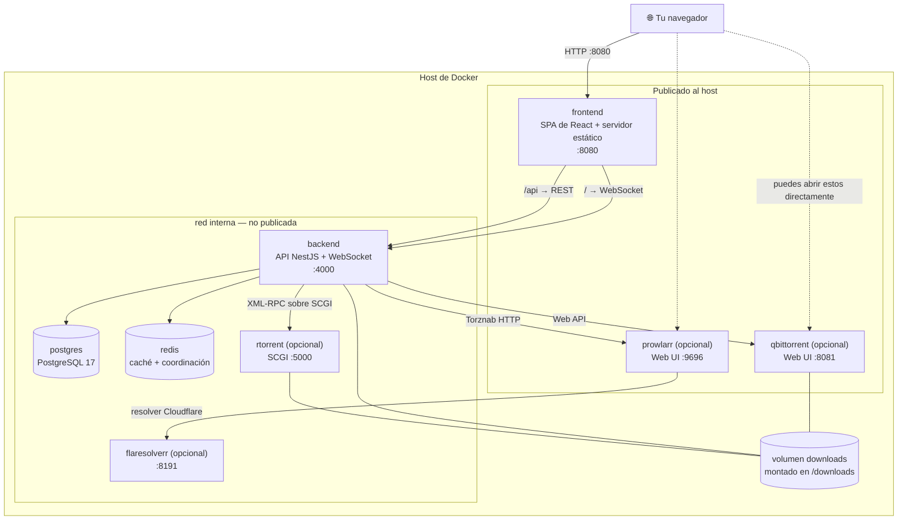
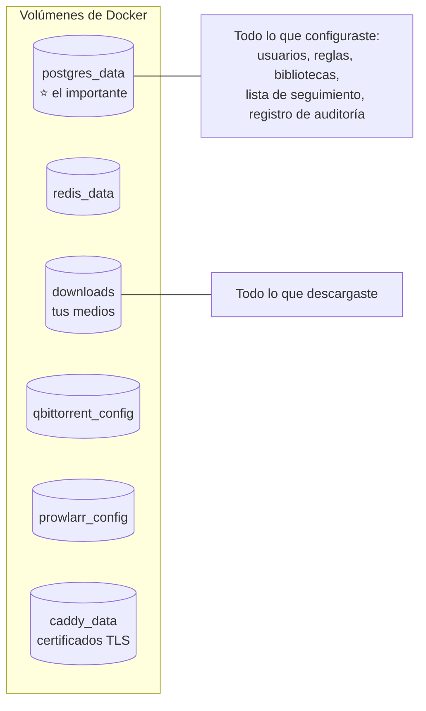
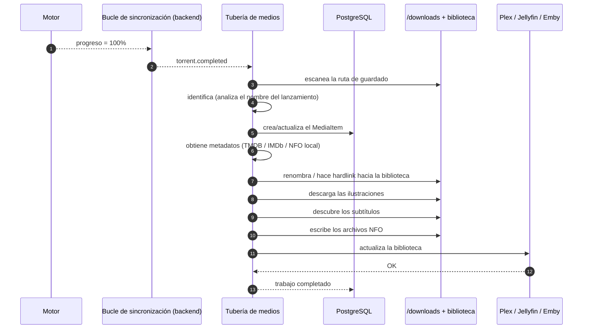
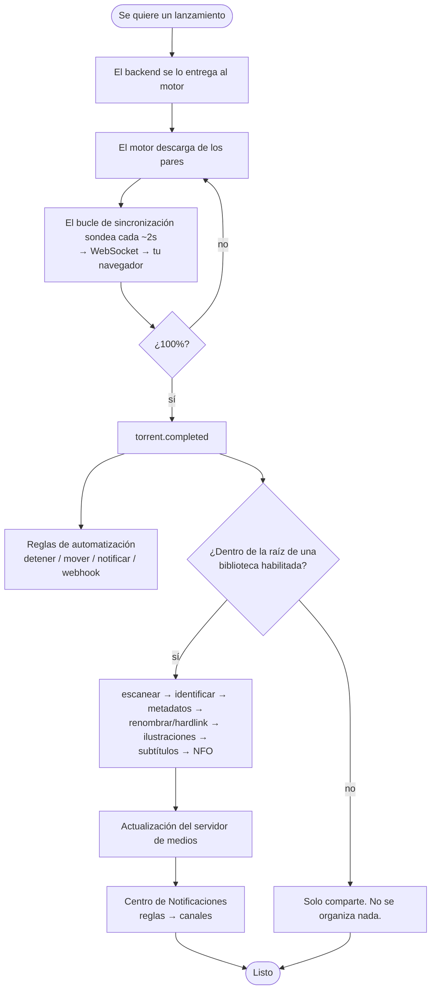

# Resumen de la Arquitectura

Qué corre de verdad en tu máquina, qué le habla a qué, y qué pasa entre "pegar un
magnet" y "Plex muestra la película".

:::info Este es el recorrido de arquitectura del *usuario*
Explica las piezas móviles que puedes ver, reiniciar y respaldar. Si quieres las
tripas de ingeniería — las capas de Clean Architecture, las costuras de
proveedores, los manifiestos de módulos, el bus de eventos — lee
[Arquitectura para desarrolladores](/develop/architecture).
:::

## Resumen

UltraTorrent es una pequeña constelación de contenedores. Solo dos de ellos son
UltraTorrent en sí; el resto es infraestructura conocida y compañeros opcionales.



## Propósito

Entender este diagrama te permite contestar, por tu cuenta:

- *¿Por qué el backend no puede alcanzar mi motor en `localhost`?*
- *¿Qué es lo que tengo que respaldar de verdad?*
- *¿Qué contenedor miro cuando algo se rompe?*
- *¿Qué es seguro exponer, y qué nunca se debe exponer?*

## Cuándo usar esta página

Léela después de [Inicio rápido](/learn/quick-start), antes de poner UltraTorrent
cerca de una red real, y otra vez cada vez que estés depurando algo que cruza el
límite de un contenedor.

## Requisitos previos

- Un stack corriendo (ver [Inicio rápido](/learn/quick-start)).
- El vocabulario de [Conceptos Fundamentales](/learn/concepts) — motor, indexador,
  tracker, biblioteca.
- Una idea aproximada de qué es un contenedor de Docker y qué es un volumen de Docker.

---

## Conceptos

### Las dos mitades de UltraTorrent

| | **frontend** | **backend** |
| --- | --- | --- |
| Qué es | Una app de una sola página en React 18 + Vite, servida como archivos estáticos. | Un servidor de API en NestJS. |
| Qué hace | Renderiza la UI. Nada más. | Todo lo demás. |
| Le habla a | Solo al backend. | Postgres, Redis, el motor, los indexadores, los servidores de medios, los proveedores de notificaciones. |
| Publicado al host | Sí — `:8080` por defecto. | **No.** El frontend lo alcanza por la red interna. |

:::warning El navegador nunca le habla a tu motor de torrents
Esta es una regla arquitectónica deliberada y vale la pena entenderla. La SPA le
habla **solo** a la API de UltraTorrent. La API traduce cada petición al protocolo
nativo del motor (XML-RPC sobre SCGI para rTorrent, la Web API para qBittorrent) y
devuelve datos **normalizados** e independientes del motor. Por eso puedes cambiar
de motor sin que cambie ni la UI ni ninguna regla, y por eso tu motor nunca tiene
que quedar expuesto a un navegador.
:::

### Cada contenedor, y para qué sirve

| Contenedor | ¿Requerido? | Propósito | Si se cae… |
| --- | --- | --- | --- |
| **postgres** | ✅ Siempre | El sistema de registro: usuarios, roles, permisos, instantáneas de torrents, fuentes/reglas RSS, automatización, notificaciones, claves API, el registro de auditoría, la configuración y todo el conjunto de modelos del Gestor de Medios. | El backend no puede arrancar. **Esto es lo que respaldas.** |
| **redis** | ✅ Siempre | Caché y coordinación de trabajos en segundo plano. | Todo se pone más lento; no se pierde estado. |
| **backend** | ✅ Siempre | La API, el gateway de WebSocket, el bucle de sincronización del motor, la consulta de RSS, los trabajos programados, la tubería de medios, el envío de notificaciones. Corre `prisma migrate deploy` al arrancar. | Nada funciona. Revisa sus logs primero. |
| **frontend** | ✅ Siempre | Sirve la SPA en `:8080`. | La UI queda inalcanzable; la API sigue funcionando. |
| **rtorrent** | Opcional (`--profile rtorrent`) | Motor de BitTorrent incluido, SCGI en `:5000`. | Las transferencias se detienen; UltraTorrent sigue corriendo. |
| **qbittorrent** | Opcional (`--profile qbittorrent`) | Motor de BitTorrent incluido, Web API en `:8080` internamente, publicada en `:8081`. **Preferido para bibliotecas grandes.** | Las transferencias se detienen; UltraTorrent sigue corriendo. |
| **prowlarr** | Opcional (`--profile prowlarr`) | Un *gestor* de indexadores. No es parte de UltraTorrent — UltraTorrent solo enlaza a él y busca en sus endpoints Torznab. | La búsqueda en indexadores falla; todo lo demás funciona. |
| **flaresolverr** | Opcional (`--profile flaresolverr`) | Resuelve los retos anti-bot de Cloudflare para los indexadores de Prowlarr que lo necesiten. Solo interno. | Los indexadores protegidos por Cloudflare fallan. |
| **proxy** | Opcional (`--profile proxy`) | Un proxy inverso de borde con Caddy para terminación TLS en `:80`/`:443`. | El acceso directo por puerto sigue funcionando. |

:::danger Al principio, un *solo* motor a la vez es buena idea
Puedes registrar varios motores y marcar uno como **Predeterminado**. Pero
mientras estás aprendiendo, corre uno. Dos motores escribiendo en el mismo árbol
`/downloads` es una manera excelente de confundirte a ti mismo.
:::

### Puertos, de un vistazo

| Puerto | Quién | ¿Publicado al host? | Se cambia con |
| --- | --- | --- | --- |
| `8080` | frontend (la UI web) | ✅ Sí | `FRONTEND_PORT` |
| `4000` | API del backend | ❌ No (solo interno) | Agrega un mapeo `ports:` si lo necesitas |
| `5432` | postgres | ❌ No | — |
| `6379` | redis | ❌ No | — |
| `5000` | SCGI de rtorrent | ❌ No | — |
| `8081` | Web UI de qBittorrent | ✅ Sí | `QBITTORRENT_PORT` |
| `9696` | Web UI de Prowlarr | ✅ Sí | `PROWLARR_PORT` |
| `8191` | FlareSolverr | ❌ No | — |
| `80` / `443` | proxy Caddy | ✅ Sí (`--profile proxy`) | — |

:::info Dentro de la red, usa los nombres de los contenedores
`qbittorrent:8080`, `rtorrent:5000`, `prowlarr:9696`, `postgres:5432`. Desde
*dentro* del contenedor del backend, `localhost` significa el backend mismo —
nunca el motor. Esta es la causa #1 de "falló la prueba del motor".
:::

### Dónde viven tus datos



**Respalda `postgres_data` y tu `.env`.** Esos dos, juntos, son tu instalación.
Perder `downloads` te cuesta ancho de banda; perder `postgres_data` te cuesta cada
regla, biblioteca, usuario y decisión que hayas configurado.

:::danger Respalda `ENCRYPTION_KEY` junto con la base de datos
`ENCRYPTION_KEY` descifra lo que está guardado cifrado en esa base de datos —
secretos de 2FA, claves API de indexadores, tokens de servidores de medios,
credenciales de notificaciones. Una base de datos restaurada sin su clave
correspondiente tiene un montón de secretos ilegibles adentro. Mantenlos juntos.
Mira [Respaldo y restauración](/operate/backup).
:::

---

## Paso a paso: cómo fluye una descarga de verdad

Sigue un archivo todo el camino. Cada paso nombra el componente que lo maneja.

### Paso 1 — Algo decide que un lanzamiento se quiere

Tres puertas dan al mismo pasillo:

| Puerta | Quién la abre | Componente |
| --- | --- | --- |
| Pegas un magnet | Tú | La página de **Torrents** → REST `POST /api/torrents` |
| Una regla RSS coincide | El trabajo `rss_poll` (cada 60s) | El módulo de **RSS** |
| Se llena un hueco | El barrido de episodios faltantes o **Buscar ahora** | **Indexadores** + **Descarga Inteligente** |

**Resultado esperado:** el backend tiene un magnet o una URL `.torrent`, y sabe
qué ruta de guardado, categoría y etiquetas usar.

### Paso 2 — El backend se lo entrega al motor

El backend llama al motor a través de la **costura del motor** — una interfaz que
todo motor implementa. rTorrent recibe XML-RPC sobre SCGI; qBittorrent recibe su
Web API.

Para una **URL** de `.torrent`, el backend la descarga del lado del servidor a
través de una **protección SSRF** que rechaza las direcciones privadas/internas a
menos que el host esté listado en `SSRF_ALLOW_HOSTS`.

**Resultado esperado:** el motor tiene el torrent y empieza a hablarle al tracker.

### Paso 3 — El motor transfiere los datos

El motor se anuncia al tracker, recibe una lista de pares e intercambia piezas.
Escribe en `/downloads` — el volumen que el backend también monta.

**Resultado esperado:** bytes en disco, el progreso subiendo.

### Paso 4 — El bucle de sincronización se entera, y tu navegador se actualiza solo

Un servicio de sincronización en segundo plano consulta cada motor
aproximadamente cada **2 segundos**, normaliza lo que encuentra y lo reparte por
el **gateway de WebSocket** hacia salas delimitadas por permisos.

**Resultado esperado:** la página de Torrents se actualiza en vivo, sin refrescar.
No estás consultando desde el navegador — el servidor está empujando.

### Paso 5 — Completar dispara un evento

Cuando el bucle de sincronización ve que el progreso cruza el **100%**, emite
`torrent.completed`.

Dos cosas independientes escuchan:

- El **motor de automatización** — tus reglas de condición/acción.
- La **tubería de medios** — pero **solo** si la ruta raíz de una biblioteca
  habilitada *contiene* la ruta de guardado de este torrent. Las descargas
  arbitrarias nunca se organizan automáticamente.

:::info Completar se dispara por flanco *y también* se rellena hacia atrás
`torrent.completed` se dispara cuando el progreso cruza el 100% en un tick en
vivo. Después, un relleno `reconcileCompleted` reevalúa los torrents que *ya*
están completos pero que nunca cruzaron ese flanco — vistos completos por primera
vez, terminados mientras la app estaba caída, o con una regla creada después de
completarse. Un libro mayor de éxitos lo mantiene idempotente, así que cada regla
corre **una vez por torrent**.
:::

### Paso 6 — La tubería de medios convierte una descarga en una entrada de biblioteca



Cada etapa está aislada — un fallo en una **nunca aborta el resto** — y cada una
dispara un evento `media.*` al que tus reglas de automatización pueden reaccionar.

**Resultado esperado:** un archivo correctamente nombrado en tu biblioteca,
enriquecido con metadatos e ilustraciones, visible en tu servidor de medios.

### Paso 7 — Salen las notificaciones

Los módulos publican eventos en un bus interno. Las reglas del **Centro de
Notificaciones** deciden **si**, **cuándo**, **cómo** y **a quién** — nada está
hardcodeado. El envío corre en un worker con horas de silencio, límite de tasa,
reintentos y escalamiento, por Correo, Telegram, SMS o WhatsApp.

**Resultado esperado:** el mensaje que configuraste, en el canal que elegiste.

### Todo junto, en un solo diagrama



---

## Ejemplos

### Rastrear un problema hasta un contenedor con un solo comando

```bash
docker compose logs --tail 100 backend      # reglas, decisiones, la API, la tubería
docker compose logs --tail 100 qbittorrent  # transferencias, errores de tracker
docker compose logs --tail 100 prowlarr     # fallos de búsqueda en indexadores
docker compose logs --tail 100 postgres     # migraciones, errores de conexión
```

Nueve de cada diez veces, `backend` es el primer lugar correcto donde mirar.

### Confirmar que el backend realmente ve al motor

```bash
docker compose exec backend sh -c "getent hosts qbittorrent || getent hosts rtorrent"
```

Si eso no imprime nada, no están en la misma red de Docker y ninguna configuración
de motor va a funcionar jamás.

### Confirmar que comparten un sistema de archivos (para que los hardlinks funcionen)

```bash
docker compose exec backend    stat -c '%d %m' /downloads
docker compose exec qbittorrent stat -c '%d %m' /downloads
```

Mismo punto de montaje, mismo dispositivo → los hardlinks van a funcionar.

---

## Resolución de problemas

| Síntoma | El componente que hay que mirar | Por qué |
| --- | --- | --- |
| La UI web en blanco / inalcanzable | `frontend` | Conflicto de puertos, o el contenedor no está corriendo. |
| La UI carga pero cada petición da error | `backend` | La API está caída o se negó a arrancar. |
| El backend se niega a arrancar | `.env` | `JWT_ACCESS_SECRET` y `ENCRYPTION_KEY` faltantes/débiles/idénticos. |
| El backend no puede arrancar, errores de BD | `postgres` | Volumen corrupto, o un `POSTGRES_PASSWORD` incorrecto. |
| Falla la prueba del motor | `backend` → red hacia el motor | Usaste `localhost`, o el perfil no está corriendo. |
| Los torrents aparecen pero nunca se actualizan | `backend` | El WebSocket no se conectó — revisa el indicador de conexión en la barra superior. |
| La búsqueda en indexadores no devuelve nada | `prowlarr` | El indexador está caído, o bloqueado por Cloudflare → agrega FlareSolverr. |
| Las capturas automáticas no hacen nada, en silencio | `backend` (protección SSRF) | Indexador con IP privada que no está en `SSRF_ALLOW_HOSTS`. |
| Los archivos se organizan pero Plex no muestra nada | la integración con el servidor de medios | URL base/token incorrectos, o Plex no ve la misma ruta. |

Más en [Resolución de problemas](/operate/troubleshooting) y [Rendimiento](/operate/performance).


---

## Consejos

:::tip Las sondas de salud son públicas a propósito
`/api/system/live` y `/api/system/ready` no necesitan autenticación para que
Docker, Kubernetes y tu monitor de uptime puedan revisarlas. No exponen ningún
dato.
:::

:::tip Todo lo que toma tiempo es un trabajo en segundo plano
Escanear, metadatos, ilustraciones, subtítulos, renombrar, generar NFO, actualizar
el servidor de medios, enviar notificaciones — nada de eso bloquea una petición
HTTP. Cada unidad se persiste como un trabajo con estado en cola/corriendo/
completado/fallido y transmite su progreso por WebSocket. Si una página parece
"colgarse", normalmente no es así: busca el trabajo.
:::

:::warning No publiques el puerto del backend a menos que sea a propósito
El backend deliberadamente no se publica al host. Si expones `:4000`
directamente, has expuesto la API — ponla detrás del proxy inverso en su lugar.
Mira [Proxy inverso](/install/reverse-proxy) y [Seguridad](/operate/security).
:::

:::tip Mira este tutorial
_Video próximamente._
:::

---

## Preguntas frecuentes

**¿Puedo usar mi propio PostgreSQL / Redis?**
Sí. Apunta `DATABASE_URL` (instalaciones manuales) y `REDIS_HOST` / `REDIS_PORT` a
ellos y quita esos servicios de Compose. Mira [Entorno](/reference/environment).

**¿Puedo correr el motor en otra máquina?**
Sí, si el backend puede alcanzarlo por la red **y** las rutas que reporta son
visibles para el backend en esas mismas rutas. La segunda mitad es la parte
difícil — por eso el stack incluido comparte un solo volumen.

**¿Necesito Redis?**
Sí, en el despliegue soportado. Respalda el caché y la coordinación de trabajos en
segundo plano.

**¿UltraTorrent necesita conexión a internet para funcionar?**
La aplicación en sí, no. Los metadatos (TMDB), las ilustraciones, la búsqueda en
indexadores y el envío de notificaciones obviamente sí. El sitio de documentación
está construido con un índice de búsqueda local y sin conexión precisamente porque
los usuarios auto-alojados pueden estar aislados de la red.

**¿Hay un broker o cola de mensajes externo?**
No. El trabajo en segundo plano corre en el mismo proceso, persistido como
trabajos, con Redis para la coordinación — no hace falta ningún broker externo.

**¿Dónde cambio el puerto en el que corre la UI?**
`FRONTEND_PORT` en `.env`, y luego `docker compose up -d`.

---

## Lista de verificación

- [ ] Puedes nombrar cada contenedor en la salida de tu `docker compose ps` y decir qué hace.
- [ ] Sabes en qué puerto está la UI y cuáles puertos son solo internos.
- [ ] Sabes que el navegador nunca le habla al motor.
- [ ] Puedes explicar por qué `localhost` falla dentro del contenedor del backend.
- [ ] Sabes que `postgres_data` + `.env` (con `ENCRYPTION_KEY`) es lo que tienes que respaldar.
- [ ] Puedes rastrear un magnet todo el camino hasta una actualización del servidor de medios.
- [ ] `docker compose exec backend stat -c '%d %m' /downloads` coincide con el del motor.

### Resultados esperados

| Comprobación | Esperado |
| --- | --- |
| `curl http://localhost:8080/api/system/ready` | Éxito. |
| `docker compose exec backend getent hosts qbittorrent` | Una IP interna. |
| Barra superior de la UI | Un indicador de WebSocket conectado y tasas en vivo. |

### Próximos pasos

1. [Mi primera descarga](/learn/first-download) — ejercita esta arquitectura, despacio.
2. [Flujos de trabajo](/learn/workflows) — los siete flujos canónicos en diagramas.
3. [Respaldo y restauración](/operate/backup) — ahora que sabes qué es lo que importa.
4. [Arquitectura para desarrolladores](/develop/architecture) — las tripas, si las quieres.

---

## Ver también

- [Instalación con Docker Compose](/install/docker-compose) — la referencia completa de servicios.
- [Proxy inverso](/install/reverse-proxy) · [TLS](/install/tls) · [Actualizaciones](/install/upgrading)
- [Variables de entorno](/reference/environment) · [Esquema de la base de datos](/reference/database-schema)
- [Módulos](/reference/modules) · [Permisos](/reference/permissions)
- [Sistema](/modules/system) · [Archivos](/modules/files)
- [Rendimiento](/operate/performance) · [Seguridad](/operate/security)
