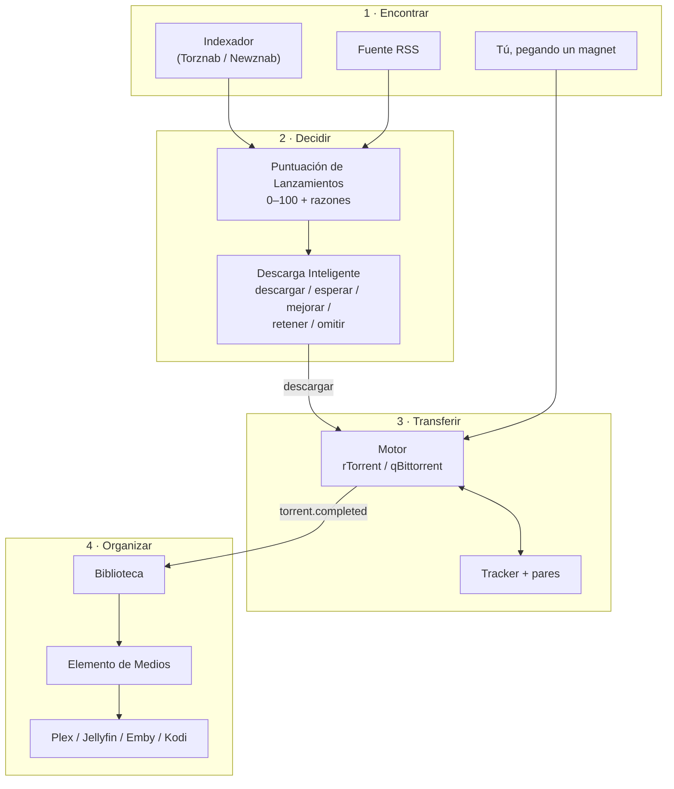
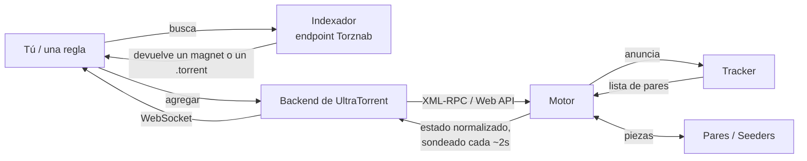
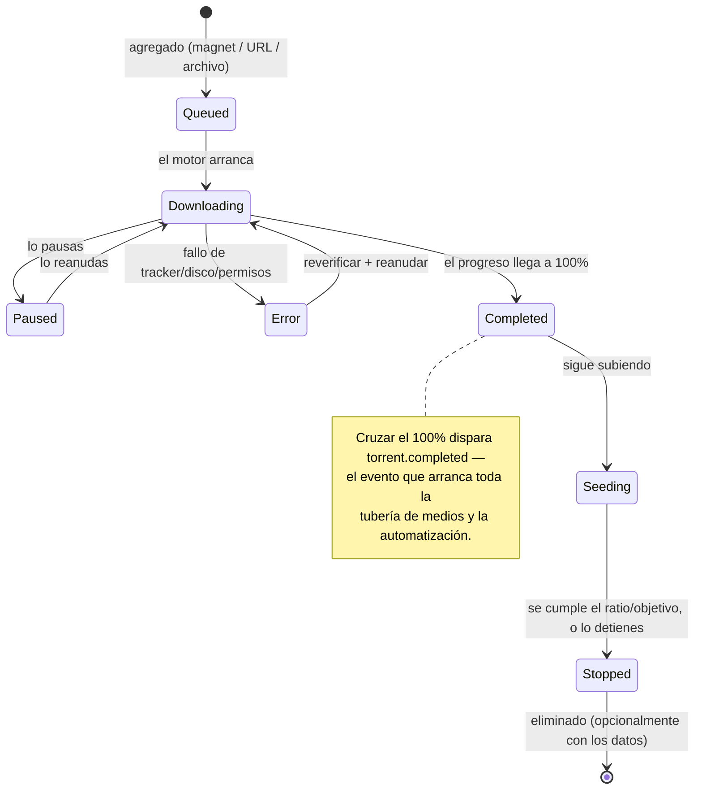
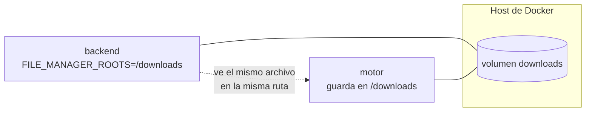
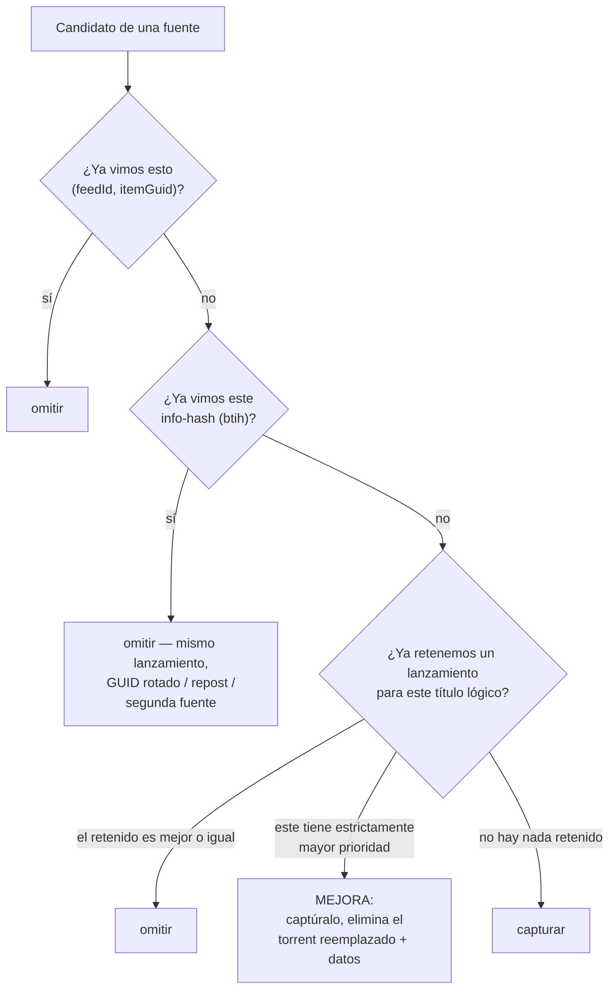
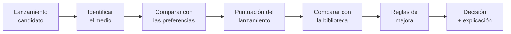
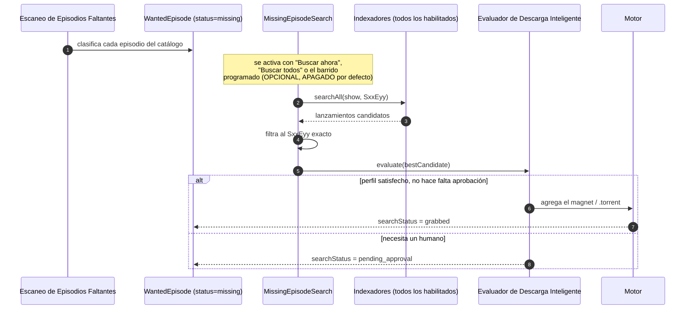
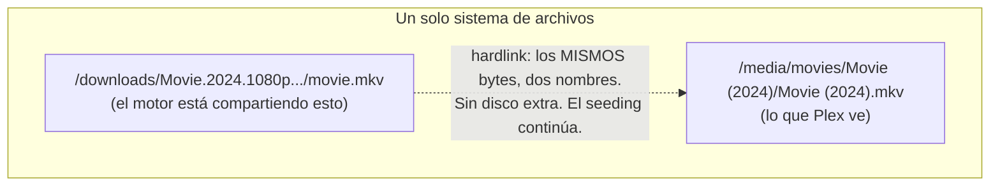
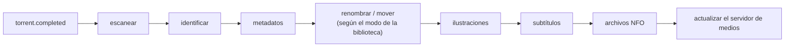

# Conceptos Fundamentales

Todo en UltraTorrent está construido a partir de una docena de ideas. Apréndelas
una vez y el producto entero deja de sorprenderte.

## Resumen

UltraTorrent separa **cuatro trabajos** que los clientes de torrents comunes
mezclan:

1. **Encontrar** un lanzamiento (indexadores, fuentes RSS).
2. **Decidir** si tomarlo (Puntuación de Lanzamientos, Descarga Inteligente).
3. **Transferirlo** (el motor).
4. **Organizarlo** después (Gestor de Medios, bibliotecas, motor de renombrado).

Mantenerlos separados es *la razón* por la que la automatización es posible. Una
regla puede decidir sin descargar. Una biblioteca puede organizar sin importarle
de dónde vino un archivo. Un motor se puede cambiar sin tocar una sola regla.



## Propósito

Esta página es el vocabulario definitivo. Todas las demás lo dan por sentado. Si
un término en otra parte de la documentación te resulta desconocido, está
definido aquí o en el [Glosario](/help/glossary).

## Cuándo usar esta página

Léela **una vez, en orden**, antes de tu segunda descarga. Vuelve a ella cada vez
que una regla haga algo que no esperabas — nueve de cada diez veces la sorpresa
es un límite conceptual que no habías notado.

## Requisitos previos

Ninguno. Esta página asume que nunca has usado BitTorrent, Sonarr, Radarr ni un
servidor de medios. Si ya lo has hecho, ojea los títulos y detente en cualquier
cosa que suene a que aquí significa algo distinto.

---

## Las tres cosas que la gente confunde constantemente

### Motor vs Indexador vs Tracker

Estas tres son *cosas completamente distintas*, y confundirlas es la fuente de
confusión más común de todas.

| | **Motor** | **Indexador** | **Tracker** |
| --- | --- | --- | --- |
| **Qué es** | El software cliente de BitTorrent que realmente transfiere los bytes. | Un **catálogo buscable** de torrents. | Un servidor que le informa a los pares unos de otros para **un torrent específico**. |
| **Quién lo corre** | Tú (rTorrent, qBittorrent — incluido o el tuyo propio). | Un sitio o tu propio Prowlarr/Jackett. | Quien haya publicado el torrent. |
| **Dónde lo configuras** | **Descargas → Motores** (`/engines`) | **Descargas → Indexadores** (`/indexers`) | En ningún lado — viene incrustado en el torrent/magnet. |
| **Protocolo con el que UltraTorrent le habla** | XML-RPC sobre SCGI (rTorrent) o la Web API (qBittorrent). | Torznab / Newznab sobre HTTP. | Ninguno. **UltraTorrent nunca le habla a los trackers.** El motor sí. |
| **Sin él puedes…** | …no hacer nada. Es obligatorio. | …aún agregar torrents a mano. Es opcional. | …no descargar ese torrent en absoluto (a menos que DHT/PEX encuentre pares). |

:::info La versión de una sola oración
**El indexador te dice que un lanzamiento existe. El motor lo descarga. El
tracker le presenta el motor a otros pares.**
:::



Fíjate en que el navegador **nunca** le habla al motor. La SPA de React solo le
habla a la API de UltraTorrent, que traduce al protocolo nativo de cada motor y
devuelve datos **normalizados** e independientes del motor. Eso es lo que hace
que los motores sean intercambiables.

---

## El torrent, de principio a fin

### Torrent

Un **torrent** es una transferencia. Se identifica por un **info hash** (`btih`)
— una huella digital del contenido. Dos magnets de dos sitios distintos con el
mismo info hash son el *mismo torrent*, y UltraTorrent usa ese hecho para negarse
a capturar el mismo lanzamiento dos veces.

Puedes agregar uno de tres maneras (**Descargas → Torrents → Agregar torrent**):

- **Magnet** — un enlace `magnet:?xt=urn:btih:…`. No hace falta ningún archivo.
- **URL** — un enlace a un archivo `.torrent`, descargado del lado del servidor (a través de una protección SSRF).
- **Archivo** — un archivo `.torrent` que subes o arrastras.

### Ciclo de vida del torrent



Los estados que ves en el submenú de la barra lateral (**Descargando /
Compartiendo / Completados / Pausados / Errores**) son vistas filtradas de la
misma tabla, controladas por la URL (`/torrents?state=…`).

### Seeding, ratio y devolver lo que tomaste

Cuando un torrent termina de descargar no se detiene — empieza a hacer
**seeding** (**Compartiendo**): subir a otros pares los datos que ahora tienes.

- **Ratio** = bytes subidos ÷ bytes descargados. Un ratio de `1.0` significa que
  has devuelto exactamente tanto como tomaste.
- Muchos trackers privados **exigen** un ratio mínimo o un tiempo de seeding
  mínimo. Detenerte demasiado pronto puede hacer que te expulsen.
- `ratio.reached` es un **disparador de automatización**: "cuando este torrent
  llegue al ratio X, deténlo / muévelo / notifícame" es una regla que puedes
  construir en **Automatización → Reglas de Automatización**.

:::warning Eliminar un torrent puede eliminar el archivo que acabas de organizar
Esta es la razón más importante por la que UltraTorrent usa el modo **hardlink**
por defecto (ver [más abajo](#hardlink-vs-copy-vs-symlink-vs-move)). Si *mueves*
un archivo completado a una biblioteca, el motor ya no puede compartirlo. El
hardlink permite que los mismos bytes existan en ambos lugares, así que puedes
hacer seeding **y** tener una biblioteca limpia.
:::

---

## Las rutas, y por qué tienen que cuadrar {#paths-and-why-they-must-line-up}

Todo lo que en UltraTorrent toca el disco está confinado a las **raíces duras**
(hard roots) — las rutas absolutas separadas por comas en `FILE_MANAGER_ROOTS`
(por defecto `/downloads`).

- El Gestor de Archivos no puede navegar fuera de ellas.
- No se puede crear una biblioteca de medios fuera de ellas.
- El motor de renombrado no puede escribir fuera de ellas.
- El path traversal, el escape por ruta absoluta, el escape por symlink y los
  directorios del sistema se rechazan todos tras la canonicalización (`realpath`).

**El motor tiene que ver las mismas rutas que ve el backend.** En el stack de
Compose incluido, tanto el backend como el motor montan el mismo volumen
`downloads` en `/downloads`, así que un torrent cuya ruta de guardado es
`/downloads/tv` es una ruta que el backend también puede leer. Si apuntas
UltraTorrent a un motor *externo*, tienes que arreglar lo mismo tú mismo — de lo
contrario el motor reportará rutas de guardado que UltraTorrent no puede abrir, y
la organización posterior a la descarga no hará nada, en silencio.



---

## Adquisición: cómo el contenido decide llegar {#acquisition-how-content-decides-to-arrive}

### Lanzamiento (release)

Un **lanzamiento** es una codificación publicada de un título —
`Some.Show.S02E05.1080p.WEB-DL.DDP5.1.H.264-GROUP`. UltraTorrent analiza ese
nombre y lo convierte en datos estructurados: título, año, temporada, episodio,
resolución, fuente, HDR, audio, códec, grupo.

La **identidad del lanzamiento** analizada es sobre lo que trabaja la
deduplicación: `movie:<title>:<year>` o `ep:<title>:<season>:<episode>`.

### Puntuación de Lanzamientos

Un módulo central que convierte un lanzamiento analizado en una **puntuación de 0
a 100** más una **decisión explícita de aceptar/rechazar, con razones y
advertencias**. Lo consumen RSS y Descarga Inteligente — nadie reimplementa las
preferencias de calidad. Puedes inspeccionarlo y ajustarlo en la página
**Puntuación de Lanzamientos** (`/release-scoring`).

### Fuente RSS y regla RSS

Una **fuente RSS** (`/rss`) es simplemente una URL que se consulta en un
intervalo (el trabajo `rss_poll` corre cada 60 segundos y consulta las fuentes
cuyo intervalo ya venció).

Una **regla RSS** vive *dentro* de una fuente y describe qué capturar de ella:

| Campo | Significado |
| --- | --- |
| Nombre | Tuyo. |
| Tipo de medio | `tv` / `anime` / `movie` / … — esto es lo que activa la conciencia del estado de la serie. |
| Regex de inclusión | Un candidato tiene que coincidir con esto. |
| Regex de exclusión | Un candidato **no** puede coincidir con esto. |
| Ruta de guardado | Dónde se guardan las capturas que coinciden. |
| Descarga automática | Si las coincidencias se capturan automáticamente, o solo se registran. |
| Candidatos de coincidencia | Una **lista de preferencias ordenada** construida en el Smart Match Builder. |

El **Smart Match Builder** (en la página de detalle de la regla,
`/rss/rules/:ruleId`) es donde expresas *"quiero 2160p Dolby Vision, pero acepto
1080p WEB-DL, y jamás voy a aceptar un CAM"* como una lista jerarquizada en vez
de una pesadilla de regex.

#### La deduplicación ocurre en tres niveles

Vale la pena interiorizar esto, porque es la razón por la que una regla bien
construida no te inunda de duplicados:



Así que una regla con una lista de preferencias retiene **un lanzamiento por
película/episodio**: el mejor disponible hasta el momento, mejorado cuando
aparece algo estrictamente mejor.

#### Conciencia del estado de emisión de las series de TV

Crear una regla para una serie que **finalizó** o fue **cancelada** desperdicia
consultas para siempre. UltraTorrent resuelve el **estado de emisión** de una
serie del lado del servidor (TMDB → conjunto de datos de IMDb → biblioteca local,
en orden de confianza) y lo normaliza a uno de estos: `continuing` · `returning` ·
`planned` · `on_hiatus` · `ended` · `canceled` · `unknown` — lo que se convierte
en una recomendación: **recomendado** · **con precaución** · **no recomendado** ·
**desconocido**.

Guardar una regla de TV para una serie finalizada/cancelada está **bloqueado** a
menos que lo confirmes explícitamente (`allowInactiveShowMonitoring`), y esa
anulación queda auditada. Un trabajo en segundo plano vuelve a revisar los
estados en caché con una cadencia por estado (activa 24h, en pausa 7d,
finalizada/cancelada 30d, desconocida 3d) y te avisa cuando el estado de una
serie cambia — pero **nunca desactiva tu regla** por ti.

### Indexador

Un endpoint de búsqueda **Torznab** o **Newznab**. Se configura en **Descargas →
Indexadores**. Campos clave: URL base, una clave API (cifrada en reposo con
AES-256-GCM, ocultada como `••••••••` en cada lectura), habilitado, prioridad (la
más baja se intenta primero), categorías y un mínimo opcional de seeders.

`searchAll` se despliega sobre todos los indexadores habilitados en orden de
prioridad, aísla los fallos de cada indexador, filtra por seeders mínimos y
**deduplica los candidatos entre indexadores por info-hash**.

:::info Las fuentes RSS no son indexadores
Son subsistemas distintos. RSS te *empuja* elementos nuevos en cada consulta; un
indexador se *busca* bajo demanda. Solo los endpoints Torznab/Newznab son
buscables.
:::

---

## Querer cosas que todavía no tienes

### Lista de seguimiento y contenido monitoreado

La **lista de seguimiento** (**RSS y Adquisición → Inteligencia de Adquisición →
Lista de seguimiento**, en `/media-acquisition`) es la lista de las cosas que
*quieres*. Un elemento puede ser un `movie`, una `series`, una `season` o un
`episode`.

Una serie está **monitoreada** en cuanto está en la lista de seguimiento **con un
ID de IMDb** (p. ej. `tt0903747`). Sin un ID de IMDb aparece como *no
monitoreable* — no hay nada contra qué comparar.

:::tip No escribas los IDs de IMDb a mano
La página **Episodios Faltantes** tiene un selector **Agregar desde la
biblioteca**: un multi-select buscable de las series de TV que ya están en tus
bibliotecas, con sus IDs de IMDb ya resueltos. Selecciona las series y agrégalas
todas de una vez.
:::

### Episodio deseado / película deseada

Un **episodio deseado** (*wanted episode*) es una fila calculada — no algo que tú
creas. UltraTorrent enumera cada episodio que una serie *debería* tener (a partir
del catálogo local de episodios de IMDb) y lo compara contra tu biblioteca,
clasificando cada uno:

| Estado | Significado |
| --- | --- |
| `owned` | Tu biblioteca tiene esta temporada/episodio. |
| `missing` | Se emitió, y no lo tienes. **Este es el hueco que se puede llenar.** |
| `unaired` | Su año de emisión está en el futuro o se desconoce — todavía no se puede adquirir. |
| `ignored` | Lo excluiste tú. Sobrevive a los reescaneos. |

La temporada 0 (especiales) queda excluida del cálculo de faltantes. Los
reescaneos son idempotentes: reconstruyen todo **excepto** tus anulaciones
`ignored`.

:::warning "Faltante" solo es tan bueno como tu identificación
La pertenencia se decide a partir de `MediaItem.season` / `episode`, que vienen de
la **identificación por nombre de archivo**, no de un escaneo crudo. Una
biblioteca llena de archivos mal nombrados o sin identificar va a sobrereportar
*faltantes*. Vuelve a identificar la biblioteca para tener resultados precisos.
:::

Las **películas deseadas** funcionan igual para los elementos `movie` de la lista
de seguimiento que están monitoreados y tienen un ID de IMDb, clasificados como
`owned` / `missing` / `unaired` / `ignored`.

### Descarga Inteligente

**Descarga Inteligente** es el **motor de decisiones** de adquisición. En vez de
capturar la primera cosa que coincida, evalúa cada candidato y elige el mejor de
los *aceptables* — decidiendo **qué** adquirir, **cuándo**, **cuál lanzamiento** y
**si mejorar algo que ya tienes**.

Cada candidato pasa por una única tubería explicable:



Cada etapa se registra como un paso del rastro. El **Simulador de Decisiones**
(`/media-acquisition/simulator`) reproduce la tubería completa para cualquier
nombre de lanzamiento **sin efectos secundarios** — nada se persiste, nada se
descarga — y la dibuja como una tubería clicable para que veas exactamente *por
qué* un lanzamiento sería elegido o rechazado.

La tubería siempre termina en exactamente una decisión:

| Decisión | Significado |
| --- | --- |
| `download` | Deseado, faltante, por encima de los umbrales → adquirir. |
| `upgrade_existing` | Ya lo tienes, pero este lanzamiento es notablemente mejor → adquirirlo **y eliminar el viejo**. |
| `wait` | Aceptable, pero por debajo del corte de espera del perfil → aguantar a propósito por algo mejor. |
| `hold_for_approval` | Se descargaría, pero un disparador (puntuación baja, riesgo de duplicado, archivo enorme, aprobación forzada) necesita un humano. |
| `manual_review` | Coincidencia ambigua entre la biblioteca y la lista de seguimiento. |
| `skip` | Término excluido, rechazado por la puntuación, ya lo tienes en calidad igual o mejor, por debajo del mínimo, o simplemente no lo quieres. |
| `replace_existing` | Reservada. El tipo de decisión existe pero todavía no se emite. |

Cada decisión lleva un **motivo**, una **confianza (0–100)**, `requiresApproval` y
el rastro completo.

### Perfil de adquisición

Un perfil agrupa la política que aplica Descarga Inteligente:

- `minimumScore` — por debajo de esto → `skip`.
- `approvalScore` — por debajo de esto → `hold_for_approval`.
- `duplicateRules.allowUpgrades` — ¿se permiten mejoras del todo?
- `automationRules.approvalRequired` — forzar aprobación para **todo**.
- `qualityRules.waitForBetter` + `waitUntilScore` — la **política de espera**.

### Qué cuenta como una mejora

Las mejoras son **multidimensionales**, no solo de resolución:

| Dimensión | Mejor → peor |
| --- | --- |
| Resolución | 2160p → 1080p → 720p → 480p |
| Fuente | Remux → BluRay → WEB-DL → WEBRip → HDTV |
| HDR | Dolby Vision → HDR10+ → HDR10 → HLG → SDR |
| Audio | Atmos / DTS:X → TrueHD / DTS-HD → DD+ → DTS/DD → AAC |
| Canales | 7.1 → 5.1 → 2.0 |

El códec (HEVC/AV1 vs AVC) es **solo un desempate de puntuación** — nunca dispara
una mejora por sí solo, porque una recodificación de x264 a x265 con la misma
calidad no vale la pena volver a descargarla.

### Adquisición automática de episodios faltantes

La detección (*este episodio falta*) y la descarga (*puntúalo, captúralo*) se
conectan mediante la búsqueda en indexadores:



`searchStatus` recorre `idle → searching → grabbed | pending_approval |
no_results | failed`, y **se preserva entre reescaneos**, así que un episodio ya
capturado nunca se vuelve a buscar. Se limpia automáticamente en cuanto el
episodio está en la biblioteca.

:::caution La búsqueda automática está apagada por defecto, y es solo de episodios
El barrido programado (`autoSearchMissing`) es **opcional y está deshabilitado por
defecto**. **Buscar ahora** / **Buscar todos** manuales funcionan siempre que el
módulo esté habilitado. Las películas llevan las mismas columnas de estado de
captura, pero la búsqueda automática es **solo de episodios** por ahora.
:::

---

## Organizar: qué pasa después de la descarga

### Biblioteca

Una **biblioteca** (**Gestión de Medios → Bibliotecas**, `/media/libraries`)
apunta el Gestor de Medios a una carpeta dentro de las raíces duras y declara:

| Ajuste | Valores |
| --- | --- |
| **Tipo** | `tv` · `anime` · `movie` · `music` · `audiobook` · `general` |
| **Preset** | `plex` · `jellyfin` · `emby` · `kodi` · `custom` |
| **Plantilla** | La plantilla de nombres basada en tokens (el preset la rellena). |
| **Modo** | `preview` · `rename_in_place` · `rename_move` · `copy` · `hardlink` (por defecto) · `symlink` |
| **Intervalo de escaneo** | Minutos entre escaneos automáticos. **En blanco o cero = solo escaneos manuales.** |

:::info El `kind` de la biblioteca le gana al nombre del archivo
Una serie cuya carpeta lleva un año pero ningún marcador de episodio — `9-1-1
(2018)` — **no** se detecta por error como película, porque el `kind` declarado de
la biblioteca es la autoridad sobre el eje película/tv/anime. Solo las bibliotecas
`general` (mixtas) recurren a adivinar a partir del nombre del archivo.
:::

### Elemento de medios

Un **elemento de medios** es un título dentro de una biblioteca — una película, o
una serie completa. El escaneo descubre archivos; la **identificación** analiza el
nombre del lanzamiento y lo convierte en tipo/título/año/temporada/episodio con
una **puntuación de confianza** y un `matchStatus`:

- `unmatched` — no se pudo identificar. Revísalos en **Gestión de Medios →
  Medios sin Coincidencia** (`/media/unmatched`).
- `matched` — identificado automáticamente.
- `manual` — lo corregiste a mano.

Para un archivo episódico organizado como `Serie/Season NN/episodio`, el **título
de la serie se toma de la carpeta de la serie**, no del nombre del archivo (que a
menudo solo lleva el título del episodio). Eso es lo que evita que una serie se
fragmente en una "serie" por episodio.

### Hardlink vs copia vs symlink vs mover {#hardlink-vs-copy-vs-symlink-vs-move}

Esta es la decisión que la gente falla, así que aquí va sin rodeos.



| Modo | Disco extra usado | El seeding sobrevive | Notas |
| --- | --- | --- | --- |
| `hardlink` **(por defecto)** | **Ninguno** — una copia de los bytes, dos entradas de directorio. | ✅ Sí | La respuesta correcta casi siempre. Requiere **el mismo sistema de archivos** para ambas rutas. |
| `copy` | **2×** el tamaño del archivo. | ✅ Sí | Úsalo cuando el origen y el destino están en sistemas de archivos distintos. |
| `symlink` | Ninguno. | ✅ Sí | Un puntero, no un segundo nombre. Algunos servidores de medios y algunos contenedores no siguen symlinks entre montajes. |
| `rename_move` | Ninguno. | ❌ **No** — el motor pierde el archivo. | Úsalo solo si no te importa el seeding. |
| `rename_in_place` | Ninguno. | ⚠️ Depende | Renombra donde el archivo ya está. |
| `preview` | Ninguno. | n/a | Solo simulación. Construye el plan, no toca nada. **Empieza aquí.** |

:::danger Los hardlinks no pueden cruzar sistemas de archivos
Un hardlink son dos nombres para el mismo inodo, así que ambas rutas tienen que
estar en el **mismo** sistema de archivos/volumen. Si `/downloads` y `/media` son
volúmenes de Docker distintos o montajes distintos, el hardlink falla y tienes que
usar `copy`. Planifica tus montajes según eso: un solo recurso compartido grande
con subcarpetas `downloads/` y `media/` es la disposición más fácil que funciona.
:::

### La tubería posterior a la descarga

Cuando un torrent cruza el 100%, el bucle de sincronización del motor emite
`torrent.completed`. Ese evento arranca una tubería **opcional y de mejor
esfuerzo** — se dispara **solo** para las bibliotecas habilitadas cuya ruta raíz
*contiene* la ruta de guardado del torrent, así que las descargas arbitrarias
nunca se organizan automáticamente:



Cada etapa está aislada: un fallo en una nunca aborta el resto, y el manejador
nunca lanza una excepción (lo que protege el bucle de sincronización). Cada etapa
también dispara un evento `media.*` del que puedes colgar tu propia
automatización.

### Servidor de medios

Plex, Jellyfin, Emby y Kodi están soportados detrás de una sola abstracción
`MediaServerProvider`. UltraTorrent les **empuja una actualización de biblioteca**
después de organizar, así que los medios nuevos aparecen sin que tengas que hacer
clic en nada. Las credenciales se cifran en reposo con AES-GCM y se ocultan en las
respuestas de la API.

El módulo de **Analíticas del Servidor de Medios** va más allá, convirtiendo los
servidores conectados en actividad en vivo, historial de reproducción, agregados
recientemente, informes y boletines.

---

## Conceptos transversales

### Módulo

Cada capacidad es un **módulo** con un manifiesto (id, tier, dependencias,
permisos, rutas, menú, trabajos del planificador). Tiers:

- `core` — siempre disponible, **no se puede deshabilitar** (auth, RBAC, motor,
  torrents, RSS, archivos, configuración, auditoría, centro de notificaciones,
  analíticas del servidor de medios…).
- `community` — incluido, activo por defecto, **conmutable** por un administrador
  (Gestor de Medios, Puntuación de Lanzamientos, Inteligencia de Adquisición de
  Medios…).

**No hay licencias, no hay ediciones y no hay paywall.** Todos los módulos vienen
en el único repositorio de código abierto. Adminístralos en **Administración →
Módulos** (`/modules`).

### Permiso (RBAC)

El acceso se decide **únicamente** por control de acceso basado en roles. Los
permisos usan espacios de nombres con puntos (`torrents.add`, `rss.manage`,
`media_manager.rename`, `media_acquisition.evaluate`, `indexers.test`…). La UI
esconde lo que no puedes usar; el **servidor siempre lo hace cumplir**.
Deshabilitar un módulo es una conveniencia de la UI — *nunca* es una decisión de
autorización.

### Regla de automatización

Una regla de condición/acción disparada por un evento. Los disparadores de torrent
(`torrent.completed`, `ratio.reached`), los disparadores de medios
(`media.matched`, `media.missing_subtitles`, `media.rename_completed`…) y los
disparadores de estado de serie de RSS (`rss.show.ended`,
`rss.show_status.changed`…) impulsan acciones como detener, eliminar, mover,
notificar, webhook, `rename_for_media`, `media_server_refresh` o
`disable_rss_rule`.

### Notificación

El **Centro de Notificaciones** está gobernado por reglas de principio a fin: los
módulos publican eventos, y *tus* reglas deciden **si**, **cuándo**, **cómo** y
**a quién** se entrega un mensaje. Nada está hardcodeado. Vienen canales para
**Correo (SMTP)**, **Telegram**, **SMS (Twilio)** y **WhatsApp (Twilio)**.

---

## Ejemplos

### Leer un nombre de lanzamiento como lo hace UltraTorrent

```text
The.Expanse.S04E03.2160p.AMZN.WEB-DL.DDP5.1.HDR.HEVC-GROUP
│           │      │     │    │      │       │    │
│           │      │     │    │      │       │    └─ códec       → solo desempate
│           │      │     │    │      │       └────── HDR         → dimensión de mejora
│           │      │     │    │      └────────────── audio       → dimensión de mejora
│           │      │     │    └───────────────────── fuente      → dimensión de mejora
│           │      │     └────────────────────────── (indexador)
│           │      └──────────────────────────────── resolución  → dimensión de mejora
│           └─────────────────────────────────────── temporada/episodio
└─────────────────────────────────────────────────── título

identidad del lanzamiento → ep:the expanse:4:3
```

### El mismo título, tres maneras en que puede llegar

| Ruta | Disparador | Decide mediante |
| --- | --- | --- |
| Pegas un magnet | Manual | Nada — simplemente se descarga. |
| Una regla RSS lo hace coincidir | `rss_poll`, cada 60s | Preferencias de coincidencia + Puntuación de Lanzamientos + dedup de 3 niveles. |
| Descarga Inteligente llena un hueco | Escaneo de episodios faltantes + búsqueda en indexadores | La tubería de decisión completa + tu perfil de adquisición. |

---

## Resolución de problemas de los conceptos

| "Yo esperaba…" | "…pero en realidad" |
| --- | --- |
| "La caja de Buscar va a buscar en los indexadores." | **Buscar** y Ctrl+K buscan en la *navegación de la aplicación*. La búsqueda en indexadores la consume la tubería de adquisición y la API; no está expuesta como una página de explorar y hacer clic. Usa la UI de Prowlarr para explorar a mano. |
| "Mi regla capturó el mismo episodio dos veces." | Casi con seguridad no lo hizo — revisa el info-hash. Dos lanzamientos *distintos* del mismo episodio se deduplican por **identidad del lanzamiento**, pero solo cuando el título se puede analizar. Los títulos inanalizables recurren al comportamiento por lanzamiento. |
| "Episodios Faltantes dice que me falta todo." | Los elementos de tu biblioteca están sin identificar, así que no se puede probar la pertenencia. Vuelve a identificar la biblioteca. |
| "No se renombró nada después de que terminó mi descarga." | La ruta raíz de la biblioteca tiene que **contener** la ruta de guardado del torrent, y la biblioteca tiene que estar **habilitada**. Las descargas arbitrarias nunca se organizan automáticamente. |
| "El hardlink falló." | `/downloads` y tu biblioteca están en sistemas de archivos distintos. Usa `copy`, o reestructura tus montajes. |
| "Mi regla RSS para una serie finalizada no se dejó guardar." | Eso es a propósito. Confirma la anulación (queda auditada), o construye una regla de relleno con la descarga automática apagada. |

---

## Consejos

:::tip Empieza cada biblioteca en modo `preview`
Construye el plan de renombrado, míralo y *entonces* cambia a `hardlink`.
`preview` no toca nada, así que revisarlo no te cuesta nada.
:::

:::tip Usa el Simulador de Decisiones como herramienta de aprendizaje
Pega cualquier nombre de lanzamiento en `/media-acquisition/simulator` y lee el
rastro. Es la manera más rápida de entender qué hace tu perfil de verdad — y no
tiene ningún efecto secundario.
:::

:::info Todo lo que muta queda auditado
Las acciones destructivas y las relevantes para la seguridad registran el actor,
la IP, el user agent y el resultado. Mira **Administración → Registro de
Auditoría** (`/audit`).
:::

:::tip Mira este tutorial
_Video próximamente._
:::

---

## Preguntas frecuentes

**¿Una fuente RSS es un indexador?**
No. Subsistema distinto, protocolo distinto, disparador distinto. El RSS se
consulta y empuja elementos hacia tus reglas; un indexador se busca bajo demanda
sobre Torznab/Newznab.

**¿Necesito una cuenta de tracker?**
No para torrents públicos. Los trackers privados exigen que seas miembro, y
normalmente hacen cumplir un ratio mínimo o un tiempo de seeding mínimo — que es
exactamente para lo que existe la automatización de `ratio.reached`.

**¿Para qué sirve un info hash, en la práctica?**
Es la identidad de un torrent. UltraTorrent lo extrae de un magnet (`btih`) y lo
usa para garantizar que el mismo lanzamiento nunca se capture dos veces, ni
siquiera bajo un GUID rotado, un repost o una segunda fuente.

**Si Descarga Inteligente dice `wait`, ¿algo está roto?**
No — eso es que está funcionando. El lanzamiento era aceptable pero quedó por
debajo del `waitUntilScore` de tu perfil, así que el motor está aguantando a
propósito por algo mejor. Míralo en la cola **En espera**.

**¿Puedo mezclar motores?**
Sí. Registra varios; uno es el predeterminado. La API y la UI siempre devuelven
datos normalizados e independientes del motor.

**¿Cuál es la diferencia entre el Gestor de Medios y Descarga Inteligente?**
Descarga Inteligente decide **qué adquirir**. El Gestor de Medios decide **qué
hacer con eso una vez que aterriza**. Se encuentran en el evento
`torrent.completed`.

---

## Lista de verificación

Tienes el modelo mental cuando puedes contestar esto **sin volver a subir**:

- [ ] ¿Con cuál de los tres —motor / indexador / tracker— habla UltraTorrent directamente?
- [ ] ¿Qué se dispara cuando un torrent cruza el 100%, y qué arranca ese evento?
- [ ] Nombra los tres niveles de deduplicación de RSS.
- [ ] ¿Qué hace que una serie esté "monitoreada"?
- [ ] ¿Cuáles son las seis decisiones de Descarga Inteligente, y cuál está *reservada*?
- [ ] ¿Por qué `hardlink` es el modo de biblioteca por defecto, y cuándo no se puede usar?
- [ ] ¿Qué significa `unaired`, y por qué no se puede adquirir?
- [ ] ¿Por qué el `kind` de una biblioteca le gana al nombre del archivo?

### Resultados esperados

Si puedes contestar las ocho, el resto de la documentación se va a leer como
*configuración*, no como *ideas nuevas*.

### Próximos pasos

1. [Resumen de la arquitectura](/learn/architecture-overview) — dónde corre físicamente cada uno de estos conceptos.
2. [Mi primera descarga](/learn/first-download) — los conceptos, ejercitados de principio a fin.
3. [Flujos de trabajo](/learn/workflows) — los siete flujos canónicos, en diagramas.

---

## Ver también

- [Glosario](/help/glossary) — definiciones de una línea de cada término de esta página.
- [Torrents](/modules/torrents) · [Motores](/modules/engines) · [Indexadores](/modules/indexers)
- [RSS](/modules/rss) · [Descarga Inteligente](/modules/smart-download) · [Episodios Faltantes](/modules/missing-episodes)
- [Gestor de Medios](/modules/media-manager) · [Analíticas del Servidor de Medios](/modules/media-server-analytics)
- [Automatización](/modules/automation) · [Centro de Notificaciones](/modules/notification-center)
- [Permisos](/reference/permissions) — el catálogo completo de RBAC.
- [Módulos](/reference/modules) — cada manifiesto de módulo.
