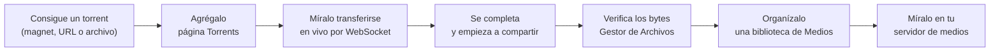
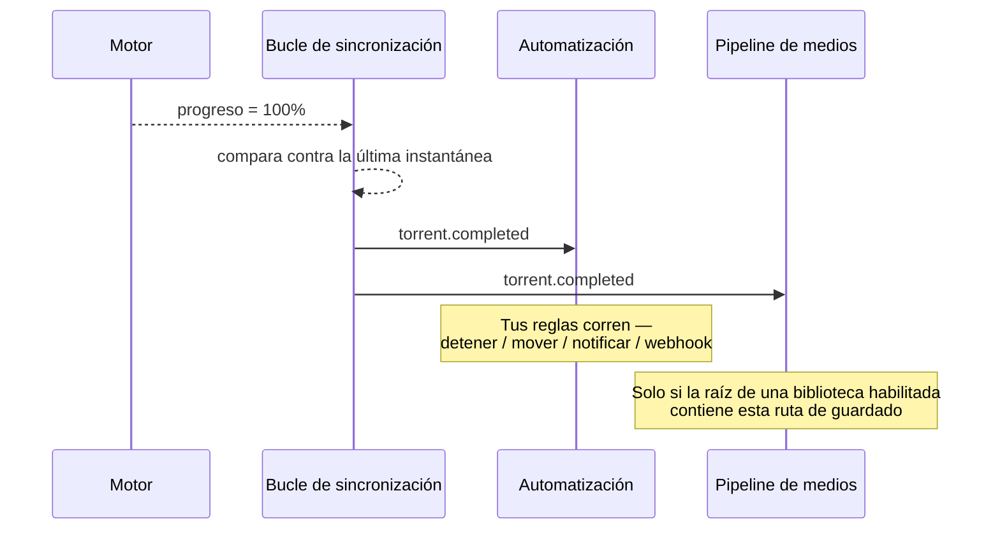

# Mi Primera Descarga

[Inicio Rápido](/learn/quick-start) llevó un torrent al 100%. Esta página hace lo mismo
pero **despacio**, explicando cada campo, cada pantalla y cada cosa que puede
salir mal — y después sigue, hasta llegar a un archivo renombrado dentro de una
biblioteca que Plex puede ver.

Si ya tienes un stack funcionando, esta es la página donde de verdad vas a *aprender*.

## Resumen



## Propósito

Al final habrás hecho, a propósito y entendiendo lo que haces, cada paso del
ciclo de adquisición **una vez a mano**. Todo lo que se automatiza más adelante en la documentación es
simplemente este ciclo con los pasos manuales removidos.

## Cuándo usar esta página

| Usa esta página cuando… | Usa otra cuando… |
| --- | --- |
| Es tu primera descarga en la vida. | Quieres la versión de 15 minutos → [Inicio Rápido](/learn/quick-start). |
| Una descarga está fallando y quieres aislar en qué paso. | Quieres la versión automatizada → [Automatizar series de TV](/learn/tutorials/automating-tv-shows). |
| Quieres entender cada campo del diálogo de agregar. | Quieres la foto del sistema completo → [Resumen de Arquitectura](/learn/architecture-overview). |

## Requisitos previos

Ya debes tener:

- [ ] Un stack corriendo — [Pasos 1–4 del Inicio Rápido](/learn/quick-start).
- [ ] Un motor registrado y marcado como **predeterminado** en **Descargas → Motores** — [Paso 5 del Inicio Rápido](/learn/quick-start#step-5--register-your-torrent-engine).
- [ ] Permiso para agregar torrents (`torrents.add`). El admin inicial lo tiene.
- [ ] Algo legal que descargar.

:::danger Escoge algo que tengas permitido descargar
Las ISOs oficiales de las distribuciones de Linux (Ubuntu, Debian, Fedora, Arch) publican torrents
en sus páginas de descarga. Son rápidas, están bien compartidas y son inequívocamente legales.
Aprende con esas. Hacia dónde apuntes UltraTorrent después es enteramente cosa tuya.
:::

## Conceptos que vas a usar

Cuatro, todos definidos en [Conceptos Básicos](/learn/concepts):

- **Motor (Engine)** — lo que de verdad descarga. Ya registraste uno.
- **Ruta de guardado (Save path)** — dónde escribe el motor en el disco. Tiene que estar dentro de las raíces duras.
- **Info hash** — la identidad del torrent. UltraTorrent la usa para rechazar duplicados.
- **Compartiendo (Seeding)** — lo que hace un torrent después de terminar: subirle a otros peers.

---

## Paso a paso

### Paso 1 — Consigue un torrent

Necesitas una de tres cosas:

| Lo que tienes | Qué pestaña vas a usar |
| --- | --- |
| Un enlace `magnet:?xt=urn:btih:…` | **Magnet** |
| Un enlace a un archivo `.torrent` (`https://…/x.torrent`) | **URL** |
| Un archivo `.torrent` ya descargado en tu computadora | **Archivo** |

Para la primera vez, copia un enlace magnet de la página de descarga de una distribución
oficial de Linux.

**Resultado esperado:** un enlace magnet en tu portapapeles, empezando con `magnet:?`.

:::info Cómo distinguir un magnet de una URL de torrent
Un **magnet** empieza con `magnet:?xt=urn:btih:` y contiene el info hash
directamente — no hay archivo que buscar. Una **URL de torrent** es un enlace `https://`
común que devuelve un pequeño archivo binario `.torrent`. UltraTorrent lo busca
del lado del servidor (nunca desde tu navegador), pasando por una protección contra SSRF.
:::

---

### Paso 2 — Abre la página de Torrents

En la barra lateral: **Descargas → Torrents**. La URL es `/torrents`.

Tómate un momento para leer esta pantalla, porque vas a vivir aquí:

| Cosa en pantalla | Qué significa |
| --- | --- |
| La tabla | Una fila por torrent, actualizada en vivo por WebSocket. |
| El submenú de la barra lateral | **Descargando · Compartiendo · Completados · Pausados · Errores** — vistas filtradas de la misma tabla, manejadas por `?state=…` en la URL, así que se pueden guardar en marcadores. |
| Las tasas de la barra superior | El total agregado de subida/bajada en vivo entre todos los motores. Si se están moviendo, tu bucle de sincronización está saludable. |
| El botón **Agregar torrent** | Solo visible si tienes `torrents.add`. |

**Resultado esperado:** la página de Torrents se renderiza. Si nunca has descargado
nada muestra un estado vacío con una llamada a la acción de **Agregar torrent**.


---

### Paso 3 — Abre el diálogo de Agregar torrent

Haz clic en **Agregar torrent**.

El diálogo tiene tres pestañas arriba — **Magnet**, **URL**, **Archivo** — y un
conjunto compartido de opciones debajo de ellas.


**Resultado esperado:** el diálogo está abierto en la pestaña **Magnet**.

---

### Paso 4 — Llena la fuente

Escoge la pestaña que corresponda con lo que tienes.

#### Pestaña Magnet

Pega el enlace magnet. Tiene que empezar con `magnet:?xt=urn:btih:`.

#### Pestaña URL

Pega el enlace `https://…/algo.torrent`. El **backend** lo busca, no
tu navegador.

:::danger Las URLs que resuelven a direcciones privadas están bloqueadas
El backend se niega a buscar una URL de torrent que resuelve a una IP privada o
interna — eso es una protección contra SSRF, y te está protegiendo. Si tu indexador está
autoalojado en una IP privada, tienes que permitirlo explícitamente:

```ini title=".env"
SSRF_ALLOW_HOSTS=prowlarr,indexer.lan,10.0.0.0/24
```

Mantén `prowlarr` en la lista si usas el Prowlarr incluido. Sin esto, las descargas
fallan con *"Torrent URL resolves to a blocked internal address."*
:::

#### Pestaña Archivo

Haz clic en la zona de soltar para abrir un selector de archivos, o **arrastra un archivo `.torrent` encima**.

**Resultado esperado:** la pestaña seleccionada muestra tu magnet / URL / nombre de archivo, y el
botón **Agregar** se habilita. (Se queda deshabilitado mientras la pestaña activa esté vacía —
eso es a propósito.)

---

### Paso 5 — Entiende las opciones antes de configurarlas

Debajo de las pestañas hay cuatro opciones. Todas son opcionales. Todas vale la pena entenderlas.

| Opción | Qué hace | Qué pasa si la dejas en blanco |
| --- | --- | --- |
| **Ruta de guardado** | El directorio donde escribe el motor. Tiene que estar dentro de las raíces duras (`FILE_MANAGER_ROOTS`, por defecto `/downloads`). | Se usa el valor por defecto del propio motor — `/downloads` en el stack incluido. |
| **Categoría** | Una etiqueta usada para filtrar y como condición de automatización. | Sin categoría. |
| **Etiquetas** | Etiquetas libres separadas por comas. | Sin etiquetas. |
| **Iniciar pausado** | Agrega el torrent pero no empieza a transferir. | Empieza de inmediato. |

:::tip Configura la ruta de guardado a propósito, desde la primerita descarga
Las rutas de guardado son lo que conecta una descarga con una **biblioteca**. El pipeline de medios solo
organiza un torrent completado cuando **la ruta raíz de una biblioteca habilitada contiene la
ruta de guardado del torrent**. Si tiras todo en `/downloads` y después creas una
biblioteca en `/downloads/movies`, ninguna de tus descargas existentes va a ser recogida.

Un diseño que funciona desde el día uno:

```text
/downloads
├── movies/     ← una biblioteca de Películas apunta aquí
├── tv/         ← una biblioteca de TV apunta aquí
└── other/      ← todo lo que no quieres que se organice
```
:::

Si escribes una ruta de guardado que no existe, UltraTorrent la valida contra las
raíces duras y **te ofrece crearla**. Acepta.

**Resultado esperado:** tus opciones están configuradas, y el botón **Agregar** está habilitado.

---

### Paso 6 — Agrégalo

Haz clic en **Agregar**.

**Resultado esperado — tres cosas, en este orden, en un par de segundos:**

1. Aparece un aviso de éxito.
2. El diálogo se cierra.
3. **Una fila nueva aparece en la tabla sin que refresques nada.**

Esa tercera importa. Significa que el backend aceptó el torrent, se lo entregó al
motor, el bucle de sincronización lo vio en su siguiente consulta de ~2 segundos, y lo empujó a tu
navegador por WebSocket. Si la fila aparece, todo tu pipeline está funcionando.

:::warning Si te sale "ya existe"
Estás tratando de agregar un torrent cuyo **info hash** ya se conoce. Eso es la
deduplicación haciendo su trabajo — el mismo lanzamiento bajo otro magnet, un
re-post, o una segunda fuente sigue siendo el mismo torrent. Búscalo en la lista
existente.
:::

---

### Paso 7 — Míralo transferirse

Quédate en la página de Torrents. En los primeros segundos deberías ver, en orden:

| Columna | Qué esperar | Si no pasa |
| --- | --- | --- |
| **Estado** | `En cola` → `Descargando` | Motor inalcanzable, o Iniciar pausado estaba activo. |
| **Pares / Semillas** | Sube por encima de 0 | Torrent muerto, tracker caído, o sin peers. |
| **Tasa de bajada** | Un número distinto de cero | Todavía no hay peers — dale 30 segundos. |
| **Progreso** | Sube desde 0% | Ve arriba. |
| **Tiempo restante** | Aparece una vez que se establece una tasa | — |

La tasa agregada de la barra superior debería moverse al mismo tiempo.


:::tip No está pasando nada. ¿Estará roto?
Probablemente no — lo más seguro es que todavía no hay peers. Antes de depurar cualquier cosa:
- Espera 60 segundos completos.
- Confirma que el torrent no está **Pausado**.
- Prueba con un torrent *distinto* y bien conocido (una ISO actual de Ubuntu). Si ese se mueve,
  el primer torrent simplemente estaba muerto.
- En el **rTorrent incluido**, el DHT está **apagado por defecto** (`RT_DHT=off`) porque
  ese build puede caerse con un `internal_error` de DHT. Los trackers y PEX siguen encontrando
  peers, pero un magnet sin ningún tracker funcionando y sin peers por PEX se va a quedar en 0%
  para siempre. Pon `RT_DHT=on` para habilitarlo, o usa el perfil de qBittorrent.
:::

---

### Paso 8 — Inspecciona el torrent mientras corre

Haz clic en la fila del torrent. Se desliza un **panel lateral** con cuatro pestañas:

| Pestaña | Qué te da |
| --- | --- |
| **Resumen** | Tamaño, progreso, tasas, ratio, ruta de guardado, categoría, etiquetas. |
| **Archivos** | Cada archivo, con **prioridades** individuales. Pon un archivo en *saltar* y el motor no lo descargará — útil para un paquete de temporada cuando solo quieres dos episodios. |
| **Pares** | A quién estás conectado. Cero pares explica al instante un torrent atascado. |
| **Rastreadores** | Las URLs de anuncio y su última respuesta. Un error de tracker aquí explica el otro tipo de torrent atascado. |

La barra de acciones te da **reanudar**, **pausar**, **detener** y **reverificar**.

:::info Qué hace realmente "reverificar"
Vuelve a calcular el hash de los datos en disco y los compara con los hashes de las piezas del torrent. Úsalo
cuando un torrent dio error, cuando moviste archivos por debajo de él, o cuando el progreso se ve
imposible. Es seguro — nunca borra nada.
:::


---

### Paso 9 — Se completa

Al 100% el torrent pasa a **Compartiendo**.

Por debajo, pasan tres cosas en el momento en que el progreso cruza el 100%:



**Resultado esperado:** estado = **Compartiendo**, progreso = 100%, y el **ratio** empieza a
subir mientras le subes a otros peers.


:::warning No borres el torrent de inmediato
Dos razones:
1. **Compartir es como funciona BitTorrent.** Muchos trackers privados exigen un ratio
   mínimo o un tiempo mínimo de seeding, y parar de golpe te puede ganar un baneo.
2. **Borrar un torrent te puede ofrecer borrar sus datos** — incluyendo el archivo que estás
   a punto de organizar. Si usas el modo `rename_move`, el archivo desaparece del
   motor de todos modos; si usas `hardlink` (el predeterminado), los bytes sobreviven en ambos
   lados y puedes compartir para siempre.
:::

---

### Paso 10 — Verifica que los bytes existen de verdad

No confíes en la barra de progreso. Ve y mira.

**Archivos → Gestor de Archivos** (`/files`).

Navega a tu ruta de guardado (`/downloads`, o la subcarpeta que escogiste). Deberías
ver la carpeta descargada y sus archivos, con tamaños reales.

El Gestor de Archivos está confinado a las raíces duras (`FILE_MANAGER_ROOTS`). Puede
explorar, previsualizar, descargar, renombrar, mover, copiar, crear directorios y borrar a una
**papelera** — y es físicamente incapaz de escapar de esas raíces. El traversal, el escape por
symlink y el escape por ruta absoluta son todos rechazados.

**Resultado esperado:** tu archivo, con su tamaño completo, en la ruta que esperas.


---

### Paso 11 — Organízalo en una biblioteca

Ahora mismo tienes un archivo con un nombre de scene feísimo. Vamos a convertirlo en una entrada de biblioteca.

1. Ve a **Gestión de Medios → Bibliotecas** (`/media/libraries`).
2. Haz clic en **Agregar biblioteca**.
3. Llénala:

   | Campo | Para este recorrido | Notas |
   | --- | --- | --- |
   | **Nombre** | `Movies` | Es tuyo. |
   | **Ruta** | `/downloads/movies` | Tiene que estar dentro de las raíces duras. El selector de rutas te ofrecerá crearla. |
   | **Tipo** | `movie` | Es **autoritativo** por encima de adivinar por el nombre del archivo. |
   | **Preset** | `plex` | Te llena la plantilla de nombrado. |
   | **Modo** | `preview` | **Empieza aquí.** Solo simulación — no toca nada. |
   | **Plantilla** | *(déjala en blanco)* | El preset la provee. |
   | **Intervalo de escaneo** | *(déjalo en blanco)* | En blanco = solo escaneos manuales. Configúralo después. |

4. Guarda, y luego haz clic en **Escanear**.

**Resultado esperado:** el escaneo descubre tu archivo, crea un **elemento de medios**, y lo
identifica — parseando el nombre del lanzamiento en tipo/título/año con una puntuación de confianza.
Míralo en **Gestión de Medios → Elementos de Medios** (`/media/items`).


---

### Paso 12 — Previsualiza el renombrado, *y después* confírmalo

Ve a **Gestión de Medios → Motor de Renombrado** (`/media/rename-preview`).

Esto construye el plan completo de renombrado — cada ruta origen, cada ruta destino —
y **no cambia nada**. Léelo. Cada segmento de ruta se sanitiza.

Si se ve bien:

1. Regresa a **Gestión de Medios → Bibliotecas**.
2. Edita la biblioteca y cambia el **Modo** de `preview` a **`hardlink`**.
3. Vuelve a correr la operación.

:::danger Escoge tu modo con los ojos abiertos

| Modo | Costo en disco | ¿Todavía puedes compartir? |
| --- | --- | --- |
| `hardlink` **(predeterminado)** | **Ninguno** | ✅ Sí — los mismos bytes, dos nombres |
| `copy` | 2× el archivo | ✅ Sí |
| `symlink` | Ninguno | ✅ Sí, pero algunos servidores no siguen symlinks |
| `rename_move` | Ninguno | ❌ **No — el motor pierde el archivo** |

`hardlink` requiere que la ruta de descarga y la ruta de la biblioteca estén en **el mismo
sistema de archivos**. En el stack incluido lo están (un solo volumen `downloads`). Si montaste
`/media` desde un volumen *distinto*, el hardlink va a fallar y tendrás que usar
`copy`.
:::

**Resultado esperado:** el archivo ahora existe en una ruta limpia de biblioteca
(`/downloads/movies/Some Movie (2024)/Some Movie (2024).mkv`) **y** el motor
sigue compartiendo el original — porque un hardlink son dos nombres para los mismos bytes.


---

### Paso 13 — Deja que tu servidor de medios lo vea

Si tienes Plex, Jellyfin, Emby o Kodi:

1. Ve a **Gestión de Medios → Configuración de Medios** (`/media/settings`), que aloja
   los Proveedores de Metadatos, Ilustraciones, Subtítulos, las herramientas de NFO y las **Integraciones
   con Servidores de Medios**.
2. Agrega tu servidor: tipo, URL base y token. El secreto se guarda **cifrado con AES-GCM en
   reposo** y se redacta en cada respuesta de la API.
3. Prueba la conexión.

De ahí en adelante, el pipeline post-descarga le envía a ese servidor un **refresco de biblioteca**
automáticamente, así que los medios nuevos aparecen sin que tengas que tocar nada.

**Resultado esperado:** tu primera descarga aparece en Plex/Jellyfin/Emby, con el nombre
correcto y con póster.


:::tip Mira este tutorial
_Video próximamente._
:::

---

## Ejemplos

### La misma descarga, enteramente desde la API

Todo lo de arriba es REST. Consigue un token, y luego:

```bash
# 1. Agregar por magnet
curl -X POST http://localhost:8080/api/torrents \
  -H "Authorization: Bearer $TOKEN" \
  -H 'Content-Type: application/json' \
  -d '{
        "magnet": "magnet:?xt=urn:btih:...",
        "savePath": "/downloads/movies",
        "category": "movies",
        "tags": ["first-download"]
      }'

# 2. Verlo
curl -s http://localhost:8080/api/torrents \
  -H "Authorization: Bearer $TOKEN"
```

Ve la [referencia de la API](/reference/api) para la superficie completa.

### Un diseño de carpetas que no te va a pelear después

```text
/downloads
├── movies/           ← biblioteca de Películas (kind: movie, preset: plex, mode: hardlink)
├── tv/               ← biblioteca de TV        (kind: tv,    preset: plex, mode: hardlink)
├── anime/            ← biblioteca de Anime     (kind: anime)
└── unsorted/         ← sin biblioteca — nada aquí se organiza automáticamente
```

Configura la **ruta de guardado** del torrent a la subcarpeta correcta *cuando lo agregues*, y el
pipeline post-descarga lo recoge automáticamente.

---

## Solución de problemas

| Síntoma | Causa | Solución |
| --- | --- | --- |
| El botón **Agregar** se queda deshabilitado | La pestaña activa está vacía. | Llena la pestaña en la que realmente estás — el diálogo valida por pestaña. |
| "Torrent already exists" | El mismo info hash ya fue agregado. | Ya está en tu lista. Esto es la deduplicación funcionando. |
| La fila nunca aparece después de agregar | El motor lo rechazó, o el WebSocket está caído. | Revisa el indicador de conexión en la barra superior; revisa `docker compose logs backend`. |
| Atascado en 0%, 0 peers | Torrent muerto / tracker muerto / sin DHT. | Prueba con una ISO de Linux que sepas que funciona. En el rTorrent incluido, el DHT está apagado por defecto — pon `RT_DHT=on` o cámbiate a qBittorrent. |
| "Torrent URL resolves to a blocked internal address" | La protección SSRF bloqueó un indexador con IP privada. | Agrega el host a `SSRF_ALLOW_HOSTS` (mantén `prowlarr`). |
| Ruta de guardado rechazada | Está fuera de `FILE_MANAGER_ROOTS`. | Usa una ruta dentro de `/downloads` (o de las raíces que tengas). |
| Se descargó, pero no se organizó nada | No hay una biblioteca **habilitada** cuya raíz **contenga** la ruta de guardado. | Crea la biblioteca, o mueve la descarga, y vuelve a escanear. |
| El elemento de medios aparece como **sin coincidencia** | El nombre del lanzamiento no se parseó con confianza. | Arréglalo en **Medios sin Coincidencia** (`/media/unmatched`) — o renombra el archivo fuente de forma más convencional. |
| Una serie de TV se fragmentó en un elemento por episodio | Los archivos no están organizados como `Show/Season NN/episode`. | El título de la serie se toma de la **carpeta del show** en los diseños episódicos. Reestructura, y vuelve a escanear. |
| El hardlink falló | La descarga y la biblioteca están en sistemas de archivos distintos. | Usa `copy`, o pon ambos en un solo volumen. |
| Archivos propiedad de `root` | El motor corrió como root. | Configura `PUID`/`PGID` en `.env` con el usuario dueño (`id someuser`), y recrea el contenedor del motor. |
| Plex no lo muestra | URL base/token equivocados, o Plex no puede ver esa ruta. | Vuelve a probar la integración; confirma que la ruta de la propia biblioteca de Plex apunta al mismo directorio. |

---

## Consejos

:::tip Usa categorías desde el principio
Una categoría no cuesta nada configurarla y después se convierte en una condición de automatización —
*"cuando un torrent en la categoría `movies` se complete, notifícame"*. Ponerlas después es
tedioso.
:::

:::tip Las prioridades por archivo ahorran un montón de disco
¿Agregando un paquete de temporada por dos episodios? Abre el torrent, ve a **Archivos**, y pon
todo lo demás en *saltar*. El motor no va a descargar lo que saltaste.
:::

:::info Nada de esto bloquea la API
Escanear, identificar, renombrar, las ilustraciones y el refresco del servidor de medios corren todos como
**trabajos en segundo plano** con progreso en vivo por WebSocket. Si una pantalla parece que no está
haciendo nada, busca el trabajo — lo más seguro es que está corriendo.
:::

:::warning Tu primera acción destructiva debería ser una vista previa
El modo `preview` existe precisamente para que tu primer renombrado no te pueda hacer daño. Úsalo.
:::

---

## Preguntas frecuentes

**¿A dónde fue mi archivo realmente?**
A la **Ruta de guardado** que hayas configurado — o a la del motor por defecto (`/downloads`) si la
dejaste en blanco. Confírmalo en el **Gestor de Archivos** (`/files`).

**¿Puedo mover un torrent después de que empezó?**
Sí, pero hoy no desde el panel lateral del torrent — hay un endpoint `POST /api/torrents/:hash/move`
(ve la [referencia de la API](/reference/api)), y `move` también está disponible como una
**acción de automatización**. De cualquier forma, reubica los datos *a través de UltraTorrent* para que el
motor se entere. Nunca muevas archivos por detrás del motor — va a dar error
y vas a tener que reverificar.

**¿Debería dejar de compartir una vez que termine?**
Eso es decisión tuya y de las reglas de tu tracker. Arma una regla en **Automatización** con el
disparador `ratio.reached` para detenerlo o eliminarlo automáticamente una vez que hayas devuelto
lo suficiente.

**¿Por qué no se renombró nada?**
El pipeline post-descarga es **opt-in por ruta**: solo se dispara para bibliotecas **habilitadas**
cuya raíz **contenga** la ruta de guardado del torrent. Las descargas arbitrarias nunca se tocan,
deliberadamente.

**¿Qué es un archivo NFO y lo quiero?**
Un sidecar XML estilo Kodi que describe el medio. Los servidores de medios los leen. UltraTorrent
los genera (movie/tvshow/season/episode) como la última etapa de enriquecimiento, solo dentro de las
raíces duras. Inofensivos si tu servidor los ignora.

**¿Tengo que hacer todo esto a mano cada vez?**
No — ese es justamente el punto del resto de la documentación. Ve
[Flujos de trabajo](/learn/workflows) y los [Tutoriales](/learn/tutorials/).

---

## Lista de verificación

### Verificación

- [ ] El diálogo de **Agregar torrent** abrió y la pestaña correcta aceptó mi fuente.
- [ ] Apareció una fila en la tabla **sin refrescar la página**.
- [ ] El progreso subió y la tasa de bajada fue distinta de cero.
- [ ] El torrent llegó al **100%** y cambió a **Compartiendo**.
- [ ] El **ratio** empezó a subir.
- [ ] Encontré los bytes reales en el **Gestor de Archivos** en la ruta esperada.
- [ ] Un escaneo de **biblioteca** descubrió el archivo y creó un **elemento de medios**.
- [ ] El `matchStatus` del elemento es `matched` (no `unmatched`).
- [ ] La **vista previa de renombrado** mostró una ruta destino sensata.
- [ ] Después de cambiar a `hardlink`, el archivo existe en la ruta limpia **y** el torrent sigue compartiendo.
- [ ] *(Opcional)* Mi servidor de medios lo muestra.

### Resultados esperados

| Pantalla | Esperado |
| --- | --- |
| `/torrents` | 1 torrent, 100%, `Compartiendo`, ratio > 0 |
| `/files` | El archivo real, tamaño completo, en la ruta de guardado |
| `/media/items` | 1 elemento de medios, `matched`, con título y año |
| `/media/rename-preview` | Un plan de origen → destino con el que estás de acuerdo |
| Plex / Jellyfin | El título, con póster |

### Próximos pasos

1. **Deja de hacer esto a mano** → [Flujos de trabajo](/learn/workflows)
2. **Construye una biblioteca de verdad** → [Construir una biblioteca de películas](/learn/tutorials/building-a-movie-library)
3. **No vuelvas a perderte un episodio** → [Automatizar series de TV](/learn/tutorials/automating-tv-shows)
4. **Que te avisen cuando pasen cosas** → [Notificaciones y automatización](/learn/tutorials/notifications-and-automation)

---

## Ver también

- [Torrents](/modules/torrents) — el módulo completo de gestión de transferencias.
- [Archivos](/modules/files) — el gestor de archivos con rutas seguras.
- [Gestor de Medios](/modules/media-manager) — bibliotecas, identificación, motor de renombrado.
- [Motores](/modules/engines) — configuración de motores y la capa de motores.
- [Automatización](/modules/automation) — disparadores y acciones.
- [Solución de problemas](/operate/troubleshooting) · [Preguntas frecuentes](/help/faq) · [Glosario](/help/glossary)
