# Inicio Rápido

De cero a una primera descarga funcionando en aproximadamente **15 minutos**.

## Resumen

UltraTorrent es una **plataforma autoalojada de adquisición y gestión de medios**. No es
solo un cliente de torrents: envuelve un motor BitTorrent real (rTorrent o
qBittorrent), y le añade búsqueda por indexadores, automatización RSS, detección de episodios
faltantes, identificación y renombrado de medios, integración con servidores de medios, notificaciones y
control de acceso basado en roles — todo detrás de una sola interfaz web y una sola API REST.

Esta página pone todo el stack a correr y te lleva hasta un torrent que llega al
100%. **No** intenta configurarlo todo. La configuración más profunda vive en
[Conceptos Básicos](/learn/concepts) y en los [Tutoriales](/learn/tutorials/).

```mermaid
flowchart LR
  A["1 · Preparar el host<br/>Docker + carpetas"] --> B["2 · Crear .env<br/>generar secretos"]
  B --> C["3 · docker compose up<br/>con un perfil de motor"]
  C --> D["4 · Primer inicio de sesión<br/>usuario admin"]
  D --> E["5 · Registrar el motor<br/>página Motores"]
  E --> F["6 · Agregar un indexador<br/>opcional, para automatizar"]
  F --> G["7 · Agregar un torrent<br/>magnet / .torrent / URL"]
  G --> H["8 · Verlo completarse<br/>página Torrents"]
```



## Propósito

Al final de esta página vas a tener:

- El stack completo corriendo bajo Docker Compose (PostgreSQL, Redis, backend, frontend).
- Un motor BitTorrent registrado y reportándose como conectado.
- Una cuenta de administrador con la que puedes iniciar sesión.
- Al menos un torrent descargando, y luego completado.

## Cuándo usar esta página

| Usa Inicio Rápido cuando… | Usa otra cosa cuando… |
| --- | --- |
| Estás evaluando UltraTorrent por primera vez. | Necesitas una instalación de producción detrás de TLS → [Proxy inverso](/install/reverse-proxy) y [TLS](/install/tls). |
| Quieres el camino más corto a una descarga funcionando. | Quieres que te expliquen cada servicio y volumen de Compose → [Instalación con Docker Compose](/install/docker-compose). |
| Estás en un host Linux, un NAS o una VM con Docker. | Estás actualizando una instalación existente → [Actualizar](/install/upgrading). |

## Requisitos previos

Antes de empezar, confirma todo lo siguiente.

| Requisito | Por qué | Cómo verificarlo |
| --- | --- | --- |
| **Docker Engine** con el plugin **Compose v2** | Todo el stack se distribuye como contenedores. | `docker --version` y `docker compose version` |
| **~2 GB de RAM libres** | PostgreSQL + Redis + backend + motor. | `free -h` |
| **Espacio en disco** para las descargas | Los torrents caen en un volumen de Docker por defecto. | `df -h` |
| **Un puerto libre en el host** | La interfaz web se publica en el `8080` por defecto. | `ss -ltn` (busca `:8080`) |
| **`openssl`** | Se usa para generar los secretos requeridos. | `openssl version` |
| **Un torrent legal para probar** | Necesitas *algo* que descargar. | Ve el [Paso 7](#step-7--add-your-first-torrent) |

:::info ¿Todavía sin Docker?
Instala primero Docker Engine y el plugin de Compose desde la documentación oficial
de Docker para tu distribución. Docker Desktop en macOS y Windows
también trae Compose v2. UltraTorrent también corre desde el código fuente con Node.js 20+, pero
Docker es el camino soportado y de primera clase.
:::

:::danger Descarga solo contenido que tengas derecho a descargar
UltraTorrent es una herramienta de adquisición de propósito general. Hacia dónde la apuntes es
enteramente tu responsabilidad. Usa imágenes de distribuciones de Linux, medios con licencia
Creative Commons, o tu propio contenido mientras estás aprendiendo.
:::

## Conceptos que necesitas para los próximos 15 minutos

Solo necesitas cuatro ideas para terminar esta página. Cada término está definido como es debido en
[Conceptos Básicos](/learn/concepts).

- **Motor (Engine)** — el cliente BitTorrent que de verdad mueve los bytes (rTorrent o
  qBittorrent). UltraTorrent lo maneja; nunca habla con los peers él mismo.
- **Indexador (Indexer)** — un catálogo de torrents que se puede buscar (un endpoint Torznab/Newznab,
  típicamente servido por Prowlarr o Jackett). Opcional para una primera descarga manual,
  requerido para la adquisición automatizada.
- **Torrent** — una transferencia, con su ciclo de vida (en cola → descargando → compartiendo).
- **Biblioteca (Library)** — una carpeta que UltraTorrent escanea, identifica, renombra y organiza.
  No hace falta hoy; se cubre en [Construir una biblioteca de películas](/learn/tutorials/building-a-movie-library).

---

## Paso a paso

### Paso 1 — Consigue el código y escoge una carpeta

```bash
git clone https://github.com/damirabal/ultratorrent-core.git
cd ultratorrent-core
```

**Resultado esperado:** una carpeta que contiene `docker-compose.yml`, `.env.example`,
`apps/` y `docs/`.

```bash
ls docker-compose.yml .env.example
```

Ambos archivos deben existir. Si no existen, estás en el directorio equivocado.

---

### Paso 2 — Crea tu `.env` y genera los secretos

Compose es deliberadamente **fail-closed**: no arranca sin una contraseña de base de
datos y una contraseña de administrador, y el backend se niega a arrancar en producción si
los secretos de JWT y de cifrado están vacíos, son débiles o son idénticos.

```bash
cp .env.example .env
```

Ahora genera tres secretos distintos:

```bash
openssl rand -base64 48   # → JWT_ACCESS_SECRET
openssl rand -base64 48   # → JWT_REFRESH_SECRET
openssl rand -base64 48   # → ENCRYPTION_KEY
```

Edita `.env` y llena **cinco** valores:

```ini title=".env (los cinco valores que debes configurar)"
# Solo alfanumérico — este valor se interpola dentro de un DATABASE_URL,
# así que los caracteres especiales de URL requerirían codificación por porcentaje.
POSTGRES_PASSWORD=ChangeMeToSomethingLongAndAlphanumeric

# Cada uno de al menos 32 caracteres. JWT_ACCESS_SECRET y ENCRYPTION_KEY DEBEN ser distintos.
JWT_ACCESS_SECRET=<pega la salida #1 de openssl>
JWT_REFRESH_SECRET=<pega la salida #2 de openssl>
ENCRYPTION_KEY=<pega la salida #3 de openssl>

# El super-admin inicial creado en el primer seed.
ADMIN_PASSWORD=YourStrongAdminPassword
```

:::warning Los tres secretos no son intercambiables
`ENCRYPTION_KEY` cifra los secretos en reposo — secretos de 2FA/TOTP, claves API de indexadores,
tokens de servidores de medios, credenciales de proveedores de notificaciones. **Cambiarla después
invalida todo lo que ya fue cifrado con ella.** Genérala una sola vez, guárdala en
un gestor de contraseñas y respáldala junto con tu base de datos.
:::

:::tip ¿El puerto ya está en uso?
El `8080` es un puerto ocupado en dispositivos NAS. Configura `FRONTEND_PORT=8090` (o cualquier puerto libre)
en `.env` ahora mismo — es mucho más fácil que cambiarlo después.
:::

**Resultado esperado:** `.env` existe, no está comiteado a git, y cada uno de los
cinco valores de arriba no está vacío.

```bash
grep -E '^(POSTGRES_PASSWORD|JWT_ACCESS_SECRET|JWT_REFRESH_SECRET|ENCRYPTION_KEY|ADMIN_PASSWORD)=' .env
```

Cada línea impresa debe tener algo después del `=`.

---

### Paso 3 — Escoge un motor de torrents y levanta el stack

UltraTorrent no contiene un motor BitTorrent. Lo **maneja**. Vienen dos
empaquetados como perfiles opcionales de Compose:

| Perfil | Motor | Escógelo cuando… |
| --- | --- | --- |
| `rtorrent` | rTorrent 0.9.8 (SCGI sobre TCP) | Quieres la huella más pequeña y una cantidad modesta de torrents. |
| `qbittorrent` | qBittorrent (Web API) | Esperas una biblioteca **grande**. rTorrent 0.9.8 puede caerse con un conteo alto de torrents. |

Levanta el stack **con** un perfil de motor. Para qBittorrent (recomendado):

```bash
docker compose --profile qbittorrent up -d --build
```

O, para el rTorrent incluido:

```bash
docker compose --profile rtorrent up -d --build
```

La primera construcción toma varios minutos. El backend corre `prisma migrate deploy`
y siembra los permisos, los roles del sistema, el usuario admin y la configuración por defecto en
el primer arranque.

**Resultado esperado:** todos los contenedores saludables.

```bash
docker compose ps
```

Deberías ver `postgres`, `redis`, `backend`, `frontend` (y tu motor)
corriendo. Luego confirma que la API está viva:

```bash
docker compose logs backend --tail 30
```

Busca un arranque exitoso de Nest sin ningún error de `refuses to boot`. Si el
backend se cierra de inmediato, salta a [Solución de problemas](#troubleshooting).


---

### Paso 4 — Inicia sesión por primera vez

Abre la interfaz web:

```
http://localhost:8080
```

(Reemplaza `localhost` con la IP o el hostname de tu servidor si es remoto, y `8080`
con tu `FRONTEND_PORT` si lo cambiaste.)

Inicia sesión con:

- **Usuario:** el valor de `ADMIN_USERNAME` (por defecto `admin`)
- **Contraseña:** el valor de `ADMIN_PASSWORD` que configuraste en el Paso 2

**Resultado esperado:** llegas al **Panel** (Dashboard), con una barra lateral izquierda agrupada
en Resumen, Descargas, RSS y Adquisición, Gestión de Medios, Analíticas del Servidor de Medios,
Automatización, Archivos, Administración y Cuenta.


:::tip Presiona Ctrl+K (o Cmd+K)
La paleta de comandos busca en cada página que tengas permiso de ver. Es la
forma más rápida de navegar y nunca te muestra una página que no puedes abrir.
:::

---

### Paso 5 — Registra tu motor de torrents {#step-5--register-your-torrent-engine}

El contenedor está corriendo, pero UltraTorrent todavía no sabe de él. Tienes que
registrarlo una vez.

1. En la barra lateral ve a **Descargas → Motores** (`/engines`).
2. Haz clic en **Agregar motor**.
3. Llénalo según el motor que levantaste en el Paso 3:

   **Si escogiste qBittorrent:**

   | Campo | Valor |
   | --- | --- |
   | Tipo | `qBittorrent` |
   | URL base | `http://qbittorrent:8080` |
   | Usuario | `admin` |
   | Contraseña | la contraseña de la Web UI de qBittorrent |

   qBittorrent genera una **contraseña temporal en el primer arranque**. Consíguela con:

   ```bash
   docker compose logs qbittorrent | grep -i "temporary password"
   ```

   Abre `http://localhost:8081`, inicia sesión con `admin` + esa contraseña temporal,
   y pon una contraseña permanente en **Options → Web UI**. Usa esa contraseña
   permanente en UltraTorrent.

   **Si escogiste rTorrent:**

   | Campo | Valor |
   | --- | --- |
   | Tipo | `rTorrent` |
   | Modo | `SCGI (TCP)` |
   | Host | `rtorrent` |
   | Puerto | `5000` |

4. Haz clic en **Probar** y confirma que la conexión funciona.
5. Guarda, y luego haz clic en la acción **Establecer como predeterminado** en el motor nuevo.

**Resultado esperado:** el motor aparece en la lista con una insignia de **predeterminado** y
un estado conectado. La barra superior empieza a mostrar tasas de transferencia en vivo (0 B/s por
ahora), lo que significa que el bucle de sincronización está consultando al motor exitosamente.


:::warning Usa el nombre del contenedor, no `localhost`
Dentro de la red de Docker el backend alcanza el motor en `qbittorrent:8080`
o `rtorrent:5000`. `localhost` desde dentro del contenedor del backend significa *el
propio contenedor del backend* y siempre va a fallar.
:::

---

### Paso 6 — Agrega un indexador (opcional hoy, esencial después)

Un **indexador** es un endpoint de búsqueda Torznab/Newznab. UltraTorrent usa los indexadores
para *buscar* lanzamientos cuando la automatización los necesita — por ejemplo cuando la Descarga
Inteligente intenta llenar un episodio faltante.

:::info No hay una página manual de "buscar en la web" — es a propósito
La entrada **Buscar** de UltraTorrent (y Ctrl+K) busca en la **propia navegación de la
aplicación**, no en los indexadores. La búsqueda por indexadores la consume el pipeline de
adquisición (el *Buscar ahora* de Episodios Faltantes, el barrido programado de auto-adquisición) y
la API REST. Para navegar los indexadores a mano, usa la interfaz de Prowlarr. Puedes saltarte
este paso completo y aun así completar el Paso 7.
:::

La fuente más fácil de indexadores es el contenedor compañero **Prowlarr** que viene incluido:

```bash
docker compose --profile qbittorrent --profile prowlarr up -d
```

Luego:

1. Abre Prowlarr en `http://localhost:9696`, agrega uno o más indexadores allí, y
   copia la **URL del feed Torznab** de un indexador y la **clave API** de Prowlarr.
2. En UltraTorrent, ve a **Descargas → Indexadores** (`/indexers`).
3. Haz clic en **Agregar indexador** y llena:

   | Campo | Significado | Ejemplo |
   | --- | --- | --- |
   | Nombre | Nombre visible | `Prowlarr — MyIndexer` |
   | Implementación | `torznab` o `newznab` | `torznab` |
   | URL base | La base de la API | `http://prowlarr:9696/1/api` |
   | Clave API | Guardada cifrada con AES-256-GCM; nunca la devuelve la API | *(pegar)* |
   | Categorías | Categorías Newznab a consultar | `5000, 5030, 5040` (TV) |
   | Seeders mín. | Piso opcional; los candidatos por debajo se descartan | `5` |
   | Prioridad | El más bajo se intenta primero | `1` |

4. Haz clic en el botón **Probar** (el ícono del matraz). Corre una negociación de
   capacidades `t=caps`.

**Resultado esperado:** el indexador muestra una insignia de estado **OK** y una
marca de tiempo `lastTestedAt`. El campo de la clave API ahora muestra una máscara (`••••••••`) — eso
es correcto; la clave nunca se devuelve al navegador.

:::danger Los indexadores con IP privada necesitan `SSRF_ALLOW_HOSTS`
El backend bloquea las URLs de torrent que resuelven a direcciones privadas/internas
(una protección contra SSRF). Un indexador autoalojado *es* una dirección privada. `SSRF_ALLOW_HOSTS`
tiene como valor por defecto `prowlarr` para que el Prowlarr incluido funcione de una. Si agregas
tu propio indexador privado, ponlo en la lista **y mantén `prowlarr`**:

```ini
SSRF_ALLOW_HOSTS=prowlarr,indexer.lan,10.0.0.0/24
```

Sin esto, las descargas automatizadas fallan con *"Torrent URL resolves to a blocked
internal address"* — muchas veces en silencio.
:::


---

### Paso 7 — Agrega tu primer torrent {#step-7--add-your-first-torrent}

Ahora la recompensa.

1. Ve a **Descargas → Torrents** (`/torrents`).
2. Haz clic en **Agregar torrent**.
3. El diálogo ofrece tres pestañas — **Magnet**, **URL** y **Archivo**:

   | Pestaña | Qué le das | Úsala cuando |
   | --- | --- | --- |
   | Magnet | `magnet:?xt=urn:btih:…` | Copiaste un enlace magnet. |
   | URL | Un enlace `https://…/x.torrent` | El indexador/sitio te da una URL `.torrent`. |
   | Archivo | Un archivo `.torrent` (haz clic o arrástralo) | Ya descargaste el `.torrent`. |

4. Opcionalmente configura **Ruta de guardado**, **Categoría** y **Etiquetas**. Deja la ruta de
   guardado en blanco para usar la del motor por defecto (`/downloads` en el stack incluido).
5. Haz clic en **Agregar**.

Para una primera prueba segura y legal, usa el torrent oficial de cualquier distribución de Linux —
por ejemplo los torrents de las ISOs de Ubuntu, Debian o Fedora publicados en sus páginas de
descarga.

**Resultado esperado:** un aviso confirma que el torrent fue agregado, y una fila nueva
aparece en la tabla de Torrents en un par de segundos — enviada a tu navegador
por WebSocket, sin refrescar la página.


---

### Paso 8 — Míralo completarse

Quédate en **Descargas → Torrents**. Al motor se le consulta más o menos cada 2 segundos
y los resultados normalizados se envían a tu navegador en vivo.

Está pendiente a:

- El **Progreso** subiendo por encima del 0%.
- Una tasa de **Bajada** distinta de cero en la fila y en la barra superior.
- **Pares/semillas** mayores que cero.
- El estado pasando a **Compartiendo** al 100%.

El submenú de Torrents en la barra lateral te deja filtrar a **Descargando**, **Compartiendo**,
**Completados**, **Pausados** y **Errores** — esas son vistas manejadas por URL
(`/torrents?state=…`), así que se pueden guardar en marcadores.

**Resultado esperado:** el torrent llega al 100% y cambia a **Compartiendo**. Tu
primera descarga está lista.


:::tip Mira este tutorial
_Video próximamente._
:::

---

## Ejemplos

### Levanta el stack recomendado completo en un solo comando

```bash
docker compose \
  --profile qbittorrent \
  --profile prowlarr \
  --profile flaresolverr \
  up -d --build
```

Eso te da: PostgreSQL, Redis, el backend de UltraTorrent, el frontend de UltraTorrent,
un motor qBittorrent, un gestor de indexadores Prowlarr, y FlareSolverr
(que resuelve los retos anti-bot de Cloudflare para los indexadores que lo necesiten).

### Verifica que la API está saludable sin iniciar sesión

```bash
curl -fsS http://localhost:8080/api/system/live   && echo "live OK"
curl -fsS http://localhost:8080/api/system/ready  && echo "ready OK"
```

Ambas sondas son públicas y son las que los orquestadores de contenedores deberían usar para el health check.

### Sigue solo el log del backend mientras depuras

```bash
docker compose logs -f backend
```

---

## Solución de problemas {#troubleshooting}

| Síntoma | Causa probable | Solución |
| --- | --- | --- |
| `POSTGRES_PASSWORD is required` al hacer `up` | Falta el `.env` o el valor está en blanco. | Configura `POSTGRES_PASSWORD` (alfanumérico) en `.env`. |
| `ADMIN_PASSWORD is required` al hacer `up` | Lo mismo, para el admin inicial. | Configura `ADMIN_PASSWORD` en `.env`. |
| El backend se cierra de inmediato en producción | `JWT_ACCESS_SECRET` / `ENCRYPTION_KEY` sin valor, con menos de 32 caracteres, con un valor por defecto conocido, o idénticos entre sí. | Regenera ambos con `openssl rand -base64 48`; tienen que **ser distintos**. |
| La interfaz web no carga en el `:8080` | El puerto ya está en uso (muy común en NAS). | Configura `FRONTEND_PORT` en `.env`, y luego `docker compose up -d`. |
| El login rechaza la contraseña de admin | El seed solo corre en el primer arranque, así que un cambio posterior en `.env` no reescribe la contraseña. | Reinicia la contraseña desde un shell, o empieza de nuevo con un volumen de base de datos vacío. |
| La prueba del motor falla con un error de conexión | Usaste `localhost` en vez del nombre del contenedor. | Usa `http://qbittorrent:8080` o el host `rtorrent`, puerto `5000`. |
| La prueba del motor falla con `401`/`403` (qBittorrent) | Todavía estás usando la contraseña temporal del primer arranque. | Pon una contraseña permanente de Web UI en qBittorrent, y luego actualiza el motor. |
| El torrent se agregó pero se queda en 0% para siempre | No hay peers, un tracker muerto, o el DHT apagado. | Prueba con un torrent de una ISO de Linux que sepas que funciona. En el rTorrent incluido, el DHT está **apagado por defecto** (`RT_DHT=off`) porque ese build puede caerse con un `internal_error` de DHT; los trackers y PEX siguen encontrando peers. |
| La descarga automática no hace nada, "blocked internal address" en los logs | La protección SSRF rechazó un enlace de indexador con IP privada. | Agrega el host del indexador a `SSRF_ALLOW_HOSTS` (mantén `prowlarr`). |
| Los archivos descargados son propiedad de `root` | El motor corrió como root. | Configura `PUID`/`PGID` en `.env` con el usuario dueño de tu carpeta de descargas (`id someuser`). |

El diagnóstico más profundo vive en [Solución de problemas](/operate/troubleshooting).

---

## Consejos

:::tip Configura `PUID` / `PGID` antes de descargar algo de verdad
Si tu carpeta de medios es propiedad de, digamos, el usuario `plex`, corre `id plex` y pon
esos números en `.env` como `PUID`/`PGID`. Las descargas se escribirán como ese usuario
sin que tengas que hacer chown de nada después. Arreglar la propiedad más tarde es mucho
más molesto.
:::

:::tip Activa el 2FA de inmediato
**Cuenta → Perfil** aloja la autenticación de dos factores (TOTP), el cambio de contraseña y
las sesiones activas. Hazlo antes de exponer esto a una red.
:::

:::warning No expongas el puerto 8080 a internet tal como está
No hay TLS en el stack simple de Compose. Ponlo detrás de un proxy inverso con un
certificado — ve [Proxy inverso](/install/reverse-proxy) y [TLS](/install/tls),
y lee [Seguridad](/operate/security) antes de abrir nada.
:::

:::info Todo también es una API
La SPA es solo un cliente más de la API REST. Cada acción en esta página tiene un equivalente
HTTP — ve la [referencia de la API](/reference/api).
:::

---

## Preguntas frecuentes

**¿Necesito Prowlarr?**
No. Puedes agregar torrents por magnet, URL o archivo para siempre sin ningún indexador. Solo
necesitas un indexador cuando quieras que UltraTorrent *busque* lanzamientos por ti
(Descarga Inteligente, auto-adquisición de episodios faltantes).

**¿Puedo usar mi rTorrent o qBittorrent existente?**
Sí. Sáltate los perfiles incluidos y apunta el motor a tu instancia existente en
**Descargas → Motores**. Tiene que ser alcanzable desde el contenedor del backend, y las
rutas que reporte tienen que ser visibles para UltraTorrent (ve
[Conceptos Básicos → Rutas](/learn/concepts#paths-and-why-they-must-line-up)).

**¿A dónde van realmente los archivos descargados?**
Al volumen de Docker `downloads`, montado en `/downloads` tanto en el backend
como en el motor. `FILE_MANAGER_ROOTS` (por defecto `/downloads`) es la frontera dura de la
que el gestor de archivos y el Gestor de Medios nunca pueden escapar.

**¿Puedo correr más de un motor?**
Sí. Registra varios en **Descargas → Motores**; uno queda marcado como **predeterminado**. La
interfaz y la API siempre hablan datos normalizados, agnósticos al motor.

**¿Alguna función está detrás de un muro de pago?**
No. UltraTorrent es un único producto comunitario de código abierto (AGPL-3.0-or-later).
Cada módulo se distribuye en este mismo repositorio; el acceso se controla **únicamente** por
permisos RBAC — ve [Permisos](/reference/permissions).

**¿UltraTorrent hace scraping de IMDb?**
No. El proveedor de IMDb funciona con **datasets de IMDb provistos por el usuario** y/o una
**API licenciada de IMDb**, configurada en **Medios → Configuración → IMDb**. Nunca hace scraping de
páginas web de IMDb.

---

## Lista de verificación

Ve bajando por esta lista. Deberías poder marcar cada casilla antes de seguir.

- [ ] `docker compose ps` muestra `postgres`, `redis`, `backend`, `frontend` y un motor, todos corriendo.
- [ ] `curl http://localhost:8080/api/system/ready` devuelve éxito.
- [ ] Puedes iniciar sesión en `http://localhost:8080` con tu `ADMIN_USERNAME` / `ADMIN_PASSWORD`.
- [ ] El **Panel** se renderiza con la barra lateral completa.
- [ ] **Descargas → Motores** muestra un motor con una insignia de **predeterminado** y una **Prueba** que pasa.
- [ ] *(Opcional)* **Descargas → Indexadores** muestra un indexador con una insignia de estado **OK**.
- [ ] **Descargas → Torrents** muestra un torrent que agregaste.
- [ ] Ese torrent llegó al **100%** y ahora está **Compartiendo**.
- [ ] Activaste el 2FA en **Cuenta → Perfil**.

### Resultados esperados de un vistazo

| Dónde | Lo que deberías ver |
| --- | --- |
| Terminal | Todos los contenedores `running`; el log del backend muestra las migraciones aplicadas, sin negarse a arrancar. |
| `/dashboard` | Tasas de transferencia en vivo en la barra superior; el estado de conexión muestra conectado. |
| `/engines` | Un motor, insignia `predeterminado`, prueba OK. |
| `/torrents` | Una fila al 100%, estado `Compartiendo`, ratio subiendo. |

### Próximos pasos

1. **Entiende lo que acabas de construir** → [Conceptos Básicos](/learn/concepts)
2. **Ve cómo encajan las piezas** → [Resumen de Arquitectura](/learn/architecture-overview)
3. **Hazlo otra vez, despacio y con cada detalle** → [Mi Primera Descarga](/learn/first-download)
4. **Automatiza una serie de TV** → [Automatizar series de TV](/learn/tutorials/automating-tv-shows)
5. **Organiza lo que descargaste** → [Construir una biblioteca de películas](/learn/tutorials/building-a-movie-library)

---

## Ver también

- [Instalación con Docker Compose](/install/docker-compose) — cada servicio, volumen y perfil explicado.
- [Variables de entorno](/reference/environment) — la referencia completa del `.env`.
- [Motores](/modules/engines) — la capa de motores y los motores soportados.
- [Indexadores](/modules/indexers) — configuración de indexadores Torznab/Newznab.
- [Prowlarr](/modules/prowlarr) — el gestor de indexadores compañero opcional.
- [Torrents](/modules/torrents) — el módulo completo de gestión de transferencias.
- [Seguridad](/operate/security) — antes de exponer esto en cualquier lado.
- [Glosario](/help/glossary) — cada término, definido.
