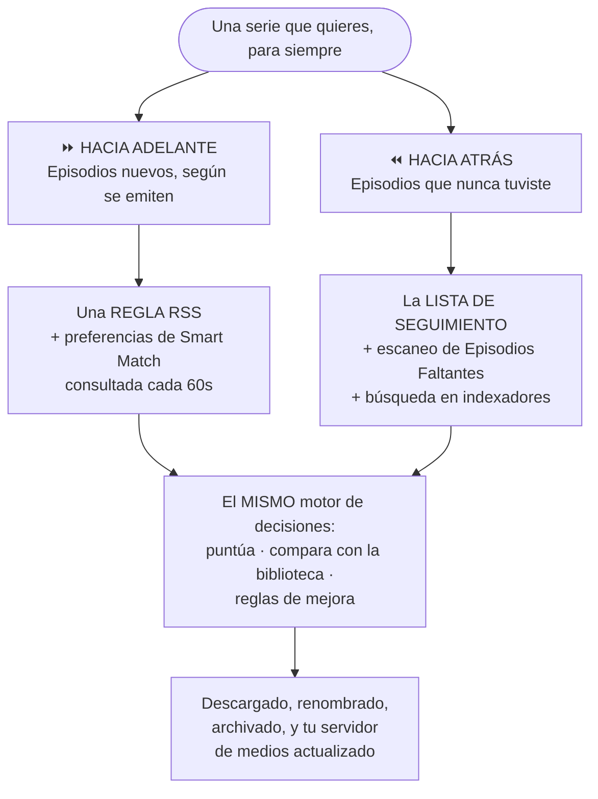
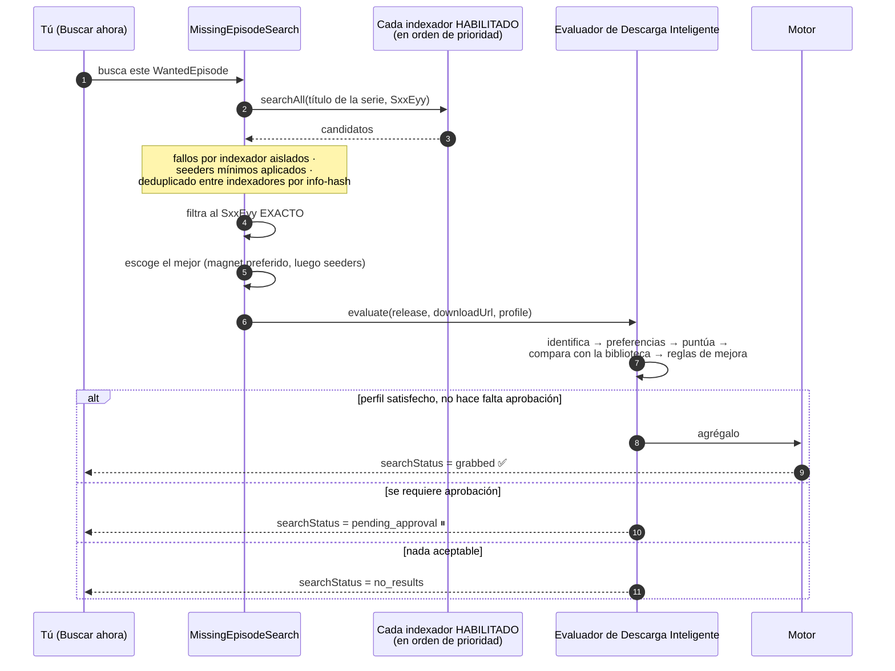

# Automatizar series de TV

**Nivel:** 🔵 Intermedio · **Tiempo:** ~60 minutos

La meta: una serie en la que nunca más tengas que pensar. Los episodios nuevos llegan
solos. Los huecos viejos se rellenan solos. Te enteras solo porque una notificación te
lo dijo.

## Resumen

Hay **dos direcciones** y quieres las dos.



La adquisición hacia adelante (RSS) captura el episodio de esta noche minutos después
de que se publica. La adquisición hacia atrás (lista de seguimiento + Episodios
Faltantes) rellena los 43 episodios que nunca tuviste. Ninguna hace el trabajo de la
otra.

## Propósito

Al terminar tendrás:

- Una serie **monitoreada** en la lista de seguimiento, con un conteo preciso de episodios faltantes.
- Episodios faltantes **buscados y capturados** — primero a mano, luego automáticamente.
- Una **regla RSS** capturando los episodios nuevos según aparecen.
- Certeza de qué va a pasar cuando la serie eventualmente **termine**.

## Cuándo usar este tutorial

| Úsalo cuando… | Usa otra cosa cuando… |
| --- | --- |
| Quieres una serie totalmente automatizada. | Quieres películas → [Construir una biblioteca de películas](/learn/tutorials/building-a-movie-library). |
| Quieres ver qué episodios te faltan. | Quieres ajustar preferencias de *calidad* → [Reglas RSS inteligentes](/learn/tutorials/smart-rss-rules). |
| Quieres que los huecos se rellenen sin que busques. | Todavía no tienes indexadores → [Múltiples indexadores](/learn/tutorials/multiple-indexers). |

## Requisitos previos

- [ ] Una **biblioteca de TV** funcional (`kind: tv`) cuyos elementos estén **identificados** — mira [Construir una biblioteca de películas](/learn/tutorials/building-a-movie-library), que aplica igual para TV.
- [ ] Al menos un **indexador** que pase su prueba (**Test**) (`/indexers`).
- [ ] El módulo `media_acquisition_intelligence` habilitado.
- [ ] Permisos: `media_acquisition.view`, `media_acquisition.manage_watchlist`, `media_acquisition.evaluate`; `rss.view`, `rss.manage`.
- [ ] **Un catálogo de episodios de IMDb** — mira la advertencia abajo. Esta es la que tumba a la gente.

:::danger Episodios Faltantes necesita el catálogo de *episodios* de IMDb
El conjunto de "qué episodios deberían existir" sale de tu espejo local de episodios de
IMDb. Ese espejo solo se llena cuando la importación de IMDb corre con **Import TV
series &amp; episodes** habilitado. **Una importación de solo películas no tiene
episodios contra los cuales comparar** — la página simplemente no mostrará nada
faltante, para siempre, y vas a pensar que está rota.

Configura esto en **Gestión de Medios → Configuración de IMDb** (`/media/settings/imdb`)
antes de seguir.
:::

## Conceptos

| Término | Significado |
| --- | --- |
| **Elemento de la lista de seguimiento** | Algo que quieres: `movie` / `series` / `season` / `episode`. |
| **Monitoreada** | En la lista de seguimiento **con un ID de IMDb**. Sin uno, una serie *no es monitoreable*. |
| **Episodio deseado** | Una fila calculada por cada episodio del catálogo: `owned` / `missing` / `unaired` / `ignored`. |
| **`searchStatus`** | `idle → searching → grabbed \| pending_approval \| no_results \| failed`. |
| **Perfil de adquisición** | La política: puntaje mínimo, puntaje de aprobación, mejoras permitidas, política de espera. |
| **Estado de la serie** | `continuing` / `returning` / `planned` / `on_hiatus` / `ended` / `canceled` / `unknown`. |

---

## Paso a paso

### Paso 1 — Asegúrate de que la serie esté de verdad en tu biblioteca, e identificada

Ve a **Gestión de Medios → Elementos de Medios** (`/media/items`).

Busca tu serie. Confirma:

- Que existe como una **serie** (no como 40 elementos sueltos, uno por episodio).
- Que su `matchStatus` es `matched` o `manual`, **no** `unmatched`.

:::warning "Faltante" vale tanto como tu identificación
La pertenencia se decide desde `MediaItem.season` / `episode`, que salen de la
**identificación por nombre de archivo** — no de un escaneo crudo. Una biblioteca con
archivos mal nombrados o sin identificar va a reportar de más lo *faltante*, y vas a
terminar volviendo a descargar cosas que ya tienes.

**Vuelve a identificar la biblioteca antes de confiar en cualquier conteo de episodios
faltantes.**
:::

:::info Por qué a veces una serie se fragmenta en un elemento por episodio
Para un layout episódico (`Show/Season NN/episode`), el **título de la serie se toma de
la carpeta de la serie**, no del nombre del archivo — porque el nombre del archivo suele
cargar solo el título del *episodio*. Si tus archivos están sueltos o la estructura de
carpetas es rara, esa consolidación no puede ocurrir. Reestructura a `Show/Season 01/…`
y vuelve a escanear.
:::

**Resultado esperado:** un elemento de medios para la serie, `matched`, con temporadas y
episodios debajo.

---

### Paso 2 — Monitorea la serie (la forma fácil)

Ve a **RSS y Adquisición → Inteligencia de Adquisición → Episodios Faltantes**
(`/media-acquisition/missing-episodes`).

Haz clic en **Agregar desde la biblioteca**.

Esto abre un selector múltiple con búsqueda de las series de TV **que ya están en tus
bibliotecas**, con sus IDs de IMDb **resueltos automáticamente** (desde el
`seriesImdbId` de cada serie, o desde el ID externo `imdb` de un episodio).

- Las series que ya están en la lista de seguimiento aparecen **premarcadas y bloqueadas**.
- Las series **sin un ID de IMDb resoluble** se marcan — todavía se pueden agregar, pero
  deberías **volver a identificar** la biblioteca para hacerlas escaneables.

Selecciona tu serie. Agrégala.

:::tip No escribas los IDs de IMDb a mano
*Puedes* — el diálogo de agregar/editar de la lista de seguimiento tiene un campo **ID de
IMDb** (estilo `tt0903747`). Pero el selector los resuelve por ti, en masa, y no comete
errores de tipeo.
:::

**Resultado esperado:** la serie aparece en la página de Episodios Faltantes como una
serie monitoreada.


---

### Paso 3 — Escanea en busca de episodios faltantes

Haz clic en **Escanear** en la serie (o en **Escanear todo**).

El escaneo:

1. Enumera **todos** los episodios de la serie desde el catálogo de episodios de IMDb.
2. Determina cuáles **tiene la biblioteca** — principalmente vía el enlace estructurado
   `seriesImdbId`, cayendo a una coincidencia de título sin distinguir mayúsculas si la
   biblioteca no ha sido re-identificada.
3. Clasifica cada episodio del catálogo:

| Estado | Significado |
| --- | --- |
| `owned` | Lo tienes. |
| `missing` | **Se emitió** y no lo tienes. **Este es el hueco adquirible.** |
| `unaired` | Su año de emisión está en el futuro o es desconocido — todavía no se puede adquirir. |
| `ignored` | Lo excluiste tú. **Sobrevive los reescaneos.** |

La temporada 0 (especiales) queda excluida de la matemática de faltantes.

**Resultado esperado:** conteos por serie (en biblioteca / total / faltantes / sin
estrenar / ignorados) y una cuadrícula de temporada → episodio que puedes expandir.

:::info Los reescaneos son idempotentes
Reescanear reconstruye todo **excepto** tus anulaciones `ignored` y el estado de captura
(`searchStatus`, `grabbedAt`) de los episodios ya buscados. No los puedes perder
reescaneando.
:::

:::caution El espejo va atrasado con respecto a IMDb
Tu catálogo está tan fresco como tu última importación de IMDb, y la importación
optimizada descarta episodios sin fecha de emisión. La página muestra la fecha del
espejo. Un episodio muy reciente puede no aparecer como *faltante* hasta que refresques
el espejo.
:::


---

### Paso 4 — Poda la lista antes de automatizarla

Expande la serie. Recorre la cuadrícula e **Ignora** todo lo que no quieras:

- Especiales que no te importan.
- Una temporada que a propósito no tienes.
- Episodios que nunca van a tener un lanzamiento.

Los episodios ignorados salen del conteo de faltantes y **sobreviven los reescaneos** —
así que esto es una inversión de una sola vez, no una tarea recurrente.

:::warning Poda ANTES de encender la búsqueda automática
Si habilitas el barrido contra una lista llena de episodios que nunca quisiste, va a ir
a buscarlos obedientemente. Diez minutos de poda aquí te ahorran un montón de disco.
:::

**Resultado esperado:** el conteo de *faltantes* ahora equivale al número de episodios
que realmente quieres.

---

### Paso 5 — Rellena un hueco a mano, primero

**No** enciendas la automatización todavía. Prueba que la cadena funciona con un
episodio.

Escoge un episodio faltante y haz clic en **Buscar ahora**.

Esto es lo que pasa:



Observa cómo cambia la insignia `searchStatus` del episodio: `searching` → `grabbed` /
`awaiting approval` / `no release` / `failed`.

**Resultado esperado:** uno de estos:

| Insignia | Significado | Qué hacer |
| --- | --- | --- |
| **Obtenido** | Se está descargando. | 🎉 Ve a `/torrents` y confírmalo. |
| **Esperando aprobación** | El motor de decisiones quiere a un humano. | Apruébalo en la pestaña **Cola de aprobación** de adquisición. |
| **Sin lanzamiento** | No se encontró nada aceptable. | Mira Solución de problemas. |
| **Búsqueda fallida** | La búsqueda misma dio error. | Revisa `docker compose logs backend`. |

:::info Por qué el mismo episodio no se busca dos veces
`searchStatus` se **preserva entre reescaneos**, exactamente igual que tus anulaciones
`ignored`. Un episodio obtenido o pendiente nunca se vuelve a buscar. El estado se cae
automáticamente en cuanto el episodio pasa a `owned`.
:::

También existe **Buscar todos** por serie, si quieres disparar todo el backlog a mano.

---

### Paso 6 — Ahora sí, enciende la búsqueda automática

Solo cuando el Paso 5 haya funcionado.

El barrido programado es **opcional y está APAGADO por defecto**. Habilítalo en la
configuración de adquisición de medios:

| Ajuste | Por defecto | Qué hace |
| --- | --- | --- |
| `autoSearchMissing` | **`false`** | Habilita el barrido programado. **Este es el interruptor maestro.** |
| `searchIntervalMinutes` | `60` | Backoff de re-búsqueda por episodio. |
| `missingSearchProfileId` | `null` | Con cuál perfil de adquisición capturar (cae al del elemento de la lista de seguimiento). |
| `maxSearchesPerSweep` | `50` | Limita cuántos episodios se buscan por tick. |

La protección contra capturas duplicadas está **en capas**, así que no estás a un ajuste
del desastre:

- `searchStatus` excluye las filas ya obtenidas/pendientes.
- Un backoff de `lastSearchedAt` impone la cadencia.
- Una guarda de reentrada evita barridos solapados.
- `searchAll` deduplica candidatos entre indexadores por info-hash.
- La propia comprobación de **owned** del evaluador devuelve `skip` si la biblioteca ya
  lo tiene.

**Resultado esperado:** durante los próximos barridos, los episodios faltantes pasan a
`grabbed` por su cuenta.

:::caution La búsqueda automática es solo de episodios
Las filas `WantedMovie` cargan las mismas columnas de estado de captura, pero la búsqueda
automática es **solo de episodios** hoy. Las *películas* faltantes se detectan y listan,
pero tienes que adquirirlas tú (o vía una regla RSS).
:::

---

### Paso 7 — Captura los episodios *futuros* con una regla RSS

Episodios Faltantes mira hacia atrás. Para el episodio de esta noche quieres RSS.

1. Ve a **RSS y Adquisición → Fuentes RSS** (`/rss`).
2. **Agregar fuente** — una URL y un intervalo de actualización. El job `rss_poll` corre
   cada 60 segundos y obtiene las fuentes cuyo intervalo ya venció.
3. **Agregar regla** bajo esa fuente:

   | Campo | Valor |
   | --- | --- |
   | Nombre | `The Expanse` |
   | **Tipo de medio** | **`tv`** ← esto es lo que activa la conciencia del estado de la serie |
   | Regex de inclusión | algo que coincida con la serie |
   | Regex de exclusión | ej. excluye `CAM`, `HDTS`, idiomas que no quieres |
   | Ruta de guardado | `/downloads/tv` ← **debe estar dentro de la raíz de tu biblioteca de TV** |
   | Descarga automática | activada |

4. Guarda.

**Resultado esperado:** la regla se crea, y como pusiste **Tipo de medio = tv**, aparece
un **panel de estado de la serie** en vivo.

---

### Paso 8 — Entiende el panel de estado de la serie

Cuando el tipo de medio es `tv` o `anime`, UltraTorrent resuelve el **estado de emisión**
de la serie — del lado del servidor, sin confiar nunca en nada que mande el navegador —
usando proveedores probados en orden de confianza:

| Proveedor | Fuente | Confianza |
| --- | --- | --- |
| TMDB | `/search/tv` + `/tv/{id}` | 0.95 — estado, próximo/último episodio, póster |
| Conjunto de datos de IMDb | tu espejo local `IMDbTitle` | 0.6 — finalizada/en emisión, sin granularidad de próximo episodio |
| Biblioteca local | tus propios `MediaItem` | 0.3 — respaldo de mejor esfuerzo |

La respuesta se normaliza a un estado y una recomendación:

| Estado | Recomendación |
| --- | --- |
| `continuing` · `returning` · `planned` | ✅ **recomendado** |
| `on_hiatus` | ⚠️ **con precaución** |
| `ended` · `canceled` | ⛔ **no recomendado** |
| `unknown` | ❓ **desconocido** — guardado con una advertencia `status_unconfirmed` |

:::warning Guardar una regla para una serie finalizada está bloqueado — a propósito
Monitorear una serie cancelada para siempre solo desperdicia consultas. Si intentas
guardar una regla de TV para una serie `ended` o `canceled`, el guardado es **rechazado
(400)** y aparece un modal de confirmación. Confirmar activa
`allowInactiveShowMonitoring` — y **esa anulación queda auditada**.

Si lo que en realidad quieres es *rellenar* una serie vieja en vez de monitorearla hacia
adelante, la jugada correcta es una regla con la **descarga automática APAGADA**, más el
flujo de lista de seguimiento + Episodios Faltantes de los Pasos 2 a 6.
:::

**Resultado esperado:** una insignia de estado, un banner de recomendación, el proveedor
y su confianza, las fechas de próximo/último episodio y un póster — antes de guardar.


---

### Paso 9 — Construye las preferencias de calidad

Abre la página de detalle de la regla (`/rss/rules/:ruleId`). Ahí es donde viven el
**Smart Match Builder** y las **Preferencias de coincidencia**.

No trates de expresar la calidad con regex. Construye en su lugar una **lista de
preferencias ordenada** — "2160p Dolby Vision primero, 1080p WEB-DL segundo, nunca un
CAM" — y el motor mantendrá **un lanzamiento por episodio**, mejorará a uno
estrictamente mejor si aparece, y omitirá cualquier cosa igual o peor.

Eso se cubre como es debido en [Reglas RSS inteligentes](/learn/tutorials/smart-rss-rules).
Por ahora, una lista simple basta.

**Resultado esperado:** la lista de Preferencias de coincidencia de la regla está
ordenada como quieres.

---

### Paso 10 — Qué pasa cuando la serie termina

Un job en segundo plano (`rss_show_status_refresh`) vuelve a resolver los estados de
serie en caché con una **cadencia por estado**:

| Estado | Se revisa cada |
| --- | --- |
| activa | 24 horas |
| `on_hiatus` | 7 días |
| `ended` / `canceled` | 30 días |
| `unknown` | 3 días |

Cuando el estado de una serie **cambia**, actualiza cada regla que fotografió esa serie,
emite `rss.show_status.changed` más la transición específica
(`rss.show.ended` / `.canceled` / `.became_active`), y lo audita.

:::info Nunca deshabilita tu regla
Exponer el cambio es trabajo de la plataforma. Decidir qué hacer al respecto es tuyo. Si
*quieres* que sea automático, construye una regla de automatización sobre el disparador
`rss.show.ended` con una acción como `convert_rule_to_backfill` (que apaga la descarga
automática pero conserva la regla) o `disable_rss_rule`. Mira
[Notificaciones y automatización](/learn/tutorials/notifications-and-automation).
:::

**Resultado esperado:** te enteras cuando una serie termina, y tú decides qué pasa
después.

:::tip Mira este tutorial
_Video próximamente._
:::

---

## Ejemplos

### La configuración completa para una serie

| Pieza | Dónde | Ajuste |
| --- | --- | --- |
| Biblioteca | `/media/libraries` | `/downloads/tv`, kind `tv`, preset `plex`, modo `hardlink`, escaneo `360` |
| Lista de seguimiento | `/media-acquisition` → Lista de seguimiento | Serie, con ID de IMDb (vía **Agregar desde la biblioteca**) |
| Relleno hacia atrás | `/media-acquisition/missing-episodes` | Escanear → podar con Ignorar → Buscar todos |
| Relleno automático | configuración de adquisición | `autoSearchMissing: true`, `maxSearchesPerSweep: 50` |
| Hacia adelante | `/rss` → regla | Tipo de medio `tv`, ruta de guardado `/downloads/tv`, descarga automática activada |
| Calidad | `/rss/rules/:id` | Una lista ordenada de Preferencias de coincidencia |
| Cuando termine | `/automation` | Disparador `rss.show.ended` → acción `convert_rule_to_backfill` + `notify_admin` |

### Una regla de automatización para el día que termine

```text
TRIGGER    rss.show.ended
CONDITIONS (ninguna — aplica a toda serie)
ACTIONS    convert_rule_to_backfill   ← conserva la regla, detén la captura hacia adelante
           notify_admin               ← avísame
```

---

## Solución de problemas

| Síntoma | Causa | Arreglo |
| --- | --- | --- |
| Episodios Faltantes no muestra nada | La importación de IMDb corrió **solo de películas**. | Vuelve a importar con **Import TV series &amp; episodes** habilitado (`/media/settings/imdb`). |
| La serie sale como *no monitoreable* | No hay ID de IMDb en el elemento de la lista de seguimiento. | Usa **Agregar desde la biblioteca**, o pon el ID de IMDb a mano. Si no se puede resolver, vuelve a identificar la biblioteca. |
| Dice que me faltan episodios que definitivamente tengo | Los elementos de la biblioteca están sin identificar, así que no se puede probar la pertenencia. | Vuelve a identificar la biblioteca. Limpia `/media/unmatched`. |
| Todo sale como `unaired` | El catálogo no tiene año de emisión para esos episodios. | El espejo va atrasado con respecto a IMDb — refresca la importación. |
| **Buscar ahora** → `no release` | (a) El título de escena de la serie no se parsea a tu título de la lista de seguimiento (un alias). (b) Ningún indexador la carga. (c) `minSeeders` filtró todo. | Revisa el indexador directamente; baja `minSeeders`; confirma que el título coincide con cómo los lanzamientos nombran la serie de verdad. |
| **Buscar ahora** → `failed` | El indexador dio error. | Prueba el indexador (`/indexers`); revisa `docker compose logs backend`. |
| Todo cae en `pending_approval` | Tu perfil fuerza la aprobación, o el puntaje está bajo `approvalScore`. | Ajusta el perfil de adquisición, o apruébalos. |
| Se capturó, pero el archivo nunca aparece | La ruta de guardado de la captura está fuera de la raíz de tu biblioteca de TV, así que la tubería de medios nunca corrió. | Arregla la ruta de guardado de la regla / la ruta del perfil. |
| La regla RSS no guarda | La serie está `ended`/`canceled`. | Confirma la anulación (auditada), **o** construye una regla de relleno con la descarga automática apagada. |
| La regla captura y luego borra lo que capturó | Una **mejora**: apareció un lanzamiento de prioridad estrictamente mayor. | Funciona según lo diseñado. Ajusta tu lista de preferencias si no estás de acuerdo. |
| La búsqueda automática nunca corre | `autoSearchMissing` está en `false` — el valor por defecto. | Enciéndelo. |
| URL del torrent bloqueada | Guarda SSRF vs. un indexador en IP privada. | Agrega el host a `SSRF_ALLOW_HOSTS` (mantén `prowlarr`). |

---

## Consejos

:::tip Rellena a mano una vez, luego automatiza
Correr **Buscar todos** manualmente en una serie te enseña más sobre tus indexadores, tu
perfil y tu lista de preferencias en diez minutos que una semana del barrido corriendo
calladito en el fondo.
:::

:::tip Usa el Simulador de Decisiones con un lanzamiento que fue omitido
Pega el nombre del lanzamiento en `/media-acquisition/simulator` y lee la traza. Te dice
exactamente qué etapa lo rechazó — con **cero efectos secundarios**.
:::

:::warning Pon `maxSearchesPerSweep` con sensatez
El valor por defecto de `50` es por tick. Si acabas de agregar seis temporadas de cinco
series, eso es un montón de tráfico hacia los indexadores. Algunos indexadores limitan la
tasa; otros banean. Empieza pequeño.
:::

:::info Descarga Inteligente no reimplementa la calidad
**Consume** las listas de preferencias de Smart Match del módulo RSS y el motor de
Puntuación de Lanzamientos como fuente de la verdad. Ajusta la calidad en un solo lugar y
ambos caminos la obedecen.
:::

---

## Preguntas frecuentes

**¿Necesito tanto una regla RSS como la lista de seguimiento?**
Para una serie que está al aire ahora mismo, sí — cubren direcciones opuestas en el
tiempo. Para una serie terminada solo quieres la lista de seguimiento + Episodios
Faltantes.

**¿Y si mi indexador conoce la serie con otro nombre?**
Un candidato solo coincide cuando su título de escena **se parsea al nombre de la serie**.
Una serie bajo un alias sustancialmente distinto puede no encontrar nada — el lanzamiento
se omite en vez de capturarse mal, que es el fallo seguro. Maneja esa serie con una regla
RSS cuyo regex de inclusión coincida con el alias.

**¿Puede capturar packs de temporada?**
La búsqueda en indexadores para episodios faltantes filtra los candidatos al **`SxxEyy`
exacto**. Una regla RSS puede coincidir con lo que su regex y su lista de preferencias
permitan.

**¿Volverá a descargar un episodio que ya tengo en peor calidad?**
Solo si tu perfil permite **mejoras** (`duplicateRules.allowUpgrades`) *y* el lanzamiento
nuevo gana en una dimensión de mejora real — resolución, fuente, HDR, audio, canales. Un
cambio de códec por sí solo (x264 → x265) **nunca** dispara una mejora.

**¿Qué es `wait` y por qué no se descarga nada?**
La política de espera de tu perfil (`waitForBetter` + `waitUntilScore`) está aguantando a
propósito por algo mejor. Mira la cola **En espera** en el panel de Descarga Inteligente.

**¿Se notifican las decisiones de Descarga Inteligente?**
Todavía no — las notificaciones por usuario en eventos de decisión y los disparadores de
automatización de Descarga Inteligente **aún no están implementados**. Usa las colas, y el
evento de notificación `media.missing_episode_filled` que sí emite una captura exitosa.

---

## Lista de verificación

### Verificación

- [ ] La importación de IMDb corrió **con TV series &amp; episodes habilitado**.
- [ ] La serie existe como **un** elemento de medios en una biblioteca `tv`, `matched`.
- [ ] Está en la **lista de seguimiento con un ID de IMDb** (vía **Agregar desde la biblioteca**).
- [ ] Un **escaneo** produjo conteos sensatos de en biblioteca / faltantes / sin estrenar.
- [ ] **Podé** la lista con Ignorar.
- [ ] Un episodio se rellenó con **Buscar ahora** y llegó a `grabbed`.
- [ ] Ese torrent apareció en `/torrents` y se completó.
- [ ] Fue **renombrado hacia la biblioteca de TV** automáticamente.
- [ ] `autoSearchMissing` está encendido, con un `maxSearchesPerSweep` sensato.
- [ ] Existe una **regla RSS** con **Tipo de medio = tv** y una ruta de guardado dentro de la raíz de la biblioteca de TV.
- [ ] El panel de estado de la serie mostró **recomendado**.
- [ ] Sé qué va a pasar cuando la serie termine.

### Resultados esperados

| Pantalla | Esperado |
| --- | --- |
| `/media-acquisition/missing-episodes` | Conteos precisos; insignias `grabbed` apareciendo con el tiempo |
| `/torrents` | Episodios llegando sin ti |
| `/media/items` | La serie creciendo, todo `matched` |
| `/rss/rules/:id` | Una lista de preferencias ordenada, y una insignia verde de estado de la serie |

### Próximos pasos

1. [Reglas RSS inteligentes](/learn/tutorials/smart-rss-rules) — toma las decisiones de *calidad* como es debido.
2. [Múltiples indexadores](/learn/tutorials/multiple-indexers) — más fuentes = más huecos rellenados.
3. [Notificaciones y automatización](/learn/tutorials/notifications-and-automation) — entérate, y reacciona a `rss.show.ended`.

---

## Ver también

- [Episodios Faltantes](/modules/missing-episodes) · [Descarga Inteligente](/modules/smart-download)
- [RSS](/modules/rss) · [Indexadores](/modules/indexers) · [Gestor de Medios](/modules/media-manager)
- [Flujos de trabajo](/learn/workflows) — los flujos 2 y 4 son este tutorial, en diagramas.
- [Conceptos básicos](/learn/concepts) — lista de seguimiento, episodio deseado, dimensiones de mejora.
- [Automatización](/modules/automation) · [Solución de problemas](/operate/troubleshooting)
