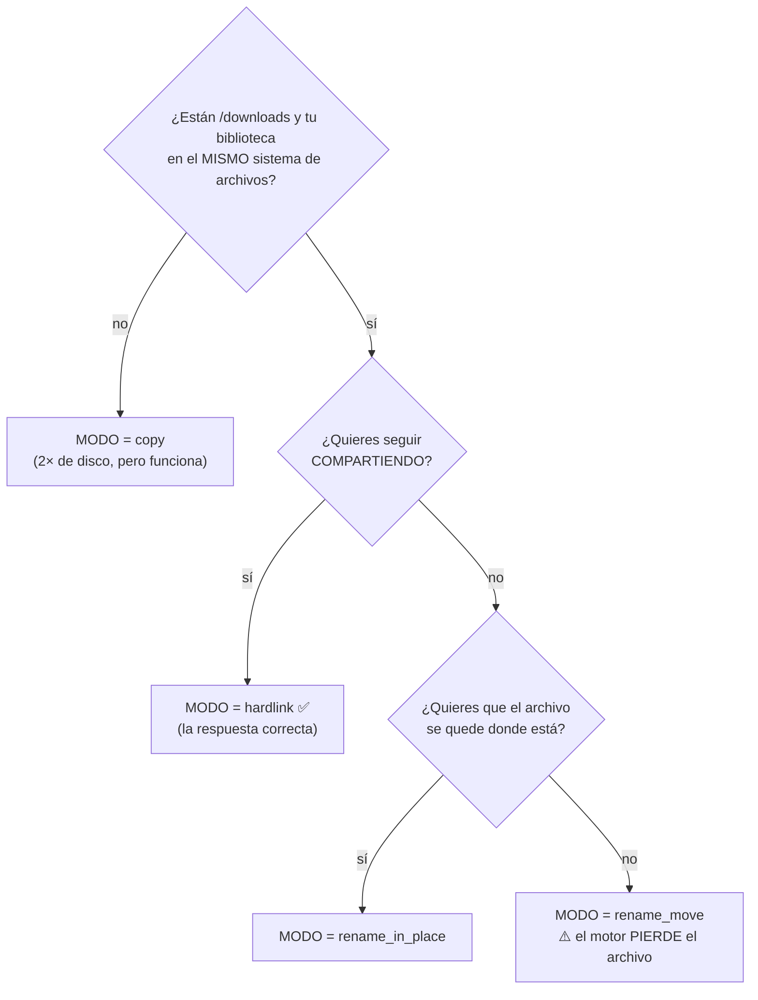

# Construir una biblioteca de películas

**Nivel:** 🔵 Intermedio · **Tiempo:** ~45 minutos

Tienes descargas. Se llaman cosas como
`Some.Movie.2024.2160p.UHD.BluRay.REMUX.DV.HDR.TrueHD.7.1.Atmos-GROUP`. Tu servidor de
medios odia eso. Este tutorial convierte esa carpeta en una biblioteca.

## Resumen


## Propósito

Construir una biblioteca de películas que:

- Nombre cada archivo como Plex/Jellyfin/Emby lo espera.
- Siga compartiendo, porque hace hardlink en vez de mover.
- Se enriquezca sola con metadatos, pósters y sidecars NFO.
- Te diga qué elementos **no** pudo identificar, en vez de adivinar en silencio.
- Organice las descargas **futuras** automáticamente, sin más trabajo de tu parte.

## Cuándo usar este tutorial

| Úsalo cuando… | Usa otra cosa cuando… |
| --- | --- |
| Tienes descargas y las quieres organizadas. | Quieres series de TV → [Automatizar series de TV](/learn/tutorials/automating-tv-shows). |
| Tu servidor de medios muestra títulos basura. | Quieres *adquirir* películas, no organizarlas → [Reglas RSS inteligentes](/learn/tutorials/smart-rss-rules). |
| Quieres que las descargas futuras se organicen solas. | Solo quieres que una descarga funcione → [Mi primera descarga](/learn/first-download). |

## Requisitos previos

- [ ] Un stack corriendo ([Inicio rápido](/learn/quick-start)).
- [ ] Al menos una **descarga completada** con la que practicar.
- [ ] El módulo `media_manager` **habilitado** (lo está, por defecto — revisa **Administración → Módulos**).
- [ ] Permisos: `media_manager.manage_libraries`, `media_manager.scan`, `media_manager.rename`, `media_manager.move_files`.
- [ ] **10 minutos pensando en la estructura de tus carpetas** antes de tocar nada. Esto importa más que cualquier ajuste.

:::danger Decide primero la estructura de tu sistema de archivos
Dos cosas dependen de ella y las dos son dolorosas de cambiar después:

1. **Los hardlinks no pueden cruzar sistemas de archivos.** Tus descargas y tu biblioteca
   tienen que estar en el **mismo** volumen/montaje, o el hardlink va a fallar y te vas a
   ver forzado a usar `copy` (2× el disco).
2. **La tubería post-descarga es opcional por ruta.** Organiza un torrent completado
   **solo** cuando *la ruta raíz de una biblioteca habilitada contiene la ruta de guardado
   de ese torrent*.

Una estructura que satisface ambas, desde el día uno:

```text
/downloads                 ← FILE_MANAGER_ROOTS (un volumen)
├── movies/                ← la biblioteca de Películas apunta AQUÍ
├── tv/                    ← la biblioteca de TV apunta aquí
└── unsorted/              ← sin biblioteca — nunca se organiza automáticamente
```
:::

## Conceptos

| Término | Significado |
| --- | --- |
| **Biblioteca** | Una carpeta + su `kind`, `preset` de nombres, `template`, `mode` de renombrado e intervalo de escaneo. |
| **Kind (tipo)** | `movie` / `tv` / `anime` / `music` / `audiobook` / `general`. **Manda** sobre el nombre del archivo. |
| **Elemento de medios** | Un título en una biblioteca, con un `matchStatus` de `unmatched` / `matched` / `manual`. |
| **Identificación** | Parsear el nombre del lanzamiento en tipo/título/año/temporada/episodio con un puntaje de confianza. |
| **Modo de renombrado** | `preview` · `rename_in_place` · `rename_move` · `copy` · `hardlink` (por defecto) · `symlink`. |
| **NFO** | Un sidecar XML estilo Kodi que los servidores de medios leen. |

---

## Paso a paso

### Paso 1 — Escoge tu preset de nombres

Ve a **Gestión de Medios → Bibliotecas** (`/media/libraries`).

Antes de crear nada, decide el **preset**, porque él te llena la plantilla de nombres:

| Preset | Escógelo si tu servidor de medios es… |
| --- | --- |
| `plex` | Plex |
| `jellyfin` | Jellyfin |
| `emby` | Emby |
| `kodi` | Kodi |
| `custom` | Otra cosa, o quieres control total de la plantilla |

**Resultado esperado:** sabes qué preset quieres. Si no estás seguro, escoge el que
corresponde al servidor que de verdad corres.

---

### Paso 2 — Crea la biblioteca, en modo `preview`

Haz clic en **Agregar biblioteca** y llénala:

| Campo | Valor | Por qué |
| --- | --- | --- |
| **Nombre** | `Movies` | Tuyo. |
| **Ruta** | `/downloads/movies` | Tiene que estar dentro de `FILE_MANAGER_ROOTS`. El selector te va a ofrecer crearla. |
| **Tipo** | `movie` | Esto manda — evita que una carpeta como `9-1-1 (2018)` se lea mal. |
| **Preset** | `plex` (o el tuyo) | Suministra la plantilla. |
| **Modo** | **`preview`** | **Empieza aquí. No toca nada.** |
| **Plantilla** | *(en blanco)* | El preset la llena. Anúlala después si quieres. |
| **Intervalo de escaneo** | *(en blanco por ahora)* | En blanco o `0` = escaneos manuales solamente. |
| **Habilitada** | activada | Una biblioteca deshabilitada nunca se escanea ni se organiza automáticamente. |

Guarda.

**Resultado esperado:** la biblioteca aparece en la lista con tres insignias — su
**tipo**, su **preset** y su **modo**. La ruta se muestra en monoespaciado debajo del
nombre.


:::warning Una biblioteca no puede vivir fuera de las raíces duras
`FILE_MANAGER_ROOTS` (por defecto `/downloads`) es un límite duro que se impone después
de canonicalizar. El traversal, el escape por symlink y el escape absoluto se rechazan
todos. Si necesitas una biblioteca en otro lado, agrega esa ruta a `FILE_MANAGER_ROOTS` y
reinicia el backend — no trates de engañarlo.
:::

---

### Paso 3 — Escanéala

Haz clic en **Escanear** en la biblioteca.

El escaneo recorre el árbol de carpetas, descubre archivos de medios y crea un **elemento
de medios** por título. Corre como un **job en segundo plano** — no bloquea la interfaz, y
su progreso se transmite por WebSocket.

**Resultado esperado:** ve a **Gestión de Medios → Elementos de Medios** (`/media/items`).
Deberías ver un elemento por cada película encontrada.


---

### Paso 4 — Revisa lo que *no* pudo identificar

Este es el paso que todo el mundo se salta y después se queja.

Ve a **Gestión de Medios → Medios sin Coincidencia** (`/media/unmatched`).

La identificación parsea el nombre del lanzamiento en tipo/título/año con un **puntaje de
confianza**, y fija un `matchStatus`:

| `matchStatus` | Significado | Qué hacer |
| --- | --- | --- |
| `matched` | Identificado automáticamente. | Nada. |
| `manual` | Lo corregiste a mano. | Nada. |
| `unmatched` | El nombre no se parseó con confianza. | **Arréglalo aquí.** |

Empareja a mano cada elemento sin coincidencia. Una vez emparejado, todo lo que va después
— metadatos, ilustraciones, renombrado, detección de duplicados, pertenencia de Episodios
Faltantes — empieza a funcionar para él.

**Resultado esperado:** la lista sin coincidencia está vacía, o contiene solo basura
genuinamente inidentificable.

:::danger Los elementos sin coincidencia envenenan todo lo que viene después
Un elemento sin identificar no tiene título, ni año, ni IDs externos. No se puede renombrar
correctamente, no se va a contar como *en biblioteca* por Episodios Faltantes (así que te
van a decir que te faltan cosas que en realidad tienes), y no se va a deduplicar. **Limpia
la lista sin coincidencia antes de confiar en cualquier otro número.**
:::


---

### Paso 5 — Enciende los metadatos

Ve a **Gestión de Medios → Configuración de Medios** (`/media/settings`). Esta página
aloja los Proveedores de Metadatos, las preferencias de Ilustraciones, las preferencias de
Subtítulos, las herramientas de NFO y las Integraciones con Servidores de Medios.

Los metadatos vienen de proveedores, probados en orden:

| Proveedor | Fuente | Necesita |
| --- | --- | --- |
| **local** | Sidecars NFO que ya están junto a tus archivos | Nada. Siempre disponible. |
| **tmdb** | The Movie Database | Una clave API de TMDB. |
| **imdb** | **Conjuntos de datos de IMDb provistos por ti** y/o una **API de IMDb licenciada** | Se configura en **Medios → Configuración → IMDb** (`/media/settings/imdb`). |

Pon una clave de TMDB si tienes una — es la fuente de mayor confianza, y también es la que
alimenta después la conciencia del estado de emisión de las series de TV.

:::info UltraTorrent no hace scraping de IMDb
El proveedor de IMDb trabaja a partir de **conjuntos de datos provistos por ti** y/o una
**API de IMDb licenciada**. Nunca hace scraping de las páginas web de IMDb. La importación
de conjuntos de datos está confinada a las raíces duras y la clave API se cifra en reposo
con AES-GCM. Mira `/media/settings/imdb`.
:::

**Resultado esperado:** tus elementos de medios ganan sinopsis, géneros, reparto e IDs
externos (tmdb/tvdb/imdb/omdb/anilist).


---

### Paso 6 — Previsualiza el renombrado. Léelo. Léelo de verdad.

Ve a **Gestión de Medios → Motor de Renombrado** (`/media/rename-preview`).

Esto construye el plan de renombrado completo — cada ruta de origen, cada ruta de destino —
y **no cambia absolutamente nada**. Cada segmento de ruta se sanitiza.

Lee cada línea. Pregúntate:

- ¿Está bien el **título**?
- ¿Está bien el **año**?
- ¿El destino está dentro de la biblioteca, donde lo esperas?
- ¿Hay parseos obviamente malos? (Vuelve al Paso 4.)

**Resultado esperado:** un plan que estarías contento de ejecutar.


:::tip La plantilla es a base de tokens
El preset te da un valor por defecto sensato, pero puedes escribir la tuya con tokens
(título, año, resolución, fuente, edición, y así). La página de renombrado tiene un panel
de ayuda de tokens. Cada segmento se sanitiza, así que no puedes salirte de las raíces
duras vía la plantilla.
:::

---

### Paso 7 — Escoge tu modo con los ojos abiertos

Ahora la decisión importante.



| Modo | Disco extra | Sobrevive el seeding | Veredicto |
| --- | --- | --- | --- |
| `preview` | — | — | Donde empiezas. |
| **`hardlink`** *(por defecto)* | **Ninguno** | ✅ | **Lo que quieres.** Los mismos bytes, dos nombres. |
| `copy` | 2× | ✅ | Cuando las dos rutas están en sistemas de archivos distintos. |
| `symlink` | Ninguno | ✅ | Un puntero. Algunos servidores/contenedores no siguen symlinks entre montajes. |
| `rename_in_place` | Ninguno | ⚠️ | Renombra donde ya está. |
| `rename_move` | Ninguno | ❌ | El motor pierde el archivo. Solo si no compartes. |

Edita la biblioteca, cambia el **Modo** a `hardlink`, guarda, y aplica el renombrado.

**Resultado esperado:** el archivo ahora existe en una ruta limpia
(`/downloads/movies/Some Movie (2024)/Some Movie (2024).mkv`) **y** el torrent sigue
compartiendo — porque un hardlink son dos entradas de directorio apuntando a los mismos
bytes.

Verifica ambas cosas:

```bash
# Un inodo, dos nombres, una sola copia de los datos.
docker compose exec backend \
  find /downloads -samefile "/downloads/movies/Some Movie (2024)/Some Movie (2024).mkv"
```

Deberías ver **dos** rutas listadas. Ese es todo el truco.

:::danger "Invalid cross-device link"
Ese error significa que `/downloads` y tu biblioteca están en sistemas de archivos
distintos. Los hardlinks son dos nombres para un mismo inodo, y un inodo pertenece a
exactamente un sistema de archivos. O reestructuras tus montajes en un solo volumen (lo
mejor), o pones el modo en `copy` y aceptas el doble uso de disco.
:::

---

### Paso 8 — Ilustraciones, subtítulos y NFO

Una vez que los elementos están emparejados, las etapas de enriquecimiento pueden correr:

| Etapa | Qué hace | Dónde verlo |
| --- | --- | --- |
| **Ilustraciones** | Descarga ilustraciones tipadas (póster, fanart, logo, clearart, banner, miniatura) vía el proveedor de ilustraciones, dentro de las raíces duras, pasando por la misma validación de magic bytes + tamaño que las subidas. | La página de detalle del elemento de medios. |
| **Subtítulos** | Descubrimiento de sidecars con banderas de idioma/forzado/SDH, más detección de idiomas faltantes. | La página de detalle del elemento de medios. |
| **NFO** | Escribe sidecars estilo Kodi de película/serie/temporada/episodio — solo dentro de las raíces duras. | Junto al archivo de medios. |

:::info Las subidas propias mandan
Si subes tu propio póster, mantiene **precedencia de selección** sobre las ilustraciones
importadas automáticamente. UltraTorrent no va a sobrescribir tu elección.
:::

:::caution La descarga remota de subtítulos todavía no se envía
El **descubrimiento** de sidecars ya está hoy (encuentra los archivos `.srt` que ya tienes
y te dice qué idiomas faltan). Descargar subtítulos desde un proveedor remoto como
OpenSubtitles está **planificado**, no presente.
:::

---

### Paso 9 — Limpia los duplicados

Ve a **Gestión de Medios → Duplicados** (`/media/duplicates`).

Los grupos de duplicados se forman por motivo:

- Mismo título + año
- Misma serie + temporada + episodio
- Mismo ID externo
- Mismo hash de archivo
- Nombre de archivo similar

Revisa cada grupo y quédate con el que quieras.

**Resultado esperado:** una copia de cada película, en la calidad que escogiste.


---

### Paso 10 — Hazlo automático, para siempre

Dos interruptores, y no vuelves a hacer nada de esto a mano.

**A. Las descargas futuras se organizan solas.**
Ya está hecho — mientras la **ruta de guardado del torrent esté dentro de la raíz de la
biblioteca**. Así que cuando agregues un torrent de película, pon su ruta de guardado en
`/downloads/movies`. El evento `torrent.completed` corre la tubería completa: escaneo →
identificación → metadatos → renombrado/hardlink → ilustraciones → subtítulos → NFO →
actualización del servidor de medios.

**B. Los archivos que sueltas a mano también se enriquecen.**
Edita la biblioteca y ponle un **intervalo de escaneo** (ej. `360` minutos). Un tick barato
de 5 minutos recoge cualquier biblioteca cuyo escaneo esté **vencido** y la enriquece.

:::warning El escaneo periódico se comporta distinto a propósito
No carga **ningún contexto de torrent**, así que **no dispara ningún trigger de
automatización `media.*`**, y **nunca renombra ni mueve archivos** — enriquece *en el
lugar*. Renombrar sigue siendo trabajo del organizador de descargas. Rellena solo los
huecos (identidad, metadatos, póster) que de verdad faltan, así que en régimen estable los
escaneos casi no hacen trabajo.

Un intervalo de escaneo en blanco o en cero significa **escaneos manuales solamente** —
esa biblioteca nunca se escanea automáticamente.
:::

**Resultado esperado:** dejas de visitar estas páginas, que es la meta.

---

### Paso 11 — Revisa la salud de la biblioteca

Ve a **Gestión de Medios → Panel de Medios** (`/media`).

Te muestra:

- Elementos sin coincidencia
- Ilustraciones faltantes
- Subtítulos faltantes
- Duplicados

Apunta a ceros. Eso es una biblioteca sana.


:::tip Mira este tutorial
_Video próximamente._
:::

---

## Ejemplos

### Una estructura de tres bibliotecas que escala

| Biblioteca | Ruta | Tipo | Preset | Modo | Intervalo de escaneo |
| --- | --- | --- | --- | --- | --- |
| Movies | `/downloads/movies` | `movie` | `plex` | `hardlink` | `720` |
| TV | `/downloads/tv` | `tv` | `plex` | `hardlink` | `360` |
| Anime | `/downloads/anime` | `anime` | `plex` | `hardlink` | `360` |

Nada apunta a `/downloads/unsorted`, así que nada de ahí se toca nunca.

### Verificar que el hardlink de verdad ocurrió

```bash
docker compose exec backend stat -c '%h %i %n' \
  "/downloads/movies/Some Movie (2024)/Some Movie (2024).mkv"
```

Un conteo de enlaces (`%h`) de **2** o más significa que el hardlink funcionó. Un conteo de
`1` significa que copiaste o moviste.

---

## Solución de problemas

| Síntoma | Causa | Arreglo |
| --- | --- | --- |
| El escaneo no encuentra nada | Ruta equivocada, carpeta vacía, o la biblioteca está deshabilitada. | Revisa la ruta en el **Gestor de Archivos** (`/files`) y que **Habilitada** esté activada. |
| Todo sale `unmatched` | Los nombres de los lanzamientos son poco convencionales o los archivos están sueltos. | Empareja manualmente en `/media/unmatched`; mejora los nombres de origen de aquí en adelante. |
| Una película se detectó como serie de TV | Usaste una biblioteca `general`. | Pon el **tipo** de la biblioteca en `movie` — el tipo manda; solo `general` adivina desde el nombre del archivo. |
| El renombrado produjo una ruta rara | El título o el año parseados están mal. | Arregla primero la identificación del elemento, luego vuelve a previsualizar. |
| "Invalid cross-device link" | Las descargas y la biblioteca están en sistemas de archivos distintos. | Usa `copy`, o unifica los montajes. |
| Renombró, pero el torrent dio error | Usaste `rename_move` y el motor perdió el archivo. | Cambia a `hardlink`. **Reverifica** el torrent, o vuelve a agregarlo. |
| Las descargas nunca se organizan automáticamente | La ruta de guardado no está dentro de la raíz de una biblioteca **habilitada**. | Pon la ruta de guardado del torrent correctamente, o mueve la raíz de la biblioteca. |
| Los archivos se crean como `root` | El motor corrió como root. | Pon `PUID`/`PGID` en `.env` con el usuario dueño (`id someuser`) y recrea el contenedor del motor. |
| No aparecen ilustraciones | No hay proveedor de metadatos configurado, o el elemento está sin coincidencia. | Pon una clave de TMDB en `/media/settings`; limpia la lista sin coincidencia. |
| Plex sigue mostrando el nombre viejo | Plex no ha vuelto a escanear. | Configura una integración con el servidor de medios para que las actualizaciones se envíen automáticamente → [Integrar Plex/Jellyfin](/learn/tutorials/integrating-plex-jellyfin). |

---

## Consejos

:::tip Empieza siempre una biblioteca nueva en `preview`
No te cuesta nada y ha salvado al menos una vez a todo el que lo ha usado.
:::

:::tip Arregla la identificación antes que ninguna otra cosa
Los metadatos, las ilustraciones, el renombrado, los duplicados y la pertenencia de
episodios faltantes leen todos de la identidad parseada. Ten eso bien y el resto sale
gratis.
:::

:::tip Pon la ruta de guardado cuando agregas el torrent
Es el único campo que decide si toda la tubería de medios corre. Ponerlo toma dos segundos;
retrofitearlo significa mover archivos.
:::

:::info Todo lo que toma tiempo es un job
Los escaneos, los metadatos, las ilustraciones, los escaneos de subtítulos, las vistas
previas de renombrado, la ejecución del renombrado, la generación de NFO y la actualización
del servidor de medios corren todos como jobs en segundo plano rastreados y con progreso en
vivo. Nada bloquea la API.
:::

---

## Preguntas frecuentes

**¿Necesito TMDB?**
No, pero lo quieres. Sin un proveedor en línea solo obtienes lo que ya cargan los sidecars
NFO locales. TMDB es además la fuente de mayor confianza para el estado de emisión de las
series de TV.

**¿Puedo tener varias bibliotecas apuntando a la misma carpeta?**
No lo hagas. Una carpeta, una biblioteca, un `kind`. Las raíces solapadas vuelven ambiguo
el "¿cuál biblioteca es dueña de esta descarga?".

**¿Qué pasa si cambio la plantilla después?**
Nada, hasta que corras un renombrado. Previsualízalo primero — un cambio de plantilla puede
reescribir las rutas de toda tu biblioteca.

**¿Puedo organizar archivos que no descargué con UltraTorrent?**
Sí. Suéltalos en la carpeta de la biblioteca y o escaneas manualmente o pones un intervalo
de escaneo. Recuerda: el escaneo periódico **enriquece pero nunca renombra**.

**¿Borrar un elemento de medios borra el archivo?**
El borrado está protegido por permiso (`media_manager.delete`) y auditado. Sé deliberado —
y recuerda que un archivo con hardlink sigue existiendo bajo su ruta de descarga.

**¿Por qué mi elemento está `manual` en vez de `matched`?**
Porque lo emparejaste a mano. Eso es bueno: los emparejamientos manuales se respetan y no
se sobrescriben.

---

## Lista de verificación

### Verificación

- [ ] Existe una biblioteca, **habilitada**, con el **tipo** y el **preset** correctos.
- [ ] Su ruta está dentro de `FILE_MANAGER_ROOTS`.
- [ ] Un escaneo descubrió tus archivos y creó elementos de medios.
- [ ] **`/media/unmatched` está vacío.**
- [ ] Hay un proveedor de metadatos configurado y los elementos tienen sinopsis/IDs.
- [ ] La **vista previa** del renombrado mostró un plan con el que estuviste de acuerdo.
- [ ] El modo es `hardlink` (o `copy`, si estás entre sistemas de archivos).
- [ ] `find -samefile` muestra **dos** rutas para un archivo renombrado.
- [ ] El torrent original **sigue compartiendo**.
- [ ] `/media/duplicates` está limpio.
- [ ] El **Panel de Medios** muestra cero problemas de salud (o problemas ya explicados).

### Resultados esperados

| Pantalla | Esperado |
| --- | --- |
| `/media/libraries` | 1+ bibliotecas, cada una con insignias de tipo/preset/modo |
| `/media/items` | Un elemento por película, todos `matched` o `manual` |
| `/media/unmatched` | Vacío |
| `/media` | Widgets de salud en cero o cerca de cero |
| `/torrents` | Sigue compartiendo, ileso |

### Próximos pasos

1. [Automatizar series de TV](/learn/tutorials/automating-tv-shows) — lo mismo, pero para series, más la detección de episodios faltantes.
2. [Integrar Plex / Jellyfin](/learn/tutorials/integrating-plex-jellyfin) — actualiza tu servidor automáticamente después de cada importación.
3. [Reglas RSS inteligentes](/learn/tutorials/smart-rss-rules) — llena la biblioteca automáticamente.

---

## Ver también

- [Gestor de Medios](/modules/media-manager) — la referencia completa del módulo.
- [Archivos](/modules/files) — el gestor de archivos con rutas seguras y las raíces duras.
- [Automatización](/modules/automation) — los triggers `media.*` que dispara cada etapa de la tubería.
- [Flujos de trabajo](/learn/workflows) — el flujo 5 es esta tubería, en diagrama.
- [Conceptos básicos](/learn/concepts) — hardlink vs copia, bibliotecas, elementos de medios.
- [Solución de problemas](/operate/troubleshooting) · [Glosario](/help/glossary)
