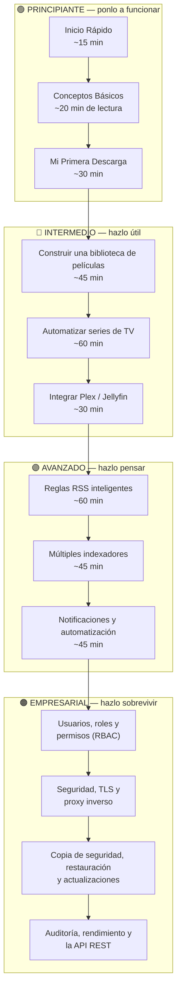
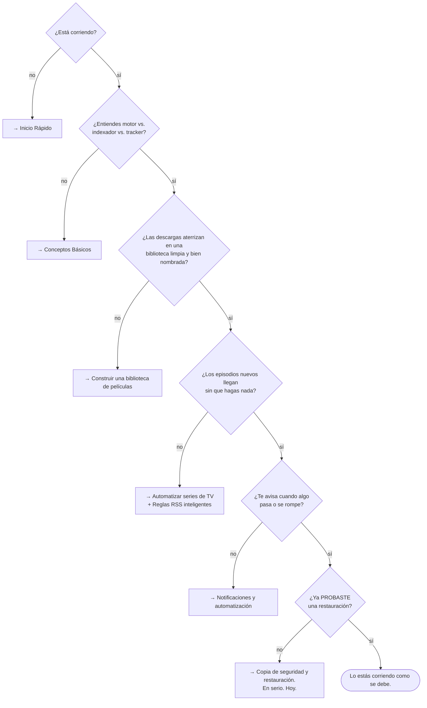

# Tutoriales

Una ruta, no un montón. Cada tutorial tiene un requisito previo, un estimado de tiempo, y
algo concreto que vas a poder hacer después.

## Resumen

## Propósito

Llevarte de *"nunca he usado un cliente de torrents"* a *"corro una plataforma de medios
multiusuario, auditada y automatizada detrás de TLS, y ya probé mi restauración."*

## Cuándo usar esta página

Como tu tabla de contenidos. La primera vez, trabájala de arriba abajo. Después, salta.

## Requisitos previos

Para la ruta completa: un host Linux/NAS/VM con Docker, y como cuatro horas repartidas en
varias sentadas. Para cada tutorial individual: lo que diga cada uno.

---

## 🟢 Principiante — ponlo a funcionar

**Meta:** una instalación corriendo, una descarga completada, y el vocabulario para leer
todo lo demás.

| # | Tutorial | Tiempo | Requisito previo | Después vas a poder… |
| --- | --- | --- | --- | --- |
| 1 | [Inicio Rápido](/learn/quick-start) | ~15 min | Docker instalado | Levantar el stack, iniciar sesión, registrar un motor, completar una descarga. |
| 2 | [Conceptos Básicos](/learn/concepts) | ~20 min (lectura) | Ninguno | Explicar motor vs. indexador vs. tracker, el ciclo de vida de un torrent, y hardlink vs. copia — sin titubear. |
| 3 | [Mi Primera Descarga](/learn/first-download) | ~30 min | Un stack corriendo + un motor | Agregar un torrent de tres maneras distintas, inspeccionarlo, verificar los bytes, y organizarlo en una biblioteca. |
| 4 | [Resumen de la Arquitectura](/learn/architecture-overview) | ~15 min (lectura) | Un stack corriendo | Nombrar cada contenedor, saber qué respaldar, y trazar cualquier descarga de punta a punta. |

:::tip No te saltes Conceptos Básicos
Es la única página que define las palabras. Todo lo demás las da por sentadas. Veinte
minutos aquí te ahorran horas de confusión después.
:::

---

## 🔵 Intermedio — hazlo útil

**Meta:** deja de tocar archivos a mano. Las descargas aterrizan, se nombran bien, y
aparecen solas en tu servidor de medios.

| # | Tutorial | Tiempo | Requisito previo | Después vas a poder… |
| --- | --- | --- | --- | --- |
| 5 | [Construir una biblioteca de películas](/learn/tutorials/building-a-movie-library) | ~45 min | Una descarga completada | Crear bibliotecas, entender los modos de renombrado, previsualizar sin riesgo, y usar hardlinks sin romper el compartir. |
| 6 | [Automatizar series de TV](/learn/tutorials/automating-tv-shows) | ~60 min | Una biblioteca funcionando | Monitorear una serie, detectar episodios faltantes, y dejar que UltraTorrent los busque y los agarre. |
| 7 | [Integrar Plex / Jellyfin / Emby](/learn/tutorials/integrating-plex-jellyfin) | ~30 min | Una biblioteca funcionando + un servidor de medios | Refrescar tu servidor solo después de cada importación, y activar las analíticas de reproducción. |

---

## 🟣 Avanzado — hazlo pensar

**Meta:** deja de tomar decisiones. Expresa tu gusto una sola vez, como política, y deja
que el motor lo aplique de forma consistente.

| # | Tutorial | Tiempo | Requisito previo | Después vas a poder… |
| --- | --- | --- | --- | --- |
| 8 | [Reglas RSS inteligentes](/learn/tutorials/smart-rss-rules) | ~60 min | Tutoriales 5–6 | Armar listas de preferencias ordenadas, entender el dedup de tres niveles, y dejar que las reglas *mejoren* lo que ya tienes. |
| 9 | [Múltiples indexadores](/learn/tutorials/multiple-indexers) | ~45 min | Un indexador + Prowlarr | Repartir búsquedas entre muchos indexadores con prioridad, seeders mínimos y dedup entre indexadores — y sobrevivir a Cloudflare. |
| 10 | [Notificaciones y automatización](/learn/tutorials/notifications-and-automation) | ~45 min | Cualquier flujo funcionando | Armar reglas de condición/acción y notificaciones guiadas por reglas sobre Email, Telegram, SMS y WhatsApp. |

:::warning Los tutoriales avanzados pueden borrar datos
Una *mejora* de RSS elimina el torrent superado **y sus datos** — a propósito. Una regla de
automatización puede borrar o mover archivos. Lee el tutorial completo antes de activar
nada, y ten una copia de seguridad.
:::

---

## 🟠 Empresarial — hazlo sobrevivir

**Meta:** más de un ser humano, en una red real, con un rastro de auditoría y una
restauración probada. "Empresarial" aquí significa un **estándar de calidad de
ingeniería**, no un producto que compras — cada funcionalidad está en el mismo repositorio
de código abierto, controlada solo por RBAC.

| # | Tema | Dónde | Después vas a poder… |
| --- | --- | --- | --- |
| 11 | Usuarios, roles y permisos | [Usuarios](/modules/users) · [Permisos](/reference/permissions) | Darle a cada quien exactamente el acceso que necesita, y nada más. |
| 12 | Endurecimiento de seguridad | [Seguridad](/operate/security) · [Proxy inverso](/install/reverse-proxy) · [TLS](/install/tls) | Correrlo en una red real sin arrepentirte. |
| 13 | Copia de seguridad, restauración y actualización | [Copia de seguridad](/operate/backup) · [Actualizar](/install/upgrading) | Perder el host sin perder la plataforma. |
| 14 | Auditoría y rendimiento | [Auditoría](/modules/audit) · [Rendimiento](/operate/performance) | Contestar "¿quién hizo eso?" y "¿por qué está lento?". |
| 15 | Perfiles de configuración | [Perfiles de configuración](/operate/configuration-profiles) | Correr configuraciones consistentes y reproducibles. |
| 16 | Automatizar contra la API | [API REST](/reference/api) | Programar cualquier cosa que la UI pueda hacer — la SPA es solo un cliente más. |

:::info No hay ninguna edición que comprar
UltraTorrent es un solo producto comunitario de código abierto (AGPL-3.0-or-later). Cada
módulo viene aquí. La única decisión de acceso que el servidor toma es *"¿este usuario tiene
el permiso requerido?"*
:::

---

## La ruta completa, como árbol de decisión

:::tip Mira este tutorial
_Video próximamente._
:::

---

## Ejemplos

### "Tengo tres horas este fin de semana"

1. [Inicio Rápido](/learn/quick-start) — 15 min
2. [Conceptos Básicos](/learn/concepts) — 20 min
3. [Construir una biblioteca de películas](/learn/tutorials/building-a-movie-library) — 45 min
4. [Automatizar series de TV](/learn/tutorials/automating-tv-shows) — 60 min
5. [Integrar Plex / Jellyfin](/learn/tutorials/integrating-plex-jellyfin) — 30 min

Vas a terminar con un pipeline de TV completamente automático hacia tu servidor de medios.

### "Solo me importa no perder cosas"

1. [Resumen de la Arquitectura](/learn/architecture-overview) — qué es lo que de verdad guarda tus datos
2. [Copia de seguridad y restauración](/operate/backup) — y después *prueba la restauración*
3. [Seguridad](/operate/security)

---

## Solución de problemas

| Problema | Haz esto |
| --- | --- |
| Un tutorial asume un término que no conoces | Está en [Conceptos Básicos](/learn/concepts) o en el [Glosario](/help/glossary). |
| La pantalla de un paso no se parece a la de los docs | Verifica que tengas el permiso — la UI esconde lo que no puedes usar. Ver [Permisos](/reference/permissions). |
| Una página no aparece del todo en tu barra lateral | Su módulo está desactivado. **Administración → Módulos** (`/modules`). |
| Algo se rompió a mitad de camino | [Solución de problemas](/operate/troubleshooting) está organizada por síntoma. |

---

## Consejos

:::tip Haz cada tutorial con contenido real que de verdad quieras
Los tutoriales funcionan mucho mejor cuando la serie que estás automatizando es una serie
que de verdad ves. Vas a notar los errores enseguida.
:::

:::tip Activa una cosa a la vez
Sobre todo en Avanzado. Si prendes la búsqueda automática, las mejoras, las reglas de
automatización y las notificaciones en una sola sentada y algo falla, no vas a saber cuál
fue.
:::

---

## Preguntas frecuentes

**¿Tengo que hacerlos en orden?**
No, pero los requisitos previos son reales. Saltarte [Conceptos Básicos](/learn/concepts)
es el que siempre te sale mal.

**¿Cuánto dura la ruta completa?**
Como cuatro horas de trabajo práctico de Principiante → Avanzado, más lo que te tardes
decidiendo tus preferencias de calidad (que es la parte divertida).

**¿Cambia algo de esto si corro en un NAS?**
Solo los puertos y el `PUID`/`PGID`. `8080` y `9696` suelen estar ocupados en los NAS —
configura `FRONTEND_PORT` y `PROWLARR_PORT`. Ver [Docker Compose](/install/docker-compose).

**¿Dónde está la documentación de la API?**
[API REST](/reference/api). Cada capacidad es un endpoint — la SPA es solo un cliente más.

---

## Lista de verificación

Completaste la ruta cuando:

- [ ] El stack está corriendo y puedes iniciar sesión.
- [ ] Hay un motor registrado, predeterminado y conectado.
- [ ] Al menos un indexador pasa su prueba (**Probar**).
- [ ] Las descargas aterrizan dentro de la raíz de una biblioteca y se renombran solas.
- [ ] Tu servidor de medios se refresca solo después de una importación.
- [ ] Una serie monitoreada muestra un conteo de episodios faltantes correcto.
- [ ] Una regla RSS con una lista de preferencias ordenada está agarrando (y mejorando).
- [ ] Una regla de notificación te llega por un canal que de verdad lees.
- [ ] Existen usuarios no administradores, con roles que les dan solo lo que necesitan.
- [ ] La UI está detrás de TLS.
- [ ] Tomaste una copia de seguridad **y la restauraste en algún sitio desechable**.

### Resultado esperado

Una instalación que adquiere, organiza, publica e informa sobre tus medios sin que la
toques — y que podrías reconstruir desde una copia de seguridad esta misma noche.

### Próximos pasos

Empieza por arriba: [Inicio Rápido](/learn/quick-start).

---

## Ver también

- [Inicio Rápido](/learn/quick-start) · [Conceptos Básicos](/learn/concepts) · [Mi Primera Descarga](/learn/first-download)
- [Resumen de la Arquitectura](/learn/architecture-overview) · [Flujos de trabajo](/learn/workflows)
- [Preguntas frecuentes](/help/faq) · [Glosario](/help/glossary)
