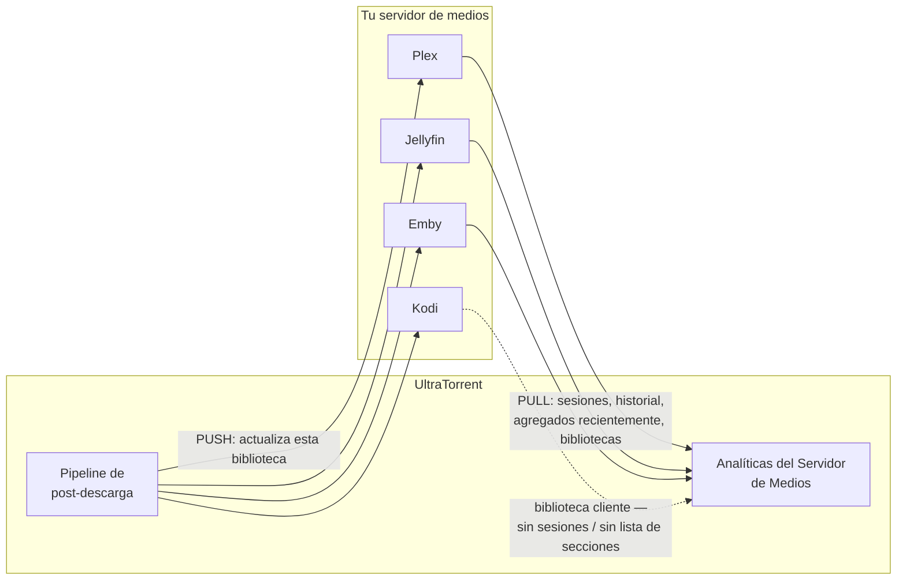
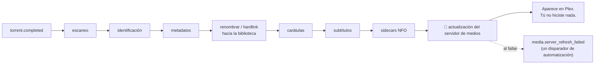

# Integrando Plex, Jellyfin &amp; Emby

**Nivel:** 🔵 Intermedio · **Tiempo:** ~30 minutos

Detrás de las palabras "integración con servidor de medios" viven dos cosas
distintas, y vale la pena saber cuál estás configurando:

| | **Actualización del servidor de medios** | **Analíticas del Servidor de Medios** |
| --- | --- | --- |
| **Qué** | UltraTorrent le dice a tu servidor "reescanea, hay medios nuevos". | UltraTorrent lee tu servidor: quién está viendo qué, historial, agregados recientemente, informes, boletines. |
| **Dónde** | **Gestión de Medios → Configuración de Medios** (`/media/settings`) | **Analíticas del Servidor de Medios → Conexiones de Servidor** (`/media-server-analytics/connections`) |
| **Por qué** | Las descargas nuevas aparecen en Plex sin que tengas que darle a Escanear. | Obtienes una visión estilo Tautulli de tu servidor. |

Ambas están construidas sobre la **misma** capa de proveedores y el mismo modelo de
conexión cifrada. Configura la primera; la segunda es un extra que no deberías
saltarte.

## Resumen



## Propósito

Al terminar:

- Los medios nuevos aparecen en tu servidor **automáticamente**, con el nombre correcto y con carátula.
- Puedes ver **quién está viendo qué, ahora mismo**.
- Tienes **historial de reproducción**, **informes** y (opcionalmente) **boletines**.

## Cuándo usar este tutorial

| Úsalo cuando… | Usa otra cosa cuando… |
| --- | --- |
| Tu servidor no ve las descargas nuevas. | Tus descargas no se están renombrando del todo → [Construyendo una biblioteca de películas](/learn/tutorials/building-a-movie-library). |
| Quieres analíticas de reproducción. | Quieres *adquirir* medios → [Reglas RSS inteligentes](/learn/tutorials/smart-rss-rules). |

## Requisitos previos

- [ ] Una **biblioteca funcional** cuyos elementos estén renombrados e identificados — ver [Construyendo una biblioteca de películas](/learn/tutorials/building-a-movie-library). Haz eso primero; no tiene sentido actualizar un servidor apuntando a una carpeta llena de nombres de scene.
- [ ] Un Plex / Jellyfin / Emby / Kodi corriendo que pueda **ver los mismos archivos**.
- [ ] Su URL base y un token de autenticación.
- [ ] Permisos: `media_manager.manage_integrations`; para analíticas, `media_server_analytics.view` y `media_server_analytics.manage_connections`.

:::danger Ambos lados tienen que ver los mismos archivos, en rutas que cada uno entienda
UltraTorrent escribe en (digamos) `/downloads/movies` **dentro de su contenedor**. Tu
contenedor de Plex tiene que tener los **mismos medios** montados, y la biblioteca de
Plex tiene que apuntar a la ruta **de Plex** para ellos.

No tienen que ser la misma cadena de texto — pero sí tienen que ser los mismos
archivos. Si la biblioteca de Plex apunta a otro sitio, una actualización no hará
absolutamente nada y le echarás la culpa a la integración.
:::

## Conceptos

| Término | Significado |
| --- | --- |
| **Proveedor de servidor de medios** | La abstracción detrás de Plex/Jellyfin/Emby/Kodi. La lógica de negocio nunca toca un cliente específico. |
| **Conjunto de capacidades** | Lo que un servidor dado puede servir realmente: `libraries`, `recentlyAdded`, `sessions`, `watchHistory`, `refresh`. |
| **Actualización (refresh)** | UltraTorrent empujando "reescanea esta biblioteca" al servidor. |
| **Conexión** | Un servidor guardado: nombre, tipo, URL base, token cifrado, banderas de habilitado/predeterminado, salud, versión, plataforma, capacidades. |

### Lo que puede hacer cada servidor

| Servidor | Autenticación | Capacidades |
| --- | --- | --- |
| **Plex** | `X-Plex-Token` | Conjunto completo de capacidades |
| **Jellyfin** | `X-Emby-Token` | Conjunto completo de capacidades |
| **Emby** | `X-Emby-Token` | Conjunto completo de capacidades |
| **Kodi** | JSON-RPC (autenticación básica opcional) | Una biblioteca **cliente** — **sin** lista de secciones, **sin** sesiones. Declara esas capacidades como `false`. |

:::info Las capacidades se degradan con elegancia, no con ruido
Una capacidad que un proveedor genuinamente no puede servir devuelve un resultado
limpio y tipado de "no soportado" en vez de un fallo genérico. Kodi no va a fingir que
tiene sesiones. Las analíticas simplemente muestran menos para ese servidor.
:::

---

## Paso a paso

### Paso 1 — Consigue la URL base y el token de tu servidor

| Servidor | URL base | Token |
| --- | --- | --- |
| **Plex** | `http://plex:32400` (contenedor) o `http://192.168.1.x:32400` | Un `X-Plex-Token`. |
| **Jellyfin** | `http://jellyfin:8096` | Una clave de API desde el Dashboard de Jellyfin → API Keys. |
| **Emby** | `http://emby:8096` | Una clave de API desde el dashboard de Emby. |
| **Kodi** | `http://kodi:8080/jsonrpc` | Autenticación básica opcional. |

:::warning `localhost` no va a funcionar
Desde dentro del contenedor del backend de UltraTorrent, `localhost` es el backend. Usa
el nombre del contenedor (si comparten una red de Docker) o la IP LAN del host.
:::

**Resultado esperado:** una URL base y un token que puedas pegar.

---

### Paso 2 — Agrega la conexión para las actualizaciones post-descarga

Ve a **Gestión de Medios → Configuración de Medios** (`/media/settings`). Esta página
aloja los Proveedores de Metadatos, las Carátulas, las preferencias de Subtítulos, las
herramientas de NFO e **Integraciones con servidores de medios**.

Agrega tu servidor: **tipo**, **URL base**, **token**.

**Prueba** la conexión.

:::info Tu token está cifrado en reposo
Los secretos de integración — tokens, claves y contraseñas de servidores de medios —
están **cifrados en reposo con AES-GCM** y **ocultados en las respuestas de la API**.
Nunca se registran en logs ni se devuelven al navegador.
:::

**Resultado esperado:** una prueba exitosa, y la conexión guardada.


---

### Paso 3 — Asegúrate de que la biblioteca de tu servidor apunte al lugar correcto

Abre **tu servidor de medios** (no UltraTorrent) y verifica que la biblioteca apunte a
los mismos medios que UltraTorrent está escribiendo.

Si la biblioteca de Películas de UltraTorrent es `/downloads/movies` y su contenedor
comparte un volumen con Plex montado en `/media/movies`, entonces la biblioteca de
Películas de Plex tiene que apuntar a `/media/movies`.

**Resultado esperado:** al navegar la biblioteca del servidor ves los archivos que
UltraTorrent renombró.

---

### Paso 4 — Dispáralo, y observa cómo ocurre la actualización

Descarga algo hacia una raíz de biblioteca (o vuelve a correr un escaneo + renombrado).

El pipeline de post-descarga termina con una **actualización del servidor de medios**:



**Resultado esperado:** el elemento nuevo aparece en tu servidor en un minuto o dos,
con el nombre correcto y con carátula.

:::tip Un fallo de actualización es un disparador, no un callejón sin salida
`media.server_refresh_failed` es un disparador de automatización. Crea una regla sobre
él que te notifique — de lo contrario una integración rota en silencio puede pasar
desapercibida por semanas. Ver [Notificaciones y automatización](/learn/tutorials/notifications-and-automation).
:::

---

### Paso 5 — Enciende las Analíticas del Servidor de Medios

Ahora la segunda mitad.

Ve a **Analíticas del Servidor de Medios → Conexiones de Servidor**
(`/media-server-analytics/connections`) y agrega tu servidor aquí también.

- Conexiones **ilimitadas**, incluyendo **varias del mismo tipo** — p. ej. "Plex
  Casa" **y** "Plex Remoto".
- Cada una guarda nombre, tipo, URL base, token cifrado, banderas de habilitado +
  predeterminado, estado de salud, versión del servidor, plataforma, capacidades y notas.
- Dale a **Probar** — sondea el servidor y **persiste** su salud, versión, plataforma
  y capacidades.

**Resultado esperado:** la conexión aparece saludable, con una versión detectada y un
conjunto de capacidades.


---

### Paso 6 — Explora lo que te dan las analíticas

| Página | Ruta | Muestra |
| --- | --- | --- |
| **Panel de Analíticas** | `/media-server-analytics` | Conteos de servidores, salud, resúmenes de conexiones. |
| **Actividad en Vivo** | `/media-server-analytics/live` | Las sesiones que se reproducen ahora. Se consulta cada 30 segundos; también puedes reconciliar a demanda. |
| **Historial de Reproducción** | `/media-server-analytics/watch-history` | Reproducciones completadas. |
| **Agregados Recientemente** | `/media-server-analytics/recently-added` | Lo que ha llegado últimamente. |
| **Informes de Analíticas** | `/media-server-analytics/reports` | Informes de uso. |
| **Boletines** | `/media-server-analytics/newsletters` | Resúmenes del tipo "esto es lo nuevo". |
| **Importar Analíticas** | `/media-server-analytics/import` | Importación de analíticas históricas. |

:::caution La importación desde Tautulli es de una fase posterior
Tautulli **no** es un servidor de medios — es una **fuente de importación** de
analíticas/boletines históricos, detrás de una abstracción separada de proveedor de
importación. La importación en sí **llega en una fase posterior**; no planifiques una
migración alrededor de ella todavía.
:::

**Resultado esperado:** Actividad en Vivo muestra una sesión cuando le das a reproducir
en tu servidor.


---

### Paso 7 — Crea una notificación sobre lo que hace tu servidor

Ahora que los eventos fluyen, conéctalos. El Centro de Notificaciones puede enrutar
eventos de servidor de medios como:

- `media_server.user_started_watching` / `user_finished_watching` / `user_paused` / `user_resumed` / `user_stopped`
- `media_server.media_added` / `media_upgraded`
- `media_server.server_online` / `server_offline`
- `media_server.transcode_detected` / `high_bandwidth`
- `media_server.newsletter_sent` / `newsletter_failed`

Ve a **Automatización → Reglas de Notificación** (`/notifications/rules`) y crea una.
Una buena primera regla: **`media_server.server_offline` → notifícame**.

**Resultado esperado:** te enteras de que tu servidor está caído por un mensaje, no por
un familiar.

:::tip Mira este tutorial
_Video próximamente._
:::

---

## Ejemplos

### Dos servidores Plex, un UltraTorrent

| Conexión | Tipo | URL base | Predeterminado |
| --- | --- | --- | --- |
| Plex Casa | `plex` | `http://plex:32400` | ✅ |
| Plex Remoto | `plex` | `https://plex.example.com` | |

Varias conexiones del mismo tipo están explícitamente soportadas.

### Las dos integraciones, una al lado de la otra

| | Configuración de Medios (`/media/settings`) | Analíticas (`/media-server-analytics/connections`) |
| --- | --- | --- |
| Dirección | **Push** — actualiza después de importar | **Pull** — lee sesiones e historial |
| Necesaria para | Que los medios nuevos aparezcan automáticamente | Actividad en vivo, historial, informes, boletines |
| ¿Configurar primero? | ✅ Sí | Después |

### Una buena primera regla de notificación

```text
TRIGGER    media_server.server_offline
ACTIONS    notify → Telegram → me
```

---

## Solución de problemas

| Síntoma | Causa | Solución |
| --- | --- | --- |
| La prueba falla: conexión rechazada | Host equivocado. `localhost` desde dentro del contenedor del backend es el backend. | Usa el nombre del contenedor o la IP LAN. |
| La prueba falla: no autorizado | Token malo o expirado. | Regenéralo en la propia UI del servidor. |
| La actualización "tiene éxito" pero no aparece nada | La biblioteca de tu servidor apunta a archivos distintos. | Haz que la ruta de la biblioteca del servidor resuelva a los mismos medios. |
| Los elementos aparecen con títulos incorrectos | Los archivos están mal nombrados — esto no es un problema del servidor. | Arregla la identificación y el renombrado → [Construyendo una biblioteca de películas](/learn/tutorials/building-a-movie-library). |
| Faltan carátulas en Plex | No se descargaron carátulas, o Plex está usando su propio agente. | Configura un proveedor de metadatos/carátulas en `/media/settings`; revisa la configuración del agente de Plex. |
| Kodi no muestra sesiones | **Correcto.** Kodi es una biblioteca cliente — declara `sessions` y la lista de secciones como no soportadas. | Nada que arreglar. Usa Plex/Jellyfin/Emby para analíticas de sesiones. |
| Actividad en Vivo está vacía | No se está reproduciendo nada, o el servidor no soporta sesiones. | Dale a reproducir. Revisa las insignias de capacidades de la conexión. |
| La actualización dejó de funcionar en silencio | El token rotó, o el servidor se mudó. | Vuelve a probar la conexión. Crea una regla sobre `media.server_refresh_failed` para enterarte la próxima vez. |
| Los secretos se ven como `••••••` | **Correcto.** Están cifrados en reposo y ocultados al leerlos. | Deja el campo en blanco al editar para conservar el valor guardado. |

---

## Consejos

:::tip Arregla tus nombres antes de culpar a tu servidor
El 90% de los "Plex muestra la cosa equivocada" es un problema de nombres, no de
integración. El **preset** de la biblioteca (`plex`/`jellyfin`/`emby`/`kodi`) existe
precisamente para nombrar los archivos como tu servidor los espera.
:::

:::tip Los sidecars NFO ayudan a los servidores que los leen
UltraTorrent genera sidecars NFO estilo Kodi para película/serie/temporada/episodio como
última etapa de enriquecimiento, solo dentro de las raíces duras. Los servidores que los
leen obtienen mejores metadatos gratis. Los servidores que los ignoran no salen
perjudicados.
:::

:::warning No apuntes dos escritores a una misma biblioteca
Si el propio agente de Plex está renombrando/moviendo archivos mientras el motor de
renombrado de UltraTorrent también los está gestionando, vas a tener una pelea. Deja que
UltraTorrent sea el dueño del sistema de archivos; deja que el servidor lo lea.
:::

:::info Las analíticas conocen las capacidades
Pídele a un servidor algo que no puede hacer y obtienes una respuesta limpia de "no
soportado", no un error. Por eso Kodi aparece con menos paneles en vez de con uno roto.
:::

---

## Preguntas frecuentes

**¿Necesito Plex, siquiera?**
No. La biblioteca de UltraTorrent es un sistema de archivos; cualquier servidor puede
leerla. La integración solo te ahorra darle a Escanear.

**¿Puedo conectar más de un servidor?**
Sí — conexiones ilimitadas, incluyendo varias del mismo tipo.

**¿UltraTorrent reemplaza a Tautulli?**
Las Analíticas del Servidor de Medios cubren actividad en vivo, historial de
reproducción, agregados recientemente, informes y boletines. La **importación** desde
Tautulli (traer tus datos históricos) está detrás de una abstracción separada de
proveedor de importación y **llega en una fase posterior**.

**¿Está seguro mi token de Plex?**
Está cifrado en reposo con AES-256-GCM, ocultado en cada respuesta de la API, y nunca se
registra en logs.

**¿Por qué Kodi muestra menos funciones?**
Porque es una biblioteca cliente, no un servidor. Genuinamente no tiene lista de sesiones
ni secciones de biblioteca, y declara esas capacidades como `false` en vez de fingir.

**¿UltraTorrent va a borrar cosas de mi servidor?**
No. La integración empuja **actualizaciones**. Borrar archivos de medios es una acción del
Gestor de Medios, protegida por permisos (`media_manager.delete`) y auditada.

---

## Lista de verificación

### Verificación

- [ ] Mi biblioteca está renombrada e identificada **antes** de que tocara la integración.
- [ ] Mi servidor de medios puede **ver los mismos archivos**.
- [ ] Existe una conexión en **Configuración de Medios** (`/media/settings`) y su **Prueba** pasa.
- [ ] Una descarga hacia la raíz de la biblioteca hizo que el servidor se actualizara **por sí solo**.
- [ ] El elemento nuevo aparece en el servidor, con el nombre correcto y con carátula.
- [ ] Existe una conexión en **Conexiones de Servidor** (`/media-server-analytics/connections`), saludable, con una versión detectada y capacidades.
- [ ] **Actividad en Vivo** muestra una sesión cuando le doy a reproducir.
- [ ] El **Historial de Reproducción** se está poblando.
- [ ] Tengo una regla de notificación sobre `media_server.server_offline`.
- [ ] Tengo una regla de notificación (o automatización) sobre `media.server_refresh_failed`.

### Resultados esperados

| Pantalla | Esperado |
| --- | --- |
| `/media/settings` | Una integración con servidor de medios, Prueba OK |
| Tu servidor de medios | Elementos nuevos apareciendo sin escaneos manuales |
| `/media-server-analytics/connections` | Saludable, con versión + capacidades |
| `/media-server-analytics/live` | Una sesión cuando algo se está reproduciendo |
| `/notifications/history` | Mensajes entregados |

### Próximos pasos

1. [Notificaciones y automatización](/learn/tutorials/notifications-and-automation) — reacciona a todo lo que acabas de conectar.
2. [Automatizando series de TV](/learn/tutorials/automating-tv-shows) — llena la biblioteca que ahora se actualiza sola.
3. [Analíticas del Servidor de Medios](/modules/media-server-analytics) — la referencia completa del módulo.

---

## Ver también

- [Analíticas del Servidor de Medios](/modules/media-server-analytics) · [Gestor de Medios](/modules/media-manager)
- [Centro de Notificaciones](/modules/notification-center) · [Automatización](/modules/automation)
- [Flujos de trabajo](/learn/workflows) — Flujos de trabajo 5 y 6.
- [Seguridad](/operate/security) — cómo se protegen los secretos de integración.
- [Solución de problemas](/operate/troubleshooting) · [Glosario](/help/glossary)
