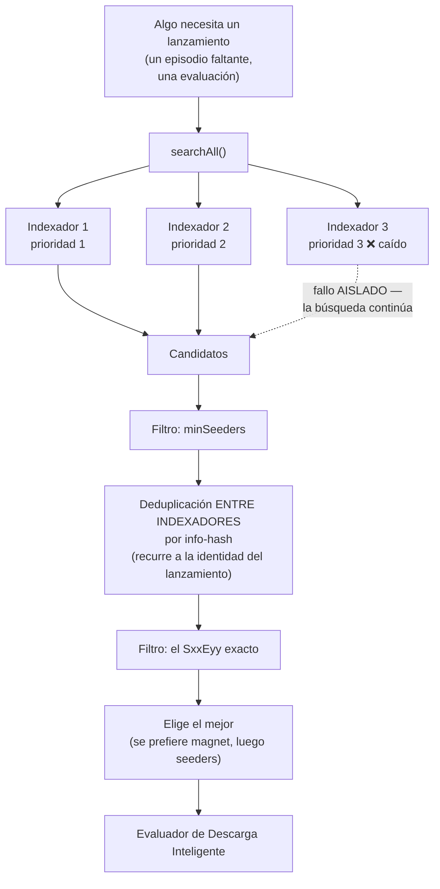
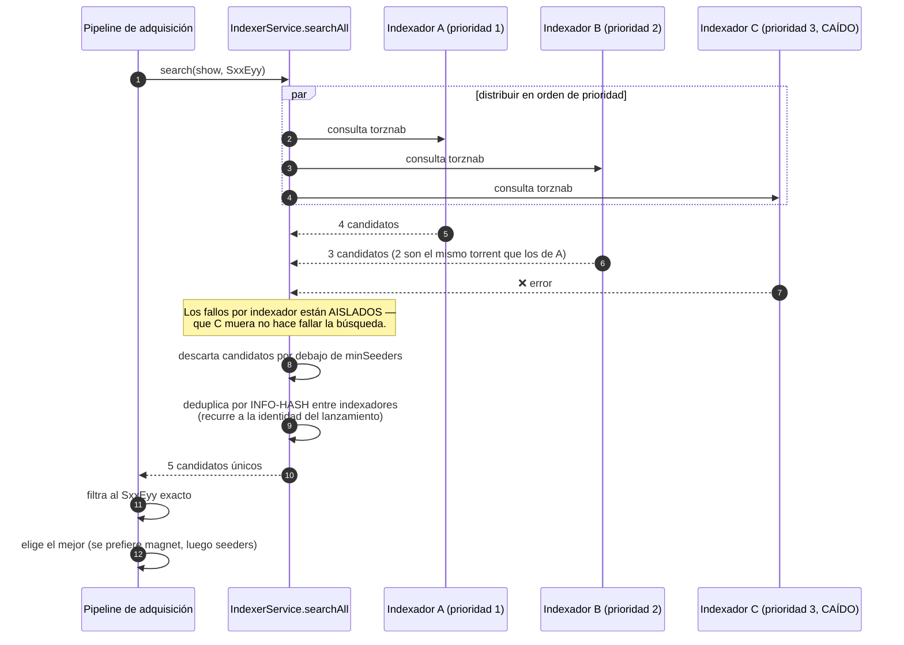
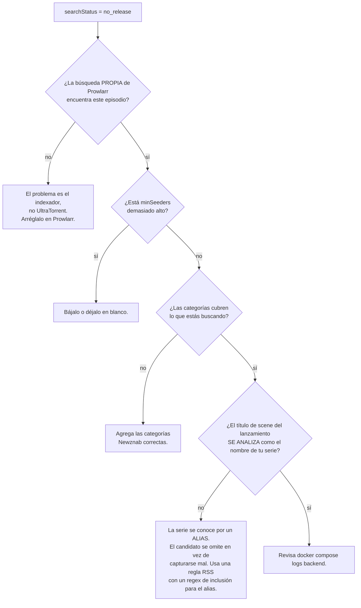

# Trabajando con Múltiples Indexadores

**Nivel:** 🟣 Avanzado · **Tiempo:** ~45 minutos

Un solo indexador es un punto único de fallo. Varios indexadores, ordenados y
deduplicados, hacen que un episodio faltante se encuentre incluso cuando tu tracker
favorito está caído.

## Resumen



## Propósito

Construir una configuración de indexadores que sea:

- **Resiliente** — un indexador muerto no rompe una búsqueda.
- **Ordenada** — tu mejor fuente se intenta primero y gana los empates.
- **Limpia** — el mismo lanzamiento desde tres indexadores es un candidato, no tres.
- **Alcanzable** — no bloqueada en silencio por el guardián SSRF ni por Cloudflare.

## Cuándo usar este tutorial

| Úsalo cuando… | Usa otra cosa cuando… |
| --- | --- |
| Las búsquedas de episodios faltantes no encuentran nada. | Quieres *detectar* los huecos → [Automatizando series de TV](/learn/tutorials/automating-tv-shows). |
| Quieres más de una fuente. | Quieres ajustar la *calidad* → [Reglas RSS inteligentes](/learn/tutorials/smart-rss-rules). |
| Cloudflare está bloqueando un indexador. | Aún no tienes una instalación → [Inicio rápido](/learn/quick-start). |

## Requisitos previos

- [ ] Un stack corriendo ([Inicio rápido](/learn/quick-start)).
- [ ] Permisos: `indexers.view`, `indexers.manage`, `indexers.test`.
- [ ] Al menos un endpoint Torznab/Newznab que tengas derecho a usar.
- [ ] Idealmente, el complemento **Prowlarr** incluido.

:::info Qué es un indexador, y qué no
Un **indexador** es un **endpoint de búsqueda Torznab o Newznab**. Se *busca* bajo
demanda.

**Las fuentes RSS no son indexadores.** Son un subsistema distinto — se consultan
periódicamente y empujan elementos hacia tus reglas. Solo los endpoints Torznab/Newznab
son buscables aquí.
:::

:::warning No hay una página de "explorar indexadores" en UltraTorrent — es a propósito
La entrada **Buscar** de UltraTorrent (y `Ctrl+K`) busca en la *navegación de la
aplicación*, no en los indexadores. La búsqueda en indexadores la **consume el pipeline
de adquisición** — el *Buscar ahora* / *Buscar todo* de Episodios Faltantes, el barrido
programado de auto-adquisición — y está disponible por la API REST
(`GET /api/indexers/:id/search`, permiso `indexers.test`).

Para explorar y hacer clic en los resultados a mano, usa **la propia UI de Prowlarr**.
Configurar indexadores aquí se trata de darle a la *automatización* algo que buscar.
:::

## Conceptos

| Campo | Significado |
| --- | --- |
| `name` | Nombre visible. |
| `implementation` | `torznab` o `newznab`. |
| `baseUrl` | La base de la API. Se le añade `/api` si falta. |
| `apiKey` | **Cifrada en reposo con AES-256-GCM.** La API nunca la devuelve — las lecturas muestran `••••••••`. |
| `enabled` | Si la distribución de búsquedas lo incluye. |
| `priority` | **Menor se intenta primero**, y es el desempate de la deduplicación. |
| `categories` | Categorías Newznab a consultar. Por defecto `5000,5030,5040` (TV). |
| `minSeeders` | Piso opcional. Un candidato por debajo se descarta. |
| `capabilities` | Negociación `t=caps` en caché (búsqueda de tv/película, categorías, límites). |
| `status` / `lastTestedAt` | El resultado de la última **Prueba**. |

---

## Paso a paso

### Paso 1 — Levanta Prowlarr (muy recomendado)

Prowlarr es un **gestor de indexadores**. Es un *contenedor complementario separado y
opcional* — no forma parte de UltraTorrent. UltraTorrent solo enlaza hacia él y busca en
los endpoints Torznab que expone.

```bash
docker compose --profile prowlarr up -d
```

Ábrelo en `http://localhost:9696` (cámbialo con `PROWLARR_PORT` si ese puerto está
ocupado). Agrega tus indexadores **allí**. Prowlarr hace la plomería de cada sitio;
UltraTorrent busca en el resultado.

**Resultado esperado:** Prowlarr corriendo, con al menos un indexador funcional que
devuelve resultados en la propia búsqueda de Prowlarr.

:::tip Compruébalo primero en Prowlarr
Si Prowlarr no puede encontrar un lanzamiento, UltraTorrent tampoco. Depura siempre
primero en la capa de Prowlarr — eso elimina gratis la mitad de las causas posibles.
:::

---

### Paso 2 — Configura la lista de permitidos del SSRF *antes* de preguntarte por qué fallan las capturas

Este paso está fuera de orden a propósito. Es el fallo silencioso más común de todos.

El backend descarga los enlaces `.torrent` **del lado del servidor**, a través de un
**guardián SSRF** que bloquea cualquier URL que resuelva a una dirección privada o
interna. Un indexador auto-alojado — Prowlarr, Jackett, cualquier cosa en tu LAN — **sí
es** una dirección privada.

`SSRF_ALLOW_HOSTS` tiene por defecto `prowlarr` para que el Prowlarr incluido funcione sin
más. Si agregas el tuyo:

```ini title=".env"
# Nombres de host, IPs o CIDRs IPv4 separados por comas.
# MANTÉN `prowlarr` si usas el que viene incluido.
SSRF_ALLOW_HOSTS=prowlarr,indexer.lan,10.0.0.0/24
```

Luego `docker compose up -d` para aplicarlo.

:::danger Sin esto, las descargas automáticas no hacen nada, en silencio
Las capturas fallan con *"Torrent URL resolves to a blocked internal address"* — y como
el fallo ocurre dentro de un barrido en segundo plano, puede que nunca lo veas en la UI.
Simplemente vas a observar que nunca se descarga nada.

Configura esto **antes** de encender la auto-adquisición, no después de dos días de
confusión.
:::

Deja `SSRF_ALLOW_HOSTS` vacío para tener protección SSRF completa **solo** si ninguno de
tus indexadores vive en una IP privada.

**Resultado esperado:** el valor está configurado, y el backend se reinició con él.

---

### Paso 3 — Agrega tu primer indexador a UltraTorrent

**Descargas → Indexadores** (`/indexers`) → **Agregar indexador**.

| Campo | Valor |
| --- | --- |
| Nombre | `Prowlarr — YourIndexer` |
| Implementación | `torznab` |
| URL base | La URL de la fuente Torznab que te da Prowlarr, p. ej. `http://prowlarr:9696/1/api` |
| Clave API | La clave API de Prowlarr |
| Categorías | `5000, 5030, 5040` (TV). Agrega las categorías de películas si quieres películas. |
| Seeders mín. | p. ej. `5` (o en blanco) |
| Prioridad | `1` |
| Habilitado | encendido |

**Resultado esperado:** se guarda. Al reabrir el diálogo de edición, la clave API muestra
una máscara (`••••••••`) — eso es correcto, y **dejarla en blanco al editar conserva la
clave guardada**.

:::info Usa el nombre de host interno, no `localhost`
Desde dentro del contenedor del backend, `http://prowlarr:9696` es Prowlarr.
`http://localhost:9696` es el propio backend. Esto le pasa a todo el mundo una vez.
:::


---

### Paso 4 — Pruébalo

Dale al botón **Probar** (el icono del matraz) en la fila del indexador.

La prueba realiza una **negociación de capacidades** `t=caps` — le pregunta al indexador
qué puede hacer (tv-search, movie-search, qué categorías, qué límites). El resultado se
**cachea** en el indexador.

**Resultado esperado:** una insignia de estado verde de **OK** y una marca de tiempo
`lastTestedAt`.

:::info Si el indexador no anuncia `tv-search`
El cliente Torznab **recurre** a una consulta simple: `t=search&q="Show SxxEyy"`. Sigue
funcionando, solo que con menos precisión. Por eso `t=caps` se negocia y se cachea en vez
de darse por supuesto.
:::


---

### Paso 5 — Agrega más, y define las prioridades a conciencia

Repite el Paso 3 para cada fuente. Luego piensa en la **prioridad**:

| Prioridad | Pon aquí |
| --- | --- |
| `1` | Tu fuente más confiable y de mejor calidad. |
| `2` | Una buena fuente de uso general. |
| `3`+ | Fuentes de cola larga que solo quieres como respaldo. |

La prioridad hace dos trabajos:

1. **Orden** — los indexadores se intentan en orden de prioridad.
2. **Desempate** — cuando el mismo lanzamiento vuelve desde varios indexadores, gana la
   copia del indexador con el número de prioridad más bajo.

**Resultado esperado:** una lista ordenada de indexadores, cada uno pasando su Prueba.

---

### Paso 6 — Entiende exactamente qué hace `searchAll`



Comportamientos clave que vale la pena memorizar:

- **Los fallos están aislados.** Un indexador muerto no hace fallar la búsqueda.
- **Se aceptan tanto enlaces magnet como `.torrent` simples.** Se prefiere magnet.
- **Un conteo de seeders ausente se trata como *desconocido*, nunca como cero** — así que
  no bloquea una captura que por lo demás es válida.
- **La deduplicación es entre indexadores, por info-hash**, y recurre a la identidad del
  lanzamiento.

---

### Paso 7 — Ajusta `minSeeders` y las categorías

**`minSeeders`** es un piso, aplicado por indexador. Un candidato por debajo se descarta.

| Valor | Efecto |
| --- | --- |
| en blanco | No se descarta nada por conteo de seeders. |
| `1`–`3` | Excluye los torrents genuinamente muertos. Un valor por defecto seguro. |
| `20`+ | Agresivo. Va a descartar lanzamientos antiguos legítimos. **Esta es la razón más común de que una búsqueda "no encuentre nada".** |

Las **categorías** son IDs de categoría Newznab. El valor por defecto `5000,5030,5040` es
TV. Si quieres que un indexador sirva también búsquedas de películas, agrega las
categorías de películas que anuncie (revisa las capacidades que cacheó la **Prueba**).

:::warning Un `minSeeders` alto va a matar de hambre tu backfill sin que lo notes
Los episodios viejos de series viejas tienen pocos seeders. Si tu piso es 20, nunca se van
a encontrar — y la página de episodios faltantes reportará `no release` para siempre, sin
razón aparente. Empieza en `1` o en blanco mientras estés haciendo backfill.
:::

---

### Paso 8 — Vence a Cloudflare con FlareSolverr

Algunos indexadores están detrás del reto anti-bot de Cloudflare y simplemente van a
fallar.

```bash
docker compose --profile prowlarr --profile flaresolverr up -d
```

Luego, **dentro de Prowlarr** (no de UltraTorrent):

1. Agrega un **indexer proxy** de tipo **FlareSolverr** en `http://flaresolverr:8191`.
2. **Etiqueta** con él los indexadores protegidos por Cloudflare.

FlareSolverr es solo interno (sin puerto en el host) y corre Chromium headless — que es
por lo que el servicio de Compose le da `shm_size: 256m`, ya que el `/dev/shm` de 64 MB
por defecto de Docker hace que Chromium se caiga.

**Resultado esperado:** el indexador que antes fallaba ahora devuelve resultados en
Prowlarr, y por lo tanto en UltraTorrent.


---

### Paso 9 — Comprueba la cadena completa, de punta a punta

No esperes a un barrido. Fuérzalo:

1. Ve a **Episodios Faltantes** (`/media-acquisition/missing-episodes`).
2. Escoge un episodio en `missing`.
3. Dale a **Buscar ahora**.

Observa la insignia de `searchStatus`: `searching` → `grabbed` / `awaiting approval` /
`no release` / `failed`.

**Resultado esperado:** `grabbed`, y un torrent nuevo en `/torrents`.

Si obtienes `no release`, trabaja hacia atrás:



:::tip Mira este tutorial
_Video próximamente._
:::

---

## Ejemplos

### Una configuración de tres indexadores

| Nombre | Prioridad | Categorías | Seeders mín. | Por qué |
| --- | --- | --- | --- | --- |
| Primario (privado) | `1` | TV + películas | en blanco | Mejor calidad, mejor retención, se intenta primero, gana los empates. |
| Secundario (privado) | `2` | TV + películas | `1` | Buena cobertura de lo que el primario se pierde. |
| Respaldo público | `3` | TV | `3` | Cola larga. Piso más alto porque los torrents públicos se pudren. |

### Probar un indexador desde la API

```bash
curl -X POST "http://localhost:8080/api/indexers/$ID/test" \
  -H "Authorization: Bearer $TOKEN"

curl -s "http://localhost:8080/api/indexers/$ID/search?q=Some+Show&season=2&ep=5" \
  -H "Authorization: Bearer $TOKEN"
```

Ambas requieren `indexers.test`. Ver la [referencia de la API](/reference/api).

---

## Solución de problemas

| Síntoma | Causa | Solución |
| --- | --- | --- |
| La **Prueba** falla de inmediato | URL base incorrecta, clave API incorrecta, o el indexador está caído. | Confirma que la URL funciona en Prowlarr. Usa el nombre de host **interno** (`http://prowlarr:9696`), nunca `localhost`. |
| La prueba dice "blocked by Cloudflare" | El indexador necesita un solucionador de retos. | Agrega FlareSolverr y etiqueta el indexador con él **en Prowlarr**. |
| La búsqueda nunca devuelve nada | `minSeeders` demasiado alto, categorías incorrectas, o el indexador genuinamente no tiene nada. | Deja `minSeeders` en blanco, revisa las capacidades cacheadas, y busca directamente en Prowlarr. |
| Las capturas fallan: "resolves to a blocked internal address" | El guardián SSRF. | Agrega el host a `SSRF_ALLOW_HOSTS` — **y mantén `prowlarr`**. |
| El mismo lanzamiento se captura dos veces | No debería pasar — la deduplicación es por info-hash entre indexadores. | Si pasa, la identidad del lanzamiento no se analizó. Revisa el nombre del lanzamiento. |
| Todo va lento | Demasiados indexadores, o uno está agotando su tiempo de espera. | Los fallos están aislados, pero un indexador lento igual cuesta latencia. Deshabilítalo. |
| La clave API desapareció del formulario de edición | No desapareció — está enmascarada. | Dejarla en blanco al editar **conserva** la clave guardada. Solo escribe en el campo para cambiarla. |
| Lo encuentro en Prowlarr pero no con Buscar ahora | El candidato no sobrevivió el filtro del `SxxEyy` exacto, o el título de scene no se analiza como el nombre de la serie. | Ver el diagrama de flujo del Paso 9. |

---

## Consejos

:::tip Un indexador muerto no es problema. De eso se trata.
`searchAll` aísla los fallos por indexador. Agrega esa fuente de cola larga — lo peor que
puede hacer es ser lenta.
:::

:::warning Algunos indexadores limitan la tasa o banean las búsquedas agresivas
`maxSearchesPerSweep` (por defecto `50`) y `searchIntervalMinutes` (por defecto `60`)
existen para protegerte. No los subas porque un backfill se sienta lento.
:::

:::info Tus claves están seguras
Las claves API de los indexadores están cifradas en reposo con AES-256-GCM (vía
`SecretCipher`), ocultadas en cada lectura, e inyectadas en el parámetro de consulta
`apikey=` del lado del servidor — y la URL de la petición, que lleva la clave, **nunca se
registra en logs**.
:::

:::tip Prowlarr es opcional
Puedes apuntar UltraTorrent a una URL Torznab de Jackett, o directamente a cualquier
endpoint Torznab/Newznab. Prowlarr es simplemente el gestor más cómodo.
:::

---

## Preguntas frecuentes

**¿Necesito Prowlarr?**
No. Cualquier endpoint Torznab/Newznab funciona — Jackett, o la API Torznab nativa de un
indexador. Prowlarr es una capa de comodidad que gestiona muchos indexadores detrás de una
sola interfaz.

**¿Prowlarr es parte de UltraTorrent?**
No. Es un **contenedor complementario separado y opcional**. UltraTorrent enlaza hacia él
(y puede mostrar un atajo de "Abrir Prowlarr" en la navegación cuando la integración está
habilitada y tienes `integrations.prowlarr.open`), y busca en sus endpoints. UltraTorrent
arranca bien sin él.

**¿Por qué no hay una página de búsqueda en UltraTorrent?**
Porque la búsqueda en indexadores aquí existe para servir a la **automatización**, no para
explorar a mano. Las búsquedas de Episodios Faltantes, el barrido de auto-adquisición y la
API REST la usan todas. Para explorar y hacer clic a mano, usa la UI de Prowlarr.

**¿Pueden los indexadores buscar películas?**
El subsistema de indexadores puede consultar las categorías que configures. Pero la
búsqueda **automática** de medios faltantes es **solo de episodios** hoy — las filas de
`WantedMovie` llevan las mismas columnas de estado de captura, pero todavía no hay búsqueda
automática de películas.

**¿Y si dos indexadores devuelven el mismo torrent?**
Se deduplica por info-hash, y la prioridad rompe el empate.

**¿Va a preferir un magnet o un `.torrent`?**
Magnet, cuando ambos están disponibles. Se aceptan los dos.

---

## Lista de verificación

### Verificación

- [ ] Prowlarr (o tu fuente de indexadores) devuelve resultados **en su propia UI**.
- [ ] `SSRF_ALLOW_HOSTS` incluye todos los hosts de indexadores con IP privada — **y sigue incluyendo `prowlarr`**.
- [ ] Cada indexador está agregado en `/indexers` con el nombre de host **interno**.
- [ ] Todos los indexadores pasan la **Prueba** con una insignia OK y un `lastTestedAt`.
- [ ] Las prioridades están definidas a conciencia (el número más bajo = la mejor fuente).
- [ ] `minSeeders` está bajo o en blanco mientras haces backfill.
- [ ] Las categorías cubren lo que realmente buscas.
- [ ] FlareSolverr está corriendo **y etiquetado en Prowlarr** si algún indexador lo necesita.
- [ ] Un **Buscar ahora** sobre un episodio faltante llegó a `grabbed`.
- [ ] Esa captura apareció en `/torrents` y se descargó.

### Resultados esperados

| Pantalla | Esperado |
| --- | --- |
| `/indexers` | 2+ indexadores, todos OK, en un orden de prioridad deliberado |
| UI de Prowlarr | Su propia búsqueda devuelve resultados |
| `/media-acquisition/missing-episodes` | **Buscar ahora** → `grabbed` |
| `/torrents` | El episodio capturado, descargándose |

### Próximos pasos

1. [Automatizando series de TV](/learn/tutorials/automating-tv-shows) — enciende el barrido ahora que la búsqueda funciona.
2. [Reglas RSS inteligentes](/learn/tutorials/smart-rss-rules) — decide *cuál* de esos candidatos quieres realmente.
3. [Notificaciones y automatización](/learn/tutorials/notifications-and-automation) — que te avisen cuando un indexador se caiga.

---

## Ver también

- [Indexadores](/modules/indexers) — la referencia completa del módulo.
- [Prowlarr](/modules/prowlarr) — la integración complementaria.
- [Descarga Inteligente](/modules/smart-download) — lo que consume estos resultados de búsqueda.
- [Episodios Faltantes](/modules/missing-episodes) — lo que dispara las búsquedas.
- [Variables de entorno](/reference/environment) — `SSRF_ALLOW_HOSTS`, `PROWLARR_*`, `FLARESOLVERR_*`.
- [Seguridad](/operate/security) — por qué existe el guardián SSRF.
- [Solución de problemas](/operate/troubleshooting) · [Glosario](/help/glossary)
