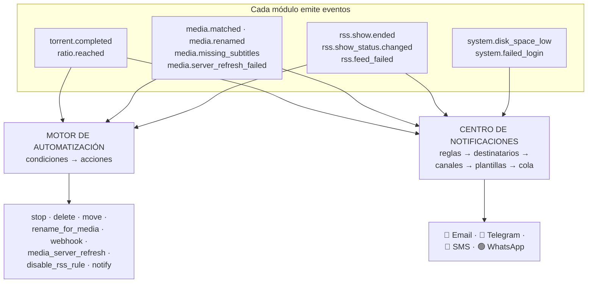
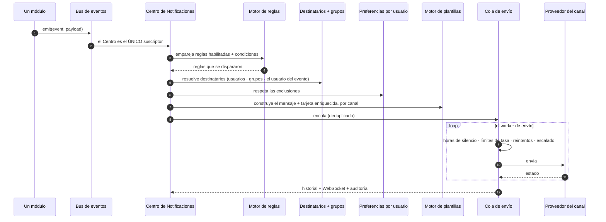

# Notificaciones &amp; Automatización

**Nivel:** 🟣 Avanzado · **Tiempo:** ~45 minutos

Dos sistemas, que se confunden a menudo, que trabajan sobre los mismos eventos:

| | **Automatización** | **Centro de Notificaciones** |
| --- | --- | --- |
| **Responde** | *"Cuando pase X, **haz** Y."* | *"Cuando pase X, ¿a **quién** se le dice, cómo y cuándo?"* |
| **Acciones** | Detener, eliminar, mover, renombrar, actualizar un servidor, deshabilitar una regla RSS, llamar a un webhook… | Entregar un mensaje por Email / Telegram / SMS / WhatsApp. |
| **Dónde** | **Automatización → Reglas de Automatización** (`/automation`) | **Automatización → Centro de Notificaciones** (`/notifications`) |

La Automatización *actúa*. El Centro de Notificaciones *avisa*. Ambos van dirigidos por
reglas; nada en ninguno de los dos está fijado en el código.

## Resumen



## Propósito

Construir:

- Una notificación que te llegue por un canal que de verdad leas.
- Una regla de automatización que haga la tarea aburrida por ti.
- Confianza sobre **por qué** algo se disparó o no se disparó.

## Cuándo usar este tutorial

| Úsalo cuando… | Usa otra cosa cuando… |
| --- | --- |
| Quieres que te avisen cuando las descargas terminen o se rompan. | Quieres *elegir* qué descargar → [Reglas RSS inteligentes](/learn/tutorials/smart-rss-rules). |
| Quieres limpieza de seeding basada en ratio. | Quieres organizar archivos → [Construyendo una biblioteca de películas](/learn/tutorials/building-a-movie-library). |
| Quieres reaccionar cuando una serie termina. | — |

## Requisitos previos

- [ ] Una instalación funcional con al menos un flujo produciendo eventos ([Inicio rápido](/learn/quick-start)).
- [ ] El módulo `notification_center` habilitado.
- [ ] Permisos: `notifications.*` y `automation.*` (ver [Permisos](/reference/permissions)).
- [ ] Para un canal: credenciales SMTP, o un token de bot de Telegram, o una cuenta de Twilio.

## Conceptos

| Término | Significado |
| --- | --- |
| **Evento** | Algo que pasó. Los módulos publican un sobre en un bus de eventos interno. |
| **Regla de automatización** | Disparador + condiciones + acciones. **Hace** algo. |
| **Regla de notificación** | Evento + condiciones → destinatarios → canales. Le **avisa** a alguien. |
| **Canal** | Una instancia de proveedor configurada: un servidor SMTP, un bot de Telegram, un número de Twilio. |
| **Destinatario** | Quién lo recibe. Usuarios, grupos, o "el usuario del que trata este evento". |
| **Plantilla** | Cómo se renderiza el mensaje, por canal. |
| **Horas de silencio** | Cuándo *no* entregar. Las hace cumplir el worker de envío. |

---

## Parte 1 — Notificaciones

### Paso 1 — Configura un canal

**Automatización → Canales de Notificación** (`/notifications/channels`) → agrega uno.

| Canal | Backend | Qué renderiza |
| --- | --- | --- |
| **Email** | SMTP (nodemailer) | Una tarjeta HTML responsiva — carátula, insignias, botones — más texto plano. |
| **Telegram** | Bot API | Foto + descripción en Markdown + botones de teclado en línea. |
| **SMS** | Twilio Messaging API | Texto plano conciso. |
| **WhatsApp** | Twilio WhatsApp | Texto enriquecido + carátula. |

Empieza con **Telegram** si quieres la victoria más rápida posible: crea un bot con
BotFather, pega el token, y estás listo en dos minutos.

Prueba el canal.

:::info Los secretos están cifrados
Los campos de configuración marcados como secretos (contraseña SMTP, token del bot, token
de autenticación de Twilio) están **cifrados automáticamente en reposo** y ocultados al
leerlos. Dejar un campo secreto en blanco al editar conserva el valor guardado.
:::

**Resultado esperado:** el canal pasa la prueba con éxito.


---

### Paso 2 — Agrega un destinatario

**Automatización → Destinatarios de Notificación** (`/notifications/recipients`).

Un destinatario es una dirección en un canal — una dirección de correo, un ID de chat de
Telegram, un número de teléfono. El proveedor lo valida y lo normaliza por ti.

**Resultado esperado:** al menos un destinatario, en el canal que configuraste.

---

### Paso 3 — Crea tu primera regla de notificación

**Automatización → Reglas de Notificación** (`/notifications/rules`) → agrega una regla.

Una regla es: **evento** → **condiciones** → **canales** → **destinatarios**.

Empieza con la más útil:

```text
EVENT       download.torrent_completed
CONDITIONS  (none)
CHANNELS    Telegram
RECIPIENTS  me
```

**Resultado esperado:** la próxima descarga completada te manda un mensaje.


---

### Paso 4 — Conoce sobre qué puedes crear reglas

El vocabulario de eventos, por área:

| Área | Eventos |
| --- | --- |
| **Descargas** | `download.torrent_added` · `torrent_started` · `torrent_completed` · `torrent_failed` · `stalled` · `ratio_reached` · `category_changed` |
| **RSS** | `rss.feed_failed` · `rule_matched` · `candidate_approved` · `candidate_rejected` · `inactive_series_warning` · `new_episode_available` |
| **Medios** | `media.metadata_match_failed` · `missing_artwork` · `missing_subtitles` · `renamed` · `processing_completed` · `processing_failed` · `duplicate` · `missing_episode_filled` · `library_scan_completed` |
| **Servidores de medios** | `media_server.user_started_watching` · `user_finished_watching` · `user_paused` · `user_resumed` · `user_stopped` · `media_added` · `media_upgraded` · `server_online` · `server_offline` · `transcode_detected` · `high_bandwidth` · `newsletter_sent` · `newsletter_failed` |
| **Sistema** | `system.disk_space_low` · `cpu_high` · `memory_high` · `provider_offline` · `backup_failed` · `database_error` · `update_available` · `security_alert` · `failed_login` · `new_login` · `api_key_created` · `settings_changed` |

:::tip Las cinco reglas que todo el mundo debería tener
1. `download.torrent_failed` → avísame.
2. `rss.feed_failed` → avísame. **Una fuente muerta en silencio es invisible de otra forma.**
3. `system.disk_space_low` → avísame. Fuerte.
4. `system.failed_login` → avísame. Siempre.
5. `media.server_refresh_failed` → avísame, o tu biblioteca deja de actualizarse calladita.

Fíjate en que todas son **fallos**. El éxito es aburrido; el fallo es lo que necesitas
saber.
:::

---

### Paso 5 — Entiende el pipeline de envío



Cada una de esas etapas es un lugar donde una notificación puede legítimamente *no*
llegar — que es por lo que existe el **Historial de Envíos**.

---

### Paso 6 — Verifica con el Historial de Envíos

**Automatización → Historial de Envíos** (`/notifications/history`).

Antes de concluir "la regla no se disparó", revisa aquí. Te va a decir si el mensaje se
encoló, se envió, se reintentó, se escaló o falló — y por qué.

**Resultado esperado:** una fila entregada para la notificación que disparaste.


---

## Parte 2 — Automatización

### Paso 7 — Aprende el vocabulario de disparadores/acciones

**Automatización → Reglas de Automatización** (`/automation`).

Una regla es **disparador** → **condiciones** → **acciones**.

**Disparadores de torrent**

| Disparador | Se dispara cuando |
| --- | --- |
| `torrent.completed` | El progreso cruza el 100%. |
| `ratio.reached` | El torrent alcanza un ratio objetivo. |

**Acciones de torrent:** stop · delete · move · notify · webhook · `rename_for_media`.

**Disparadores del Gestor de Medios**

`media.detected` · `media.matched` · `media.unmatched` · `media.missing_artwork` ·
`media.missing_subtitles` · `media.rename_completed` · `media.server_refresh_failed`

**Acciones del Gestor de Medios**

`media_scan_library` · `media_match` · `media_fetch_metadata` · `media_fetch_artwork` ·
`media_generate_nfo` · `media_rename` · `media_move` · `media_notify` ·
`media_server_refresh`

**Disparadores de estado de serie RSS**

`rss.rule.created_for_inactive_show` · `rss.show_status.changed` ·
`rss.show.became_active` · `rss.show.ended` · `rss.show.canceled`

**Acciones de estado de serie RSS**

`refresh_rss_show_status` · `disable_rss_rule` · `convert_rule_to_backfill` (apaga la
descarga automática — conserva la regla, detiene las capturas hacia adelante) ·
`notify_admin`

:::warning Las reglas de contexto de evento solo permiten acciones seguras para eventos
Los disparadores de estado de serie RSS corren por una ruta separada de **contexto de
evento**: las condiciones se emparejan contra un objeto de evento plano, y **solo se
permiten acciones seguras para eventos** (notify / webhook + las acciones `rss_*`
delegadas). Una acción del motor de torrents sobre un disparador RSS **dará error por
regla**. Eso es una barrera de protección, no un bug.
:::

:::info El catálogo completo está a una llamada de API de distancia
`GET /api/automation/catalog` devuelve todos los disparadores y acciones que el motor
conoce. Ver la [referencia de la API](/reference/api).
:::

---

### Paso 8 — Crea una regla de limpieza basada en ratio

La clásica:

```text
TRIGGER     ratio.reached
CONDITIONS  ratio >= 2.0
            category == "movies"
ACTIONS     stop
            notify
```

**Resultado esperado:** los torrents de esa categoría dejan de compartir una vez que han
devuelto el doble de lo que tomaron, y a ti te avisan.

:::danger Las acciones pueden borrar datos
`delete` y `move` son reales. Prueba una regla **solo** con `notify` primero, confirma que
se dispara exactamente sobre los torrents que esperas, y solo entonces cambia a la acción
destructiva.
:::

---

### Paso 9 — Crea una regla de "la serie terminó"

La que evita que tus reglas gasten consultas en silencio para siempre:

```text
TRIGGER     rss.show.ended
CONDITIONS  (none)
ACTIONS     convert_rule_to_backfill
            notify_admin
```

`convert_rule_to_backfill` apaga `autoDownload` — conservando la regla (así que sigue
registrando coincidencias) pero deteniendo la auto-captura hacia adelante.

:::info La plataforma nunca va a deshabilitar tu regla por su cuenta
La tarea en segundo plano de actualización de estado vuelve a resolver los estados de las
series con una cadencia por estado (activa 24h · pausa 7d · terminada/cancelada 30d ·
desconocida 3d), actualiza cada regla que hizo una instantánea de la serie, emite el
evento, y lo audita — pero **nunca deshabilita una regla**. Su trabajo es sacar el cambio a
la superficie; decidir qué pasa es el tuyo. Esta regla es como delegas esa decisión.
:::

**Resultado esperado:** cuando una serie que monitoreas termina, la regla deja de capturar
hacia adelante y a ti te avisan.


---

### Paso 10 — Entiende la idempotencia (para que no entres en pánico)

`torrent.completed` se detecta por el bucle de sincronización **comparando cada sondeo de
~2 segundos contra la instantánea persistida**. Se dispara por flanco cuando el progreso
cruza el 100%.

¿Pero qué pasa con los torrents que ya *estaban* completos y nunca cruzaron ese flanco —
vistos completos por primera vez, terminados mientras la app estaba caída, o una regla
creada *después* de completarse?

Un **backfill de `reconcileCompleted`** los vuelve a evaluar. Y un **libro mayor de éxitos**
(`AutomationLog`) mantiene todo esto idempotente, así que **cada regla corre exactamente una
vez por torrent**.

:::tip Por esto una regla nueva puede dispararse sobre torrents viejos
Crea una regla hoy y puede actuar sobre un torrent que se completó la semana pasada. Ese es
el backfill, funcionando como se pretende. Si no quieres eso, acota la regla con una
condición.
:::

:::tip Mira este tutorial
_Video próximamente._
:::

---

## Ejemplos

### Un conjunto de reglas completo y práctico

| # | Tipo | Disparador / evento | Condiciones | Acción |
| --- | --- | --- | --- | --- |
| 1 | Notificación | `download.torrent_completed` | — | Telegram → yo |
| 2 | Notificación | `download.torrent_failed` | — | Telegram → yo |
| 3 | Notificación | `rss.feed_failed` | — | Email → yo |
| 4 | Notificación | `system.disk_space_low` | — | SMS → yo (esta es urgente) |
| 5 | Notificación | `system.failed_login` | — | Email → admins |
| 6 | Notificación | `media.server_refresh_failed` | — | Telegram → yo |
| 7 | Automatización | `ratio.reached` | `ratio >= 2.0` | stop |
| 8 | Automatización | `torrent.completed` | `category == "movies"` | `rename_for_media` |
| 9 | Automatización | `media.missing_subtitles` | — | notify |
| 10 | Automatización | `rss.show.ended` | — | `convert_rule_to_backfill` + `notify_admin` |

### Consulta el catálogo y mira todo lo disponible

```bash
curl -s http://localhost:8080/api/automation/catalog \
  -H "Authorization: Bearer $TOKEN" | jq .
```

---

## Solución de problemas

| Síntoma | Causa | Solución |
| --- | --- | --- |
| La notificación nunca llega | Regla deshabilitada · condición no cumplida · ningún destinatario resuelto · el usuario se excluyó · horas de silencio · el canal falló. | **Revisa primero el Historial de Envíos** (`/notifications/history`). Te dice cuál. |
| La prueba del canal falla | Credenciales SMTP / token del bot / credenciales de Twilio incorrectos. | Vuelve a ingresarlos. Recuerda: en blanco al editar **conserva** el secreto guardado. |
| La regla se dispara demasiadas veces | Sin condiciones. | Acótala — categoría, etiqueta, tamaño, puntuación. |
| Una regla de automatización se disparó sobre un torrent *viejo* | El backfill de `reconcileCompleted`. | Funciona como se diseñó. Agrega una condición para acotarla. |
| Una regla de automatización se disparó dos veces | No debería — el libro mayor de éxitos la hace una-vez-por-torrent. | Si puedes reproducirlo, es un bug que vale la pena reportar. |
| Una regla con disparador RSS da error | Usaste una acción del motor de torrents sobre un disparador de contexto de evento. | Las reglas de contexto de evento solo permiten acciones seguras para eventos (notify/webhook + `rss_*`). |
| La acción de webhook no hace nada | El destino es inalcanzable o lo está bloqueando el guardián SSRF. | Revisa la URL y `SSRF_ALLOW_HOSTS`. |
| Las notificaciones llegan a las 3 a.m. | No hay horas de silencio configuradas. | Configúralas — el worker de envío las hace cumplir. |
| Una regla borró algo que yo quería | Armaste una acción destructiva sin probarla. | Restaura desde un respaldo. Luego vuelve a leer la caja de peligro del Paso 8. |

---

## Consejos

:::tip Notifica primero, actúa después
Construye **cada** regla destructiva primero como una regla de `notify`. Observa por una
semana lo que *habría* golpeado. Solo entonces cámbiala por `delete` o `move`.
:::

:::tip Alerta sobre fallos, no sobre éxitos
Una notificación por cada descarga completada es emocionante por dos días y después es
ruido que vas a silenciar — y entonces te vas a perder la que importaba. Alerta sobre
**fallos**. Deja que los éxitos sean silenciosos.
:::

:::info Nada está fijado en el código
Cada notificación en UltraTorrent es una **regla editable**. Si la plataforma te está
diciendo algo que no quieres oír, esa es una regla que puedes cambiar — no un comportamiento
con el que tienes que vivir.
:::

:::info Agregar un canal nuevo es un cambio de código, no de configuración
Discord, Slack, Teams, Signal, Matrix, ntfy, Gotify, Pushover, notificaciones push y
webhooks genéricos están todos **soportados estructuralmente** por el registro de
proveedores — cada uno es una clase más una entrada en el registro, sin cambios en la lógica
de negocio. Pero solo **Email, Telegram, SMS (Twilio) y WhatsApp (Twilio)** vienen hoy.
:::

---

## Preguntas frecuentes

**¿Cuál es la diferencia entre una regla de automatización y una regla de notificación?**
La automatización **hace** algo (detener, eliminar, mover, renombrar, actualizar,
deshabilitar una regla). Las notificaciones le **avisan** a alguien. La automatización
también tiene una acción `notify` para casos simples; el Centro de Notificaciones es lo que
quieres para enrutamiento, plantillas, destinatarios y horas de silencio de verdad.

**¿Puede un usuario excluirse de las notificaciones?**
Sí — las preferencias por usuario se respetan en el pipeline de envío.

**¿Un webhook cuenta como una notificación?**
Hay una **acción de automatización** `webhook`. Los **canales** que trae el Centro de
Notificaciones son Email, Telegram, SMS y WhatsApp.

**¿Puedo notificar a un grupo?**
Sí — los destinatarios resuelven usuarios, **grupos**, y "el usuario del que trata este
evento".

**¿Por qué mi regla se disparó sobre un torrent de la semana pasada?**
El backfill de `reconcileCompleted` vuelve a evaluar los torrents que ya estaban completos
pero nunca cruzaron el flanco del 100% en un tick en vivo. El libro mayor de éxitos sigue
garantizando una-vez-por-torrent.

**¿Se notifican las decisiones de Descarga Inteligente?**
Todavía no. Los **disparadores de automatización** de la Descarga Inteligente y las
**notificaciones de decisión por usuario** están explícitamente **aún sin implementar**. Una
captura exitosa de un episodio faltante *sí* emite `media.missing_episode_filled`, sobre el
cual **sí puedes** crear una regla.

---

## Lista de verificación

### Verificación

- [ ] Hay un canal configurado y **su prueba pasa**.
- [ ] Existe un destinatario en ese canal.
- [ ] Una regla de notificación sobre `download.torrent_completed` me llegó.
- [ ] El **Historial de Envíos** muestra una fila `sent` para ella.
- [ ] Tengo reglas de fallo: `torrent_failed`, `rss.feed_failed`, `disk_space_low`, `failed_login`, `server_refresh_failed`.
- [ ] Una regla de automatización sobre `ratio.reached` se dispara solo con `notify`.
- [ ] Entiendo que `delete` y `move` son **reales** antes de armarlas.
- [ ] Existe una regla sobre `rss.show.ended` → `convert_rule_to_backfill`.
- [ ] Entiendo por qué una regla nueva puede actuar sobre un torrent viejo (el backfill) y por qué no puede dispararse dos veces (el libro mayor).
- [ ] Las horas de silencio están configuradas para que no me despierten a las 3 a.m.

### Resultados esperados

| Pantalla | Esperado |
| --- | --- |
| `/notifications/channels` | 1+ canales, prueba OK |
| `/notifications/rules` | Reglas enfocadas en fallos |
| `/notifications/history` | Filas `sent` |
| `/automation` | Reglas con condiciones acotadas |
| `/audit` | Cada acción que muta algo, con actor e IP |

### Próximos pasos

1. [Integrando Plex / Jellyfin](/learn/tutorials/integrating-plex-jellyfin) — más eventos a los que reaccionar.
2. [Seguridad](/operate/security) — ahora que estás alertando sobre `failed_login`.
3. [Respaldo &amp; restauración](/operate/backup) — la regla de la que no puedes automatizar tu salida si no la tienes.
4. [API REST](/reference/api) — automatiza con scripts cualquier cosa que la UI pueda hacer.

---

## Ver también

- [Centro de Notificaciones](/modules/notification-center) · [Automatización](/modules/automation)
- [Auditoría](/modules/audit) · [Sistema](/modules/system) · [Usuarios](/modules/users)
- [Flujos de trabajo](/learn/workflows) — El Flujo de trabajo 6 es el pipeline de envío, como diagrama.
- [Permisos](/reference/permissions) · [API](/reference/api)
- [Solución de problemas](/operate/troubleshooting) · [Glosario](/help/glossary)
