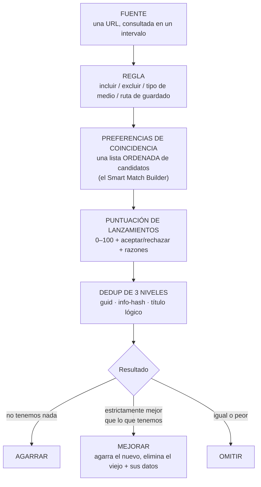
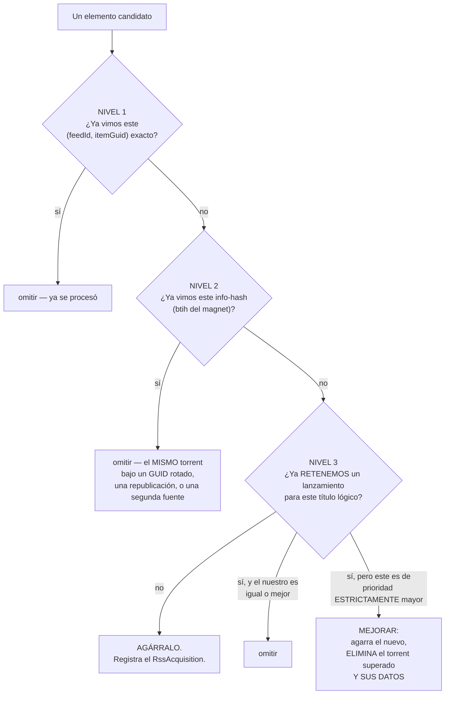

# Reglas RSS Inteligentes

**Nivel:** 🟣 Avanzado · **Tiempo:** ~60 minutos

La mayoría de la gente escribe reglas RSS como una pared de regex, se inunda de duplicados,
y se rinde. Las reglas de UltraTorrent están hechas de otra forma: tú expresas
**preferencia**, no coincidencia de patrones, y el motor se encarga del resto.

## Resumen



El cambio mental: **el regex decide qué es elegible. Las preferencias deciden qué te
llevas.**

## Propósito

Armar una regla que:

- Agarre exactamente **un** lanzamiento por película o episodio.
- Escoja el **mejor disponible**, no el primero.
- **Se mejore sola** cuando aparezca algo genuinamente mejor.
- Nunca agarre lo mismo dos veces, ni entre fuentes, republicaciones y GUIDs rotados.
- Se pueda probar antes de que descargue nada.

## Cuándo usar este tutorial

| Úsalo cuando… | Usa otra cosa cuando… |
| --- | --- |
| Quieres que las preferencias de calidad se apliquen de forma consistente. | Quieres *encontrar* huecos en una serie → [Automatizar series de TV](/learn/tutorials/automating-tv-shows). |
| Tus reglas están agarrando duplicados. | Quieres buscar bajo demanda → [Múltiples indexadores](/learn/tutorials/multiple-indexers). |
| Quieres mejoras de calidad automáticas. | Todavía estás tratando de que funcione una primera descarga → [Inicio Rápido](/learn/quick-start). |

## Requisitos previos

- [ ] Una instalación funcionando con un motor ([Inicio Rápido](/learn/quick-start)).
- [ ] Una biblioteca cuya raíz contenga la ruta de guardado de tu regla — si no, no se organiza nada.
- [ ] Permisos: `rss.view`, `rss.manage`.
- [ ] Una URL de fuente RSS que de verdad quieras vigilar.
- [ ] Lee primero [Conceptos Básicos → Adquisición](/learn/concepts#acquisition-how-content-decides-to-arrive). Este tutorial se construye directamente sobre eso.

## Conceptos

| Término | Significado |
| --- | --- |
| **Fuente** | Una URL consultada periódicamente. El trabajo `rss_poll` corre cada **60 s** y consulta las fuentes cuyo intervalo de actualización ya venció. |
| **Regla** | Vive debajo de una fuente. Regex de inclusión/exclusión, tipo de medio, categoría, ruta de guardado, descarga automática. |
| **Candidato de coincidencia** | Una entrada en la lista **ordenada** de preferencias de la regla. |
| **Identidad de lanzamiento** | `movie:<title>:<year>` o `ep:<title>:<season>:<episode>` — la clave sobre la que trabaja el dedup de nivel 3. |
| **Info hash (`btih`)** | La identidad del torrent, extraída del magnet. Dedup de nivel 2. |
| **`RssAcquisition`** | El registro de "esta regla retiene *este* lanzamiento para *ese* título lógico". |

---

## Paso a paso

### Paso 1 — Agrega la fuente

**RSS y Adquisición → Fuentes RSS** (`/rss`) → **Agregar fuente**.

| Campo | Valor |
| --- | --- |
| Nombre | El tuyo |
| URL | La URL de la fuente |
| Intervalo de actualización | Cada cuánto consultarla |
| Activada | sí |

**Resultado esperado:** la fuente aparece y, después del siguiente tick de `rss_poll`
(dentro de los 60 segundos de que venza su intervalo), empieza a mostrar elementos.

:::info El tick de 60 segundos no es tu intervalo de actualización
`rss_poll` corre cada 60 segundos y consulta **solo** las fuentes cuyo propio intervalo de
actualización ya venció. Poner una fuente en 15 minutos no la hace consultar cada 60
segundos — la hace consultar cada 15 minutos, revisado cada 60 segundos.
:::


---

### Paso 2 — Crea la regla con la descarga automática **APAGADA**

Esta es la jugada de seguridad que todo el mundo debería hacer y casi nadie hace.

**Agregar regla** debajo de la fuente:

| Campo | Valor | Notas |
| --- | --- | --- |
| Nombre | p. ej. `Dune Part Two` | El tuyo. |
| **Tipo de medio** | `movie` / `tv` / `anime` / … | Para `tv`/`anime` esto activa la conciencia del estado de la serie. |
| **Regex de inclusión** | Lo que un candidato **tiene** que cumplir | Mantenlo amplio. |
| **Regex de exclusión** | Lo que un candidato **no** puede cumplir | Mantenlo estrecho. |
| **Ruta de guardado** | `/downloads/movies` | **Tiene que estar dentro de la raíz de una biblioteca**, o no se organiza nada. |
| **Descarga automática** | **APAGADA** ← por ahora | La regla registra las coincidencias sin agarrarlas. |

Guarda, y déjala correr un ciclo o dos de consulta.

**Resultado esperado:** el historial de coincidencias de la regla muestra lo que *hubiera*
agarrado — sin descargar nada.

:::tip La descarga automática APAGADA también es el patrón de "regla de relleno"
Una regla con la descarga automática apagada sigue coincidiendo y registrando para siempre
sin agarrar nada. Eso es exactamente lo que hace la acción de automatización
`convert_rule_to_backfill` cuando una serie termina — apaga `autoDownload` y conserva la
regla.
:::

---

### Paso 3 — Deja el regex bien (y déjalo bruto)

El error más común es tratar de codificar la **calidad** en el regex. No lo hagas. Para eso
está la lista de preferencias.

| Regex | Debe expresar | **No** debe expresar |
| --- | --- | --- |
| **Inclusión** | *¿De cuál título se trata esto?* | Cuál resolución / fuente / grupo prefieres. |
| **Exclusión** | *¿Qué es categóricamente inaceptable?* (CAM, TS, un idioma que no puedes leer) | Cualquier cosa que solo preferirías evitar. |

Un buen regex de inclusión es lo suficientemente amplio para atrapar todos los lanzamientos
de la cosa, y nada más. Un buen regex de exclusión es una lista corta de cosas que nunca
tomarías bajo ninguna circunstancia.

**Resultado esperado:** la regla coincide con todos los lanzamientos de tu objetivo, en toda
calidad, y con nada que no venga al caso.

:::warning Un excluir demasiado apretado va a matar de hambre a la regla en silencio
Si excluyes todo menos una cadena de lanzamiento exacta, la regla va a encontrar esa cadena
o nada — y nunca vas a tener una mejora, porque no hay nada mejor que se le permita ver.
Deja que la lista de preferencias haga la elección.
:::

---

### Paso 4 — Arma la lista de preferencias

Abre la página de detalle de la regla (`/rss/rules/:ruleId`). Ahí es donde viven el **Smart
Match Builder** y las **Preferencias de coincidencia**, junto con un panel de pruebas y el
historial de coincidencias.

Arma una lista **ordenada** de candidatos de coincidencia — el mejor primero:

```text
 1.  2160p · Remux · Dolby Vision · Atmos      ← ideal
 2.  2160p · WEB-DL · HDR10 · DD+ 5.1
 3.  1080p · BluRay · SDR · DTS-HD
 4.  1080p · WEB-DL · SDR · DD+ 5.1            ← perfectamente bien
 5.  720p  · WEB-DL                            ← aceptable si no hay de otra
 —   (cualquier cosa que no esté en la lista no es aceptable)
```

La lista está **ordenada**, y ese orden es lo que impulsa tanto el agarre inicial como cada
mejora futura.

**Resultado esperado:** la lista de Preferencias de coincidencia queda ordenada exactamente
como escogerías tú a mano.


---

### Paso 5 — Entiende lo que la regla va a hacer ahora {#step-5--understand-what-the-rule-will-now-do}

Este es el corazón del tutorial. Tres niveles de deduplicación corren sobre **cada**
candidato, tanto en el sondeo en vivo como en el relleno hacia atrás:



**El nivel 3 es el que te cambia la forma de pensar.** Una regla con lista de preferencias
retiene exactamente **un lanzamiento por título lógico** — `movie:<title>:<year>` o
`ep:<title>:<season>:<episode>`. Agarra el mejor disponible hasta ese momento, mejora cuando
aparece algo de prioridad estrictamente mayor, y omite todo lo que sea igual o peor.

:::danger Una mejora BORRA el torrent superado y sus datos
Esto es intencional y es el punto entero: pediste el mejor lanzamiento, así que retener dos
no tiene sentido. Pero ten claro que:
- El torrent viejo se **elimina del motor**.
- Sus **datos se borran**.
- Si lo enlazaste con hardlink a una biblioteca, la copia de la biblioteca sobrevive (para
  eso son los hardlinks) — pero la copia que estaba compartiendo desaparece.

Si nunca quieres esto, no rankees un lanzamiento mejor por encima del que ya tienes, o
desactiva las mejoras en el perfil de adquisición (`duplicateRules.allowUpgrades`).
:::

:::info Si el título no se puede analizar, el nivel 3 no aplica
La identidad de lanzamiento se analiza del nombre. Un título imposible de analizar cae de
vuelta al comportamiento simple por lanzamiento — así que una regla que coincide con
lanzamientos con nombres raros puede retener más de uno. Eso es una degradación elegante, no
un bug.
:::

---

### Paso 6 — Prueba la regla antes de armarla

La página de detalle de la regla tiene un **panel de pruebas**. Úsalo contra elementos
reales de la fuente y verifica que:

- Los lanzamientos correctos coinciden.
- Los correctos quedan **rankeados** más alto.
- La basura queda excluida.

Después ve más lejos: pega el nombre de un lanzamiento candidato en el **Simulador de
Decisiones** (`/media-acquisition/simulator`). Corre el pipeline de adquisición completo —
identificar → preferencias → puntuar → comparación con la biblioteca → reglas de mejora — y
renderiza cada etapa como una traza clicable, **sin ningún efecto secundario**. No se
persiste nada, no se toma ninguna acción, no se descarga nada.

**Resultado esperado:** puedes predecir, con confianza, lo que la regla le va a hacer a
cualquier lanzamiento dado.


---

### Paso 7 — Prende la descarga automática

Edita la regla y activa la **Descarga automática**.

**Resultado esperado:** en la próxima consulta, los lanzamientos que coincidan se agarran —
uno por título lógico, el mejor disponible — y aparecen en `/torrents`.

Vigila `/rss` y el historial de coincidencias de la regla durante el primer ciclo. Deberías
ver agarres, omisiones y (eventualmente) mejoras, cada una con su razón.

---

### Paso 8 — Ajusta los umbrales de puntaje

La Puntuación de Lanzamientos le da a cada lanzamiento analizado un **puntaje de 0–100** más
una decisión de aceptar/rechazar con razones y advertencias. Tu **perfil de adquisición**
convierte ese puntaje en comportamiento:

| Campo del perfil | Efecto |
| --- | --- |
| `minimumScore` | Por debajo de esto → **`skip`**. |
| `approvalScore` | Por debajo de esto → **`hold_for_approval`** (decide un humano). |
| `qualityRules.waitForBetter` + `waitUntilScore` | La **política de espera**: un lanzamiento que está ≥ el mínimo pero < `waitUntilScore` se vuelve **`wait`** — se aguanta a propósito. |
| `duplicateRules.allowUpgrades` | Si se permiten las mejoras del todo. |
| `automationRules.approvalRequired` | Fuerza la aprobación para **todo**. |

Puedes inspeccionar y ajustar la puntuación misma en **Puntuación de Lanzamientos**
(`/release-scoring`).

:::tip `wait` es una funcionalidad, no un atasco
Si no se está descargando nada y la cola En espera está llena, el motor está haciendo
exactamente lo que le dijiste: los lanzamientos disponibles son aceptables pero no lo
suficientemente buenos, así que está aguantando por algo mejor. Baja `waitUntilScore` si
prefieres tenerlo ya.
:::

**Resultado esperado:** las colas del panel de Descarga Inteligente (Aprobadas · Pendientes
de aprobación · **En espera** · Mejoras pendientes · Rechazadas) reflejan decisiones con las
que estás de acuerdo.


---

### Paso 9 — Entiende qué cuenta como una mejora

Las mejoras son **multidimensionales**, no solo de resolución:

| Dimensión | Mejor → peor |
| --- | --- |
| **Resolución** | 2160p → 1080p → 720p → 480p |
| **Fuente** | Remux → BluRay → WEB-DL → WEBRip → HDTV |
| **HDR** | Dolby Vision → HDR10+ → HDR10 → HLG → SDR |
| **Audio** | Atmos / DTS:X → TrueHD / DTS-HD → DD+ → DTS/DD → AAC |
| **Canales** | 7.1 → 5.1 → 2.0 |

Cuando un candidato gana, las **dimensiones ganadoras salen a flote en la razón de la
decisión** — p. ej. *"owned, lower quality (resolution 2160p > 1080p, HDR Dolby Vision >
SDR)"*.

:::info El códec por sí solo nunca dispara una mejora
HEVC/AV1 vs. AVC es **solo un desempate de puntaje**. Un recodificado de x264 → x265 con la
misma calidad no vale la pena volver a descargarlo, así que nunca, por sí solo, va a causar
una mejora. Esto es deliberado, y es la fuente número uno de "¿por qué no mejora al x265?" —
la respuesta es: porque eso no es una mejora.
:::

:::tip Mira este tutorial
_Video próximamente._
:::

---

## Ejemplos

### Una regla de película que se porta bien

| Ajuste | Valor |
| --- | --- |
| Tipo de medio | `movie` |
| Inclusión | amplio — coincide con el título |
| Exclusión | `CAM\|HDTS\|TELESYNC\|HDCAM` |
| Ruta de guardado | `/downloads/movies` (dentro de la raíz de la biblioteca de películas) |
| Descarga automática | prendida (después de probar con ella apagada) |
| Preferencias | 2160p Remux DV → 2160p WEB-DL HDR10 → 1080p BluRay → 1080p WEB-DL |
| Perfil | `allowUpgrades: true`, un `minimumScore` sensato |

Resultado: agarra lo mejor que encuentre ahora, y calladamente mejora al Remux cuando
aparezca uno — eliminando el torrent viejo y sus datos.

### Una regla que a propósito **no** mejora

Igual que la de arriba, pero pon `duplicateRules.allowUpgrades: false` en el perfil. Agarra
una vez, y no lo vuelve a tocar.

### Una regla solo de relleno

Descarga automática **apagada**. Registra cada coincidencia para siempre y no agarra nada.
Emparéjala con el flujo de lista de seguimiento + [Episodios Faltantes](/learn/tutorials/automating-tv-shows)
para una adquisición controlada.

---

## Solución de problemas

| Síntoma | Causa | Arreglo |
| --- | --- | --- |
| La regla no coincide con nada | El regex de inclusión está muy apretado, o la fuente no tiene elementos que coincidan. | Prueba en el panel de pruebas de la regla. Amplía la inclusión. |
| La regla coincide con todo | El regex de inclusión está muy suelto. | Apriétalo — pero deja la calidad fuera de él. |
| Siguen llegando duplicados | Los lanzamientos tienen **títulos imposibles de analizar**, así que el dedup de nivel 3 cae de vuelta a por lanzamiento. | Verifica que los nombres de lanzamiento se analicen a una identidad de lanzamiento. |
| Agarró y enseguida borró | Una **mejora** — apareció un lanzamiento de prioridad estrictamente mayor. | Funciona como fue diseñado. Reordena tu lista de preferencias si no estás de acuerdo. |
| No quiere mejorar al x265 | El códec es solo un desempate, nunca una dimensión de mejora. | Es intencional. |
| No descarga nada; la cola En espera está llena | Tu `waitUntilScore` está más alto que cualquier cosa disponible. | Bájalo, o espera. |
| Todo aterriza en Pendientes de aprobación | `approvalRequired`, o el puntaje está por debajo de `approvalScore`. | Ajusta el perfil, o aprueba. |
| Los agarres funcionan pero nada se organiza | La **ruta de guardado** de la regla no está dentro de la raíz de una biblioteca habilitada. | Arregla la ruta de guardado. |
| "Torrent URL resolves to a blocked internal address" | El guardia SSRF contra un indexador con IP privada. | Agrega el host a `SSRF_ALLOW_HOSTS` (deja `prowlarr`). |
| Una regla de TV se niega a guardarse | La serie está `ended` / `canceled`. | Confirma la anulación (queda auditada), o usa una regla de relleno. |
| La fuente dejó de actualizarse | La URL de la fuente está muerta o te está limitando la tasa. | Vigila el evento de notificación `rss.feed_failed`; revisa el historial de la fuente. |

---

## Consejos

:::tip Siempre empieza con la descarga automática APAGADA
Un ciclo de consulta de "¿qué *hubiera* agarrado?" vale por una hora de limpieza.
:::

:::tip Deja el regex bruto y las preferencias inteligentes
El regex contesta *"¿es este el título correcto?"*. Las preferencias contestan *"¿es este el
lanzamiento correcto?"*. Mezclarlos produce reglas que nadie puede depurar seis meses
después.
:::

:::tip El Simulador de Decisiones no tiene efectos secundarios — abúsalo
No se persiste nada, no corre ninguna acción, no se descarga nada. Pégale todos los nombres
de lanzamiento raros que encuentres y lee la traza.
:::

:::warning Las mejoras borran datos
Lee el recuadro de peligro del [Paso 5](#step-5--understand-what-the-rule-will-now-do) antes
de activar `allowUpgrades` sobre algo que te importe.
:::

:::info Un cerebro, dos caminos
Descarga Inteligente **consume** las listas de preferencias de Smart Match del módulo RSS y
el motor de Puntuación de Lanzamientos como fuente de verdad. Orquesta; no duplica. Ajusta
la calidad una vez, y tanto RSS como la adquisición de episodios faltantes la obedecen.
:::

---

## Preguntas frecuentes

**¿Una sola regla puede cubrir una serie completa?**
Sí. Pon el tipo de medio `tv`, un regex de inclusión que coincida con la serie, y una lista
de preferencias. El dedup de nivel 3 usa como clave `ep:<title>:<season>:<episode>`, así que
retiene un lanzamiento *por episodio*.

**¿Qué pasa si dos fuentes traen el mismo lanzamiento?**
El dedup de nivel 2 lo atrapa por info-hash. Se agarra una sola vez.

**¿Un GUID rotado lo engaña?**
No — para eso existe precisamente el nivel 2.

**¿Por qué omitió un lanzamiento que a mí me parece mejor?**
Lee la razón. Te va a nombrar la etapa: un término de exclusión, un puntaje por debajo del
mínimo, ya lo tienes en calidad igual o mejor, o está por debajo de la lista de preferencias
del todo. El Simulador de Decisiones te muestra la traza completa.

**¿Las reglas RSS buscan en los indexadores?**
No. **Las fuentes RSS no son indexadores.** El RSS se consulta y empuja elementos hacia tus
reglas; los indexadores se *buscan* bajo demanda, sobre Torznab/Newznab, desde el pipeline de
adquisición. Son subsistemas distintos.

**¿Me pueden notificar cuando una fuente se rompe?**
Sí — `rss.feed_failed` es un evento de notificación. Ver
[Notificaciones y automatización](/learn/tutorials/notifications-and-automation).

---

## Lista de verificación

### Verificación

- [ ] Existe una fuente y está consultando.
- [ ] Existe una regla con una **inclusión amplia** y una **exclusión estrecha**.
- [ ] Su **ruta de guardado está dentro de la raíz de una biblioteca**.
- [ ] La corrí con la **descarga automática APAGADA** por lo menos un ciclo y revisé las coincidencias.
- [ ] Hay una lista **ordenada** de Preferencias de coincidencia armada en el Smart Match Builder.
- [ ] Probé nombres candidatos en el **Simulador de Decisiones** y entendí cada traza.
- [ ] La descarga automática ya está **prendida**.
- [ ] La regla retiene exactamente **un** lanzamiento por título lógico.
- [ ] Sé que una **mejora borra el torrent superado y sus datos**.
- [ ] Sé que un **cambio de códec por sí solo nunca mejora nada**.
- [ ] Las colas de Descarga Inteligente (En espera / Aprobaciones / Mejoras / Rechazadas) se ven bien.

### Resultados esperados

| Pantalla | Esperado |
| --- | --- |
| `/rss` | Fuentes consultando; reglas coincidiendo |
| `/rss/rules/:id` | Una lista de preferencias ordenada + un historial de coincidencias sensato |
| `/media-acquisition/simulator` | Una traza completa para cualquier lanzamiento que pegues |
| `/media-acquisition/dashboard` | Colas que reflejan decisiones con las que estás de acuerdo |
| `/torrents` | Un lanzamiento por título, mejorado cuando aterriza algo mejor |

### Próximos pasos

1. [Múltiples indexadores](/learn/tutorials/multiple-indexers) — dale al motor más de dónde escoger.
2. [Notificaciones y automatización](/learn/tutorials/notifications-and-automation) — reacciona a `rss.feed_failed`, `rss.show.ended`, y a los agarres.
3. [Automatizar series de TV](/learn/tutorials/automating-tv-shows) — empareja el RSS hacia adelante con el llenado de huecos hacia atrás.

---

## Ver también

- [RSS](/modules/rss) · [Descarga Inteligente](/modules/smart-download) · [Indexadores](/modules/indexers)
- [Automatización](/modules/automation) · [Gestor de Medios](/modules/media-manager)
- [Flujos de trabajo](/learn/workflows) — el Flujo 3 es esta regla, como diagrama de secuencia.
- [Conceptos Básicos](/learn/concepts) — identidad de lanzamiento, niveles de dedup, dimensiones de mejora.
- [Solución de problemas](/operate/troubleshooting) · [Glosario](/help/glossary)
