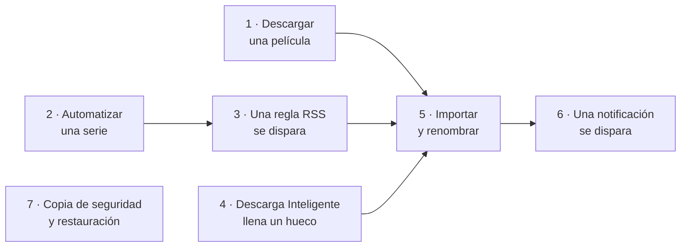
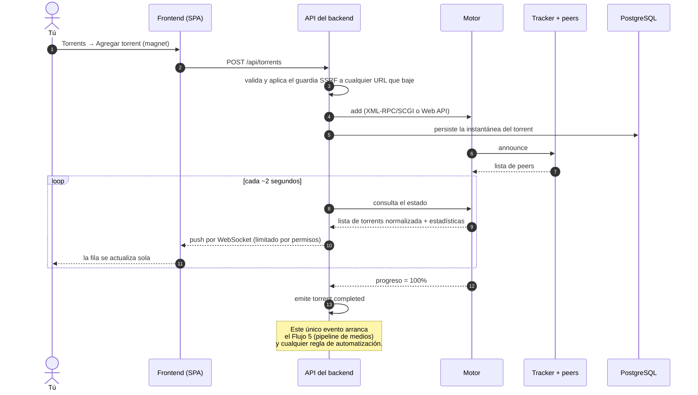
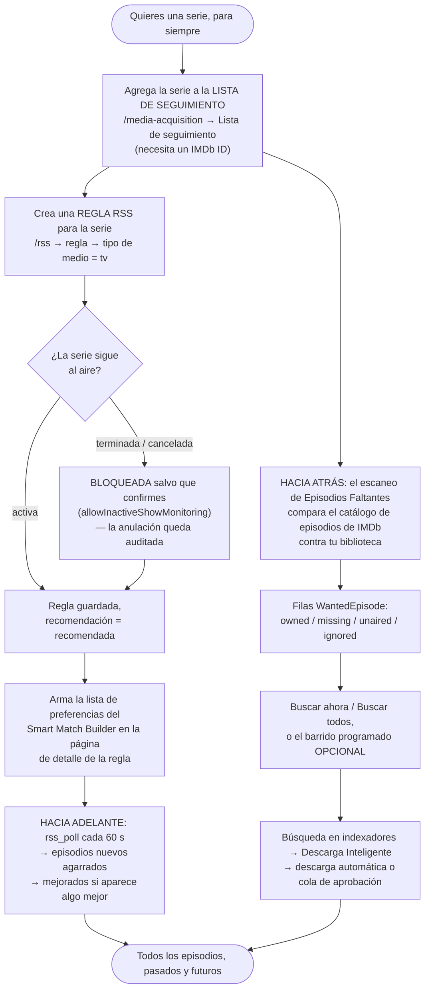
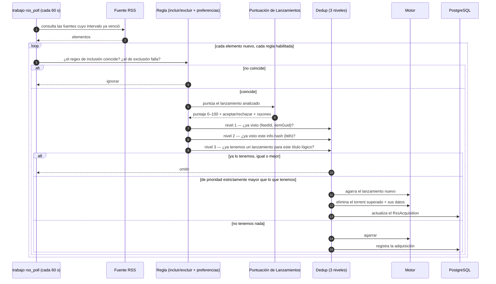
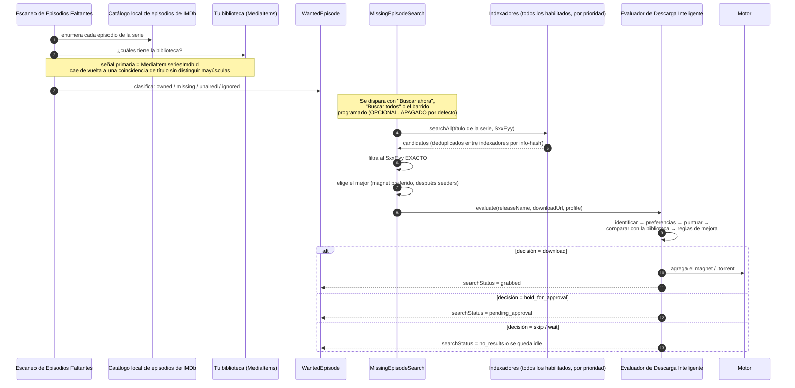
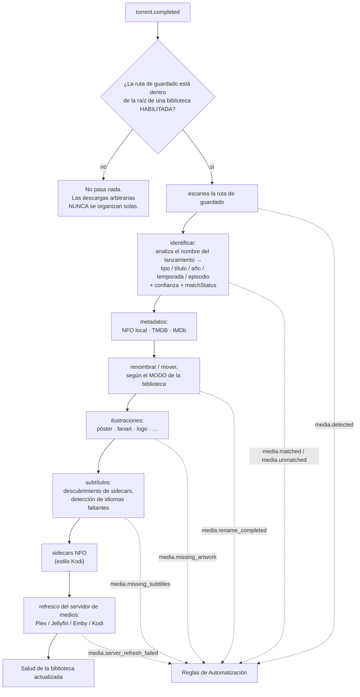
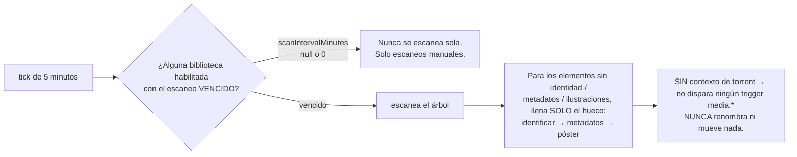
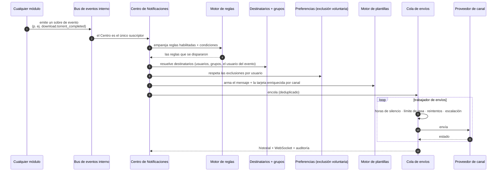
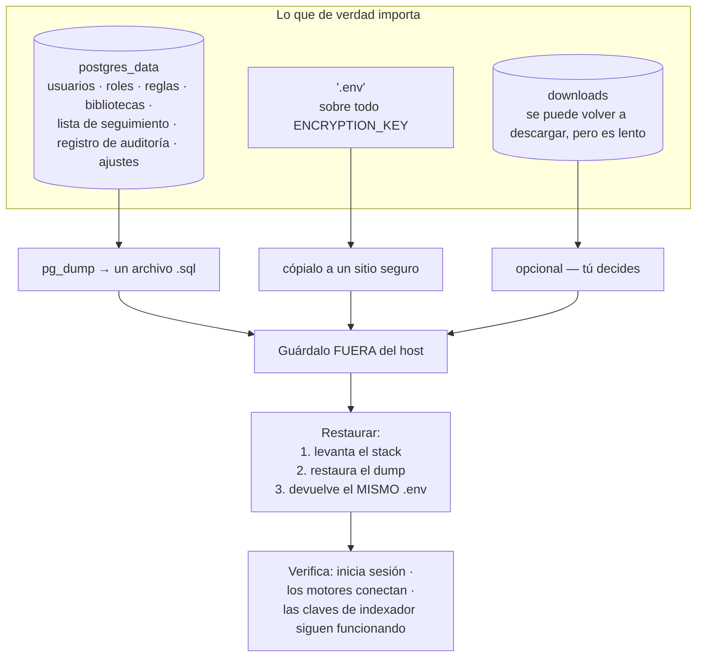

# Flujos de trabajo

Siete flujos. Cada uno es lo que *realmente* pasa, dibujado de punta a punta, con el
componente dueño de cada paso nombrado.

Lee el diagrama primero, después las notas debajo. Entre los dos explican casi todo
"¿por qué hizo eso?" que vas a tener en la vida.

## Resumen



## Propósito

Darte un índice mental. Cuando algo se porte mal, busca el flujo al que pertenece,
recorre el diagrama, y el paso roto casi siempre va a ser obvio.

## Cuándo usar esta página

- Después de [Conceptos Básicos](/learn/concepts), para ver los conceptos en movimiento.
- Mientras depuras, para aislar cuál paso falló.
- Antes de construir automatización, para ver qué ya pasa gratis.

## Requisitos previos

- Una instalación funcionando ([Inicio Rápido](/learn/quick-start)).
- El vocabulario de [Conceptos Básicos](/learn/concepts).

---

## Flujo 1 — Descargar una película

El flujo más simple, y la base de todos los demás.



**Notas**

- El navegador **nunca** toca el motor. Todo se normaliza del lado del servidor.
- Agregar por **URL** lo baja el backend a través de un guardia SSRF — un indexador
  con IP privada tiene que estar listado en `SSRF_ALLOW_HOSTS`.
- `torrent.completed` se **dispara por flanco** (el progreso cruza el 100% en un tick
  en vivo) **y se rellena hacia atrás** (`reconcileCompleted` reevalúa torrents que ya
  estaban completos y nunca cruzaron ese flanco — terminaron mientras la app estaba
  caída, o la regla se creó después). Un libro mayor de éxitos lo mantiene idempotente,
  así que cada regla corre **una sola vez por torrent**.


---

## Flujo 2 — Automatizar una serie

No quieres volver a pensar en esa serie nunca más. Dos mecanismos pueden hacer eso, y
son complementarios:

| Mecanismo | Se dispara cuando | Bueno para |
| --- | --- | --- |
| **Regla RSS** | Aparece un elemento nuevo en una fuente (consultada cada 60 s) | Adquisición *hacia adelante* — el episodio de esta noche, minutos después de que lo publican. |
| **Descarga Inteligente + Episodios Faltantes** | Un escaneo encuentra un hueco entre el catálogo de IMDb y tu biblioteca | Adquisición *hacia atrás* — los 43 episodios que nunca tuviste. |

Usa los dos. Juntos cubren la línea de tiempo completa.



**Notas**

- Una serie queda **monitoreada** una vez está en la lista de seguimiento **con un
  IMDb ID**. Usa el selector **Agregar desde la biblioteca** en la página de Episodios
  Faltantes en vez de escribir IDs a mano.
- La búsqueda automática de episodios faltantes (`autoSearchMissing`) es **opcional y
  está apagada por defecto**. **Buscar ahora** / **Buscar todos** siempre funcionan.
- Si la serie después **termina**, el trabajo de refresco de estado en segundo plano te
  avisa — y emite `rss.show.ended` — pero **nunca desactiva tu regla**. Esa decisión es
  tuya.

Recorrido completo: [Automatizar series de TV](/learn/tutorials/automating-tv-shows).


---

## Flujo 3 — Una regla RSS se dispara

Este es el flujo que la gente malinterpreta más, por la deduplicación de tres niveles.



**Notas**

- **El nivel 3 es el que sorprende a la gente.** Una regla con lista de preferencias
  retiene exactamente **un lanzamiento por título lógico** (`movie:<title>:<year>` o
  `ep:<title>:<season>:<episode>`). Agarra el mejor disponible, *mejora* cuando aparece
  algo estrictamente mejor (eliminando el torrent viejo **y sus datos**), y omite todo
  lo que sea igual o peor.
- Si el título de un lanzamiento no se puede analizar en una identidad de lanzamiento,
  el nivel 3 cae de vuelta al comportamiento simple por lanzamiento.
- Los tres niveles se aplican **tanto** en el sondeo en vivo como en el relleno hacia
  atrás.
- **Descarga automática apagada** convierte la regla en una grabadora: las coincidencias
  se registran, no se agarra nada. Eso es también lo que hace la acción de automatización
  `convert_rule_to_backfill`.

Recorrido completo: [Reglas RSS inteligentes](/learn/tutorials/smart-rss-rules).


---

## Flujo 4 — Descarga Inteligente adquiere un episodio faltante

La detección y la descarga son dos mitades separadas. La búsqueda en indexadores es el
puente.



**Notas**

- `searchStatus` recorre `idle → searching → grabbed | pending_approval | no_results | failed`
  y **se preserva entre reescaneos** (igual que tus anulaciones `ignored`), así que un
  episodio ya agarrado nunca se vuelve a buscar. Se limpia una vez el episodio está en la
  biblioteca.
- La seguridad contra agarres duplicados va en capas: `searchStatus` excluye las filas
  grabbed/pending · un backoff de `lastSearchedAt` · un guardia de reentrada en el barrido ·
  deduplicación entre indexadores por info-hash · y el chequeo de **owned** del propio
  evaluador.
- Un candidato solo coincide cuando su título de escena **se analiza al nombre de la
  serie**. Una serie conocida por otro alias puede quedar omitida en vez de agarrada mal.

:::caution Límites que vale la pena conocer
La búsqueda automática es **solo de episodios** hoy — las filas `WantedMovie` cargan las
mismas columnas de estado de agarre, pero todavía no hay búsqueda automática de películas.
Los **disparadores de automatización** de Descarga Inteligente y las **notificaciones de
decisión por usuario** tampoco están cableadas todavía, y `replace_existing` existe como
tipo de decisión pero no se emite.
:::


---

## Flujo 5 — Importación y renombrado de medios

Lo que convierte "una descarga" en "una biblioteca".



**Notas**

- **Cada etapa está aislada.** Un fallo en una nunca aborta el resto, y el manejador
  nunca lanza excepciones (lo que protege el bucle de sincronización del motor).
- El **`kind`** de la biblioteca (`tv`/`anime`/`movie`) es **autoritativo** sobre el nombre
  del archivo en el eje película/tv/anime. Una carpeta como `9-1-1 (2018)` en una biblioteca
  `tv` no se lee mal como película. Solo las bibliotecas `general` adivinan desde los nombres
  de archivo.
- Para estructuras episódicas (`Show/Season NN/episode`), el **título de la serie viene de la
  carpeta de la serie**, no del nombre del archivo — que es lo que evita que una serie se
  fragmente en un elemento por episodio.
- Cada flecha punteada es un **disparador de automatización** real del que puedes colgar tus
  propias reglas.

### También hay un escaneo periódico — y se comporta distinto



Eso es deliberado: un escaneo de rutina **enriquece en el sitio**. Renombrar sigue siendo
trabajo del organizador de descargas. Solo se llenan los huecos, así que los escaneos en
estado estable casi no hacen trabajo y nunca vuelven a martillar a los proveedores de
metadatos.


---

## Flujo 6 — Una notificación se dispara

Nada de las notificaciones está hardcodeado. **Cada** notificación es una regla tuya.



**Canales disponibles**

| Canal | Backend | Renderizado |
| --- | --- | --- |
| **Email** | SMTP | Tarjeta HTML responsiva (póster, insignias, botones) + texto plano |
| **Telegram** | Bot API | Foto + descripción en Markdown + botones de teclado en línea |
| **SMS** | Twilio | Texto plano y conciso |
| **WhatsApp** | Twilio | Texto enriquecido + póster |

**Eventos sobre los que puedes construir reglas** incluyen descargas
(`download.torrent_completed`, `download.torrent_failed`, `download.stalled`,
`download.ratio_reached`), RSS (`rss.feed_failed`, `rss.rule_matched`,
`rss.new_episode_available`), medios (`media.renamed`, `media.missing_subtitles`,
`media.missing_episode_filled`, `media.library_scan_completed`), servidores de medios
(`media_server.user_started_watching`, `media_server.server_offline`), y sistema
(`system.disk_space_low`, `system.failed_login`, `system.new_login`,
`system.update_available`).

**Las páginas que vas a usar**

| Página | Ruta | Para |
| --- | --- | --- |
| Centro de Notificaciones | `/notifications` | El panel. |
| Canales | `/notifications/channels` | Configurar Email/Telegram/SMS/WhatsApp. Los secretos se cifran en reposo. |
| Reglas | `/notifications/rules` | Evento → condiciones → canales → destinatarios. |
| Destinatarios | `/notifications/recipients` | Quién recibe qué. |
| Historial de Envíos | `/notifications/history` | La prueba de que salió (o de por qué no). |

Recorrido completo: [Notificaciones y automatización](/learn/tutorials/notifications-and-automation).


---

## Flujo 7 — Copia de seguridad y restauración

El flujo menos emocionante y el único cuya ausencia te va a arruinar la semana.



### Respaldar

```bash
# La base de datos — esta es la que importa.
docker compose exec -T postgres \
  pg_dump -U ultratorrent ultratorrent > backup-$(date +%F).sql

# Los secretos. Sin ENCRYPTION_KEY las columnas cifradas del dump no se pueden leer.
cp .env env-backup-$(date +%F)
```

:::danger `ENCRYPTION_KEY` y la base de datos son una sola unidad
`ENCRYPTION_KEY` es lo que descifra las columnas cifradas de ese dump — secretos de
2FA/TOTP, claves API de indexadores, tokens de servidores de medios, credenciales de
notificaciones. **Una base de datos restaurada sin su clave correspondiente tiene un
montón de secretos ilegibles adentro.** Respáldalos juntos, restáuralos juntos, y
guárdalos en un sitio que no sea el host que estás respaldando.
:::

### Restaurar

1. Levanta un stack con el **mismo `.env`** (mismo `ENCRYPTION_KEY`, misma
   `POSTGRES_PASSWORD`).
2. Restaura el dump en la base de datos nueva.
3. Arranca el backend. Corre `prisma migrate deploy` al arrancar.
4. Verifica, en este orden: **inicia sesión** → **los motores conectan** → **la prueba
   (Test) de un indexador todavía pasa** (eso prueba que las claves cifradas se
   descifraron bien).

:::warning Las migraciones son solo hacia adelante
Si una actualización sale mal, restauras la copia de seguridad **previa a la
actualización** — no reviertes una migración. Toma la copia *antes* de actualizar,
siempre. Ver [Actualizar](/install/upgrading).
:::

Procedimiento completo, incluyendo programación y retención: [Copia de seguridad y restauración](/operate/backup).

:::tip Mira este tutorial
_Video próximamente._
:::

---

## Ejemplos

### ¿Cuál flujo es dueño de mi problema?

| Síntoma | Flujo | Empieza mirando |
| --- | --- | --- |
| Torrent atascado en 0% | 1 | Motor, tracker, peers |
| Los episodios nuevos nunca se agarran | 2, 3 | Regex de la regla, intervalo de la fuente, estado de la serie |
| El mismo episodio agarrado dos veces | 3 | Análisis de la identidad de lanzamiento (dedup de nivel 3) |
| Un episodio viejo nunca se llena | 4 | IMDb ID en la lista de seguimiento, resultados de indexadores, `autoSearchMissing` |
| Los archivos se descargan pero nunca se renombran | 5 | Raíz de la biblioteca vs. ruta de guardado; ¿la biblioteca está habilitada? |
| Nunca me entero de nada | 6 | Reglas de notificación, canales, destinatarios |
| Lo perdí todo | 7 | Sí tomaste una copia de seguridad, ¿verdad? |

---

## Solución de problemas

| Síntoma | Paso del flujo probable | Arreglo |
| --- | --- | --- |
| La regla coincide pero nunca agarra | Flujo 3, dedup nivel 3 | Ya tienes un lanzamiento igual o mejor para ese título lógico. Revisa las adquisiciones de la regla. |
| La regla agarra y enseguida elimina | Flujo 3 | Eso es una **mejora** — apareció un lanzamiento de prioridad estrictamente mayor y superó al viejo. Funciona como fue diseñado. |
| La búsqueda de episodios faltantes no encuentra nada | Flujo 4 | El título de escena de la serie no se analiza al título de tu lista de seguimiento (un alias), o ningún indexador lo tiene. |
| Todo queda en `pending_approval` | Flujo 4 | Tu perfil de adquisición tiene `approvalRequired`, o el puntaje está por debajo de `approvalScore`. |
| Los medios se quedan en `unmatched` | Flujo 5 | Nombre de lanzamiento malo. Arréglalo en `/media/unmatched`, o mejora el nombrado en el origen. |
| La regla de notificación nunca se dispara | Flujo 6 | Nombre de evento equivocado, una condición sin cumplir, ningún destinatario resuelto, o el usuario se excluyó. Revisa el **Historial de Envíos**. |
| Restauré la BD, pero todos los indexadores fallan | Flujo 7 | `ENCRYPTION_KEY` equivocada. Las claves cifradas no se pueden descifrar. |

---

## Consejos

:::tip Lee la traza, no adivines
Cada decisión de Descarga Inteligente persiste su **traza completa**. El **Simulador de
Decisiones** (`/media-acquisition/simulator`) reproduce el pipeline entero para cualquier
nombre de lanzamiento con **cero efectos secundarios**. Te va a decir exactamente por qué
algo se eligió o se rechazó en menos tiempo del que te toma formar una teoría.
:::

:::tip El Historial de Envíos es el equivalente para notificaciones
`/notifications/history` muestra si un mensaje se encoló, se envió, se reintentó o falló —
y por qué. Revísalo antes de asumir que una regla no se disparó.
:::

:::info Todo lo que muta queda auditado
Actor, IP, agente de usuario y resultado, en **Administración → Registro de Auditoría**
(`/audit`). Incluyendo la anulación de estado de serie en una serie terminada.
:::

---

## Preguntas frecuentes

**¿Las reglas RSS y Descarga Inteligente pelean entre sí?**
No — comparten el mismo cerebro. Descarga Inteligente **consume** las listas de
preferencias de Smart Match del módulo RSS y el motor de Puntuación de Lanzamientos como
fuente de verdad. Orquesta; no reimplementa las preferencias de calidad.

**¿Por qué una mejora de RSS borró mi torrent?**
Porque lo superó. El dedup de nivel 3 retiene un lanzamiento por título lógico: cuando
aparece un lanzamiento de prioridad estrictamente mayor, agarra el nuevo y elimina el
torrent viejo **y sus datos**. Si no quieres eso, no rankees el lanzamiento mejor por
encima del que ya tienes.

**¿Puedo correr el pipeline de medios sobre archivos que no descargué?**
Sí — para eso está el **escaneo periódico de biblioteca**. Enriquece en el sitio las
carpetas que dejaste caer desde afuera. Pero ojo: **nunca renombra ni mueve**, y no
dispara ningún trigger `media.*`.

**¿Cuál es la copia de seguridad útil más pequeña?**
`pg_dump` + tu `.env`. Todo lo demás se puede volver a descargar.

---

## Lista de verificación

- [ ] Puedo nombrar el evento que arranca el pipeline de medios (`torrent.completed`).
- [ ] Puedo nombrar los tres niveles de deduplicación de RSS.
- [ ] Sé que la búsqueda automática de episodios faltantes es **opcional y está apagada por defecto**.
- [ ] Sé que el escaneo periódico de biblioteca **nunca renombra**.
- [ ] Sé que las notificaciones son **completamente guiadas por reglas** — nada está hardcodeado.
- [ ] Tomé un `pg_dump` **y** respaldé el `.env` con `ENCRYPTION_KEY`.
- [ ] Restauré esa copia de seguridad al menos una vez, en algún sitio desechable, y verifiqué que la prueba (**Test**) de un indexador todavía pasa.

### Resultados esperados

| Verificación | Esperado |
| --- | --- |
| Agrega un torrent dentro de la raíz de una biblioteca y espera | Se renombra y aparece en el servidor de medios. |
| Pega un nombre de lanzamiento en el Simulador de Decisiones | Una traza completa y clicable con una decisión y una razón. |
| Dispara una regla de notificación | Una fila en el **Historial de Envíos** con estado `sent`. |
| Restaura tu copia de seguridad en un stack limpio | Puedes iniciar sesión, y la prueba (**Test**) de un indexador pasa. |

### Próximos pasos

Escoge el flujo que quieres dominar y métete a fondo:

1. [Construir una biblioteca de películas](/learn/tutorials/building-a-movie-library) → Flujo 5
2. [Automatizar series de TV](/learn/tutorials/automating-tv-shows) → Flujos 2 + 4
3. [Reglas RSS inteligentes](/learn/tutorials/smart-rss-rules) → Flujo 3
4. [Notificaciones y automatización](/learn/tutorials/notifications-and-automation) → Flujo 6

---

## Ver también

- [Torrents](/modules/torrents) · [RSS](/modules/rss) · [Descarga Inteligente](/modules/smart-download)
- [Episodios Faltantes](/modules/missing-episodes) · [Indexadores](/modules/indexers)
- [Gestor de Medios](/modules/media-manager) · [Automatización](/modules/automation)
- [Centro de Notificaciones](/modules/notification-center) · [Auditoría](/modules/audit)
- [Copia de seguridad y restauración](/operate/backup) · [Actualizar](/install/upgrading)
- [Solución de problemas](/operate/troubleshooting) · [Glosario](/help/glossary)
