# Claves API

## Resumen

Las **claves API** son el mecanismo de UltraTorrent para el acceso programático de larga duración — eso que le darías a un script en vez de tu contraseña.

El módulo (id `api_keys`, core, permiso `apikeys.manage`) puede **emitir** una clave, **listar** tus claves y **revocar** una. La criptografía es sólida: las claves se generan con entropía real, solo se guarda un hash Argon2id, y el secreto se muestra exactamente una vez.

:::danger Una clave API todavía no se acepta como credencial
Esto es lo más importante de esta página, y necesitas saberlo antes de construir nada.

**No hay ningún encabezado, ningún guard ni ninguna estrategia de autenticación que acepte una clave API en una petición.** Las claves se pueden crear, listar y revocar — pero **ninguna ruta te va a autenticar con una**. Todas las rutas del producto autentican con un **bearer token JWT**, obtenido de `POST /api/auth/login`.

Emitir una clave hoy te da una credencial bien formada y bien guardada que **nada verifica**. Si estás automatizando contra UltraTorrent ahora mismo, usa el flujo JWT — consulta [Autenticación](/develop/authentication) y la [referencia de la API](/reference/api).
:::

El resto de esta página documenta lo que el módulo sí hace de verdad, y es explícita sobre lo que no hace, para que puedas planificar en consecuencia.

## Por qué / cuándo usarlo

Hoy, la respuesta honesta es: **por compatibilidad futura, y poco más.**

El uso previsto a futuro — un script, un cron job, una integración de domótica que autentica sin un humano — es hacia donde se está construyendo el módulo. La mitad de emitir/revocar existe y es correcta. La mitad de *aceptarla en una petición* no.

**Para automatizar hoy, usa autenticación JWT.** Inicia sesión con una cuenta de usuario dedicada y de privilegio mínimo, guarda el access token y refréscalo. Consulta la guía más abajo.

## Requisitos previos

- El permiso `apikeys.manage`. Ojo que **Power User no lo tiene** — solo Administrator y Super Admin lo tienen por defecto.
- **Un cliente REST.** **No hay UI para claves API en ninguna parte de la aplicación.** Las claves solo se pueden crear vía la API REST.

## Conceptos

**Prefijo** — la mitad pública y no secreta de la clave: `ut_` seguido de 12 caracteres hexadecimales (p. ej. `ut_a1b2c3d4e5f6`). Es único, identifica la clave, y es seguro registrarlo o mostrarlo.

**Secreto** — 24 bytes aleatorios, codificados en base64url (192 bits de entropía). **Solo se guarda su hash Argon2id.**

**La clave** — lo que realmente tienes en mano: `<prefix>.<secret>`. Se devuelve **una sola vez**, en la llamada de creación, y nunca más. `GET /api/api-keys` devuelve el id, el nombre, el prefijo, los scopes, `lastUsedAt`, `revokedAt` y `createdAt` — nunca el secreto, y nunca el hash.

**Revocación** — **suave**. `DELETE` establece `revokedAt`. Las filas nunca se borran de verdad (excepto cuando se borra el usuario dueño). Solo puedes revocar **tus propias** claves.

## Cómo funciona

```mermaid
flowchart TD
    subgraph Today["Lo que funciona hoy"]
      C[POST /api/api-keys<br/>name + scopes]
      C --> G[prefix = ut_ + 12 hex<br/>secret = 24 bytes aleatorios<br/>base64url · 192 bits]
      G --> H[Guarda SOLO argon2id&#40;secret&#41;]
      G --> R["Devuelve &lt;prefix&gt;.&lt;secret&gt; UNA SOLA VEZ"]
      H --> DB[(api_keys)]
      C --> EV[Emite system.api_key_created<br/>keyName · prefix · userId · scopes<br/>NUNCA el secreto]
      DB --> L[GET /api/api-keys<br/>id · name · prefix · scopes ·<br/>lastUsedAt · revokedAt · createdAt]
      DB --> RV["DELETE /api/api-keys/:id<br/>suave: establece revokedAt"]
    end

    subgraph NotYet["Lo que NO existe"]
      USE[Una petición que lleva una clave API]
      USE -.-> NOG[No se lee ningún encabezado.<br/>Ningún guard verifica keyHash.<br/>Ninguna estrategia de auth la acepta.]
      NOG -.-> REJ[401 Unauthorized]
    end

    subgraph Works["Usa esto en su lugar"]
      LOGIN[POST /api/auth/login] --> JWT[accessToken · 15m]
      JWT --> BEARER[Authorization: Bearer &lt;accessToken&gt;]
      BEARER --> OK[Autenticado]
      REF[POST /api/auth/refresh] -.->|al expirar| JWT
    end

    style NotYet fill:#3a2020,stroke:#b04040,color:#eee
    style REJ fill:#3a2020,stroke:#b04040,color:#eee
```



## Configuración

### Endpoints

| Método | Ruta | Permiso |
|--------|------|-----------|
| GET | `/api/api-keys` | `apikeys.manage` |
| POST | `/api/api-keys` | `apikeys.manage` |
| DELETE | `/api/api-keys/:id` | `apikeys.manage` |

### Campos

| Campo | Comportamiento |
|-------|-----------|
| `name` | Texto libre. Para qué es la clave. |
| `scopes[]` | Un arreglo de cadenas, con valor por defecto `[]`. **Se guarda y se devuelve, pero nunca se valida contra el catálogo de permisos y nunca se aplica en ninguna parte.** |
| `expiresAt` | **No implementado.** La columna existe en la base de datos, pero nunca se establece, nunca se expone en el DTO de creación y nunca se verifica. |
| `lastUsedAt` | La columna existe y se devuelve, pero **nada la escribe nunca** — porque nada autentica jamás con una clave. |
| `revokedAt` | Lo establece `DELETE`. Revocación suave. |

:::caution Tres campos son cosméticos hoy
`scopes`, `expiresAt` y `lastUsedAt` existen en el modelo de datos y los devuelve la API, pero **ninguno hace nada**. Los scopes no se aplican, la expiración no se verifica, y el último uso nunca se escribe.

Están documentados aquí para que no te confundas al verlos en una respuesta.
:::

## Guía paso a paso

### Emitir una clave (esto sí funciona)

No hay UI, así que usa la API. Autentícate primero con un JWT.

```bash
# 1. Inicia sesión para obtener un JWT
TOKEN=$(curl -s -X POST https://ultratorrent.example.com/api/auth/login \
  -H 'Content-Type: application/json' \
  -d '{"username":"admin","password":"..."}' | jq -r .accessToken)

# 2. Crea la clave (necesita apikeys.manage)
curl -s -X POST https://ultratorrent.example.com/api/api-keys \
  -H "Authorization: Bearer $TOKEN" \
  -H 'Content-Type: application/json' \
  -d '{"name":"backup-script"}'
```

La respuesta contiene `{ prefix, key, name }`. **`key` se muestra una sola vez.** Guárdala ahora mismo, en un gestor de secretos. No hay forma de recuperarla después.

```bash
# 3. Lista tus claves (el secreto nunca se devuelve)
curl -s https://ultratorrent.example.com/api/api-keys \
  -H "Authorization: Bearer $TOKEN"

# 4. Revoca una
curl -s -X DELETE https://ultratorrent.example.com/api/api-keys/<id> \
  -H "Authorization: Bearer $TOKEN"
```

### Autenticar un script hoy (lo que de verdad deberías hacer)

Como una clave no te va a autenticar, usa el **flujo JWT** con un usuario dedicado:

1. **Crea un usuario para el script**, con el **rol más bajo que funcione** — consulta [Usuarios y Roles](/modules/users). No uses tu cuenta de admin.
2. `POST /api/auth/login` → obtienes un `accessToken` (**15 minutos**) y un `refreshToken` (**30 días**).
3. Envía `Authorization: Bearer <accessToken>` en cada petición.
4. Cuando el access token expire, `POST /api/auth/refresh`. Los tokens **rotan**, así que guarda el nuevo refresh token cada vez.

:::warning Los refresh tokens rotan y detectan reutilización
Si tu script guarda un refresh token y luego reproduce uno **viejo**, el sistema lo trata como robo y **revoca la familia completa de tokens** — cerrando la sesión de ese script por completo. Persiste siempre el refresh token más reciente de cada respuesta de refresh.
:::

Aplican límites de tasa: `/api/auth/login` es **5/min**, `/api/auth/refresh` es **20/min**, y todo cae bajo un global de **120 peticiones / 60 s**.

## Capturas de pantalla


:::tip Mira este tutorial
_Video próximamente._
:::

## Ejemplos del mundo real

### Un script de respaldo nocturno

Quieres que un cron job consulte `/api/system/health` y alerte si a un disco le queda poco espacio.

**No** emitas una clave API para esto — no te va a autenticar. En su lugar: crea un usuario con el rol **Read-Only**, inicia sesión desde el script, guarda el access token, refréscalo cuando expire, y llama al endpoint con un bearer token. Guarda el refresh token más reciente después de cada refresh.

### Prepararte para la auth por clave API antes de que llegue

Si quieres estar listo: emite la clave ahora (`POST /api/api-keys`), nómbrala según su consumidor, y guarda el secreto en tu gestor de secretos. Cuando llegue la autenticación por clave, la credencial ya estará provista y ya estará auditada (`system.api_key_created` se emite al crearla, llevando el nombre de la clave, el prefijo, el usuario y los scopes — **nunca** el secreto). Hasta entonces, conecta el script con JWT.

## Solución de problemas

| Síntoma | Causa | Solución |
|---------|-------|-----|
| Una petición con una clave API devuelve `401` | **Las claves API no se aceptan como credencial.** No se lee ningún encabezado, ningún guard verifica el hash guardado, y no existe ninguna estrategia de autenticación para ellas. | Usa el flujo de bearer JWT. Consulta [Autenticación](/develop/authentication). |
| No encuentro las claves API en la UI | **No hay UI de claves API.** | Usa la API REST. |
| Perdí el secreto de la clave | Se guarda solo como un **hash Argon2id**. No se puede recuperar — ni por ti, ni por un administrador, ni desde la base de datos. | Revoca la clave y emite una nueva. |
| Power User no puede crear una clave | `apikeys.manage` no está en el rol Power User. | Asigna Administrator, o pídele a un admin que la emita. |
| El `expiresAt` de mi clave nunca surte efecto | **La expiración no está implementada.** La columna existe pero nunca se establece ni se verifica. | Rota las claves manualmente. Revoca las viejas. |
| Los scopes no restringen nada | **Los scopes no se aplican.** Se guardan y se devuelven, nada más. | No dependas de ellos. Usa un *usuario* de privilegio mínimo para automatizar. |
| `lastUsedAt` siempre es null | Nada lo escribe — porque nada autentica con una clave. | Es lo esperado. |

## Buenas prácticas

- **Para automatizar hoy, usa un usuario dedicado de privilegio mínimo + el flujo JWT.** Ni el admin predefinido, ni una clave API.
- **Guarda el secreto de la clave en un gestor de secretos en el momento en que te lo devuelvan.** Hay exactamente una oportunidad.
- **Nombra las claves según su consumidor.** `backup-script`, no `key1`. Cuando vayas a revocar, quieres saber qué estás rompiendo.
- **Revoca las claves que no estés usando.** La revocación es suave y gratis.
- **No dependas de `scopes` ni de `expiresAt`.** No se aplican.
- **Persiste el refresh token más reciente** en cada refresh, o la detección de reutilización sacará a tu script.

## Errores comunes

- **Construir una integración alrededor de una clave API** y descubrir, al desplegar, que cada petición devuelve `401`. Lee la caja de peligro al principio de esta página.
- **Asumir que los scopes limitan una clave.** No lo hacen.
- **Asumir que `expiresAt` va a expirar una clave.** No lo hará.
- **Buscar la UI.** No existe.
- **Reproducir un refresh token viejo** en un script, y que se revoque la familia completa de tokens.
- **Automatizar como el usuario `admin` predefinido**, lo que destruye la atribución de auditoría y le da al script mucho más poder del que necesita.

## Preguntas frecuentes

**¿Puedo autenticar una petición con una clave API?**
**No — hoy no.** Ninguna ruta acepta una. Todas las rutas autentican con un bearer token JWT. Es una carencia conocida y documentada.

**¿Entonces para qué sirve el módulo?**
Para emitir, listar y revocar claves — la mitad de almacenamiento de la funcionalidad, construida correctamente, adelantada a la mitad de autenticación.

**¿Cómo se guarda la clave?**
Solo un **hash Argon2id** del secreto. El prefijo (`ut_` + 12 hex) se guarda en claro, porque es público e identifica la clave.

**¿El secreto se registra o se emite en algún momento?**
No. La creación emite `system.api_key_created` al bus de notificaciones con el **nombre, el prefijo, el id de usuario y los scopes** de la clave — deliberadamente **nunca** el secreto.

**¿Puedo revocar la clave de otra persona?**
No. La revocación está limitada a tu propio `userId`.

**¿Los scopes hacen algo?**
No. Se guardan y se devuelven pero nunca se validan contra el catálogo de permisos y nunca se aplican.

**¿Qué debería usar en su lugar?**
Una **cuenta de usuario dedicada con el rol más bajo que funcione**, y el flujo JWT de login/refresh. Eso te da aplicación real de RBAC, atribución real de auditoría, y revocación (desactivando al usuario, lo que mata al instante todas sus sesiones).

## Lista de verificación

- [ ] Emite una clave vía `POST /api/api-keys`. Esperado: `{ prefix, key, name }`, con `key` mostrada **una sola vez**.
- [ ] Lista tus claves. Esperado: el prefijo está presente; el secreto y el hash **no**.
- [ ] Intenta autenticar una petición con la clave. Esperado: **`401`** — confirmando, por ti mismo, que la auth por clave no está conectada.
- [ ] Inicia sesión vía `POST /api/auth/login` y llama al mismo endpoint con el bearer token. Esperado: funciona.
- [ ] Revoca la clave. Esperado: `revokedAt` queda establecido; la fila no se borra.
- [ ] Confirma que `system.api_key_created` se disparó. Esperado: lleva el nombre, el prefijo, el usuario y los scopes — y **no** el secreto.

## Ver también

- [Autenticación](/develop/authentication) — el flujo JWT que de verdad deberías usar.
- [Usuarios y Roles](/modules/users) — crear un usuario de privilegio mínimo para un script.
- [Referencia de la API](/reference/api) — cada endpoint.
- [Referencia de permisos](/reference/permissions)
- [Seguridad](/operate/security)
