# Registro de Auditoría

## Resumen

El **Registro de Auditoría** es el récord de quién hizo qué.

Cada acción sensible en todo el producto — inicios de sesión, eliminaciones de torrents, operaciones de archivos, cambios de configuración, activar o desactivar módulos, pruebas de servidores de medios, ejecuciones de reglas de automatización, aprobaciones de adquisición — escribe una fila: el **actor**, la **acción**, el **objeto**, la **dirección IP**, el **user agent**, el **resultado** y cualquier **metadato** relevante.

Es un módulo **core** (id `audit`, permiso `audit.view`), y es a lo que recurres cuando algo cambió y nadie se acuerda de haberlo cambiado.

## Por qué / cuándo usarlo

- **Algo desapareció y nadie admite haberlo borrado.** El registro de auditoría sabe.
- **Un ajuste cambió y rompió algo.** El registro de auditoría sabe cuándo, y quién.
- **Compartes la instancia.** La atribución es el sentido mismo de tener cuentas.
- **Una regla de automatización hizo algo sorprendente.** Cada ejecución de regla se refleja aquí como `automation.rule.executed`, con su resultado.

## Requisitos previos

- El permiso `audit.view`. **Power User no lo tiene** — por defecto, solo Administrator y Super Admin lo tienen.

## Conceptos

**Fila de auditoría** — una acción registrada:

| Campo | Significado |
|-------|---------|
| `userId` | Quién. Puede ser nulo — una acción generada por el sistema no tiene usuario. **Eliminar un usuario conserva sus filas pero las deja huérfanas** (el campo se pone en null, no se elimina en cascada). |
| `action` | Qué, como cadena con puntos: `auth.login`, `file.deleted`, `automation.rule.executed`, `media.integration.test_failed`, … |
| `objectType` / `objectId` | A qué cosa le pasó. |
| `result` | `success` o `failure`. Por defecto es `success`. |
| `ipAddress` / `userAgent` | Desde dónde. |
| `metadata` | Detalle específico de la acción. |
| `createdAt` | Cuándo. |

**Objetivo** — una descripción **humanizada** del objeto, resuelta al momento de la lectura. En vez de un uuid opaco, una fila que apunta a un elemento de medios muestra *`Silo (2023) — S01E03`*. Esto se resuelve para torrents, episodios buscados, elementos de medios, y acciones de adquisición y elementos de la lista de seguimiento — ya sea con una consulta agrupada a la base de datos, o extrayendo el nombre del lanzamiento de los metadatos de la fila.

**Solo escritura (append-only)** — ve la advertencia importante más abajo.

## Cómo funciona

```mermaid
flowchart LR
    subgraph Actors["Actores"]
      U[Una acción de usuario]
      S[Una acción del sistema<br/>userId = null]
      A[Una ejecución de regla de automatización]
    end

    U --> AS[AuditService.record&#40;&#41;]
    S --> AS
    A --> AS

    AS --> TC{try / catch}
    TC -->|éxito| DB[(audit_logs<br/>append-only en la práctica)]
    TC -->|fallo| SW[Se registra y se TRAGA.<br/>Nunca lanza una excepción<br/>hacia la petición que llama.]

    DB --> Q[GET /api/audit<br/>audit.view]
    Q --> EN["Enriquecer: resolver un objetivo<br/>humanizado por fila<br/>+ adjuntar el nombre de usuario"]
    EN --> UI["Página de auditoría:<br/>paginada, con filas expandibles"]

    style SW fill:#3a2f16,stroke:#f5a623,color:#fff
```



:::info Una escritura de auditoría nunca puede romper una petición
`AuditService.record()` está envuelto en un try/catch y **nunca lanza una excepción hacia la petición que llama**. Una escritura de auditoría fallida se registra y se traga.

Ese es el compromiso correcto para una herramienta de medios autoalojada — prefieres que la eliminación funcione a que la petición completa falle porque la tabla de auditoría estuvo momentáneamente indisponible. Pero sí significa que el registro de auditoría es de **mejor esfuerzo**, no una garantía transaccional. No lo trates como un libro contable a prueba de manipulaciones con grado de cumplimiento normativo. No lo es, y no pretende serlo.
:::

## Configuración

Hay muy poco que configurar. Eso es mayormente por diseño, y en parte una carencia.

### Endpoint

| Método | Ruta | Permiso | Consulta |
|--------|------|-----------|-------|
| GET | `/api/audit` | `audit.view` | `page`, `pageSize` (por defecto **50**, tope duro **200**), `action` |

Las filas se ordenan de más nuevas a más viejas.

:::caution Lo que el registro de auditoría no tiene
Ten claros los límites actuales, para que puedas planificar alrededor de ellos:

- **El único filtro del backend es `action`, y es de igualdad exacta.** **No** hay filtrado por usuario, rango de fechas, resultado, tipo de objeto, dirección IP ni texto libre.
- **La UI no expone ningún control de filtro** — ni siquiera el filtro `action` que el backend sí soporta. Es una lista paginada con filas expandibles.
- **No hay exportación.** Ni CSV, ni descarga JSON, ni botón.
- **No hay política de retención.** Ni TTL, ni purga programada, ni endpoint de borrado. **Las filas se acumulan indefinidamente.** En una instancia ocupada esta tabla crece sin límite, y debes planificarlo en tu [respaldo](/operate/backup) y en el dimensionamiento del disco.
- **El "solo escritura" es por omisión, no por diseño.** La aplicación no tiene ningún camino de código que actualice o elimine una fila de auditoría. Pero **no hay ninguna restricción en la base de datos, ni trigger, ni cadena de hashes, ni evidencia de manipulación**. Cualquiera con acceso a la base de datos puede modificar filas libremente. La afirmación precisa es: *la aplicación nunca modifica ni elimina filas de auditoría.* No es "inmutable".
:::

## Qué se audita

Una muestra representativa — esto no es exhaustivo:

| Área | Acciones |
|------|---------|
| **Auth** | `auth.login` (éxito **y** fallo), `auth.change_password`. Un reto de 2FA pendiente deliberadamente **no** se audita como login fallido. |
| **Cuenta** | `account.password_changed`, `account.2fa_enabled`, `account.2fa_disabled`. |
| **Archivos** | `file.created_folder`, `file.renamed`, `file.moved`, `file.copied`, `file.deleted`, `file.cleanup_execute`, `file.restore`, `file.trash_empty`, `file.bulk.<op>`, `file.operation_failed` — con el usuario, el origen/destino, el conteo de bytes y el resultado. |
| **Automatización** | `automation.rule.executed`, con `success`/`failure`, el nombre de la regla y la lista de acciones. |
| **Gestor de Medios** | Acciones destructivas, de renombrado, de movimiento y de integración. Fallos de prueba/actualización (`media.integration.test_failed`, `media.integration.refresh_failed`) — registrados **sin secretos**. |
| **RSS** | Creación de reglas, y por separado `rss.rule.created_for_inactive_show` cuando alguien ignora la advertencia de serie finalizada. |
| **Descarga Inteligente** | Evaluaciones, aprobaciones, rechazos y anulaciones. |
| **Centro de Notificaciones** | Cada cambio de canal/regla/plantilla/destinatario/preferencia, más los envíos manuales y los reintentos. |
| **Módulos** | Cada activación y desactivación. |
| **Prowlarr / Indexadores** | Vistas y actualizaciones de configuración, cambios de clave API, pruebas de conexión y aperturas. |

## Guía paso a paso

**1. Abre Administración → Registro de Auditoría.** Obtienes una lista paginada, con lo más nuevo primero.

**2. Expande una fila.** Ves el tipo y el id del objetivo, la etiqueta de medios resuelta (no solo un uuid), la insignia de resultado, la marca de tiempo, el user agent y los metadatos humanizados.

**3. Léelo después de cada cambio importante.** Activa un módulo, elimina un torrent, cambia un ajuste — y luego mira. Construir el hábito de *revisar* el registro de auditoría es lo que lo hace útil cuando lo *necesitas*.

**4. Trabaja alrededor de los filtros que faltan.** La UI no tiene ninguno. Si necesitas encontrar cada `file.deleted`, usa la API directamente:

```bash
curl -s "https://ultratorrent.example.com/api/audit?action=file.deleted&pageSize=200" \
  -H "Authorization: Bearer $TOKEN"
```

Ese filtro `action` de coincidencia exacta es el único que existe. Para cualquier otra cosa — por usuario, por fecha, por resultado — vas a tener que paginar la API y filtrar del lado del cliente, o consultar la base de datos.

## Capturas de pantalla


:::tip Mira este tutorial
_Video próximamente._
:::

## Ejemplos del mundo real

### "¿Dónde se metió mi serie?"

Una temporada entera desapareció de la biblioteca. Abre el registro de auditoría y busca `file.deleted` — o, más probablemente, una decisión `upgrade_existing` de Descarga Inteligente que consiguió un mejor lanzamiento y eliminó correctamente el que quedó reemplazado, que es exactamente para lo que la configuraste. La fila nombra el objeto, el actor (un usuario, o el sistema) y el resultado. Caso cerrado en menos de un minuto.

### "¿Quién apagó Puntuación de Lanzamientos?"

Activar y desactivar módulos se audita. La fila tiene el usuario, la marca de tiempo y la IP. Este es el escenario de "nadie recuerda haber cambiado eso" más común de todos, y es precisamente para lo que sirve el registro.

### "¿Por qué la regla de automatización no se disparó?"

Cada ejecución de regla escribe `automation.rule.executed` con un resultado `success` o `failure`, el nombre de la regla y las acciones intentadas. Si no hay ninguna fila, la regla nunca coincidió — ve a revisar sus condiciones. Si hay una fila de `failure`, el mensaje te dice qué acción lanzó el error. Consulta [Automatización](/modules/automation).

## Solución de problemas

| Síntoma | Causa | Solución |
|---------|-------|-----|
| No puedo ver el registro de auditoría | Te falta `audit.view`. **Power User no lo tiene.** | Asigna Administrator o Super Admin. |
| No puedo filtrar por usuario ni por fecha | **Esos filtros no existen.** El único filtro del backend es `action` de coincidencia exacta, y la UI no expone ningún control de filtro. | Usa `GET /api/audit?action=...` y filtra del lado del cliente, o consulta la base de datos. |
| No puedo exportar el registro | **No hay exportación.** Ni CSV, ni descarga JSON. | Pagina la API y escribe la salida tú mismo. |
| La tabla es enorme | **No hay política de retención** — ni TTL, ni tarea de purga, ni endpoint de borrado. Las filas se acumulan indefinidamente. | Planifícalo en el dimensionamiento del disco y en el [respaldo](/operate/backup). La purga, si la necesitas, es una operación manual de base de datos. |
| Falta una acción que yo esperaba | No todas las acciones se auditan, y `AuditService.record()` **se traga sus propios fallos** en vez de romper la petición. | Compara con los propios registros del módulo. La auditoría es de mejor esfuerzo. |
| Una fila muestra un uuid crudo, no un título | La humanización de objetivos cubre torrents, episodios buscados, elementos de medios, y acciones de adquisición y elementos de la lista de seguimiento. Otros tipos de objeto muestran el id crudo. | Es lo esperado. Versiones anteriores volcaban metadatos JSON crudos; eso ya se humanizó. |
| Se eliminó un usuario y sus filas no muestran usuario | Deliberado. El `userId` se pone en null en vez de eliminarse en cascada — **las filas sobreviven**, así que el historial no se destruye al eliminar una cuenta. | Es el comportamiento buscado. Prefiere **desactivar** un usuario antes que eliminarlo, para que la atribución sobreviva intacta. |
| La "Actividad reciente" del Panel es un muro de ruido | Históricamente, los eventos de fondo en ráfaga y las lecturas por sondeo lo inundaban. Arreglado: el colapso de ráfagas se amplió (por acción + resultado + actor) y las lecturas por sondeo ya no se auditan. | Actualiza. |

## Buenas prácticas

- **Restringe `audit.view`.** El registro contiene IPs, user agents y nombres de objetos. No es una página para todo el mundo.
- **Desactiva usuarios; no los elimines.** Eliminarlos deja huérfanas sus filas de auditoría. Desactivar revoca todas las sesiones al instante y conserva la atribución.
- **No uses la cuenta `admin` compartida en el día a día.** Cada acción que toma queda atribuida a "admin", que es como decir atribuida a nadie.
- **Planifica para un crecimiento sin límite.** No hay política de retención. Dimensiona tu disco y tus respaldos en consecuencia.
- **Revisa el registro después de cada cambio importante.** Es el hábito más barato de toda esta documentación.
- **No lo trates como evidencia con grado de cumplimiento normativo.** Es de solo escritura en la práctica, no a prueba de manipulaciones por diseño.

## Errores comunes

- **Esperar filtros o exportación en la UI.** No existe ninguno de los dos. Usa la API.
- **Asumir que es inmutable.** La aplicación nunca modifica ni elimina filas — pero no hay restricción, ni trigger, ni cadena de hashes. El acceso a la base de datos lo derrota.
- **Asumir que cada acción queda registrada.** Es de mejor esfuerzo, y una escritura fallida se traga en silencio en vez de romper tu petición.
- **Eliminar un usuario para "limpiar"** y dejar huérfano todo su historial.
- **Dejar que la tabla crezca por años** sin darte cuenta, porque nada la purga.

## Preguntas frecuentes

**¿El registro de auditoría es inmutable?**
**No.** Es de **solo escritura en la práctica** — la aplicación no tiene ningún camino de código que actualice o elimine una fila de auditoría. Pero no hay restricción a nivel de base de datos, ni trigger, ni evidencia de manipulación. Alguien con acceso a la base de datos puede cambiarlo. Descríbelo con precisión.

**¿Puedo exportarlo?**
Hoy no. No hay endpoint ni botón de exportación. Pagina `GET /api/audit`.

**¿Puedo filtrar por usuario o por fecha?**
No por la API. El único filtro es `action` de **coincidencia exacta**. La UI no expone ningún filtro.

**¿Cuánto tiempo se conservan las filas?**
Para siempre. No hay ajuste de retención, ni TTL, ni tarea de purga.

**¿Qué pasa con las filas de un usuario eliminado?**
Sobreviven, con `userId` en null. El historial no se destruye — pero la atribución sí. **Desactiva en vez de eliminar.**

**¿Puede un fallo de auditoría romper mi petición?**
No. `AuditService.record()` captura y se traga sus propios errores. Eso significa que el registro es de mejor esfuerzo por diseño.

**¿Las ejecuciones de reglas de automatización se registran aquí?**
Sí — `automation.rule.executed`, con el resultado, el nombre de la regla y la lista de acciones, además del propio registro de ejecución del módulo de automatización.

## Lista de verificación

- [ ] Confirma que solo los roles privilegiados tienen `audit.view`. Esperado: Power User no puede ver la página.
- [ ] Elimina un torrent de prueba. Esperado: aparece una fila con el actor, el objeto, la IP, el user agent y el resultado.
- [ ] Expándela. Esperado: un **objetivo humanizado** (un título, no un uuid crudo) y metadatos legibles.
- [ ] Activa o desactiva un módulo. Esperado: una fila de auditoría por la activación/desactivación.
- [ ] Ejecuta una regla de automatización que falle. Esperado: `automation.rule.executed` con `result: failure`.
- [ ] Consulta `GET /api/audit?action=file.deleted`. Esperado: solo coincidencias exactas con esa acción.
- [ ] Confirma que el registro está en tu [respaldo](/operate/backup). Esperado: la tabla `audit_logs` está incluida, y dimensionaste para su crecimiento sin límite.

## Ver también

- [Usuarios y Roles](/modules/users) — la atribución depende de que la gente tenga su propia cuenta.
- [Automatización](/modules/automation) — las ejecuciones de reglas se reflejan aquí.
- [Gestor de Archivos](/modules/files) — cada operación de archivo se audita.
- [Seguridad](/operate/security)
- [Respaldo](/operate/backup)
- [Referencia de permisos](/reference/permissions)
