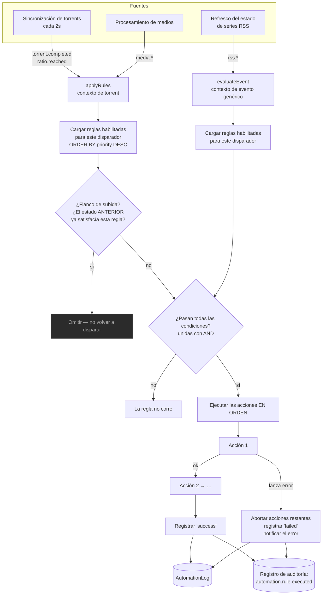

# Automatización

## Resumen

**Automatización** es el motor de reglas. Vigila cuando pasan cosas, verifica si cumplen con tus condiciones y ejecuta acciones.

```
disparador  →  condiciones (todas deben pasar)  →  acciones (corren en orden)
```

Ese es todo el modelo, y es deliberadamente pequeño. "Cuando una descarga se complete, **y** su etiqueta sea `movies`, **y** su ratio esté por encima de 2.0 — muévela, y después notifícame."

Es un módulo **core** (id `automation`, permisos `automation.view` / `automation.manage`), y es donde se enganchan tanto [Descarga Inteligente](/modules/smart-download) como [RSS](/modules/rss).

## Por qué / cuándo usarlo

- **Posprocesamiento.** Mueve una descarga completada a otro lugar; entrégasela al Gestor de Medios para que la renombre.
- **Higiene de seeding.** Detén o elimina un torrent en cuanto alcance tu meta de ratio.
- **Integración.** Dispara un webhook hacia algo de lo que UltraTorrent no sabe nada.
- **Reaccionar a tu biblioteca.** Una serie termina — convierte su regla RSS a modo backfill, automáticamente.

Si te encuentras haciendo lo mismo a mano dos veces por semana, su lugar es aquí.

## Requisitos previos

- Un [motor](/modules/engines) funcionando (`automation` lo declara como dependencia dura).
- `automation.view` para ver las reglas y sus registros; `automation.manage` para crearlas o cambiarlas.
- Para acciones de notificación: un canal configurado en el [Centro de Notificaciones](/modules/notification-center).

## Conceptos

**Disparador (trigger)** — el evento que inicia una regla. Cada regla tiene exactamente uno.

**Condición** — una prueba `{ field, op, value }` contra el contexto del evento. Las condiciones se unen con **AND**: *cada* una tiene que pasar. **Cero condiciones significa que la regla siempre coincide.**

**Acción** — qué hacer. Cada regla tiene una lista ordenada, y corren **secuencialmente**. La primera acción que lance un error **aborta las acciones restantes de esa regla**, registra la corrida como `failed` y despacha una notificación de error.

**Prioridad** — un entero. **La prioridad más alta corre primero.** Todas las reglas que coincidan corren; no hay "detenerse en la primera coincidencia".

**Flanco de subida (rising edge)** — una regla solo se dispara en la *transición* hacia un estado que coincide, no repetidamente mientras se mantiene ahí. Esto aplica a `ratio.reached`: si el estado anterior ya satisfacía las condiciones, la regla se omite.

**Registro de ejecución** — cada corrida se guarda en `AutomationLog` con un estado (`success` / `failed`), el contexto y un mensaje. También se refleja en el [registro de auditoría](/modules/audit).

## Cómo funciona



### Idempotencia en `torrent.completed`

Una finalización es un **flanco**: el torrent cruza de incompleto a completo, y la regla se dispara. ¿Pero qué pasa con un torrent que *ya* estaba completo cuando escribiste la regla? Nunca cruza el flanco, así que nunca se dispara — por eso "los torrents completados siguen compartiendo a pesar de mi regla de eliminación" fue un bug real y confuso.

Se arregla con un **backfill**: las reglas de `torrent.completed` se vuelven a correr contra torrents que ya están completos, usando las filas exitosas de `AutomationLog` (con clave `ruleId::hash`) como libro mayor de lo que ya se hizo. Los fallos **no** se registran como hechos, así que se reintentan en el próximo ciclo.

## Configuración

### Disparadores

Existen catorce disparadores, en tres familias.

| Disparador | Categoría | Se dispara cuando |
|---------|----------|-----------|
| `torrent.completed` | torrent | Una descarga se completa (más el backfill de arriba). |
| `ratio.reached` | torrent | El ratio de compartición cruza tu umbral. **Flanco de subida.** |
| `media.detected` | media | Se escanea un archivo de medios nuevo. |
| `media.matched` | media | Se identifica un elemento. |
| `media.unmatched` | media | No se pudo identificar un elemento. |
| `media.missing_artwork` | media | Un elemento no tiene ilustraciones. |
| `media.missing_subtitles` | media | Un elemento no tiene los subtítulos preferidos. |
| `media.rename_completed` | media | Se completó un renombrado/movimiento. |
| `media.server_refresh_failed` | media | Falló la actualización de un servidor de medios. |
| `rss.rule.created_for_inactive_show` | rss | Alguien pasó por encima de la advertencia de serie finalizada/cancelada. |
| `rss.show_status.changed` | rss | Cambió el estado de emisión de una serie monitoreada. |
| `rss.show.became_active` | rss | Una serie monitoreada regresó. |
| `rss.show.ended` | rss | Una serie monitoreada finalizó. |
| `rss.show.canceled` | rss | Se canceló una serie monitoreada. |

### Operadores de condición

Exactamente ocho:

| Operador | Comportamiento |
|----------|-----------|
| `eq` / `neq` | Igualdad / desigualdad estricta. |
| `gt` / `gte` / `lt` / `lte` | Comparación numérica — **ambos lados se convierten a números**. |
| `contains` | Coincidencia de subcadena sobre el valor convertido a texto. |
| `matches` | Expresión regular sin distinguir mayúsculas. **Una regex inválida devuelve `false` en vez de lanzar un error** — así que un typo nunca coincide, en silencio. |

:::warning Un operador desconocido devuelve `false`
Cualquier operador que no sea uno de estos ocho evalúa a `false`, así que la regla nunca se dispara. Si una regla misteriosamente nunca corre, revisa el operador primero.
:::

### Acciones

Existen veintidós acciones, en cuatro familias.

**Acciones de torrent** (necesitan un torrent real — solo válidas en los disparadores de torrent):
`move` (parámetro `destination`), `pause`, `stop`, `delete`, `delete_with_data`, `rename_for_media` (parámetros `preset`, `mode` — por defecto `hardlink` — `libraryPath`, `template`).

**Acciones sin contexto** (válidas en cualquier disparador):
`notify` (parámetros `title`, `message`), `send_notification` (despacho completo del [Centro de Notificaciones](/modules/notification-center): `channelIds`, `recipientIds`, `groupIds`, `templateId`, `variables`, `priority`, `title`, `message`), `webhook` (hace POST de JSON a `params.url`), `notify_admin` (solo en contexto de evento).

**Acciones de medios:**
`media_scan_library`, `media_match`, `media_fetch_metadata`, `media_fetch_artwork`, `media_generate_nfo`, `media_rename`, `media_move`, `media_server_refresh`, `media_notify`.

**Acciones de RSS:**
`refresh_rss_show_status`, `disable_rss_rule`, `convert_rule_to_backfill` (apaga `autoDownload` — conserva la regla, detiene la captura automática hacia adelante).

:::caution Hoy la mayoría de los disparadores y acciones son solo por API
El **constructor de reglas de la UI actualmente expone solo dos disparadores** (`torrent.completed`, `ratio.reached`) y **ocho acciones** (`notify`, `move`, `pause`, `stop`, `delete`, `delete_with_data`, `webhook`, `rename_for_media`), con campos de condición limitados a `name`, `label`, `state`, `ratio`, `size`, `progress`, `downloadRate`, `uploadRate`.

Los otros **doce disparadores** (todos los `media.*` y `rss.*`) y **catorce acciones** (todas las `media_*`, `rss_*` y `send_notification`) existen en el motor y son completamente funcionales, pero solo se alcanzan **a través de la API REST** — `POST /api/automation/rules`. El catálogo completo en vivo está en `GET /api/automation/catalog`.

Si las necesitas, crea la regla vía la API. Va a correr correctamente; simplemente todavía no la puedes crear desde el formulario.
:::

### Reglas con contexto de evento

Los cinco disparadores `rss.*` corren por una ruta separada (`evaluateEvent`) que evalúa las condiciones contra un **objeto de evento plano** en vez de un torrent. Ahí solo se permiten acciones **seguras para eventos**: `notify`, `notify_admin`, `send_notification`, `webhook`, y las tres acciones `rss_*`. Cualquier otro id de acción se rechaza con `Action "<type>" is not valid for an event trigger`, se registra como `failed` y se notifica.

### Campos de la regla

| Campo | Qué hace | Por defecto |
|-------|--------------|---------|
| `name` | Nombre visible. | — |
| `description` | Texto libre. | — |
| `trigger` | El único disparador. | — |
| `conditions` | El arreglo de condiciones unidas con AND. **Vacío = siempre coincide.** | `[]` |
| `actions` | El arreglo ordenado de acciones. | `[]` |
| `isEnabled` | Si corre o no. | `true` |
| `priority` | La más alta corre primero. | `0` |

### Endpoints

| Método | Ruta | Permiso |
|--------|------|-----------|
| GET | `/api/automation/catalog` | `automation.view` |
| GET | `/api/automation/rules` | `automation.view` |
| POST | `/api/automation/rules` | `automation.manage` |
| PATCH | `/api/automation/rules/:id` | `automation.manage` |
| DELETE | `/api/automation/rules/:id` | `automation.manage` |
| GET | `/api/automation/rules/:id/logs` | `automation.view` |

## Recorrido paso a paso

**1. Ve a Automatización → Reglas de Automatización.**

**2. Crea primero una regla con una acción obviamente segura.** Disparador `torrent.completed`, sin condiciones, una acción: `notify`. Guárdala, habilitada.

**3. Completa una descarga.** Recibes una notificación. Acabas de probar que el disparador se dispara y que la acción corre — que es justo lo que casi nadie verifica antes de escribir algo destructivo.

**4. Agrega una condición.** `label` `eq` `movies`. Completa un torrent con una etiqueta distinta. La regla **no** debería correr. Revisa el **Registro de ejecución** para confirmarlo.

**5. Ahora haz algo de verdad.** Agrega una acción `move` con un destino, o una acción `rename_for_media`. Ponla *después* del notify, para que si la acción destructiva falla igual te enteres.

**6. Vigila el registro de ejecución.** Cada corrida queda registrada, con éxito o con fallo. También en el [registro de auditoría](/modules/audit), bajo `automation.rule.executed`.

:::danger No hay simulación
Automatización **no tiene** capacidad de prueba, simulación ni vista previa. Una regla o está apagada o está en vivo.

Así que: construye la regla primero con una acción `notify`, comprueba que el disparador y las condiciones se comportan, y solo entonces cambia a la acción que elimina cosas. No hay deshacer, y una regla con cero condiciones coincide con **todo**.
:::

## Capturas de pantalla


:::tip Mira este tutorial
_Video próximamente._
:::

## Ejemplos del mundo real

### Dejar de compartir al alcanzar una meta de ratio

Disparador: `ratio.reached`. Condición: `ratio` `gte` `2.0`. Acciones: `notify` (para que te enteres), y después `stop`.

Como `ratio.reached` es de **flanco de subida**, esto se dispara exactamente **una vez** — en la transición pasando 2.0 — y no en cada tick de sincronización de 2 segundos por el resto de la vida del torrent. Si además quieres que los datos desaparezcan, usa `delete_with_data` en vez de `stop`, pero prueba primero con `stop`.

### Enlazar con hardlink las películas completadas hacia la biblioteca

Disparador: `torrent.completed`. Condición: `label` `eq` `movies`. Acción: `rename_for_media` con `preset: plex`, `mode: hardlink`, y el `libraryPath` de tus películas.

`hardlink` es el modo por defecto por una razón: el archivo aparece en la biblioteca **y** el original se queda donde el cliente de torrents lo dejó, así que el seeding continúa. Una sola copia de los bytes.

### Convertir una regla RSS a backfill cuando una serie termina (hoy solo por API)

Disparador: `rss.show.ended`. Acciones: `notify_admin`, y después `convert_rule_to_backfill`.

Cuando el refresco horario del estado de series nota que una serie monitoreada finalizó, esto apaga la descarga automática de esa regla — conservas la regla y su historial, pero deja de capturar hacia adelante episodios que nunca se van a emitir. La acción apunta a una regla ya sea por un `ruleId` explícito o por la identidad de la serie que viene en el contexto del disparador.

Crea esta vía `POST /api/automation/rules`; el formulario de la UI todavía no ofrece disparadores `rss.*`.

### Disparar un webhook hacia cualquier cosa

Disparador: `torrent.completed`. Acción: `webhook` con tu URL. Hace POST de un cuerpo JSON que contiene el torrent (o el evento) y tus parámetros. Esa es tu salida de emergencia para todo lo que UltraTorrent no hace de forma nativa.

## Solución de problemas

| Síntoma | Causa | Arreglo |
|---------|-------|-----|
| Los torrents completados siguen compartiendo a pesar de tener una regla de eliminación que funciona | Dos bugs históricos distintos. **(1)** `torrent.completed` solo se disparaba en el *flanco* de finalización, así que un torrent que ya estaba completo cuando se escribió la regla nunca la disparaba. **(2)** El `delete` de rTorrent no verificaba que la eliminación de verdad ocurriera. Ambos están arreglados — ahora hay un backfill (usando las filas exitosas del registro como libro mayor) y el delete verifica y reintenta. | Actualiza. Después revisa el **Registro de ejecución** de la regla — si la corrida muestra `success` y el torrent sigue ahí, es un problema del motor, no de la regla. |
| Una regla nunca se dispara | Lo más probable es un **operador desconocido** (que evalúa a `false`), o una regex inválida en una condición `matches` (que también devuelve `false` en vez de lanzar error). O que el disparador de verdad no se está disparando. | Revisa el operador contra los ocho listados arriba. Después deja la regla con cero condiciones y una acción `notify` para comprobar que el disparador mismo se dispara. |
| Una regla se dispara **constantemente** | Cero condiciones significa que **siempre coincide**. Y solo `ratio.reached` es de flanco de subida — los otros disparadores se disparan cada vez que ocurre el evento. | Agrega condiciones. |
| Solo corrieron algunas de las acciones de una regla | La **primera acción que lanza un error aborta el resto** de esa regla. | Lee el **Registro de ejecución** — el mensaje de fallo dice qué salió mal. Pon las acciones no destructivas primero. |
| `Action "media_rename" is not valid for an event trigger` | Las reglas con contexto de evento (los disparadores `rss.*`) solo permiten `notify`, `notify_admin`, `send_notification`, `webhook`, y las tres acciones `rss_*`. | Usa un disparador de torrent o de medios para las acciones de torrent/medios. |
| No encuentro los disparadores `media.*` o `rss.*` en la UI | El formulario del constructor de reglas actualmente expone solo los dos disparadores de torrent. El resto vive en el motor y es solo por API. | Crea la regla vía `POST /api/automation/rules`. Mira `GET /api/automation/catalog` para la lista completa en vivo. |
| Una condición numérica se comporta raro | `gt` / `gte` / `lt` / `lte` **convierten ambos lados a números**. Comparar numéricamente un campo no numérico te da semántica de `NaN`. | Compara los campos numéricos numéricamente; usa `eq` / `contains` para textos. |
| Dos reglas entran en conflicto | Todas las reglas que coincidan corren; no hay "detenerse en la primera coincidencia". El orden es por **prioridad, descendente**. | Usa `priority` para secuenciarlas, y haz que las condiciones sean mutuamente excluyentes. |

## Buenas prácticas

- **Prototipa con `notify`.** Comprueba el disparador y las condiciones antes de conectar algo destructivo. No hay simulación ni deshacer.
- **Pon la acción de notify primero.** Si una acción posterior falla, igual te enteras.
- **Nunca dejes una regla destructiva con cero condiciones.** Cero condiciones coincide con todo.
- **Usa `priority` deliberadamente** cuando las reglas se puedan solapar.
- **Lee el registro de ejecución después de cualquier cambio.** Es el único ciclo de retroalimentación que tienes.
- **Prefiere `stop` sobre `delete_with_data`** hasta que estés seguro.
- **Recuerda que `ratio.reached` es de flanco de subida** — por eso no te llena de spam.

## Errores comunes

- **Escribir una regla `delete_with_data` sin condiciones** y habilitarla. Eso va a eliminar todo, al completarse, para siempre.
- **Asumir que hay una simulación.** No la hay.
- **Usar un operador que no existe** (`ne`, `regex`, `startsWith`…) y concluir que el motor está roto. Los operadores desconocidos evalúan a `false` en silencio.
- **Esperar que todos los disparadores sean de flanco de subida.** Solo `ratio.reached` lo es.
- **Intentar usar una acción de medios en un disparador RSS.** Las reglas con contexto de evento la rechazan.
- **Buscar los disparadores `media.*` en el formulario de la UI.** Por ahora son solo por API.

## Preguntas frecuentes

**¿Puedo probar una regla antes de habilitarla?**
No. No hay endpoint de simulación, prueba ni vista previa en el módulo de automatización. Constrúyela con `notify` y observa.

**¿Cada cuánto se evalúan las reglas de torrent?**
En el ciclo de sincronización de torrents, que corre cada **2 segundos**.

**¿Corren todas las reglas que coinciden, o solo la primera?**
**Todas**, en orden de `priority` descendente.

**¿Qué pasa si una acción falla?**
Aborta las acciones restantes de esa regla, la corrida se registra como `failed`, y se despacha una notificación de error. Las demás reglas no se ven afectadas.

**¿Por qué mi regla `ratio.reached` solo se dispara una vez?**
Porque es de flanco de subida — se dispara en la *transición* hacia el estado que coincide. Si el estado anterior ya satisfacía las condiciones, la regla se omite. Este es el comportamiento deseado, no un bug.

**¿Hay un constructor de reglas visual / de arrastrar y soltar?**
Hoy no. La UI es un formulario estructurado — tarjetas de regla, un diálogo de creación, filas de condición y filas de acción con widgets de parámetros por tipo. No hay lienzo.

**¿Se auditan las corridas de las reglas?**
Sí. Cada corrida escribe `automation.rule.executed` en el [registro de auditoría](/modules/audit), con `success` o `failure`, el nombre de la regla y la lista de acciones — además del registro de ejecución propio del módulo.

## Lista de verificación

- [ ] Crea una regla: `torrent.completed`, sin condiciones, una acción `notify`. Esperado: se dispara en la próxima finalización.
- [ ] Agrega una condición `label` `eq`. Esperado: se dispara solo para las etiquetas que coinciden; el registro de ejecución no muestra nada para las demás.
- [ ] Usa a propósito un operador desconocido. Esperado: la regla nunca se dispara — confirmando el comportamiento de `false` silencioso.
- [ ] Agrega una segunda acción después del notify. Esperado: ambas corren, en orden.
- [ ] Haz que la segunda acción falle (un destino inválido). Esperado: la corrida registra `failed`, y llega una notificación de error.
- [ ] Revisa el registro de auditoría. Esperado: una fila `automation.rule.executed` con `result: failure`.
- [ ] Crea una regla `ratio.reached` y deja que un torrent pase el umbral. Esperado: se dispara **exactamente una vez**, no repetidamente.

## Ver también

- [Torrents](/modules/torrents) — de dónde vienen los disparadores de torrent.
- [Gestor de Medios](/modules/media-manager) — los disparadores `media.*` y las acciones de medios.
- [Automatización RSS](/modules/rss) — los disparadores `rss.*` y la acción de backfill.
- [Centro de Notificaciones](/modules/notification-center) — la acción `send_notification`.
- [Registro de Auditoría](/modules/audit) — donde se reflejan las corridas de las reglas.
- [Referencia de la API](/reference/api)
