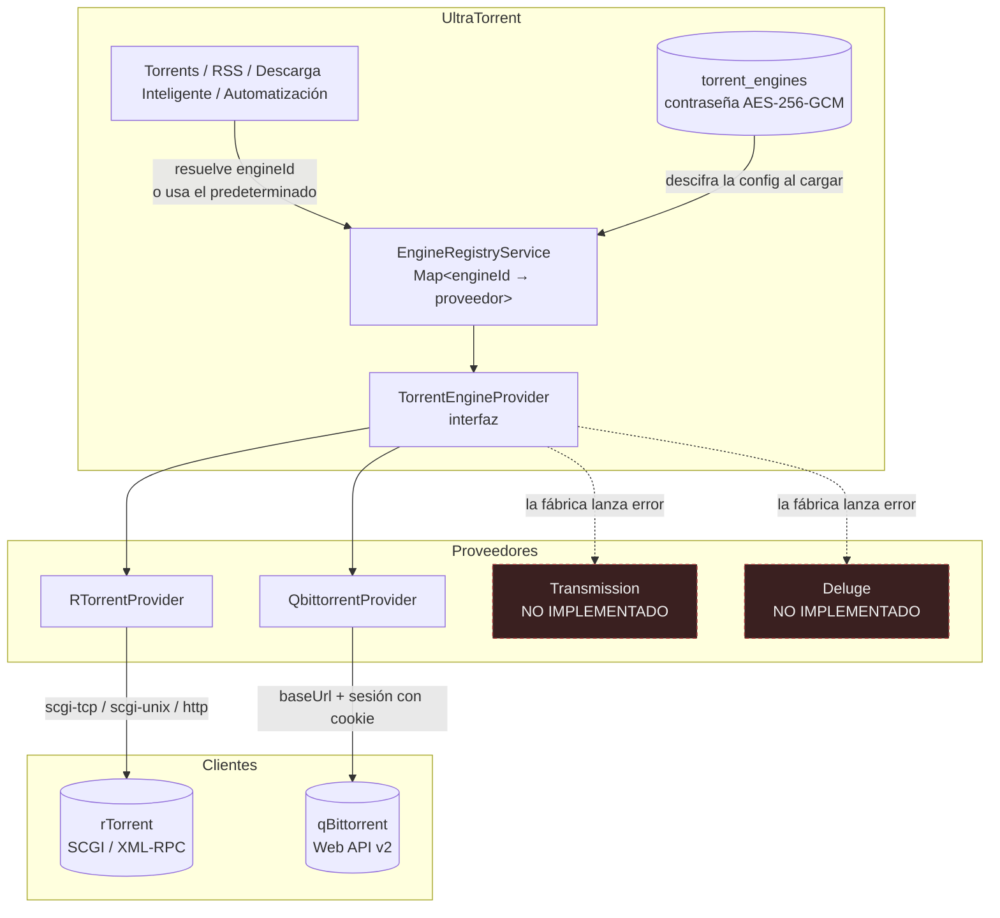

# Motores

## Resumen

UltraTorrent **no descarga torrents por sí mismo**. Maneja un cliente de torrents — un *motor* — a través de una abstracción de proveedor, y todo lo demás en el producto está escrito contra esa abstracción y no contra ningún cliente en particular.

El módulo **Motores** (id `engine`, core) es donde conectas uno. Una vez que un motor está conectado y sano, [Torrents](/modules/torrents), [RSS](/modules/rss), [Descarga Inteligente](/modules/smart-download) y [Automatización](/modules/automation) se encienden. Hasta entonces, ninguno puede hacer nada.

## Por qué / cuándo usarlo

Configuras un motor **una vez, al instalar**, y después casi nunca vuelves a pensar en él. Regresas a esta página cuando:

- Estás configurando por primera vez.
- Quieres **cambiar de cliente** — de rTorrent a qBittorrent, digamos — sin tocar ninguna otra configuración.
- Quieres **más de un motor** — uno local rápido para las capturas nuevas y uno lento de archivo para un seedbox, por ejemplo.
- Algo está roto, y necesitas saber si el problema es UltraTorrent o el cliente.

## Requisitos previos

- Un cliente de torrents corriendo que UltraTorrent pueda **alcanzar por la red**. En el stack de Docker incluido, eso significa levantar uno de los perfiles opcionales de Compose:

  ```bash
  docker compose --profile rtorrent up -d
  # o
  docker compose --profile qbittorrent up -d
  ```

- Los datos de conexión del cliente — para rTorrent, su host/puerto SCGI; para qBittorrent, la URL de su Web UI y el inicio de sesión.
- `system.view` para ver motores, `engines.manage` para crearlos, editarlos, probarlos o eliminarlos.
- Una `ENCRYPTION_KEY` en tu entorno. Las contraseñas de los motores se cifran en reposo con ella, y debe ser distinta de tu `JWT_ACCESS_SECRET`. Genera una con `openssl rand -base64 48`.

:::warning No hay motor predeterminado
UltraTorrent **no** crea una fila de motor en el primer arranque. Una instalación nueva tiene cero motores, y la página de Torrents te lo va a decir. Crear uno es un paso de configuración obligatorio — mira [Inicio rápido](/learn/quick-start).
:::

## Conceptos

**Motor** — una conexión a un cliente de torrents. Tiene un nombre, un `kind`, un blob de configuración, una bandera de habilitado y una bandera de predeterminado.

**Kind** — qué cliente es. Dos están implementados: **`rtorrent`** y **`qbittorrent`**. Otros dos (`transmission`, `deluge`) pasan la validación pero **no están implementados** — la fábrica de proveedores lanza un error, y el selector de la UI los deshabilita.

**Proveedor** — el código que habla el protocolo de un cliente dado. `TorrentEngineProvider` es la interfaz: conectar, verificar salud, listar, agregar, quitar, iniciar/detener/pausar/reanudar, reverificar, mover, renombrar, fijar prioridades y límites, administrar trackers. Todo lo que está por encima de la capa del motor solo conoce esta interfaz.

**Motor predeterminado** — el que se usa cuando una petición no nombra un `engineId`. Exactamente un motor puede ser el predeterminado; poner la bandera en uno la quita de los demás. Si ningún motor está marcado como predeterminado, se usa el primero que se cargó.

**Verificación de salud** — una sonda en vivo que devuelve `{ online, latencyMs, version, error, checkedAt }`. Para rTorrent llama a `system.client_version`; para qBittorrent consulta la Web API.

**Sincronización de torrents** — la tarea en segundo plano que lee cada motor habilitado cada **2 segundos** y empuja el resultado a la UI.

## Cómo funciona



El registro mantiene un proveedor vivo por cada fila de motor **habilitada**, y se reconstruye cada vez que creas, actualizas o eliminas un motor. Cada ruta de torrents acepta un `engineId` opcional; si lo omites, el registro resuelve el predeterminado.

Como todo lo que está aguas arriba se escribió contra la interfaz, **el resto del producto es agnóstico al motor**. Agregar un cliente significa escribir una clase de proveedor — mira [Proveedores](/develop/providers).

## Configuración

### rTorrent

rTorrent habla XML-RPC, usualmente sobre SCGI. Elige el transporte que corresponda a cómo está expuesto tu rTorrent.

| Campo | Qué hace | Predeterminado | Recomendado |
|-------|--------------|---------|-------------|
| **Modo** | `scgi-tcp` (TCP crudo), `scgi-unix` (socket Unix), o `http` (XML-RPC sobre HTTP). | `scgi-tcp` | `scgi-tcp` — es lo que expone el contenedor incluido. |
| **Host** | Nombre de host para `scgi-tcp`. | `rtorrent` (el nombre del servicio de Compose) | `rtorrent` en el stack incluido; el nombre del contenedor/host en otro caso. |
| **Puerto** | Puerto para `scgi-tcp`. | `5000` | `5000`. |
| **Ruta del socket** | Ruta del sistema de archivos, solo para `scgi-unix`. | — | Solo si rTorrent y UltraTorrent comparten un sistema de archivos. |
| **URL** | El endpoint XML-RPC, solo para el modo `http`. | — | Solo si rTorrent está detrás de un endpoint HTTP. |
| **Tiempo de espera (ms)** | Cuánto esperar al cliente. | `15000` (el formulario precarga `10000`) | `10000`. Súbelo si el cliente está sobre almacenamiento lento o remoto. |

### qBittorrent

qBittorrent habla su Web API v2 sobre HTTP, con una sesión de cookie.

| Campo | Qué hace | Predeterminado | Recomendado |
|-------|--------------|---------|-------------|
| **URL base** | La URL de la Web UI. | `http://qbittorrent:8080` (precarga del formulario) | El nombre del servicio de Compose en el stack incluido. `http://<host>:8081` desde afuera, si publicaste el `QBITTORRENT_PORT` predeterminado. |
| **Usuario** | Inicio de sesión de la Web UI. | — | Que no sea `admin`/`adminadmin`. Cámbialo primero en qBittorrent. |
| **Contraseña** | Contraseña de la Web UI. **Cifrada en reposo con AES-256-GCM.** | — | Una de verdad. |
| **Tiempo de espera (ms)** | Cuánto esperar. | `15000` | `15000`. |

:::info La contraseña nunca se devuelve
`GET /api/engines` devuelve `hasPassword: true|false`, nunca la contraseña en sí. Al editar, **dejar el campo de contraseña en blanco conserva la guardada**. Una `ENCRYPTION_KEY` rotada o corrupta falla de forma cerrada — el campo se lee como ausente en vez de exponer el texto cifrado.
:::

### Campos comunes

| Campo | Qué hace | Predeterminado |
|-------|--------------|---------|
| **Nombre** | Nombre para mostrar (máx. 120 caracteres). | — |
| **Kind** | `rtorrent` o `qbittorrent`. **No se puede cambiar después de crearlo** — el formulario de edición lo deshabilita. | — |
| **Habilitado** | Si el registro carga este motor del todo. | `true` |
| **Predeterminado** | Si se usa cuando no se da un `engineId`. Ponerlo quita la bandera de todos los demás motores. | `false` |

### Endpoints

| Método | Ruta | Permiso |
|--------|------|-----------|
| GET | `/api/engines` | `system.view` |
| GET | `/api/engines/health` | `system.view` (`?engineId=` opcional) |
| POST | `/api/engines/test` | `engines.manage` |
| POST | `/api/engines` | `engines.manage` |
| PATCH | `/api/engines/:id` | `engines.manage` |
| DELETE | `/api/engines/:id` | `engines.manage` |

`POST /api/engines/test` sondea una configuración **sin guardarla** — es lo que llama el botón *Probar conexión* del formulario. Si falla devuelve `{ online: false, error: "..." }` en vez de lanzar un error, así que obtienes un mensaje legible en lugar de un stack trace.

:::danger No configures el motor con variables de entorno
`.env.example` lista `RTORRENT_SCGI_HOST` y `RTORRENT_SCGI_PORT`, pero **ningún código de la aplicación las lee**. Son sobras. La conexión del motor vive en la base de datos y se configura **únicamente** a través de **Descargas → Motores** o de la API. Si fijas esas variables esperando que UltraTorrent recoja tu rTorrent, no va a pasar nada.
:::

## Recorrido paso a paso

**1. Levanta un cliente.** En el stack de Docker incluido, levanta un perfil:

```bash
docker compose --profile rtorrent up -d
```

Confirma que está corriendo y escuchando (`docker compose ps`).

**2. Ve a Descargas → Motores** y haz clic en **Agregar motor**.

**3. Llena la conexión.** Para el rTorrent incluido: kind `rtorrent`, modo `scgi-tcp`, host `rtorrent`, puerto `5000`. Para el qBittorrent incluido: kind `qbittorrent`, URL base `http://qbittorrent:8080`, más el usuario y la contraseña que fijaste en la propia UI de qBittorrent.

**4. Haz clic en Probar conexión *antes* de guardar.** Un motor sano devuelve `online: true` con una latencia y la cadena de versión del cliente. Si falla, el mensaje de error te dice qué salió mal — arréglalo ahora, no después de haber guardado una fila rota.

**5. Márcalo como predeterminado** (asumiendo que es el único que tienes) y guarda.

**6. Verifica.** Ve a **Descargas → Torrents**. La insignia de salud del motor en el encabezado debería estar verde. Agrega un magnet bien sembrado; debería aparecer en unos dos segundos.

## Capturas de pantalla


:::tip Mira este tutorial
_Video próximamente._
:::

## Ejemplos del mundo real

### Migrar de rTorrent a qBittorrent sin tiempo fuera de servicio

Agrega el motor de qBittorrent junto al de rTorrent que ya tienes, y **no** lo marques como predeterminado todavía. Pruébalo, confirma que está sano, y deja ambos corriendo. Las capturas nuevas siguen yendo a rTorrent. Cuando estés confiado, cambia la bandera de predeterminado a qBittorrent: las capturas nuevas ahora van ahí, mientras rTorrent sigue compartiendo todo lo que ya tiene. Una vez que los torrents de rTorrent hayan compartido lo suficiente para tu gusto, deshabilítalo. Nada en RSS, Descarga Inteligente ni Automatización tuvo que cambiar — ellos solo hablaban con la interfaz.

### Enrutar las capturas a un seedbox y dejar la caja local para archivo

Crea dos motores: `Seedbox` (qBittorrent remoto, marcado como predeterminado) y `Local Archive` (rTorrent). Las capturas automáticas nuevas aterrizan en el seedbox porque es el predeterminado. Cuando quieras algo en la caja local, agrégalo explícitamente con ese `engineId`. La insignia de salud del motor muestra ambos, y la lista de torrents se puede filtrar por motor.

## Solución de problemas

| Síntoma | Causa | Solución |
|---------|-------|-----|
| "No hay motor de torrents configurado" | Hay cero filas de motor. UltraTorrent no crea una por ti. | Crea una en **Descargas → Motores**. |
| `Engine "transmission" is planned but not yet implemented` | Solo rTorrent y qBittorrent tienen proveedor. Transmission y Deluge pasan la validación del DTO pero la fábrica lanza un error. | Usa rTorrent o qBittorrent. |
| Probar conexión falla con un tiempo de espera agotado, pero el contenedor está corriendo | El host/puerto está mal para la red en la que estás. Dentro de Docker, usa el **nombre del servicio** (`rtorrent`, `qbittorrent`), no `localhost` — `localhost` dentro del contenedor del backend es el backend, no el motor. | Usa el nombre del servicio de Compose y el puerto interno. |
| El inicio de sesión de qBittorrent falla contra un build reciente | qBittorrent moderno responde a un inicio de sesión exitoso con `204 No Content` en vez de un cuerpo, lo cual el código de cliente viejo no aceptaba. Arreglado. | Actualiza UltraTorrent. Luego verifica dos veces el usuario/contraseña directamente contra la Web UI de qBittorrent. |
| rTorrent se sigue cayendo y reiniciando bajo carga | rTorrent 0.9.8 tiene un **bug sin arreglar aguas arriba** — `internal_error: priority_queue_insert(...) called on an invalid item`, disparado durante la programación del anuncio al tracker. Es **impulsado por la carga**: un host real con 752 torrents se cayó 44 veces en 4 días; otro con 7 torrents en el mismo build no se cayó ni una vez. No hay arreglo dentro del motor. | Cada caída sale limpiamente, Docker lo reinicia, y la sesión guardada se recarga — **no se pierde ningún torrent**. La configuración incluida fija `trackers.use_udp.set = no` para eliminar una variante secundaria del crash (los trackers HTTP/HTTPS y PEX igual encuentran pares). El healthcheck de Compose expone un motor trabado-pero-corriendo. Si operas con conteos altos de torrents, prefiere **qBittorrent**. |
| Un magnet reporta `download.failed` y luego descarga bien | rTorrent no registra el info-hash de un magnet hasta que obtiene los metadatos del DHT, lo cual rutinariamente toma mucho más que la vieja ventana de confirmación de ~6 s. Esto producía fallos falsos — en un host, 257 "fallos" de los cuales **256 en realidad cargaron** (mediana de ~53 s después). Arreglado: los magnets ahora son *aceptados/pendientes* y se reconcilian con la sincronización de 2 s. Los archivos `.torrent` siguen fallando en duro. | Actualiza. |
| Los torrents completados nunca se eliminan pese a una regla de eliminación | El `delete` de rTorrent no verificaba que la eliminación de verdad ocurriera. Arreglado: ahora verifica y reintenta. | Actualiza. |
| La insignia del motor está verde pero no descarga nada | El motor es alcanzable pero sus ranuras de descarga están llenas de torrents muertos. | Mira la [cola de estacionamiento](/modules/torrents). |
| El DHT está causando caídas de rTorrent | El build de rTorrent incluido puede caerse con un `internal_error` de DHT. | `RT_DHT` viene en `off` por defecto en `.env.example` exactamente por esta razón. Déjalo apagado. |

## Buenas prácticas

- **Siempre Prueba antes de Guardar.** Un motor guardado-pero-roto se ve idéntico a uno que funciona hasta que algo intenta usarlo.
- **Usa los nombres de servicio de Compose, no `localhost`,** dentro de Docker. Este es el error de conexión más común de todos.
- **Fija `ENCRYPTION_KEY` antes de crear un motor con contraseña**, y nunca la rotes a la ligera — una clave rotada vuelve ilegibles las contraseñas guardadas, y el campo falla de forma cerrada.
- **Prefiere qBittorrent a escala.** El crash de rTorrent 0.9.8 es impulsado por la carga y no está arreglado aguas arriba. Está bien para decenas de torrents; es un riesgo con cientos.
- **Mantén exactamente un motor predeterminado.** La ambigüedad aquí aparece después como "¿por qué esa captura se fue a la caja equivocada?".
- **Cambia las credenciales predeterminadas de qBittorrent** antes de conectarte a él.

## Errores comunes

- **Fijar `RTORRENT_SCGI_HOST` y esperar que haga algo.** No hace nada. El motor se configura en la UI/base de datos.
- **Apuntar el backend a `localhost:5000`** desde dentro de un contenedor. Ese es el propio loopback del backend.
- **Elegir Transmission o Deluge** de la lista de kind. Están visiblemente deshabilitados en la UI por una razón.
- **Eliminar un motor para "reiniciarlo".** Sus torrents siguen corriendo en el cliente; lo único que hiciste fue dejar a UltraTorrent ciego ante ellos. Deshabilítalo en su lugar.
- **Esperar que el kind sea editable.** No lo es — crea un motor nuevo en su lugar.

## Preguntas frecuentes

**¿Qué clientes de torrents están soportados?**
**rTorrent** y **qBittorrent**, completamente. Transmission y Deluge están nombrados en la unión de tipos pero no tienen proveedor — la fábrica lanza un error si lo intentas.

**¿Puedo correr más de un motor a la vez?**
Sí. El registro carga cada motor habilitado, cada ruta de torrents recibe un `engineId` opcional, y un motor es el predeterminado para las peticiones que lo omiten.

**¿Dónde se guarda la contraseña del motor?**
Cifrada con AES-256-GCM en el JSON de configuración del motor, con clave derivada de tu `ENCRYPTION_KEY`. Nunca la devuelve la API y nunca se registra en los logs.

**¿Cada cuánto lee UltraTorrent el motor?**
Cada **2 segundos** (`TorrentSyncService`). Esa tarea también transmite `torrents:update`, `stats:update` y `engine:status` a la UI.

**¿Hay soporte para TLS?**
No hay un interruptor dedicado de TLS. TLS queda implícito por el esquema en tu `url` (modo `http` de rTorrent) o `baseUrl` (qBittorrent) — usa `https://`.

**¿Puedo agregar soporte para mi propio cliente?**
Sí — implementa `TorrentEngineProvider` y regístralo en la fábrica. Mira [Proveedores](/develop/providers).

## Lista de verificación

- [ ] Levanta un contenedor de motor. Esperado: `docker compose ps` lo muestra corriendo.
- [ ] Crea el motor y haz clic en **Probar conexión**. Esperado: `online: true`, una cifra de latencia, y la cadena de versión del cliente.
- [ ] Guárdalo y márcalo como predeterminado. Esperado: aparece en la lista de motores con una insignia de predeterminado.
- [ ] Abre **Descargas → Torrents**. Esperado: una insignia verde de salud del motor, sin el estado vacío de "no hay motor configurado".
- [ ] Agrega un magnet bien sembrado. Esperado: aparece en la lista en ~2 segundos y empieza a descargar.
- [ ] Vuelve a abrir el motor para editarlo. Esperado: el campo de contraseña está en blanco/enmascarado y muestra `hasPassword`, no la contraseña.

## Ver también

- [Torrents](/modules/torrents) — lo que haces una vez que hay un motor conectado.
- [Proveedores](/develop/providers) — la abstracción, y cómo agregar un cliente.
- [Instalación con Docker Compose](/install/docker-compose) — levantar los perfiles de motor incluidos.
- [Referencia de entorno](/reference/environment) — `ENCRYPTION_KEY`, `QBITTORRENT_PORT`, `RT_DHT`.
- [Inicio rápido](/learn/quick-start)
- [Solución de problemas](/operate/troubleshooting)
