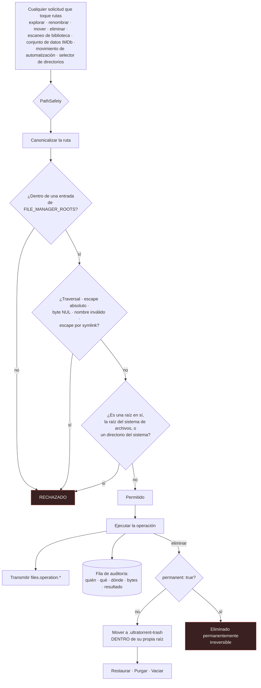

# Gestor de Archivos

## Resumen

El **Gestor de Archivos** es un gestor de archivos en el navegador para los directorios en los que escribe tu motor de torrents. Explora, previsualiza, renombra, mueve, copia, elimina y opera en masa — sin hacer SSH a la máquina.

Es un módulo **core** (id `files`, permisos `files.*`), y es más fundacional de lo que parece: es dueño de la **lista de raíces permitidas** que restringe *toda* funcionalidad del producto que toque rutas. El escaneo de bibliotecas del [Gestor de Medios](/modules/media-manager), la ruta del conjunto de datos de IMDb, los destinos de movimiento de Automatización y cada selector de directorios de la app están todos confinados por el límite que define este módulo.

## Por qué / cuándo usarlo

- **Limpiar después de una descarga.** Elimina la muestra, el `.nfo`, la carpeta `Subs/` en nueve idiomas.
- **Recuperar espacio.** El Asistente de Limpieza encuentra basura, duplicados por hash, subtítulos huérfanos y descargas parciales.
- **Arreglar un error de forma segura.** Los borrados van a una **Papelera**, no al vacío.
- **Inspeccionar.** Previsualiza un archivo de texto, revisa el sha-256 de un archivo, mira cuán grande es realmente una carpeta.

## Requisitos previos

- `FILE_MANAGER_ROOTS` configurado correctamente (ver abajo). Esta es una decisión **a nivel de despliegue**, no de la UI.
- `files.view` para explorar, más el permiso granular de cada operación.

## Conceptos

**Raíces duras** (`FILE_MANAGER_ROOTS`) — una lista de permitidos explícita, separada por comas, de directorios, configurada en el entorno. **Este es el límite de seguridad.** Toda operación, en todo módulo, se resuelve a una ruta **dentro** de una de estas raíces o se rechaza.

```bash
FILE_MANAGER_ROOTS=/downloads,/media   # por defecto: /downloads
```

**Ruta Raíz Predeterminada** — un *estrechamiento opcional* dentro de las raíces duras, configurado por un administrador (permiso `settings.manage_root_path`). Raíces duras `= /downloads`, Ruta Raíz Predeterminada `= /downloads/complete`. **Solo puede estrechar dentro de** las raíces duras — nunca ampliar más allá de ellas, nunca alcanzar un directorio del sistema.

**`PathSafety`** — la aplicación de la regla. Canonicaliza cada ruta y derrota el traversal con `../`, el escape por ruta absoluta, los bytes NUL, los nombres inválidos y los **escapes por symlink**, y se niega a operar sobre una raíz configurada en sí, sobre la raíz del sistema de archivos o sobre un directorio del sistema.

**Papelera** — los borrados son **suaves por defecto**. El elemento se mueve a un directorio `.ultratorrent-trash` **dentro de su propia raíz de almacenamiento** (así nunca cruza un límite de sistema de archivos), y una fila registra su ruta original, su tamaño y quién lo borró.

**Asistente de Limpieza** — escanea una carpeta, clasifica los candidatos removibles en categorías y te muestra un ahorro de espacio estimado. **Nunca borra automáticamente.**

## Cómo funciona



**El backend es la autoridad.** El frontend solo *esconde* lo que no puedes hacer; el servidor es el que *rechaza*. Esa distinción importa — una solicitud fabricada no puede escapar de las raíces saltándose la UI.

## Configuración

### Raíces

| Ajuste | Dónde | Por defecto | Recomendado |
|---------|-------|---------|-------------|
| `FILE_MANAGER_ROOTS` | Entorno | `/downloads` | **Mantenlo lo más estrecho posible.** Agrega `/media` si tus bibliotecas viven ahí. Nunca agregues `/`, `/etc`, ni un directorio home. |
| `fileManager.defaultRootPath` | **Configuración → Ruta Raíz Predeterminada** (necesita `settings.manage_root_path`) | `""` (usar las raíces del entorno tal cual) | Estréchala al subárbol que la gente realmente necesita, p. ej. `/downloads/complete`. |

La Ruta Raíz Predeterminada se cambia **solo** vía `PUT /api/files/root` (validado y auditado), **no** a través de los endpoints genéricos de configuración — es una clave protegida, y escribirla vía `PATCH /api/settings` devuelve un `403` diciéndotelo.

`GET /api/files/root` reporta la raíz efectiva más **existe / legible / escribible**, lo cual se muestra en Configuración con una advertencia si la app no puede escribir ahí.

### Selector de directorios

Los campos de ruta en toda la app — la ruta de guardado de Agregar torrent, la ruta de guardado de las reglas RSS, las rutas de biblioteca del Gestor de Medios, los destinos de movimiento de Automatización, y la propia Ruta Raíz Predeterminada — usan un **selector de directorios limitado a la raíz**. Las migas de pan no pueden subir por encima de la raíz, se pueden crear carpetas en el sitio (con `files.create_folder`), y la selección se valida **del lado del servidor** al usarse. La entrada manual sigue disponible, y sigue siendo validada.

### Capacidades y permisos

| Capacidad | Endpoint | Permiso |
|-----------|----------|-----------|
| Explorar un directorio | `GET /api/files` | `files.view` |
| Propiedades (tamaño, cantidad de elementos, ext, sha-256) | `GET /api/files/properties` | `files.view` |
| Previsualizar texto (≤ 256 KB) | `GET /api/files/preview` | `files.preview` |
| Descargar un archivo | `GET /api/files/download` | `files.download` |
| Crear carpeta | `POST /api/files/folders` | `files.create_folder` |
| Renombrar | `POST /api/files/rename` | `files.rename` |
| Mover | `POST /api/files/move` | `files.move` |
| Copiar (recursivo) | `POST /api/files/copy` | `files.copy` |
| Eliminar (Papelera o permanente) | `POST /api/files/delete` | `files.delete` |
| Mover/copiar/eliminar/limpiar en masa | `POST /api/files/bulk` | `files.bulk_actions` |
| Vista previa / ejecución de limpieza | `POST /api/files/cleanup-preview` · `…/cleanup-execute` | `files.cleanup` |
| Papelera: listar / restaurar / purgar / vaciar | `GET /api/files/trash` · `…/trash/*` | `files.view` / `files.delete` |

`files.manage` se conserva como permiso **paraguas heredado**; el gestor de archivos en sí usa los granulares de arriba.

### Categorías de limpieza

| Categoría | Heurística |
|----------|-----------|
| `sample_files` | Archivos de video cuyo nombre contiene `sample` |
| `empty_folders` | Carpetas cuyos hijos también se están removiendo todos |
| `zero_byte_files` | Archivos de tamaño 0 |
| `duplicate_files` | Tamaño idéntico **y** sha-256 idéntico (conserva el primero) |
| `orphan_subtitles` | Un subtítulo sin archivo de video en su carpeta |
| `orphan_artwork` | Una imagen sin archivo de video en su carpeta |
| `nfo_files` / `sfv_files` / `txt_files` | Por extensión |
| `hidden_temp_files` | Dotfiles, `~`/`.tmp`/`.bak`, `Thumbs.db`, `.DS_Store` |
| `partial_downloads` | `.part`, `.crdownload`, `.aria2`, `.!ut`, … |

La vista previa devuelve grupos por categoría (cantidad de elementos y bytes) y un total `estimatedSpaceSaved`. **Cada candidato se puede seleccionar individualmente.**

## Recorrido paso a paso

**1. Deja bien las raíces, en el entorno.** Esta es la única decisión que importa. `FILE_MANAGER_ROOTS=/data` (con las descargas y los medios adentro) es una buena forma — le permite al [Gestor de Medios](/modules/media-manager) hacer hardlinks entre ellos, porque están en un solo sistema de archivos.

**2. Estrecha la Ruta Raíz Predeterminada** si quieres que la UI arranque en un lugar más específico. **Configuración → Ruta Raíz Predeterminada**. Confirma que las insignias de existe/legible/**escribible** estén todas en verde — si no es escribible, la mitad de las operaciones van a fallar más adelante de formas que parecen bugs.

**3. Explora.** **Archivos → Gestor de Archivos**. No puedes navegar por encima de la raíz; las migas de pan no te dejan.

**4. Elimina algo, y después restáuralo.** Elimina un archivo de prueba. Va a la **Papelera**. Restáuralo. Vuelve a su ubicación original. **Confirma que esto funciona antes de eliminar algo que te importe.**

**5. Corre el Asistente de Limpieza.** Apúntalo a una carpeta de descargas completadas. Escanea y clasifica. **Lee las categorías antes de seleccionar nada** — `nfo_files` y `txt_files` son basura para algunos y metadatos para otros.

**6. Selecciona y ejecuta.** La limpieza remueve solo las rutas que seleccionaste, **a la Papelera por defecto**.

## Capturas de pantalla


:::tip Mira este tutorial
_Video próximamente._
:::

## Ejemplos del mundo real

### Recuperar 40 GB de una carpeta de descargas completadas

Corre el Asistente de Limpieza sobre `/downloads/complete`. Encuentra: 60 archivos de muestra, un puñado de archivos de cero bytes, 200 subtítulos huérfanos de packs a los que les borraste el video, una docena de descargas parciales de torrents cancelados, y — la grande — **archivos duplicados emparejados por tamaño idéntico *y* sha-256**, que es como descubres que tienes la misma película dos veces bajo dos nombres de lanzamiento distintos.

Selecciona las categorías que de verdad quieres que se vayan. Ejecuta. Va a la Papelera, así que si te equivocaste, lo puedes restaurar.

### Darle acceso de solo lectura a un compañero de casa

Crea un rol con `files.view`, `files.preview` y `files.download` — y nada más. Pueden explorar y descargar; no pueden renombrar, mover ni eliminar un solo byte. Después configura la **Ruta Raíz Predeterminada** al subárbol compartido para que ni siquiera vean el resto.

### Recuperarte de un borrado malo

Borraste la carpeta equivocada. Está en la **Papelera**, con su ruta original relativa a la raíz registrada. Haz clic en **Restaurar**. Vuelve exactamente donde estaba. Restaurar **nunca sobrescribe** un elemento existente a menos que pases explícitamente `overwrite: true`.

## Solución de problemas

| Síntoma | Causa | Arreglo |
|---------|-------|-----|
| Una ruta se rechaza: fuera de las raíces | Está fuera de `FILE_MANAGER_ROOTS`. Este es un **límite duro**, y aplica también al escaneo de bibliotecas del Gestor de Medios y a la ruta del conjunto de datos de IMDb. | Agrega la raíz a `FILE_MANAGER_ROOTS`, o mueve el contenido dentro de una existente. |
| La Ruta Raíz Predeterminada no se guarda vía la API de configuración | `fileManager.defaultRootPath` es una **clave protegida**. `PATCH /api/settings` devuelve un `403` explicando que tienes que usar la ruta dedicada. | Usa **Configuración → Ruta Raíz Predeterminada** (que llama a `PUT /api/files/root`), con el permiso `settings.manage_root_path`. |
| Las operaciones fallan con errores de permisos en el disco | La raíz existe y es legible pero **no es escribible** por el usuario de la app. | `GET /api/files/root` reporta existe/legible/**escribible**; Configuración muestra una advertencia. Arregla la propiedad o el `PUID`/`PGID`. |
| Los archivos eliminados no liberaron espacio | Se fueron a la **Papelera**, que está dentro de la misma raíz. De eso se trata. | **Purga** el elemento, o **Vacía** la papelera. O pasa `permanent: true` al eliminar para saltarte la papelera — irreversiblemente. |
| No veo el directorio de la papelera al explorar | El directorio `.ultratorrent-trash` está **oculto de los listados normales** por diseño. | Usa la vista **Papelera**. |
| La limpieza eliminó algo que yo quería | Nunca elimina automáticamente — tú lo seleccionaste. Pero se fue a la Papelera. | **Restáuralo.** Y lee las categorías con más cuidado la próxima vez. `nfo_files` y `txt_files` son basura para algunos y metadatos para otros. |
| Una restauración se niega a correr | Ya existe algo en la ruta original. Restaurar nunca sobrescribe en silencio. | Mueve el elemento existente, o restaura con `overwrite: true`. |
| El Gestor de Medios no puede escanear una biblioteca | Su `path` está fuera de las raíces duras — el escáner llama a `assertWithinHardRoots` antes de recorrer nada. | El mismo arreglo: muévela dentro de la raíz, o amplía `FILE_MANAGER_ROOTS`. |

## Buenas prácticas

- **Mantén `FILE_MANAGER_ROOTS` lo más estrecho posible.** Es un límite de seguridad. Cada ruta del producto está confinada por él.
- **Nunca agregues `/`, `/etc`, ni un directorio home** como raíz.
- **Usa la Ruta Raíz Predeterminada para estrechar aún más** para el uso diario, sin aflojar el límite duro.
- **Deja la papelera encendida.** El borrado suave es el valor por defecto por una razón, y ha salvado a más gente de la que ha molestado.
- **Previsualiza la limpieza antes de ejecutarla.** Siempre. La vista previa es de solo lectura.
- **Otorga permisos granulares, no `files.manage`.** El juego granular es la razón por la que un rol puede explorar sin poder eliminar.
- **Usa el selector de directorios** en vez de escribir rutas a mano. No puede seleccionar una ruta fuera de la raíz.

## Errores comunes

- **Poner `FILE_MANAGER_ROOTS=/`** para "hacerlo más fácil". Acabas de darle a la UI web todo tu sistema de archivos.
- **Asumir que un borrado liberó espacio.** Se fue a la Papelera, que está dentro de la misma raíz.
- **Seleccionar todas las categorías de limpieza** sin leerlas. `nfo_files` pueden ser los metadatos de los que depende tu servidor de medios.
- **Poner las descargas y los medios en sistemas de archivos distintos** — lo cual rompe el hardlinking del [Gestor de Medios](/modules/media-manager), y significa que un "mover" en realidad es copiar y borrar.
- **Intentar configurar la Ruta Raíz Predeterminada por la API genérica de configuración.** Está protegida; tiene su propia ruta.

## Preguntas frecuentes

**¿Puede el gestor de archivos alcanzar todo mi sistema de archivos?**
No. Está confinado a `FILE_MANAGER_ROOTS`, y cada ruta se canonicaliza y se verifica con `PathSafety`, que derrota el traversal, el escape por ruta absoluta, los bytes NUL y los **escapes por symlink**, y se niega a operar sobre una raíz en sí, sobre la raíz del sistema de archivos o sobre un directorio del sistema.

**¿Es reversible el borrado?**
Por defecto, sí. Los borrados son **suaves** — el elemento se mueve a un directorio `.ultratorrent-trash` dentro de su propia raíz de almacenamiento. Pasa `permanent: true` para saltarte la papelera, lo cual es irreversible.

**¿Por qué la papelera está dentro de la raíz, en vez de en algún lugar central?**
Para que nunca cruce un límite de sistema de archivos. Un directorio de papelera en otro volumen convertiría cada borrado en una copia completa.

**¿El asistente de limpieza elimina algo por su cuenta?**
No. `cleanup-preview` es de **solo lectura**. Tú seleccionas qué remover, y `cleanup-execute` remueve **solo** esas rutas — a la Papelera por defecto.

**¿Cómo encuentra los duplicados?**
Tamaño idéntico **y** sha-256 idéntico. Conserva el primero y te ofrece el resto.

**¿Se audita todo?**
Sí. Cada operación escribe una fila de auditoría (`file.created_folder`, `file.renamed`, `file.moved`, `file.copied`, `file.deleted`, `file.cleanup_execute`, `file.restore`, `file.trash_empty`, `file.bulk.<op>`, y `file.operation_failed`) con el usuario, el origen y el destino, la cantidad de bytes y el resultado.

**¿La UI se actualiza en vivo?**
Sí. Las operaciones que mutan transmiten `files.operation.started` / `.completed` / `.failed`, `files.cleanup.completed` y `files.trash.updated`, y el frontend refresca en vivo el listado actual.

## Lista de verificación

- [ ] Confirma que `FILE_MANAGER_ROOTS` contenga solo los directorios que pretendes. Esperado: sin `/`, sin directorio home.
- [ ] Abre **Configuración → Ruta Raíz Predeterminada**. Esperado: existe, legible y **escribible**, todo en verde.
- [ ] Explora en **Archivos**. Esperado: las migas de pan se niegan a subir por encima de la raíz.
- [ ] Elimina un archivo de prueba. Esperado: aterriza en la **Papelera**, no en el olvido.
- [ ] Restáuralo. Esperado: vuelve a su ruta original exacta.
- [ ] Corre una **vista previa** de limpieza. Esperado: grupos por categoría con totales de bytes y un `estimatedSpaceSaved`, y **nada eliminado**.
- [ ] Ejecuta la limpieza sobre un subconjunto seleccionado. Esperado: solo esas rutas se remueven, a la Papelera.
- [ ] Revisa el registro de auditoría. Esperado: una entrada por operación, con actor, rutas, bytes y resultado.

## Ver también

- [Gestor de Medios](/modules/media-manager) — que está confinado por las mismas raíces.
- [Torrents](/modules/torrents) — las rutas de guardado que aterrizan aquí.
- [Automatización](/modules/automation) — la acción `move`, validada contra las mismas raíces.
- [Registro de Auditoría](/modules/audit) — donde se registra cada operación.
- [Seguridad](/operate/security) — el modelo completo de validación de rutas.
- [Referencia de entorno](/reference/environment) — `FILE_MANAGER_ROOTS`.
- [Respaldo](/operate/backup)
