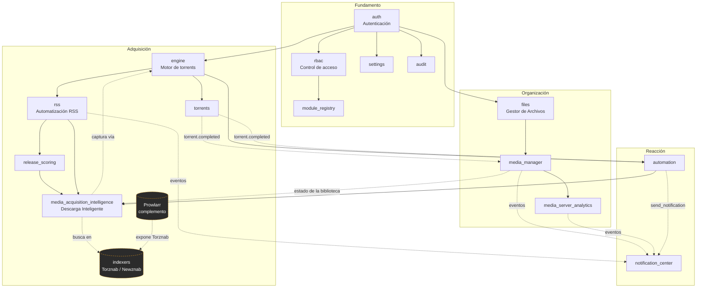

# Módulos

UltraTorrent no es un monolito con una página de configuración pegada por encima. **Cada funcionalidad es un módulo** — un módulo NestJS autocontenido que declara un *manifiesto*: su id, su tier, los módulos de los que depende, los permisos que introduce, las rutas de API que le pertenecen, los eventos WebSocket que emite y las tareas programadas que ejecuta.

Al arrancar, el **registro de módulos** carga cada manifiesto, lo valida, resuelve el grafo de dependencias y decide qué está activo. Esta página es el mapa: para qué sirve cada módulo, cómo encajan entre sí y qué página leer después.

## Por qué funciona así

Un registro de módulos te da cuatro cosas que importan en un producto autoalojado:

- **Puedes apagar cosas.** ¿No quieres gestión de bibliotecas? Desactiva el Gestor de Medios y su UI, sus rutas y sus tareas se callan. Nada más se rompe, porque el registro sabe quién depende de quién.
- **Nada se carga a medias.** Los manifiestos se validan al arrancar — una dependencia hacia un módulo desconocido, o una dependencia circular, se rechaza con un error claro en vez de un fallo misterioso en tiempo de ejecución.
- **Los permisos se declaran, no se descubren.** Cada manifiesto lista los permisos que introduce; el registro los sincroniza con el catálogo de permisos para que RBAC pueda asignarlos desde el día uno.
- **Agregar una funcionalidad es aditivo.** Un módulo nuevo es un manifiesto nuevo más un controlador protegido — mira [Crear módulos](/develop/creating-modules).

:::info Un solo tier, sin muro de pago
En UltraTorrent **no hay licencias, ediciones, claves de producto ni funcionalidades bloqueadas**. Cada módulo viene en el único producto community. `core` y `community` tratan sobre *si puedes apagar un módulo*, no sobre lo que pagaste. El acceso se gobierna **únicamente** por [permisos RBAC](/reference/permissions).
:::

## Tiers

| Tier | Significado |
|------|---------|
| `core` | Siempre disponible, **no se puede desactivar**. El sistema no sería coherente sin él — auth, RBAC, motor, torrents, RSS, archivos, configuración, auditoría, Analíticas del Servidor de Medios, Centro de Notificaciones. |
| `community` | Módulos opcionales incluidos, **activos por defecto pero conmutables** por un administrador — Gestor de Medios, Puntuación de Lanzamientos, Inteligencia de Adquisición de Medios. |

## Estado del módulo

Para cada módulo el registro calcula un estado:

| Estado | Significado | Qué hacer |
|-------|---------|-----------|
| `enabled` | Dependencias satisfechas y activado. | Nada. |
| `disabled` | Permitido, pero un administrador lo apagó. | Actívalo desde **Administración → Módulos**. |
| `missing_dependency` | Quiere correr, pero algo de lo que depende está apagado. | Activa primero la dependencia. |

`enabled` requiere que **todas** las dependencias estén activadas, y se calcula como un punto fijo — así que desactivar un módulo **se propaga en cascada** a todo lo que depende de él. Desactivar RSS, por ejemplo, se lleva por delante a Puntuación de Lanzamientos y a Inteligencia de Adquisición de Medios, porque ambos declaran RSS como dependencia dura.

Dos reglas te protegen de romper la instalación:

- **Los módulos core no se pueden desactivar.**
- **Un módulo solo se puede desactivar si ningún módulo activo depende de él.**

Cada activación/desactivación se registra como un evento de módulo **y** como una entrada en el registro de auditoría.

## Cómo se relacionan los módulos

Las flechas sólidas son **dependencias declaradas en el manifiesto** (el registro las hace cumplir). Las flechas punteadas son **colaboraciones en tiempo de ejecución** — un módulo usando los datos o los eventos de otro sin una dependencia dura. Las cajas punteadas son subsistemas que no son módulos del registro: **Indexadores** está protegido por RBAC pero no tiene manifiesto, y **Prowlarr** es un contenedor externo opcional.

Lee el grafo como una historia:

1. **auth / rbac** deciden quién eres y qué puedes hacer. Nada más corre sin ellos.
2. **engine** habla con tu cliente de torrents; **torrents** es la UI y el ciclo de vida encima de él.
3. **rss** vigila las fuentes; **release_scoring** califica lo que encuentra; **media_acquisition_intelligence** (Descarga Inteligente) decide si un lanzamiento calificado realmente vale la pena adquirirlo, y le pide al motor que lo capture.
4. **files** le da a cada funcionalidad que toca rutas un sandbox seguro; **media_manager** organiza las descargas terminadas en bibliotecas; **media_server_analytics** reporta lo que la gente de verdad ve.
5. **automation** y **notification_center** son la capa reactiva — todos los demás módulos emiten eventos hacia ellos.

## Los módulos

### Descargar

| Módulo | Tier | Qué hace |
|--------|------|--------------|
| [Torrents](/modules/torrents) | core | La lista de torrents, la vista de detalle, las acciones de ciclo de vida y las operaciones en masa. |
| [Motores](/modules/engines) | core | La abstracción del cliente de torrents — conecta, verifica la salud y sincroniza tu motor. |
| [Indexadores](/modules/indexers) | (subsistema) | Endpoints de búsqueda Torznab/Newznab, y el puente que convierte un episodio faltante en una descarga. |
| [Prowlarr](/modules/prowlarr) | (complemento) | Gestor de indexadores externo opcional, corriendo como complemento de Compose. |

### Adquirir

| Módulo | Tier | Qué hace |
|--------|------|--------------|
| [Automatización RSS](/modules/rss) | core | Fuentes, reglas, candidatos de coincidencia ordenados y conciencia del estado de emisión de las series. |
| [Descarga Inteligente](/modules/smart-download) | community | El motor de decisiones de adquisición explicable: qué capturar, cuándo, cuál lanzamiento y si conviene mejorar. |
| [Episodios Faltantes](/modules/missing-episodes) | community | Compara el catálogo de episodios de IMDb contra tu biblioteca para encontrar los huecos. |

### Organizar

| Módulo | Tier | Qué hace |
|--------|------|--------------|
| [Gestor de Medios](/modules/media-manager) | community | Escanea, identifica, enriquece, renombra y organiza tus bibliotecas de medios. |
| [Inteligencia de Subtítulos](/modules/subtitle-intelligence) | core | Encuentra, califica, valida, instala y sincroniza el mejor subtítulo para cada título. |
| [Analíticas del Servidor de Medios](/modules/media-server-analytics) | core | Monitoreo de Plex/Jellyfin/Emby/Kodi, historial de reproducción, informes y boletines. |
| [Gestor de Archivos](/modules/files) | core | Navegación segura por rutas, operaciones de archivos, papelera y el asistente de limpieza. |

### Reaccionar

| Módulo | Tier | Qué hace |
|--------|------|--------------|
| [Automatización](/modules/automation) | core | El motor de reglas disparador → condición → acción. |
| [Centro de Notificaciones](/modules/notification-center) | core | Mensajería basada en proveedores: reglas, plantillas, destinatarios, canales, cola de envío. |

### Administrar

| Módulo | Tier | Qué hace |
|--------|------|--------------|
| [Usuarios y roles](/modules/users) | core | Gestión de usuarios, asignación de roles, 2FA. |
| [Claves API](/modules/api-keys) | core | Acceso programático para scripts e integraciones. |
| [Registro de Auditoría](/modules/audit) | core | El rastro de solo-anexado de cada acción sensible. |
| [Sistema](/modules/system) | core | Sondas de salud, configuración y el propio registro de módulos. |

## Administrar los módulos

Los módulos se administran en **Administración → Módulos** (`/modules`), que requiere `modules.view` para ver y `modules.manage` para cambiar.

La página lista cada módulo con su tier, estado, dependencias, permisos y salud. Los módulos core muestran su interruptor bloqueado. Un módulo community cuyos dependientes siguen activos se niega a desactivarse, y te dice cuál módulo lo está reteniendo.

La superficie de API equivalente:

| Método | Ruta | Permiso |
|--------|------|-----------|
| GET | `/api/modules` | `modules.view` |
| GET | `/api/modules/enabled` | autenticado (esto es lo que alimenta la navegación del cliente) |
| GET | `/api/modules/:id` | `modules.view` |
| GET | `/api/modules/:id/manifest` | `modules.view` |
| GET | `/api/modules/:id/health` | `modules.view` |
| POST | `/api/modules/:id/enable` | `modules.manage` |
| POST | `/api/modules/:id/disable` | `modules.manage` |

:::tip Mira este tutorial
_Video próximamente._
:::

## Ejemplos del mundo real

### Una caja de descargas mínima

Quieres un cliente de torrents sin cabeza con una buena UI web y nada más. Deja los módulos core en paz (de todos modos son obligatorios), y **desactiva** el Gestor de Medios, la Puntuación de Lanzamientos y la Inteligencia de Adquisición de Medios en **Administración → Módulos**. Los grupos de navegación de Medios, Puntuación de Lanzamientos y Adquisición de Medios desaparecen, sus rutas dan 404 para quienes no son administradores, sus tareas programadas dejan de correr, y la app se vuelve notablemente más tranquila.

### Una tubería de medios completa

Quieres que RSS encuentre episodios, que Descarga Inteligente escoja el mejor lanzamiento y omita lo que ya tienes, que el Gestor de Medios archive el resultado en una biblioteca con forma de Plex, y que el Centro de Notificaciones te avise por Telegram cuando aterrice. Eso es: `rss` + `release_scoring` + `media_acquisition_intelligence` + `media_manager` + `notification_center`, todos activados (lo predeterminado). Empieza en [Inicio rápido](/learn/quick-start), y luego recorre [RSS](/modules/rss) → [Descarga Inteligente](/modules/smart-download) → [Gestor de Medios](/modules/media-manager).

## Solución de problemas

| Síntoma | Causa | Solución |
|---------|-------|-----|
| Una entrada de navegación desapareció tras una actualización | El módulo está desactivado, o perdiste el permiso que lo protege. | Revisa su estado en **Administración → Módulos**, y luego revisa tu rol en **Administración → Usuarios → Roles**. Activar un módulo *nunca* es autorización — mira [RBAC](/develop/rbac). |
| "Cannot disable: module X depends on it" | Otro módulo **activo** declara a este como dependencia dura. | Desactiva primero el módulo dependiente, o deja este encendido. |
| Un módulo muestra `missing_dependency` | Algo de lo que depende está desactivado. | Activa la dependencia; el estado se recalcula como un punto fijo. |
| El backend se niega a arrancar con un error de manifiesto | Un manifiesto referencia un id de módulo desconocido, o se introdujo un ciclo. | Esto es un error a nivel de código, no de configuración. Mira [Crear módulos](/develop/creating-modules). |
| Un administrador todavía puede abrir la página de un módulo desactivado | Deliberado — los usuarios con `modules.manage` conservan el acceso para poder reactivarlo. | Nada que arreglar. |

## Buenas prácticas

- **Desactiva lo que no uses.** Cada módulo activo te cuesta tareas programadas, tráfico WebSocket y superficie de ataque.
- **Otorga permisos, no roles al tanteo.** Lee [Permisos](/reference/permissions) una vez y construye los roles deliberadamente.
- **Trata el registro de auditoría como el récord.** Cada activación/desactivación se audita; úsalo cuando algo cambie y nadie recuerde por qué.
- **Activa un módulo a la vez** cuando estés configurando por primera vez, y verifica cada uno antes de seguir.

## Errores comunes

- **Asumir que una entrada de navegación oculta significa que la ruta está protegida.** No lo significa. La navegación es una capa de conveniencia; el guard RBAC del backend es el punto donde se hace cumplir.
- **Desactivar `rss` para "calmar las cosas"** — se propaga en cascada a Puntuación de Lanzamientos y a Descarga Inteligente, que casi nunca es lo que querías. Desactiva el módulo hoja en su lugar.
- **Esperar que los datos de un módulo desactivado se borren.** Desactivar detiene las rutas y las tareas; no elimina tablas. Al reactivarlo, retoma donde lo dejaste.

## Preguntas frecuentes

**¿Hay un tier de pago o una clave de licencia?**
No. Cada módulo está en el producto community. El registro consulta una capa de disponibilidad que siempre responde "sí" — existe para que el código tenga un solo lugar donde hacer la pregunta, no para bloquear nada.

**¿Desactivar un módulo borra sus datos?**
No. Detiene las rutas, las tareas y la UI del módulo. Las filas de la base de datos se quedan.

**¿Por qué no puedo desactivar un módulo core?**
Porque el resto del sistema lo da por sentado. Auth, RBAC, el motor y el registro de auditoría no son opcionales en ninguna configuración coherente.

**¿Cómo agrego mi propio módulo?**
Construye el módulo NestJS, agrega un manifiesto, protege el controlador y agrega la entrada de navegación. El recorrido completo está en [Crear módulos](/develop/creating-modules).

**¿Dónde veo exactamente qué permisos introduce un módulo?**
En su manifiesto, expuesto en `GET /api/modules/:id/manifest` y renderizado en la página de [Referencia de módulos](/reference/modules).

## Lista de verificación

- [ ] Abre **Administración → Módulos**. Esperado: cada módulo listado con una insignia de tier y un estado.
- [ ] Confirma que los módulos core muestran un interruptor bloqueado. Esperado: ningún control para desactivar.
- [ ] Desactiva un módulo community (p. ej. Puntuación de Lanzamientos). Esperado: su entrada de navegación desaparece para quienes no son administradores, y se escribe una fila de auditoría.
- [ ] Intenta desactivar `rss` mientras Descarga Inteligente está activa. Esperado: rechazado, nombrando el módulo dependiente.
- [ ] Reactiva el módulo que desactivaste. Esperado: la entrada de navegación vuelve, sin pérdida de datos.

## Ver también

- [Conceptos básicos](/learn/concepts) — el vocabulario usado en cada página de módulo.
- [Referencia de módulos](/reference/modules) — la tabla de manifiestos autogenerada.
- [Referencia de permisos](/reference/permissions) — cada cadena de permiso.
- [Crear módulos](/develop/creating-modules) — construye el tuyo.
- [Glosario](/help/glossary)
