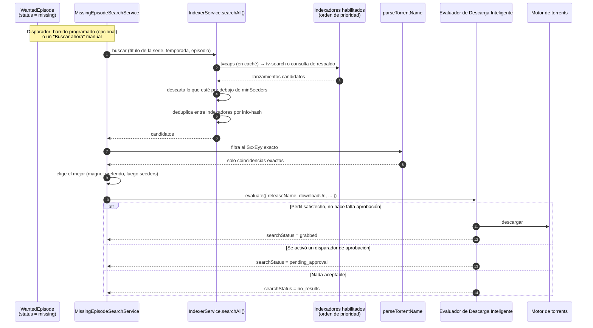

# Indexadores

## Resumen

Un **indexador** es un endpoint de búsqueda. Le preguntas "¿tienes `Severance S02E05` en 1080p?" y te responde con una lista de lanzamientos. Eso es algo fundamentalmente distinto a una [fuente RSS](/modules/rss), que solo te dice lo que un tracker publicó recientemente.

Los indexadores son lo que le permite a UltraTorrent **ir a buscar** algo. En concreto, son el puente que convierte *"[Episodios Faltantes](/modules/missing-episodes) dice que no tengo el S02E05"* en *"el S02E05 se está descargando"*:

```
Episodios Faltantes  →  buscar en los indexadores  →  evaluar los candidatos  →  descargar
    (detección)               (esta página)          (Descarga Inteligente)      (motor)
```

UltraTorrent habla **Torznab** y **Newznab** — los dos protocolos de búsqueda estándar. Cualquier cosa que exponga uno de esos endpoints funciona: [Prowlarr](/modules/prowlarr), Jackett, o un tracker que lo soporte de forma nativa.

:::info Indexadores es un subsistema, no un módulo del registro
A diferencia de la mayoría de las funciones de este sitio, Indexadores **no tiene manifiesto de módulo** — no lo vas a encontrar en **Administración → Módulos** y no lo puedes activar ni desactivar. Siempre está presente, y el acceso se rige puramente por los permisos RBAC `indexers.*`.
:::

## Por qué / cuándo usarlo

Agrega indexadores cuando quieras que UltraTorrent sea **proactivo** en vez de reactivo:

- **Llenar huecos en una serie.** Episodios Faltantes encuentra los huecos; solo un indexador puede ir a buscarlos.
- **Ponerte al día con un catálogo viejo.** RSS nunca te va a mostrar un episodio de 2019. Un indexador sí.
- **Cubrir más trackers de los que tienes fuentes.** Una sola instancia de Prowlarr puede exponer decenas de trackers como endpoints Torznab.

Si lo único que quieres son lanzamientos nuevos según aparecen, con RSS te basta. En el momento en que te importe algo que *ya existe*, necesitas un indexador.

## Requisitos previos

- **Un endpoint Torznab o Newznab.** La forma más fácil de conseguir uno — a menudo varias decenas — es el contenedor acompañante [Prowlarr](/modules/prowlarr) que viene incluido.
- **La clave API de ese endpoint.**
- Un [motor](/modules/engines) funcionando — una búsqueda que encuentra un lanzamiento igual necesita algo que lo descargue.
- Permisos: `indexers.view` para ver, `indexers.manage` para agregar/editar/eliminar, `indexers.test` para probar y ejecutar una búsqueda.
- Para la adquisición automática: el módulo **Media Acquisition Intelligence** habilitado, más una [lista de seguimiento](/modules/missing-episodes) de Episodios Faltantes con contenido.

## Conceptos

**Torznab / Newznab** — los protocolos de búsqueda. Newznab viene de Usenet; Torznab es su hermano con sabor a torrent. Ambos son APIs de consulta HTTP con un parámetro `apikey` y respuestas en XML.

**Capacidades (`t=caps`)** — antes de buscar, UltraTorrent le pregunta al indexador qué puede hacer: qué categorías maneja, si soporta `tv-search`, y sus límites de resultados. La respuesta se guarda en caché. Si un indexador **no** anuncia `tv-search`, el cliente recurre a una consulta simple `t=search&q="Show SxxEyy"`.

**Prioridad** — un número, **el más bajo se intenta primero**. También desempata durante la deduplicación entre indexadores.

**`minSeeders`** — un piso. Un lanzamiento candidato con menos seeders se descarta. **Este es el campo más importante de esta página** — mira la advertencia más abajo.

**`searchStatus`** — el estado de la búsqueda de un episodio deseado: `idle → searching → grabbed | pending_approval | no_results | failed`. Se preserva entre reescaneos, así que un episodio ya obtenido nunca se vuelve a buscar.

**El barrido** — la tarea programada en segundo plano que busca los episodios faltantes. Es **opcional y está apagada por defecto**.

## Cómo funciona



Hay dos cosas que vale la pena notar aquí.

Primero, el candidato ganador se le entrega **al mismo evaluador que usan RSS y las capturas manuales**. No existe una "lógica de calidad aparte para episodios faltantes" — tu perfil de adquisición la gobierna exactamente igual que gobierna todo lo demás. Una búsqueda que encuentre un lanzamiento pésimo se va a negar a descargarlo, y hace bien.

Segundo, el estado de captura se escribe de vuelta en el `WantedEpisode` y **sobrevive a los reescaneos**, igual que tus anulaciones `ignored`. Eso es lo que evita que el barrido vuelva a capturar el mismo episodio cada hora. El estado se limpia automáticamente en cuanto el episodio aparece como tuyo en la biblioteca.

## Configuración

### Campos del indexador

| Campo | Qué hace | Predeterminado | Recomendado |
|-------|--------------|---------|-------------|
| **Nombre** | Nombre visible. | — | Ponle el nombre del tracker, no el del proxy. |
| **Tipo** | `torznab` o `newznab`. | — | `torznab` para torrents. |
| **URL base** | La base de la API. Se le agrega `/api` si falta. | — | Para Prowlarr, copia la URL Torznab de cada indexador desde la lista de indexadores de Prowlarr. |
| **Clave API** | **Cifrada en reposo con AES-256-GCM**, nunca la devuelve la API. | — | Para Prowlarr, esta es la propia clave API de Prowlarr (**Settings → General → Security → API Key**). |
| **Habilitado** | Si la búsqueda en paralelo lo incluye. | Activado | Deshabilita un indexador inestable en vez de eliminarlo. |
| **Prioridad** | El más bajo se intenta primero; también es el desempate de la deduplicación. | — | Pon tus mejores trackers privados de primero. |
| **Categorías** | Categorías Newznab a consultar. | `5000,5030,5040` (TV) | Deja el valor por defecto para TV. Agrega categorías de películas si monitoreas películas. |
| **`minSeeders`** | Descarta candidatos por debajo de este número de seeders. | **sin definir** | **Defínelo. Siempre. Empieza en `3`.** |
| **Capacidades** | Negociación `t=caps` en caché. | Automático | Vuelve a correr **Probar** si cambian las capacidades del indexador. |

:::danger Define `minSeeders` en cada indexador
El filtro de seeders por indexador **solo aplica cuando la columna está definida**. Déjala sin definir y los lanzamientos con cero seeders pasan derechito.

Esto no es teórico. En una instalación real, dos de cuatro indexadores no tenían `minSeeders`, el barrido de episodios faltantes se comió un catálogo viejo entero, y el cliente terminó cargando **1,137 torrents moviendo 0 bytes** — 1,114 de ellos con cero seeders. Un magnet con cero seeders nunca puede obtener sus metadatos, pero el motor lo cuenta como una *descarga activa* todo el tiempo que lo intenta, así que 100 slots activos quedaron ocupados permanentemente por torrents que nunca podían terminar, y 1,034 torrents saludables quedaron encolados detrás de ellos para siempre.

Define `minSeeders`. Además, habilita la [cola de estacionamiento](/modules/torrents) como segunda línea de defensa.
:::

### Manejo de la clave API

La clave API se enmascara como `••••••••` en cada lectura. **Enviar la máscara de vuelta en una actualización conserva la clave existente** — así que puedes editar el nombre de un indexador sin volver a escribir su clave. La clave se inyecta en el parámetro de consulta `apikey=` y la URL completa **nunca se registra en los logs**.

### El barrido de adquisición automática (clave de ajustes `media_acquisition.settings`)

| Clave | Qué hace | Predeterminado | Recomendado |
|-----|--------------|---------|-------------|
| `autoSearchMissing` | Habilita el barrido programado. | **`false`** | Actívalo una vez que tu biblioteca esté bien identificada y tus indexadores tengan un piso de `minSeeders`. No antes. |
| `searchIntervalMinutes` | Espera antes de volver a buscar cada episodio. Un episodio no se vuelve a buscar hasta que pase este tiempo. | `60` | `60`–`360`. Buscar un episodio que no existe cada minuto no ayuda a nadie. |
| `maxSearchesPerSweep` | Episodios buscados por cada tick del barrido. | `50` | `50`. Bájalo si estás machacando tus indexadores. |
| `missingSearchProfileId` | El perfil de adquisición usado para las capturas. Si no, usa el perfil del propio elemento de la lista de seguimiento. | `null` | Apúntalo a un perfil deliberadamente conservador. |

Configura esto en **RSS y Adquisición → Inteligencia de Adquisición → Configuración** ("Descargar episodios faltantes automáticamente").

### Búsqueda manual

Una búsqueda manual corre siempre que el módulo esté habilitado, **sin importar `autoSearchMissing`**. Eso la hace la forma segura de probar el pipeline antes de encender el barrido.

- `POST /api/media-acquisition/missing-episodes/:id/search` — un episodio.
- `POST /api/media-acquisition/missing-episodes/series/:watchlistItemId/search` — una serie completa.

Ambas necesitan `media_acquisition.evaluate`.

### Endpoints y permisos

| Método | Ruta | Permiso |
|--------|------|-----------|
| GET | `/api/indexers` | `indexers.view` |
| GET | `/api/indexers/:id` | `indexers.view` |
| POST | `/api/indexers` | `indexers.manage` |
| PATCH | `/api/indexers/:id` | `indexers.manage` |
| DELETE | `/api/indexers/:id` | `indexers.manage` |
| POST | `/api/indexers/:id/test` | `indexers.test` |
| GET | `/api/indexers/:id/search?q=&season=&ep=` | `indexers.test` |

## Guía paso a paso

**1. Consigue un endpoint Torznab.** El camino de menor resistencia es [Prowlarr](/modules/prowlarr): levanta el contenedor acompañante, agrega tus trackers ahí, y copia la URL Torznab de cada uno.

**2. Agrega el indexador.** **Descargas → Indexadores → Agregar indexador**. Pega la URL base y la clave API. **Define `minSeeders` en 3 como mínimo.** Pon una prioridad.

**3. Pruébalo.** El botón **Probar** ejecuta `t=caps`. Un resultado verde significa que el endpoint respondió y que UltraTorrent ya conoce sus categorías y capacidades. Uno rojo te dice qué falló.

**4. Busca manualmente, desde el indexador.** Usa `GET /api/indexers/:id/search?q=...` (o la búsqueda de la UI) para confirmar que el indexador de verdad devuelve resultados para una serie que sabes que tiene. Arregla esto antes de seguir — un indexador que aquí no devuelve nada nunca va a llenar un hueco.

**5. Llena un hueco a mano.** Ve a **Episodios Faltantes**, busca un episodio `missing`, y haz clic en **Buscar ahora**. Observa cómo se mueve la insignia de `searchStatus`. Debería aterrizar en `grabbed` (descargado automáticamente), `pending_approval` (enviado a la cola de aprobación), o `no_results`.

**6. Solo ahora, enciende el barrido.** Una vez que el paso 5 funcione de forma confiable, habilita `autoSearchMissing`. Vuelve en una hora y mira lo que capturó — y los conteos de seeders de esas capturas.

## Capturas de pantalla


:::tip Mira este tutorial
_Video próximamente._
:::

## Ejemplos del mundo real

### Recuperar una temporada que nunca tuviste

Tienes las temporadas 2–4 de una serie y quieres la 1. RSS no sirve de nada aquí — ninguna fuente va a republicar una temporada de hace cinco años. Agrega la serie a la lista de seguimiento de [Episodios Faltantes](/modules/missing-episodes), escanéala, y los episodios de la temporada 1 aparecen como `missing`. Dale a **Buscar todos** en la serie. Se consulta a los indexadores episodio por episodio, el evaluador aplica tu perfil, y lo que pase se descarga en la carpeta de biblioteca que ya existe para esa serie.

### Evitar que el barrido capture basura

Encendiste `autoSearchMissing` y amaneciste con cuarenta torrents estancados. Diagnostícalo en este orden: **(1)** ¿Todos tus indexadores tienen `minSeeders`? Casi seguro que no — esa es la causa. Defínelo. **(2)** Habilita la [cola de estacionamiento](/modules/torrents) para que las capturas muertas no puedan ocupar slots de descarga. **(3)** Sube `searchIntervalMinutes` para no estar buscando los mismos episodios inexistentes cada hora. **(4)** Apunta `missingSearchProfileId` a un perfil de adquisición más estricto, con un `minimumScore` más alto.

## Solución de problemas

| Síntoma | Causa | Solución |
|---------|-------|-----|
| El cliente se llena de torrents con 0 seeders que nunca arrancan | Un indexador no tiene `minSeeders`, así que los lanzamientos muertos pasan el filtro. Un magnet con 0 seeders ocupa un slot de descarga activa para siempre mientras caza metadatos que nunca va a encontrar. | Define `minSeeders` en **todos** los indexadores. Habilita la [cola de estacionamiento](/modules/torrents). |
| Una captura desde un Prowlarr autoalojado no hace nada, en silencio | La URL del `.torrent` resuelve a una IP privada de Docker/LAN, y la protección SSRF bloquea la descarga: *"Torrent URL resolves to a blocked internal address"*. La **prueba de conexión de Prowlarr sigue pasando** — el chequeo de salud confía en los hosts privados, pero la descarga del torrent es una protección aparte y más estricta. | Agrega el host a `SSRF_ALLOW_HOSTS`. El stack incluido usa `prowlarr` por defecto; mantenlo en la lista cuando agregues otros (`SSRF_ALLOW_HOSTS=prowlarr,indexer.lan`). |
| La prueba falla con "blocked by Cloudflare Protection" | El tracker está detrás del desafío anti-bots de Cloudflare. | Ejecuta el contenedor acompañante **FlareSolverr** y etiqueta el indexador en Prowlarr. Mira [Prowlarr](/modules/prowlarr). |
| La búsqueda devuelve resultados, pero nunca se captura nada | El evaluador está haciendo su trabajo. O el lanzamiento no llega al `minimumScore` de tu perfil de adquisición, o ya lo tienes en calidad igual o mejor, o fue enviado a la cola de aprobación. | Revisa **Descarga Inteligente → Rechazadas** y **→ Cola de aprobación**. El rastro de la evaluación te dice exactamente qué paso dijo que no. |
| Un episodio nunca se encuentra, aunque el tracker claramente lo tiene | Un candidato solo coincide cuando su título de escena **se analiza al nombre de la serie**. Una serie conocida por un alias distinto al título de tu lista de seguimiento no va a coincidir — el lanzamiento se omite en vez de capturarse mal. | Renombra el elemento de la lista de seguimiento con el título de escena, o captúralo manualmente. |
| El barrido nunca corre | `autoSearchMissing` está en `false`. Ese es el valor por defecto. | Habilítalo en **Inteligencia de Adquisición → Configuración**. La búsqueda manual funciona igual. |
| Un episodio muestra `no_results` para siempre | Los indexadores genuinamente no lo tienen, o todavía no ha pasado la espera por episodio. | Revisa `searchIntervalMinutes`. Luego corre una búsqueda manual directamente en el indexador para ver los resultados crudos. |
| Las películas nunca se buscan automáticamente | La búsqueda automática es **solo para episodios** hoy por hoy. Las filas de `WantedMovie` tienen las mismas columnas de estado de captura, pero nada las barre. | Captura las películas manualmente, o vía RSS. |

## Mejores prácticas

- **`minSeeders` en cada indexador, antes de habilitar el barrido.** En esto se resume todo.
- **Compruébalo manualmente primero.** Probar → búsqueda en el indexador → una búsqueda manual de un episodio → *luego* el barrido.
- **Prioriza tus buenos trackers.** Número de prioridad más bajo = se intenta primero = gana el desempate de la deduplicación.
- **Usa un perfil conservador para el barrido.** `missingSearchProfileId` existe precisamente para que las capturas de fondo puedan ser más exigentes que las que haces tú a mano.
- **Vuelve a identificar tu biblioteca antes de confiar en la lista de huecos.** Episodios Faltantes es solo tan preciso como la identificación de tu biblioteca — mira [Episodios Faltantes](/modules/missing-episodes).
- **Habilita la cola de estacionamiento.** Cinturón y tirantes.

## Errores comunes

- **Dejar `minSeeders` en blanco** porque parecía opcional. Es opcional en el esquema y obligatorio en la práctica.
- **Agregar la URL de una fuente RSS como indexador.** Las fuentes RSS no son indexadores. Aquí solo se buscan endpoints Torznab/Newznab.
- **Encender `autoSearchMissing` el primer día**, antes de que la biblioteca esté identificada y antes de que los indexadores estén probados. Vas a capturar un montón de cosas que no querías.
- **Asumir que una prueba de conexión exitosa de Prowlarr significa que las descargas van a funcionar.** No es así. Esa es la trampa del SSRF de arriba, y es la falla más confusa del producto.
- **Esperar que los huecos de películas se llenen automáticamente.** Todavía no se llenan.

## Preguntas frecuentes

**¿Cuál es la diferencia entre un indexador y una fuente RSS?**
Una fuente RSS te **empuja** lo que un tracker publicó recientemente. Un indexador te deja **jalar** — pedirle un título, temporada y episodio específicos. RSS no puede rellenar el pasado; los indexadores sí.

**¿Necesito Prowlarr?**
No. Cualquier endpoint Torznab/Newznab funciona — Jackett, el endpoint nativo de un tracker, lo que tengas. Prowlarr es simplemente la forma más cómoda de conseguir decenas de ellos.

**¿Dónde se guarda la clave API?**
Cifrada con AES-256-GCM (`SecretCipher`), enmascarada en cada respuesta de la API, y nunca escrita en los logs — incluida la URL de la petición, que la lleva como parámetro de consulta.

**¿La búsqueda se salta mis reglas de calidad?**
No. El candidato ganador pasa por el **mismo evaluador** que cualquier otra vía de adquisición. Tu perfil de adquisición decide si se descarga, espera, se retiene para aprobación, o se omite.

**¿Va a volver a capturar un episodio que ya capturó?**
No. El `searchStatus` se escribe de vuelta en el episodio deseado y se preserva entre reescaneos. También hay una espera `lastSearchedAt` por episodio, una protección de reentrada en el barrido, deduplicación por info-hash entre indexadores, y el propio chequeo de "ya lo tienes" del evaluador.

**¿Cada cuánto corre el barrido?**
Corre en el tick del planificador de adquisición, pero la cadencia *efectiva* por episodio es `searchIntervalMinutes` (60 por defecto), y cada tick tiene un tope de `maxSearchesPerSweep` (50 por defecto).

## Lista de verificación

- [ ] Agrega un indexador con un `minSeeders` de al menos 3. Esperado: se guarda, y la clave API se muestra como `••••••••`.
- [ ] Haz clic en **Probar**. Esperado: un estado verde, y las categorías y capacidades del indexador quedan en caché.
- [ ] Corre una búsqueda en el indexador para una serie que sabes que tiene. Esperado: lanzamientos candidatos con conteos de seeders.
- [ ] Corre un **Buscar ahora** en un episodio faltante. Esperado: la insignia de `searchStatus` se mueve a `grabbed` o `pending_approval`.
- [ ] Confirma que la captura aterrizó en la carpeta de biblioteca de la serie, no en `/downloads`. Esperado: la ruta de guardado resuelve a la carpeta de la serie.
- [ ] Habilita `autoSearchMissing`, espera un intervalo, e inspecciona las capturas. Esperado: cada captura tiene un conteo de seeders saludable.
- [ ] Verifica que la [cola de estacionamiento](/modules/torrents) esté habilitada. Esperado: ningún torrent muerto puede ocupar un slot.

## Mira también

- [Episodios Faltantes](/modules/missing-episodes) — la mitad de detección de este pipeline.
- [Descarga Inteligente](/modules/smart-download) — el evaluador que decide sobre cada candidato.
- [Prowlarr](/modules/prowlarr) — el gestor de indexadores acompañante, y la trampa del SSRF.
- [Torrents](/modules/torrents) — la cola de estacionamiento.
- [Automatización RSS](/modules/rss) — la mitad de empuje de la adquisición.
- [Seguridad](/operate/security)
