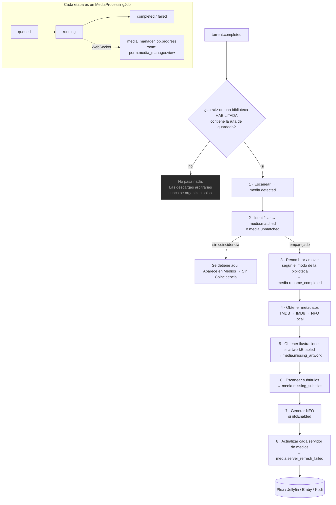

import Tabs from '@theme/Tabs';
import TabItem from '@theme/TabItem';

# Gestor de Medios

## Resumen

Un torrent completado es una carpeta con un nombre como `Show.Name.S02E05.2160p.WEB-DL.DDP5.1.HDR.H265-GROUP`. Un servidor de medios quiere `Show Name/Season 02/Show Name - S02E05 - Episode Title.mkv`, con un póster, una sinopsis y subtítulos.

El **Gestor de Medios** es la máquina que convierte lo primero en lo segundo.

Escanea tus carpetas, identifica qué es realmente cada archivo, lo enriquece con metadatos e ilustraciones, busca subtítulos, genera archivos NFO adyacentes y renombra o enlaza (hardlink) los archivos dentro de una biblioteca con forma de servidor de medios — y luego le dice a Plex, Jellyfin, Emby o Kodi que se actualice.

Es un módulo `community` (id `media_manager`, permisos `media_manager.*`) que depende de `auth` y de [`files`](/modules/files). Se puede deshabilitar si no lo quieres.

## Por qué / cuándo usarlo

- **Tu servidor de medios no ve tus descargas.** El naming de la scene no es el naming de Plex. El Gestor de Medios cierra esa brecha.
- **Estás compartiendo (seeding) y no puedes mover archivos.** El hardlink (lo predeterminado) pone el archivo en la biblioteca *y* deja el original en su sitio para el cliente de torrents. Una copia de los bytes, dos rutas.
- **Quieres que [Descarga Inteligente](/modules/smart-download) funcione.** Toda su lógica de "¿ya tengo esto?" lee la biblioteca del Gestor de Medios. Sin una biblioteca bien identificada, Descarga Inteligente se equivoca con total confianza.
- **Quieres que [Episodios Faltantes](/modules/missing-episodes) sea preciso.** Por la misma razón.

## Requisitos previos

- **`FILE_MANAGER_ROOTS`** debe incluir las rutas donde viven tus bibliotecas. Este es el límite duro — una biblioteca cuya ruta caiga fuera es **rechazada al momento del escaneo**. Ver [Gestor de Archivos](/modules/files).
- Un lugar donde viva la biblioteca (puede ser el mismo volumen que tus descargas — para eso existe el hardlink).
- Permisos: `media_manager.view` para mirar, más los granulares de cada acción.
- **Opcional pero transformador:** una **clave de la API de TMDB** (ajuste `media.tmdbApiKey`, o `TMDB_API_KEY`). Sin ella, los metadatos caen de vuelta a leer solamente archivos `.nfo` locales.

## Conceptos

**Biblioteca** (`MediaLibrary`) — una carpeta en disco más las reglas para organizar lo que hay en ella: su tipo, su preset de nombrado y su modo de renombrado.

**Elemento** (`MediaItem`) — un *título* identificado. Un elemento de TV es una serie; un elemento de película es una película.

**Archivo** (`MediaFile`) — un archivo físico, con sus atributos técnicos analizados (contenedor, códecs, resolución, HDR, idioma, grupo de lanzamiento).

**Identificación** — analizar el nombre de un lanzamiento para sacar tipo / título / año / temporada / episodio, con un puntaje de **confianza**. Cuando el nombre del archivo por sí solo omite el título — el caso común en bibliotecas ordenadas donde el nombre de la serie vive en la carpeta (`Show/Season 01/S01E01.mkv`) — la identificación **sube hasta la primera carpeta padre con significado**, saltándose contenedores genéricos como `Season N` / `Specials`, para recuperarlo.

**Estado de emparejamiento** — `unmatched` (no se pudo resolver con confianza), `matched` (identificado automáticamente) o `manual` (lo emparejó una persona). **Un emparejamiento `manual` nunca se sobrescribe automáticamente.**

**Modo de renombrado** — lo que realmente le pasa al archivo. Este es el ajuste de mayor consecuencia del módulo:

| Modo | Efecto | ¿Seguro para seedear? |
|------|--------|--------------|
| `preview` | Simulación. Construye el plan, no toca nada. | Sí |
| `hardlink` | **Predeterminado.** Enlace fijo dentro de la biblioteca, el original se queda. Una copia de los bytes. | **Sí** |
| `symlink` | Enlace simbólico dentro de la biblioteca, el original se queda. | Sí |
| `copy` | Copia a la biblioteca, el original se queda. Dos copias de los bytes. | Sí |
| `rename_in_place` | Renombra el original **en el lugar**. | **No** |
| `rename_move` | **Mueve** el original al destino. | **No** |

**Preset** — un conjunto de plantillas de nombrado predeterminadas con la forma que quiere cada servidor de medios: `plex`, `jellyfin`, `emby`, `kodi` o `custom`.

## Cómo funciona



Vale la pena interiorizar tres propiedades de este pipeline:

1. **Es opt-in y está acotado.** El flujo posterior a la descarga se dispara **solo** para bibliotecas habilitadas cuya `path` raíz *contiene* la ruta de guardado del torrent. Si descargas algo a una carpeta que ninguna biblioteca cubre, no le pasa nada. Esto es deliberado — las descargas arbitrarias nunca se organizan solas.
2. **Cada etapa está aislada.** Un fallo en una etapa nunca aborta las demás, y el handler nunca lanza excepciones — no puede tumbar el bucle de sincronización de torrents.
3. **Todo lo que tarda es un trabajo en segundo plano.** Escaneos, identificación, metadatos, ilustraciones, subtítulos, renombrado y NFO corren todos por una cola en proceso que persiste cada unidad como un `MediaProcessingJob` y transmite el progreso por WebSocket. Por eso el escaneo de una biblioteca de 24,000 archivos no agota el tiempo de la petición HTTP.

## Configuración

### Biblioteca

| Campo | Qué hace | Predeterminado | Recomendado |
|-------|--------------|---------|-------------|
| **Nombre** | Nombre para mostrar. | — | — |
| **Tipo** | `tv`, `anime`, `movie`, `music`, `audiobook` o `general`. | `tv` | **Acierta con esto.** El tipo de la biblioteca es *autoritativo* para decidir película vs. TV. Una serie de TV en una biblioteca `movie` se identificará como película. |
| **Ruta** | La carpeta raíz a escanear. Debe estar dentro de `FILE_MANAGER_ROOTS`. | — | Usa el selector de directorios; no puede seleccionar una ruta fuera de la raíz. |
| **Preset** | `plex`, `jellyfin`, `emby`, `kodi`, `custom`. | `plex` | Que coincida con tu servidor de medios. |
| **Plantilla** | Una plantilla de renombrado por biblioteca, que anula el preset. | Sin definir | Déjala sin definir a menos que tengas una razón. Lee la advertencia sobre plantillas más abajo. |
| **Modo** | El modo de renombrado (tabla de arriba). | `hardlink` | **`hardlink`.** Pone el archivo en la biblioteca mientras deja el original para que el cliente de torrents lo siga compartiendo. |
| **Habilitado** | Si la biblioteca participa en los escaneos y en el flujo posterior a la descarga. | Activado | — |
| **Intervalo de escaneo (minutos)** | Re-escaneo periódico opcional, que autopobla metadatos e ilustraciones para carpetas nuevas. Nunca renombra ni mueve archivos. | Sin definir | Actívalo si agregas archivos fuera de UltraTorrent. |
| **NFO habilitado** | Genera archivos NFO adyacentes durante el flujo. | **Desactivado** | Actívalo si tu servidor de medios prefiere metadatos locales. |
| **Ilustraciones habilitadas** | Obtiene ilustraciones durante el flujo. | **Activado** | Actívalo. |

:::danger Los hardlinks necesitan un solo sistema de archivos
Un hardlink no puede cruzar el límite de un sistema de archivos. Si `/downloads` y `/media` son volúmenes distintos, el hardlink **fallará** y terminarás copiando (dos copias de los bytes) o moviendo (rompiendo tu seed). Móntalos como un solo volumen — este es el error más común de todos en un stack de medios con Docker.
:::

### Plantillas de renombrado

Los tokens **distinguen mayúsculas y minúsculas** y usan la sintaxis `{Token}`. Los tokens numéricos aceptan relleno con ceros como `{Token:00}`. `{Token?…}` renderiza su literal interno solo cuando el token está presente.

| Token | Valor |
|-------|-------|
| `{Movie Title}` | Título de la película |
| `{Series Title}` | Título de la serie |
| `{Episode Title}` | Título del episodio |
| `{year}` | Año de estreno |
| `{season}` / `{episode}` / `{episodeEnd}` | Números, p. ej. `{season:00}` |
| `{Resolution}` | `1080p`, `2160p`, … |
| `{Source}` | `BluRay`, `WEB-DL`, … |
| `{Codec}` | Códec de video |
| `{Release Group}` | Grupo de lanzamiento |
| `{ext}` | Extensión del archivo |

<Tabs>
<TabItem value="tv" label="TV (preset Plex)" default>

```
{Series Title}/Season {season}/{Series Title} - S{season:00}E{episode:00}{episodeEnd? - E{episodeEnd:00}} - {Episode Title}.{ext}
```

</TabItem>
<TabItem value="movie" label="Película (preset Plex)">

```
{Movie Title} ({year})/{Movie Title} ({year}) - {Resolution}.{ext}
```

</TabItem>
</Tabs>

Cada segmento de la ruta se sanea (el traversal se neutraliza), y `Season 00` se reescribe como `Specials`.

:::warning Una plantilla corrupta antes podía destruir nombres de archivo
Una biblioteca cuya plantilla quedó truncada a un solo `{` renderizaba el destino de **todos** los episodios al literal `{` — un token sin cerrar no es un token legal, y `{` no es un carácter ilegal en un nombre de archivo, así que sobrevivió al saneamiento. Todos los episodios de una carpeta se renombraron al mismo nombre, sobrescribiendo al anterior: en un host real, **284 archivos llamados `{`, ~111 GB, nombres originales irrecuperables**.

Esto está arreglado. Una ruta renderizada ahora solo es utilizable para un video principal si no está vacía, **no** contiene `{` ni `}` sin resolver, y su nombre base termina en la extensión propia del archivo. Un archivo que no pase esa verificación se **omite** con `reason: 'invalid naming template'` y una advertencia, nunca se mueve.

Aun así: **previsualiza un cambio de plantilla antes de aplicarlo.** El modo `preview` existe exactamente para esto.
:::

### Proveedores de metadatos

| Proveedor | Necesita | Notas |
|----------|-------|-------|
| **`local`** | Nada | Lee un archivo `.nfo` adyacente al medio. Siempre disponible, sin conexión. |
| **`tmdb`** | Una clave de API | The Movie Database v3. El bueno. |
| **`imdb`** | Tu propio conjunto de datos, o una API licenciada | Ver más abajo. |

La clave de TMDB se resuelve en tiempo de ejecución: primero el ajuste **`media.tmdbApiKey`**, luego la variable de entorno **`TMDB_API_KEY`**. Si no hay ninguna, el proveedor **degrada silenciosamente** al proveedor local sin conexión — los metadatos siguen funcionando desde los archivos NFO, pero no obtienes nada nuevo.

### Integración con IMDb

:::info Nada de scraping. Jamás.
UltraTorrent **no** hace scraping de las páginas web de IMDb. El soporte de IMDb usa **conjuntos de datos de IMDb provistos por ti** (los archivos oficiales no comerciales `.tsv.gz`) o **acceso licenciado a la API de IMDb** que tengas derecho a usar. Ninguno de los dos hace falta para correr UltraTorrent — sin configuración de IMDb, el proveedor queda deshabilitado y nada más se ve afectado.
:::

Modos (**Medios → Configuración → IMDb**, ajuste `media.imdb.mode`):

| Modo | Comportamiento |
|------|-----------|
| `disabled` | Apagado. **Predeterminado.** |
| `dataset` | Sirve solo desde las tablas de tu conjunto de datos importado — totalmente sin conexión. |
| `official_api` | Consulta solo la API REST licenciada de IMDb que configuraste. |
| `hybrid` | Prefiere el conjunto de datos; recurre a la API licenciada. |

**Importación del conjunto de datos**, que es de lo que depende [Episodios Faltantes](/modules/missing-episodes):

1. **Consigue los conjuntos de datos.** Descarga los siete archivos `.tsv.gz` de la página oficial de datasets de IMDb, sujeto a los términos de IMDb: `title.basics`, `title.akas`, `title.crew`, `title.episode`, `title.principals`, `title.ratings`, `name.basics`.
2. **Colócalos dentro de tu ruta raíz.** Deben vivir **dentro de uno de tus `FILE_MANAGER_ROOTS`**. Una ruta fuera es rechazada.
3. **Valida.** El servidor verifica que cada archivo exista, esté dentro de la raíz y sea un gzip/TSV legible con la cabecera esperada. El progreso se transmite por WebSocket.
4. **Importa.** Un trabajo desacoplado y reanudable transmite cada TSV comprimido fila por fila hacia las tablas de IMDb. El endpoint responde de inmediato; el trabajo sigue en segundo plano con progreso en vivo.

**Debes habilitar "Import TV series & episodes"** si quieres que [Episodios Faltantes](/modules/missing-episodes) funcione siquiera. Una importación solo de películas deja el catálogo de episodios vacío.

| Ajuste de IMDb | Predeterminado |
|--------------|---------|
| `mode` | `disabled` |
| `apiBaseUrl` / `apiKey` | `null` (la clave se cifra con AES-GCM y se redacta) |
| `datasetPath` | `null` |
| `preferredRegion` / `preferredLanguage` | `null` |
| `includeAdult` | `false` |
| `minVotes` | `0` |
| `cacheTtl` | `3600` s |

### Integraciones con servidores de medios

El Gestor de Medios envía actualizaciones de biblioteca a **Plex**, **Jellyfin**, **Emby** y **Kodi**, bajo `/api/media/server-integrations` (todo protegido por `media_manager.manage_integrations`).

Las claves de configuración secretas (`token`, `apiKey`, `password`) se **cifran en reposo con AES-GCM** y se **redactan a `••••••••`** en cada respuesta. Al actualizar, un marcador compuesto solo de caracteres `•` significa "conserva el secreto existente".

### Permisos

| Permiso | Otorga |
|-----------|--------|
| `media_manager.view` | Paneles, bibliotecas, elementos, ilustraciones, subtítulos, duplicados, presets, historial. |
| `media_manager.manage_libraries` | Crear / actualizar / eliminar bibliotecas. |
| `media_manager.scan` | Disparar un escaneo de biblioteca. |
| `media_manager.match` | Emparejar / desemparejar / volver a identificar elementos. |
| `media_manager.edit_metadata` | Editar elementos; obtener y editar metadatos. |
| `media_manager.manage_artwork` | Seleccionar y subir ilustraciones. |
| `media_manager.manage_subtitles` | Escanear subtítulos. |
| `media_manager.rename` | **Ejecutar** un plan de renombrado. |
| `media_manager.generate_nfo` | Generar archivos NFO. |
| `media_manager.manage_integrations` | Administrar / probar / actualizar integraciones con servidores de medios. |
| `media_manager.imdb.*` | `view`, `configure`, `import_dataset`, `search`, `match`. |

`move_files`, `delete` y `admin` están declarados en el catálogo pero **reservados** — todavía ningún endpoint los exige.

## Recorrido paso a paso

**1. Acierta primero con la distribución de volúmenes.** Descargas y medios deben estar en **un solo sistema de archivos** para que los hardlinks funcionen. En Docker, monta un solo volumen (p. ej. `/data`) con `/data/torrents` y `/data/media` dentro, y pon `FILE_MANAGER_ROOTS=/data`.

**2. Configura una clave de TMDB.** **Medios → Configuración**. Todo lo que viene después mejora con ella.

**3. Crea una biblioteca.** **Medios → Bibliotecas → Nueva**. Tipo = `tv`. Ruta = tu carpeta de TV (usa el selector). Preset = `plex`. Modo = `hardlink`. Ilustraciones activadas.

**4. Escanéala.** El escaneo corre como un **trabajo en segundo plano** con una barra de progreso en vivo y un registro de acciones por archivo. En una biblioteca grande esto toma un rato — eso es lo esperado, y la petición HTTP no va a expirar.

**5. Limpia el montón de elementos sin coincidencia.** **Medios → Sin Coincidencia**. Para cada elemento, o vuelves a correr la identificación automática (`match` con cuerpo vacío), o lo emparejas manualmente. Usa **reidentificar todo** para reintentar todos los fallos de una vez — los emparejamientos `manual` nunca se sobrescriben.

**6. Previsualiza un renombrado antes de aplicar uno.** **Medios → Motor de Renombrado**. Mira el plan. Confirma que los destinos son los que esperas. *Después* aplícalo.

**7. Conecta tu servidor de medios.** **Medios → Configuración → Integraciones con servidores de medios**. Agrega Plex/Jellyfin/Emby/Kodi, dale a **Probar**, y confirma que se pone en verde.

**8. Deja correr el pipeline.** De ahora en adelante, un torrent completado cuya ruta de guardado esté dentro de la raíz de la biblioteca se escanea, se identifica, se enlaza con hardlink en su sitio, se enriquece y se empuja a tu servidor de medios — automáticamente.

## Capturas de pantalla


:::tip Mira este tutorial
_Video próximamente._
:::

## Ejemplos del mundo real

### Compartir y servir el mismo archivo

Estás en un tracker privado y tienes que seedear por semanas. También quieres que Plex vea el archivo *ahora*, con el nombre correcto. Pon el modo de la biblioteca en **`hardlink`**. El cliente de torrents sigue compartiendo `/data/torrents/Show.S02E05.../file.mkv`; Plex lee `/data/media/tv/Show/Season 02/Show - S02E05 - Title.mkv`. **Una sola copia de los bytes en disco.** Ambas rutas apuntan al mismo inodo. Cuando eventualmente dejes de seedear y borres la copia del torrent, el enlace de la biblioteca sobrevive.

### Rescatar una biblioteca que el renombrador nunca tocó

Tienes miles de archivos en carpetas con nombres de la scene que una herramienta anterior nunca organizó. Crea la biblioteca sobre ellos, pon el modo en `hardlink` (o `rename_in_place` si no los estás seedeando y quieres ordenarlos en el lugar) y escanea. El escáner organiza los archivos in-place en una estructura `Show/Season` — con una salvaguarda que mantiene el movimiento **dentro de la propia carpeta de la serie**, así que nunca puede lanzar un archivo al otro lado de tu biblioteca. Después vuelve a identificar para completar los números de temporada/episodio, y deja que se resuelva el enlace con IMDb.

### Encontrar y eliminar duplicados

**Medios → Duplicados** agrupa los elementos por motivo: `title_year`, `show_season_episode`, `external_id`, `file_hash` o `similar_filename`. Ese último atrapa el caso en el que tienes el mismo episodio de dos grupos de lanzamiento distintos con dos calidades. Revisa los grupos, conserva la mejor copia y elimina la otra — a través del [Gestor de Archivos](/modules/files), que hace un borrado suave a la Papelera en vez de destruir nada.

## Resolución de problemas

| Síntoma | Causa | Solución |
|---------|-------|-----|
| Un escaneo de biblioteca se rechaza antes de empezar | La `path` de la biblioteca cae **fuera** de `FILE_MANAGER_ROOTS`. Este es un límite duro de seguridad, verificado al momento del escaneo. | Mueve la biblioteca dentro de una raíz configurada, o agrega la raíz a `FILE_MANAGER_ROOTS`. |
| El hardlink falla / los archivos se están copiando | `/downloads` y `/media` están en **sistemas de archivos distintos**. Un hardlink no puede cruzar uno. | Móntalos como un solo volumen. Este es el error clásico del stack de medios con Docker. |
| El escaneo de una biblioteca grande devuelve 504 Gateway Time-out | Históricamente, el escaneo era **síncrono** — la petición HTTP esperaba el escaneo completo, y una biblioteca de ~24k archivos se pasaba del `proxy_read_timeout` del gateway. (El escaneo en sí sí terminaba del lado del servidor.) Arreglado: ahora los escaneos son trabajos en segundo plano desacoplados que devuelven un `jobId` de inmediato, con progreso en vivo por WebSocket. | Actualiza. |
| Todos los archivos de una carpeta colapsaron en un solo archivo llamado `{` | Una plantilla de nombrado corrupta/truncada. Lee la advertencia sobre plantillas más arriba. **Arreglado** — una ruta renderizada con llaves sin resolver ahora se omite, nunca se aplica. | Actualiza. Repara la plantilla. Los nombres originales no son recuperables. |
| Una serie se fragmenta en una "serie" por episodio | Históricamente, un archivo episódico cuyo nombre no llevaba título producía un elemento separado por episodio. Arreglado: la identificación sube hasta la **carpeta de la serie** para archivos episódicos. | Actualiza, luego reidentifica en masa. |
| Una serie de TV se identifica como **película** | Históricamente, el tipo de medio se inferría por archivo. Arreglado: el **`kind` de la biblioteca ahora es autoritativo** para película vs. TV, y `(Year)` se elimina de los títulos de episodio. | Ajusta el tipo de la biblioteca correctamente, luego vuelve a identificar. |
| `Hijack.2023.S02E03` sale con el título estropeado | Un año a secas *antes* del marcador de episodio es el **año de la serie**, no parte del título. Arreglado. | Actualiza. |
| Un título con un acrónimo (`M.I.A.`) se analiza mal | La normalización de separadores solía convertir los puntos propios del título en espacios. Arreglado: los patrones repetidos de letra-más-punto sobreviven. | Actualiza. |
| Los metadatos nunca se poblan | No hay clave de TMDB. El proveedor degrada silenciosamente a leer archivos NFO locales — y si no hay ninguno, no obtienes nada. | Configura `media.tmdbApiKey` o `TMDB_API_KEY`. |
| La importación del conjunto de datos de IMDb falla la validación | Falta un archivo, no está bajo `FILE_MANAGER_ROOTS`, o es un gzip truncado/renombrado. | Confirma que los siete archivos `.tsv.gz` estén presentes, dentro de la raíz e íntegros. Vuelve a descargarlos si están truncados. |
| Una operación intensiva de IMDb se cuelga por minutos | Históricamente, las búsquedas en IMDb eran escaneos completos de tabla — 47.8 s por llamada, y un escaneo de películas podía atascarse indefinidamente. Arreglado con índices GIN de trigramas, que ahora se construyen **concurrentemente en tiempo de ejecución** sin tiempo fuera de servicio. | Actualiza, y deja que la construcción del índice termine en el primer arranque. |
| Una actualización del servidor de medios falla | URL mala, token malo, o el servidor no es alcanzable. Los fallos se auditan **sin** secretos. | Dale a **Probar** en la integración. Revisa el registro de auditoría buscando `media.integration.test_failed`. |
| No pasa nada después de que un torrent completa | La ruta de guardado del torrent **no está dentro** de la raíz de una biblioteca habilitada. Esto es por diseño — las descargas arbitrarias nunca se organizan solas. | Pon la ruta de guardado en la regla RSS / el elemento de la lista de seguimiento a una carpeta dentro de la biblioteca. |

## Buenas prácticas

- **Un solo sistema de archivos para descargas y medios.** Todo lo demás se deriva de esto.
- **Modo `hardlink`, siempre,** a menos que tengas una razón específica para no hacerlo. Es no destructivo y seguro para seedear.
- **Previsualiza antes de aplicar.** Sobre todo después de cambiar una plantilla.
- **Acierta con el `kind` de la biblioteca.** Es autoritativo para la identificación.
- **Vuelve a identificar después de cualquier arreglo de identificación.** Las mejoras son reales, pero solo aplican a los elementos que vuelvas a correr.
- **Importa el conjunto de datos de IMDb con TV habilitado** si quieres detección de huecos.
- **Nunca dependas de `rename_move` mientras seedeas.** Vas a romper todos los torrents de esa carpeta.

## Errores comunes

- **Volúmenes separados para descargas y medios.** Los hardlinks degradan en silencio, y duplicas tu uso de disco — o mueves el archivo y rompes tu seed.
- **Poner el modo en `rename_move` porque "suena más ordenado"**, mientras el cliente de torrents sigue compartiendo el original.
- **Saltarte la clave de TMDB** y luego preguntarte por qué todos los elementos no tienen póster ni sinopsis.
- **Una importación de IMDb solo de películas** seguida de confusión sobre por qué [Episodios Faltantes](/modules/missing-episodes) está vacío.
- **Editar una plantilla a mano y aplicarla sin previsualizar.**
- **Esperar que un elemento sin coincidencia se organice.** La identificación es una compuerta: los elementos sin coincidencia se detienen en el paso 2 y no avanzan más.

## Preguntas frecuentes

**¿El Gestor de Medios mueve mis archivos?**
Solo si se lo dices. El modo predeterminado es **`hardlink`**, que es no destructivo — el original se queda exactamente donde el cliente de torrents lo puso. Solo `rename_in_place` y `rename_move` reubican el original.

**¿Organizar va a romper mi seeding?**
No en los modos `hardlink`, `symlink`, `copy` ni `preview`. Sí en `rename_in_place` y `rename_move`.

**¿Necesito TMDB?**
No, pero sin él los metadatos vienen solamente de archivos `.nfo` locales. Con él, obtienes títulos, sinopsis, pósters, calificaciones y reparto.

**¿Hace scraping de IMDb?**
**No.** Lee los conjuntos de datos oficiales descargables de IMDb que *tú* provees, o una API REST licenciada de IMDb que *tú* configuras. Ninguno de los dos es obligatorio.

**¿Por qué no le pasó nada a mi descarga completada?**
El flujo posterior a la descarga se dispara **solo** cuando la ruta de guardado del torrent está dentro de la raíz de una biblioteca **habilitada**. Eso es deliberado: las descargas arbitrarias nunca se organizan solas.

**¿A dónde van los secretos?**
Los tokens de servidores de medios, la clave de la API de IMDb y las contraseñas de integración se cifran en reposo con AES-GCM, se redactan de las respuestas y nunca se registran en los logs.

**¿Puedo deshacer un renombrado?**
Hay un **historial** de renombrados (`GET /api/media/history`), pero no hay deshacer de un clic. Previsualiza primero. Para eso está la vista previa.

## Lista de verificación

- [ ] Confirma que descargas y medios comparten un solo sistema de archivos. Esperado: `stat` muestra el mismo device id para ambos.
- [ ] Configura una clave de TMDB. Esperado: los elementos recién obtenidos traen póster y sinopsis.
- [ ] Crea una biblioteca dentro de `FILE_MANAGER_ROOTS` con modo `hardlink`. Esperado: se guarda; el selector de directorios nunca ofrece una ruta fuera de la raíz.
- [ ] Escanéala. Esperado: un trabajo en segundo plano con barra de progreso en vivo; sin 504.
- [ ] Revisa **Medios → Sin Coincidencia**. Esperado: casi vacío después de reidentificar en masa.
- [ ] Previsualiza un renombrado. Esperado: destinos razonables, sin `{` ni `}` en ninguna ruta.
- [ ] Aplícalo, luego revisa el uso de disco. Esperado: **sin cambios** — los hardlinks no duplican bytes.
- [ ] Confirma que el torrent sigue compartiendo. Esperado: sí.
- [ ] Prueba una integración con un servidor de medios. Esperado: verde, y una actualización manual hace que el elemento nuevo aparezca en Plex/Jellyfin.
- [ ] Completa un torrent dentro de la raíz de la biblioteca. Esperado: el pipeline completo corre automáticamente, transmitido por WebSocket.

## Ver también

- [Gestor de Archivos](/modules/files) — el límite de la raíz, la seguridad de rutas y el asistente de limpieza.
- [Episodios Faltantes](/modules/missing-episodes) — lo que desbloquea el conjunto de datos de IMDb.
- [Descarga Inteligente](/modules/smart-download) — que lee esta biblioteca para decidir qué ya tienes.
- [Analíticas del Servidor de Medios](/modules/media-server-analytics) — que reutiliza las mismas conexiones de servidor.
- [Automatización](/modules/automation) — disparadores y acciones `media.*`.
- [Centro de Notificaciones](/modules/notification-center) — que te avisa cuando un escaneo o renombrado de biblioteca termina.
- [Seguridad](/operate/security)
