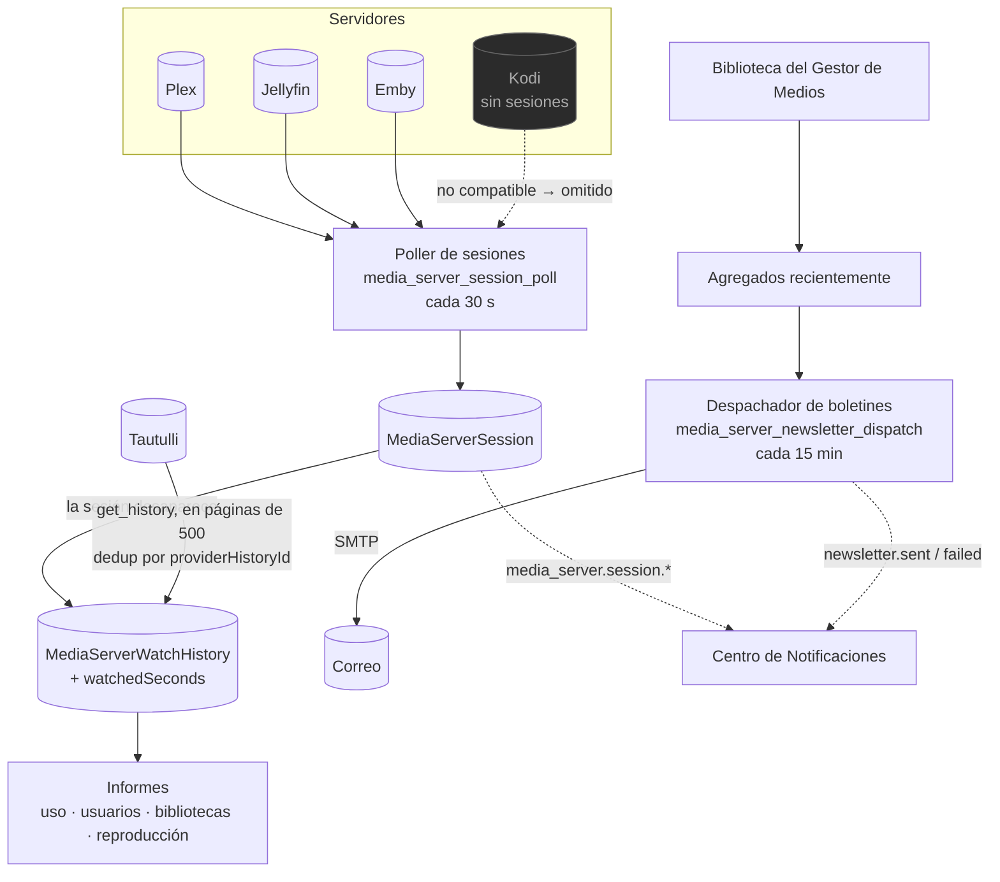

# Analíticas del Servidor de Medios

## Resumen

Tienes un servidor de medios. La gente ve cosas en él. **Analíticas del Servidor de Medios** convierte eso en información: quién está viendo qué ahora mismo, qué vieron el mes pasado, cuáles bibliotecas realmente se usan y cuál de tus archivos 4K cuidadosamente curados nunca ha abierto nadie.

También envía **boletines** — un resumen por correo, programado, de lo que se ha agregado recientemente — y puede **importar tus analíticas históricas desde Tautulli**, para que cambiarte no signifique perder años de historial.

Es un módulo **core** (id `media_server_analytics`, permisos `media_server_analytics.*`).

:::info Extiende al Gestor de Medios, no lo duplica
Las conexiones, los secretos cifrados y la capa de proveedores Plex/Jellyfin/Emby/Kodi se **reutilizan del [Gestor de Medios](/modules/media-manager)**. Por eso `media_manager` es una dependencia dura: el mismo servidor que le dijiste al Gestor de Medios que actualizara es el servidor del que este módulo lee estadísticas.
:::

## Por qué / cuándo usarlo

- **Compartes tu servidor.** Quieres saber quién está transmitiendo, desde dónde, en qué, y si está transcodificando (lo que te cuesta CPU).
- **Quieres podar.** Los informes de uso te dicen qué contenido no ve nadie.
- **Quieres decirle a la gente lo que hay de nuevo.** El boletín lo hace de forma programada, con pósters.
- **Estás migrando desde Tautulli** y no quieres tirar tu historial a la basura.

## Requisitos previos

- Un servidor de medios: **Plex**, **Jellyfin**, **Emby** o **Kodi**.
- Su URL y un token de autenticación (Plex: `X-Plex-Token`; Jellyfin/Emby: `X-Emby-Token`; Kodi: JSON-RPC, opcionalmente con autenticación básica).
- El módulo `media_manager` habilitado (una dependencia dura).
- Para los boletines: **ajustes de SMTP** configurados (**Configuración → Ajustes de correo**, requiere `media_server_analytics.manage_settings`).
- Para la importación desde Tautulli: un Tautulli corriendo y su clave de API.

## Conceptos

**Conexión** — un servidor de medios. Puedes tener conexiones **ilimitadas**, incluyendo varias del mismo tipo ("Plex Home" + "Plex Remote"). Cada una guarda un nombre, tipo, URL base, token cifrado, banderas de habilitado/predeterminado, estado de salud, versión, plataforma, capacidades y notas.

**Capacidad** — lo que un proveedor dado realmente puede hacer. Cada uno declara su propio conjunto: `libraries`, `recentlyAdded`, `sessions`, `watchHistory`, `refresh`.

| Proveedor | Autenticación | Notas |
|----------|------|-------|
| Plex | `X-Plex-Token` | Conjunto de capacidades completo. |
| Jellyfin | `X-Emby-Token` | Conjunto de capacidades completo. |
| Emby | `X-Emby-Token` | Conjunto de capacidades completo. |
| **Kodi** | JSON-RPC (autenticación básica opcional) | **Es un cliente, no un servidor.** Sin lista de secciones, sin sesiones. Declara esas capacidades en `false`. |

:::tip No compatible no es lo mismo que roto
Una capacidad que un proveedor genuinamente no puede servir devuelve un **resultado tipado y limpio** (`{ supported: false }`), no un fallo genérico. Las analíticas degradan con gracia por servidor — una conexión de Kodi simplemente no aporta sesiones en vivo, en vez de romper la página de Actividad en Vivo.
:::

**Sesión** — un stream reproduciéndose ahora. Lo captura un poller y se reconcilia en filas de `MediaServerSession`.

**Historial de reproducción** — una reproducción completada. Cuando una sesión **desaparece**, se escribe en `MediaServerWatchHistory` con los segundos vistos. Esta es la fuente de historial nativa del servidor de medios; la importación desde Tautulli es la otra.

**Boletín** — una campaña de correo programada con los medios agregados recientemente, renderizada como un "resumen de medios" oscuro y adaptable.

**Importación de analíticas** — Tautulli, detrás de una abstracción aparte, `MediaAnalyticsImportProvider`. **Tautulli no es un servidor de medios** — es una fuente de analíticas históricas, y así está modelado.

## Cómo funciona

El **poller de sesiones** corre cada **30 segundos**, pero solo cuando el módulo está habilitado *y* existen conexiones. Obtiene las sesiones que se reproducen ahora de cada servidor (Plex `/status/sessions`, Jellyfin/Emby `/Sessions`; Kodi no es compatible y se omite) y las reconcilia. Cuando una sesión desaparece, esa es la señal de que la reproducción terminó — y la fila se escribe en el historial de reproducción.

## Configuración

### Conexión

| Campo | Qué hace | Recomendado |
|-------|--------------|-------------|
| **Nombre** | Nombre para mostrar. | Distingue varios servidores del mismo tipo. |
| **Tipo** | `plex`, `jellyfin`, `emby`, `kodi`. | — |
| **URL base** | Cómo el backend lo alcanza. | Dentro de Docker, usa el nombre del servicio — **no `localhost`**. |
| **Token / credenciales** | **Cifrados en reposo con AES-256-GCM**, redactados en cada respuesta. | — |
| **Habilitado** | Si se consulta con el poller. | — |
| **Predeterminado** | La conexión predeterminada (se usa para el nombre del servidor en el boletín, entre otras cosas). | Define una. |

Dale a **Probar** en una conexión para sondearla y persistir su salud: estado, versión, plataforma y capacidades.

### Boletines

El boletín es un correo original de "resumen de medios" oscuro, construido con tablas y estilos en línea (para amplia compatibilidad con clientes de correo), con un contenedor de 720 px y un acento ámbar.

- **Secciones por tipo de contenido.** Los elementos agregados recientemente se dividen en una sección por grupo: TV/anime/episodio → *Series de TV*, película → *Películas*, música/video musical/concierto → *Música y Conciertos*, documental → *Documentales*, otro → *Agregados Recientemente*. Los grupos vacíos se omiten.
- **Los grupos episódicos colapsan en tarjetas de serie.** Los episodios se agrupan por serie, y el resumen dice "N Series / M Episodios" — nunca una lista plana por episodio. Esta es la diferencia entre un resumen legible y un muro de 200 filas.
- **Alcance.** Un boletín se puede acotar a un subconjunto de tipos de contenido, así un boletín de "Series de TV" solo contiene series agrupadas.
- **Vista previa + envío de prueba.** Ambos existen. Se renderizan datos de muestra en la vista previa cuando la biblioteca no tiene elementos nuevos, y hay un interruptor de vista previa de escritorio/móvil.
- **Localizado** (`en-US` + `es-PR`), con una alternativa de texto plano siempre generada.

**El hospedaje de pósters lo elige el administrador** (**Configuración → Imágenes de pósters del boletín**). Los pósters siempre se reducen primero a un JPEG de ~240 px, y luego se entregan según el modo elegido:

| Modo | Cómo | Compensación |
|------|-----|-----------|
| **Incrustar** (`attach`) | Un **adjunto en línea por CID**. **Predeterminado.** | Autocontenido, sin descarga remota, funciona en todas partes. Gmail los lista en la tira de adjuntos. |
| **Servir desde esta instancia** (`self_hosted`) | Una **URL de imagen pública, firmada y con vencimiento**, protegida por un token HMAC-SHA256 sobre `(artworkId, expiry)`. Solo sirve una ilustración reducida **por id** — nunca una ruta arbitraria. | Sin adjuntos. **Requiere que tu instancia sea alcanzable** en la URL base pública configurada. |
| **Host externo** (`external`) | Sube el póster reducido a Imgur (el client id se guarda cifrado) y lo enlaza. | Sin adjuntos; funciona incluso si tu instancia es privada. |

Cualquier modo con configuración faltante **degrada silenciosamente a `attach`**, así que un envío nunca produce imágenes rotas. Un póster faltante degrada a un marcador de posición con gradiente e inicial — el diseño nunca se rompe.

### Importación desde Tautulli

1. **Agrega una fuente** — URL de Tautulli + clave de API (cifrada en reposo, redactada; solo se devuelve `hasApiKey`).
2. **Probar** — comprueba que la clave funciona.
3. **Vista previa** — reporta el total de historial y el conteo de usuarios **sin importar nada**.
4. **Importar** — un trabajo en segundo plano transmite `get_history` en **páginas de 500**, escribiendo filas con clave única `(importSourceId, providerHistoryId)`. **Los duplicados nunca inflan las estadísticas, y volver a correrlo es seguro.** El progreso se transmite por WebSocket.
5. **Resumen** — conteos finales en la fila del trabajo.

La fase 1 importa el **historial de reproducción**. Usuarios, bibliotecas, estadísticas de reproducción/dispositivo/transcodificación, configuración e historial de boletines, mapeo y sincronización incremental quedan como seguimiento.

### Permisos

`media_server_analytics.` + `view`, `manage_connections`, `manage_mappings`, `view_live_activity`, `view_users`, `view_history`, `view_reports`, `export`, `manage_newsletters`, `send_newsletters`, `manage_imports`, `run_imports`, `manage_settings`, `admin`.

### Endpoints clave

| Método + ruta | Permiso |
|---------------|-----------|
| `GET /dashboard` | `media_server_analytics.view` |
| `GET/POST/PATCH/DELETE /connections` | `…manage_connections` |
| `POST /connections/:id/test` · `/sync` | `…manage_connections` |
| `GET /live` | `…view_live_activity` |
| `GET /watch-history` | `…view_history` |
| `GET /reports/usage` · `/users` · `/libraries` · `/playback` | `…view_reports` |
| `GET /recently-added` | `media_server_analytics.view` |
| `GET/POST /import-sources`, `POST /import-sources/:id/test` · `/preview` | `…manage_imports` |
| `POST /import-sources/:id/import` | `…run_imports` |

## Recorrido paso a paso

**1. Agrega una conexión.** **Analíticas del Servidor de Medios → Conexiones de Servidor → Agregar**. Tipo, URL base, token. Dale a **Probar** — el resultado verde te dice la versión, la plataforma y las capacidades que realmente soporta.

**2. Mira la Actividad en Vivo.** Pon algo a reproducir en el servidor. En menos de 30 segundos aparece bajo **Actividad en Vivo**, con el usuario, el dispositivo, el método de reproducción (direct play vs. transcodificación) y el bitrate.

**3. Detén la reproducción.** La sesión desaparece de Actividad en Vivo y aterriza en el **Historial de Reproducción**, con los segundos vistos.

**4. Importa tu historial de Tautulli** (si tienes uno). **Importar Analíticas → Agregar fuente** → URL + clave de API → **Probar** → **Vista previa** (esto te dice cuánto historial estás a punto de traer, sin importar nada) → **Importar**. Observa el progreso. Como deduplica por el propio id de historial de Tautulli, volver a correrlo es seguro.

**5. Lee los informes.** **Informes de Analíticas** ahora tiene datos reales — uso a lo largo del tiempo, actividad por usuario, desgloses por biblioteca y métodos de reproducción.

**6. Configura un boletín.** Configura SMTP en **Configuración → Ajustes de correo**. Luego **Boletines → Nuevo**: elige las secciones de contenido, la programación y los destinatarios. **Previsualízalo** (escritorio y móvil), envía una **prueba**, y solo entonces prográmalo. El despachador revisa cada 15 minutos.

## Capturas de pantalla

:::tip Mira este tutorial
_Video próximamente._
:::

## Ejemplos del mundo real

### Averigua quién te está derritiendo la CPU

Los ventiladores de tu servidor se oyen y no sabes por qué. Abre **Actividad en Vivo**. Dos usuarios están transmitiendo 4K HDR a dispositivos que no pueden hacer direct play, así que el servidor está transcodificando ambos — ahí está tu CPU. Ahora abre **Informes de Analíticas → Reproducción** y podrás ver si eso es habitual o algo puntual. Después conecta una regla del [Centro de Notificaciones](/modules/notification-center) sobre `transcode_detected` para enterarte *mientras* pasa, no después.

### Migrar desde Tautulli sin perder tres años de historial

Agrega Tautulli como fuente de importación. **Previsualiza** primero — te dice exactamente cuántas filas de historial y cuántos usuarios existen, sin escribir nada. Luego importa. El trabajo transmite en páginas de 500 y deduplica por el propio id de historial de Tautulli, así que no puede contar doble y volver a correrlo es seguro. Cuando termine, tus **Informes de Analíticas** cubren los tres años completos, y de ahí en adelante el poller de sesiones de 30 segundos captura el historial de forma nativa. Tautulli ya no hace falta — UltraTorrent no lo desinstala por ti, simplemente deja de ser esencial.

### Un correo semanal de "lo nuevo" que la gente sí lee

Configura SMTP. Crea un boletín acotado solo a **Series de TV** y **Películas**. Como los grupos episódicos colapsan en tarjetas de serie, una semana con 47 episodios nuevos repartidos en 6 series se renderiza como **6 tarjetas de serie** que dicen "6 Series / 47 Episodios" — no 47 filas. Previsualízalo en móvil, envíate una prueba, y entonces prográmalo. Deja el hospedaje de pósters en **Incrustar** a menos que tu instancia sea alcanzable públicamente.

## Resolución de problemas

| Síntoma | Causa | Solución |
|---------|-------|-----|
| Una conexión da verde en la prueba pero la Actividad en Vivo siempre está vacía | El proveedor no soporta sesiones. **Kodi** es un cliente, no un servidor — declara `sessions: false` y el poller lo omite. | Este es el comportamiento correcto, no un bug. Usa Plex/Jellyfin/Emby para la actividad en vivo. |
| La Actividad en Vivo está vacía para Plex/Jellyfin/Emby | Nadie está reproduciendo nada, o el token no tiene permiso para leer sesiones. | Reproduce algo y espera hasta 30 segundos. Luego vuelve a darle a **Probar** en la conexión. |
| La prueba de la conexión falla | URL base o token equivocados. Dentro de Docker, `localhost` es el contenedor del backend, no tu servidor de medios. | Usa el hostname/nombre de servicio alcanzable. Vuelve a copiar el token. |
| El historial de reproducción está vacío aunque la gente ve cosas | El historial se escribe **cuando una sesión termina**. Si el módulo estaba deshabilitado, o no existían conexiones, el poller no estaba corriendo. | Solo captura desde el momento en que se habilita. Rellena el pasado con una **importación desde Tautulli**. |
| Las imágenes del boletín salen rotas en Gmail | Elegiste `self_hosted` y tu instancia no es alcanzable en la URL base pública configurada. | Cambia el hospedaje de pósters a **Incrustar** (`attach`) — es autocontenido. De todos modos, cualquier modo mal configurado degrada silenciosamente a `attach`. |
| El boletín nunca se envía | SMTP no está configurado, o la programación aún no ha vencido. El despachador revisa cada 15 minutos. | Configura **Configuración → Ajustes de correo**, y envía una **prueba** para comprobar que SMTP funciona antes de depender de la programación. |
| El boletín es un muro de 200 filas de episodios | No debería serlo — los grupos episódicos **colapsan en tarjetas de serie** por diseño. | Confirma que estás en una versión actual. |
| Una importación desde Tautulli infló mis estadísticas | No debería — las importaciones deduplican por la clave única `(importSourceId, providerHistoryId)`, así que volver a correrlas es seguro. | Verifica que no agregaste el mismo Tautulli dos veces como **dos fuentes distintas**. |
| Un informe está vacío para un servidor pero bien para otro | Degradación consciente de capacidades. Ese servidor genuinamente no puede servir ese dato. | Revisa las capacidades guardadas de la conexión en la página de Conexiones de Servidor. |

## Buenas prácticas

- **Prueba cada conexión y lee la lista de capacidades.** Te dice de entrada qué aportará y qué no ese servidor.
- **Previsualiza una importación de Tautulli antes de correrla.** No cuesta nada y te dice exactamente qué estás a punto de traer.
- **Mantén el hospedaje de pósters del boletín en Incrustar** a menos que tu instancia sea genuinamente alcanzable de forma pública. Es el modo que no se puede romper.
- **Envía un boletín de prueba antes de programar uno.** Los fallos de SMTP son mucho más fáciles de depurar bajo demanda que en un cron.
- **Acota los boletines por tipo de contenido.** Un resumen solo de TV es mucho más legible que un resumen de todo.
- **Conecta `transcode_detected` al [Centro de Notificaciones](/modules/notification-center)** si tu servidor anda corto de CPU.

## Errores comunes

- **Esperar que Kodi reporte sesiones.** No puede. Es un cliente.
- **Usar `localhost` como URL base** desde dentro de un contenedor.
- **Asumir que el historial de reproducción es retroactivo.** Empieza cuando arranca el poller. Importa desde Tautulli para el pasado.
- **Elegir imágenes de pósters `self_hosted` en una instancia privada**, y luego preguntarte por qué toda imagen sale rota en el correo.
- **Programar un boletín antes de comprobar SMTP.**

## Preguntas frecuentes

**¿Qué servidores de medios son compatibles?**
Plex, Jellyfin, Emby y Kodi. Kodi es un cliente, así que no tiene secciones ni sesiones, y declara esas capacidades como `false`.

**¿Tautulli es un servidor de medios?**
No. Es una **fuente de importación de analíticas**, detrás de una abstracción aparte. Existe aquí para que puedas traerte tu historial contigo.

**¿Esto copia algo de código de Tautulli?**
No. No se usa código, UI, plantillas ni recursos de Tautulli. Esta es funcionalidad original que lee la API pública de Tautulli.

**¿Cada cuánto se consultan las sesiones?**
Cada **30 segundos**, y solo cuando el módulo está habilitado y existen conexiones.

**¿Dónde se guardan los tokens?**
Cifrados en reposo con AES-256-GCM, redactados de cada respuesta de la API, nunca registrados en los logs.

**¿Puedo correr varios servidores del mismo tipo?**
Sí. Las conexiones son ilimitadas, y se soportan varias del mismo tipo ("Plex Home" y "Plex Remote" lado a lado).

**¿Cómo se asegura la URL de imagen del boletín?**
El modo `self_hosted` sirve imágenes desde un controlador deliberadamente **sin protección** — los clientes de correo no pueden enviar un bearer token. En su lugar, el acceso se protege con un **token HMAC-SHA256 sobre `(artworkId, expiry)`**, y solo sirve una ilustración reducida **por id**, nunca una ruta de archivo arbitraria.

## Lista de verificación

- [ ] Agrega y **Prueba** una conexión. Esperado: verde, con la versión, la plataforma y la lista de capacidades persistidas.
- [ ] Reproduce algo en el servidor. Esperado: aparece en **Actividad en Vivo** en menos de 30 segundos, con el método de reproducción mostrado.
- [ ] Detén la reproducción. Esperado: la sesión sale de Actividad en Vivo y aparece en el **Historial de Reproducción** con `watchedSeconds`.
- [ ] Corre una **Vista previa** de Tautulli. Esperado: total de historial y conteo de usuarios, sin **nada importado**.
- [ ] Corre la importación. Esperado: progreso en vivo, y un resumen final de `processed / imported / skipped`.
- [ ] Vuelve a correr la misma importación. Esperado: todo se omite como duplicado — las estadísticas no se inflan.
- [ ] Configura SMTP y envía un boletín de **prueba**. Esperado: llega, con pósters, en ambos diseños de escritorio y móvil.
- [ ] Revisa los informes. Esperado: uso, usuarios, bibliotecas y reproducción, todos poblados.

## Ver también

- [Gestor de Medios](/modules/media-manager) — las conexiones de servidor y la capa de proveedores compartidas.
- [Centro de Notificaciones](/modules/notification-center) — enrutar eventos `media_server.*` a Telegram, correo y SMS.
- [Automatización](/modules/automation) — reaccionar a eventos del servidor de medios.
- [Resumen de módulos](/modules/) — dependencias entre módulos.
- [Perfiles de configuración](/operate/configuration-profiles)
