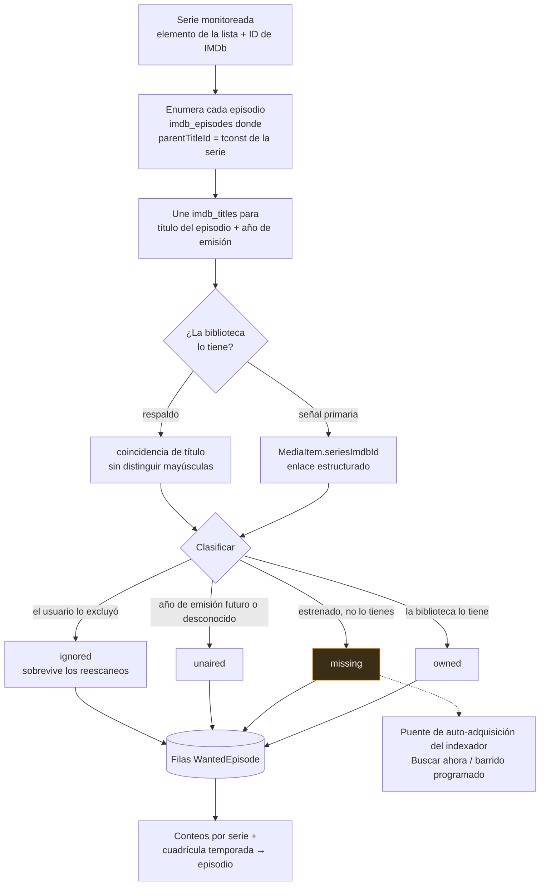

# Episodios Faltantes

## Resumen

**Episodios Faltantes** contesta una pregunta con precisión: *¿cuáles episodios de esta serie no tengo?*

La contesta **comparando** dos listas — cada episodio que IMDb dice que existe para la serie, contra cada episodio que tu biblioteca realmente contiene — y clasificando cada uno como `owned`, `missing`, `unaired` o `ignored`.

Eso te da una lista de pendientes al estilo Sonarr: un resumen por serie (en biblioteca / total / faltantes / sin estrenar / ignorados) y una cuadrícula de temporada → episodio que puedes expandir.

Es la mitad de **detección** del llenado de brechas. La otra mitad — ir a buscar esos episodios de verdad — es el puente de auto-adquisición de [Indexadores](/modules/indexers).

## Por qué / cuándo usarlo

- **Heredaste una biblioteca desordenada** y de verdad no sabes qué está completo.
- **Quieres rellenar una serie** y necesitas saber exactamente qué buscar.
- **Quieres que las brechas se llenen automáticamente.** Episodios Faltantes es el requisito previo: nada puede buscar un episodio hasta que algo haya establecido que el episodio falta.

## Requisitos previos

Dos cosas, y **ambas son requisitos duros**.

### 1. Episodios de TV en la réplica local de IMDb

El lado de "qué episodios *deberían* existir" de la comparación viene de la tabla `imdb_episodes`, que **solo se llena cuando la importación del conjunto de datos de IMDb corre con "Importar series y episodios de TV" habilitado** (`importTvShows`).

Una importación de solo películas te deja con un catálogo de episodios vacío y, por lo tanto, sin brechas, nunca. Ve [Gestor de Medios → integración con IMDb](/modules/media-manager).

### 2. Una serie monitoreada con un ID de IMDb

Una serie está monitoreada cuando está en la **lista de seguimiento** de [Descarga Inteligente](/modules/smart-download) como elemento `series` (o `season`) **con un ID de IMDb** en sus IDs externos (p. ej. `tt0903747`). Sin uno, la serie aparece como **no monitoreable** y se omite.

:::tip Usa "Agregar desde la biblioteca" — no escribas los IDs de IMDb a mano
La página de Episodios Faltantes tiene un selector **Agregar desde la biblioteca**: una selección múltiple con búsqueda de las series de TV que ya están en tus bibliotecas, con sus IDs de IMDb **resueltos automáticamente** (desde el `seriesImdbId` de cada serie, o desde el id externo `imdb` de un episodio).

Selecciona las series a monitorear y agrégalas todas de una vez. Las series que ya están en la lista de seguimiento aparecen pre-marcadas y bloqueadas. Las series sin un ID de IMDb resoluble se marcan — igual las puedes agregar, pero vuelve a identificar la biblioteca para que sean escaneables.
:::

También necesitas `media_acquisition.view` para mirar, y `media_acquisition.manage_watchlist` para escanear o ignorar.

## Conceptos

**Serie monitoreada** — un elemento `series`/`season` de la lista de seguimiento con un ID de IMDb.

**El catálogo** — `imdb_episodes` unido a `imdb_titles`. Esta es tu réplica local de lo que IMDb dice que contiene la serie. Está tan fresca como tu última importación, ni más.

**Señal de propiedad** — cómo el escaneo decide que tienes un episodio. La señal **primaria** es el enlace estructurado `MediaItem.seriesImdbId`, que se establece durante la identificación de los elementos de TV/anime. Si una biblioteca no se ha vuelto a identificar, recurre a una **coincidencia de título** que no distingue mayúsculas contra el título de la serie.

**`WantedEpisode`** — una fila por cada episodio del catálogo, que lleva su clasificación y su estado de búsqueda.

**Estados:**

| Estado | Significado |
|--------|-------------|
| `owned` | La biblioteca tiene esta temporada/episodio. |
| `missing` | Se estrenó (tiene un año de emisión pasado) y no lo tienes. |
| `unaired` | Su año de emisión está en el futuro, o se desconoce. Todavía no se puede adquirir. |
| `ignored` | Excluiste este episodio a mano. **Sobrevive los reescaneos.** |

La temporada 0 (especiales) queda fuera del cálculo de faltantes.

**`searchStatus`** — lo establece el puente de [indexadores](/modules/indexers): `idle → searching → grabbed | pending_approval | no_results | failed`. Igual que `ignored`, se preserva a través de los reescaneos, así que un episodio ya obtenido nunca se vuelve a buscar. Se limpia automáticamente en cuanto el episodio está en biblioteca.

## Cómo funciona

Los escaneos son **idempotentes**: reescanear reconstruye todo **excepto** tus anulaciones `ignored` y el estado de búsqueda.

### Autocorrección

Una serie monitoreada cuyo ID de IMDb estaba mal o faltaba solía ser un callejón sin salida. Ahora se corrige sola en buena medida:

- Una serie **sin ID de IMDb** resuelve uno desde el catálogo local por título → `tvSeries`/`tvMiniSeries`, ganando la que tenga más episodios.
- Una serie cuyo tconst guardado es en realidad un **episodio**, y no la serie, se sana de vuelta hacia la serie.
- Los títulos que solo difieren en **puntuación** o **acentos** ahora coinciden (`Pokémon` ↔ `Pokemon`), y los elementos sin año se manejan bien.

El efecto práctico fue grande: en una instalación real, las series monitoreables pasaron de **74 de 8,986** a casi todas.

## Configuración

Hay muy poco que configurar — Episodios Faltantes es en su mayoría una consecuencia de que otras cosas estén bien montadas.

| Ajuste | Dónde | Predeterminado | Notas |
|--------|-------|----------------|-------|
| **Importar series y episodios de TV** | Gestión de Medios → Configuración de IMDb (importación del conjunto de datos) | — | **Obligatorio.** Sin esto no hay catálogo de episodios. |
| **ID de IMDb del elemento de la lista** | El diálogo de agregar/editar de la lista de seguimiento, o **Agregar desde la biblioteca** | — | **Obligatorio.** Sin él, la serie no es monitoreable. |
| `autoSearchMissing` | Inteligencia de Adquisición → Configuración | `false` | Habilita el barrido de búsqueda programado. Ve [Indexadores](/modules/indexers). |
| `searchIntervalMinutes` | Inteligencia de Adquisición → Configuración | `60` | Espera entre rebúsquedas por episodio. |
| `maxSearchesPerSweep` | Inteligencia de Adquisición → Configuración | `50` | Episodios buscados por tic de barrido. |

### Endpoints

| Método | Ruta | Permiso |
|--------|------|---------|
| GET | `/api/media-acquisition/missing-episodes` | `media_acquisition.view` |
| GET | `/api/media-acquisition/missing-episodes/:watchlistItemId` | `media_acquisition.view` |
| GET | `/api/media-acquisition/missing-episodes/:id/seasons` | `media_acquisition.view` |
| POST | `/api/media-acquisition/missing-episodes/scan` | `media_acquisition.manage_watchlist` |
| POST | `/api/media-acquisition/missing-episodes/:id/ignore` · `/unignore` | `media_acquisition.manage_watchlist` |
| POST | `/api/media-acquisition/missing-episodes/:id/search` | `media_acquisition.evaluate` |
| POST | `/api/media-acquisition/missing-episodes/series/:watchlistItemId/search` | `media_acquisition.evaluate` |

`POST /scan` sin cuerpo escanea **todas** las series monitoreadas; con `{ watchlistItemId }` escanea una sola.

## Recorrido paso a paso

**1. Importa el conjunto de datos de IMDb con TV habilitado.** Gestión de Medios → Configuración de IMDb. Descarga los siete archivos `.tsv.gz`, ponlos bajo tu ruta raíz, valida e importa — con **Importar series y episodios de TV** marcado. Este es el paso que todo el mundo se salta, y es el paso que hace que todo lo demás funcione.

**2. Asegúrate de que tu biblioteca esté identificada.** Ve a **Gestión de Medios → Medios sin Coincidencia** y vacíalo. Corre una reidentificación masiva. La propiedad se calcula desde la identificación, así que una biblioteca llena de archivos sin identificar va a reportar casi todo como faltante.

**3. Agrega series a la lista de seguimiento.** Abre **Episodios Faltantes → Agregar desde la biblioteca**, marca las series que quieres monitorear, y agrégalas. Sus IDs de IMDb se resuelven automáticamente.

**4. Escanea.** Haz clic en **Escanear todo**, o en **Escanear** en una serie. Obtienes conteos por serie.

**5. Lee los resultados con ojo crítico.** Si una serie dice "38 faltantes" y estás bastante seguro de que los tienes todos, eso es un problema de identificación, no una brecha. Vuelve al paso 2.

**6. Ignora lo que no quieras.** Expande una serie y haz clic en **Ignorar** en los episodios que nunca vas a adquirir (un especial de recuento, un crossover que no te importa). Los ignorados sobreviven los reescaneos.

**7. Llena las brechas.** Haz clic en **Buscar ahora** en un episodio faltante. Si eso funciona de forma confiable, habilita `autoSearchMissing`. Ve [Indexadores](/modules/indexers) — y **configura `minSeeders` en cada indexador primero**.

## Capturas de pantalla

:::tip Ve este tutorial
_Video próximamente._
:::

## Ejemplos del mundo real

### Audita una biblioteca que heredaste

Tienes un disco de 6 TB con series de otra persona y ni idea de qué está completo. Importa el conjunto de datos de IMDb con TV habilitado, vuelve a identificar cada biblioteca, y luego **Agregar desde la biblioteca** → seleccionar todo → **Escanear todo**. En minutos tienes una lista exacta de brechas por serie. Ordena por cantidad de faltantes y sabes con precisión dónde gastar tu ancho de banda.

### Rellena una serie de principio a fin

Quieres *The Wire*, completa. Agrégala desde el selector de la biblioteca (o por ID de IMDb). Escanea. Obtienes 60 episodios, de los cuales tienes 44. Cada una de las 16 filas `missing` recibe un botón **Buscar ahora**. Haz clic en **Buscar todos** en la serie: cada episodio faltante se busca a través de tus indexadores, se filtra al `SxxEyy` exacto, y se le entrega al evaluador de [Descarga Inteligente](/modules/smart-download), que aplica tu perfil de adquisición. Lo que pasa se descarga — dentro de la carpeta de biblioteca que ya existe para la serie, no en `/downloads`.

### Ignora las cosas que nunca vas a querer

Una serie de muchos años tiene 40 episodios de clips, recuentos y especiales que no te interesan para nada. Aparecen como `missing` y distorsionan tus conteos y tus barridos. Expande la serie e **Ignóralos**. Salen del cálculo de faltantes de forma permanente — los reescaneos no los van a resucitar.

## Solución de problemas

| Síntoma | Causa | Arreglo |
|---------|-------|---------|
| Ningún episodio, para ninguna serie | La importación de IMDb corrió **solo con películas**. `imdb_episodes` está vacía, así que no hay nada contra qué comparar. | Vuelve a correr la importación con **Importar series y episodios de TV** habilitado. |
| Una serie aparece como "no monitoreable" | El elemento de la lista de seguimiento no tiene ID de IMDb. | Usa **Agregar desde la biblioteca** (que lo resuelve), o ponlo a mano. Vuelve a identificar la biblioteca si el selector tampoco lo puede resolver. |
| Todo se reporta como faltante, aunque tienes los archivos | **La propiedad depende de la calidad de la identificación.** `MediaItem.season` y `.episode` se llenan por la identificación del nombre de archivo, no por un escaneo crudo de archivos. Una biblioteca con archivos mal nombrados o sin identificar sobrerreporta faltantes. | Vuelve a identificar la biblioteca en el [Gestor de Medios](/modules/media-manager). Esta es de lejos la causa más común. |
| A una serie le faltan episodios que definitivamente se estrenaron hace poco | **La réplica va detrás de IMDb.** El catálogo está tan fresco como tu última importación, y la importación optimizada descarta los episodios sin fecha de emisión. | Revisa la fecha de la réplica que se muestra en la página. Vuelve a importar para refrescarla. |
| Una serie es permanentemente irresoluble — su título tiene acentos | Históricamente, los acentos se **eliminaban** en vez de plegarse, así que `Pokémon` nunca coincidía con `Pokemon`. Arreglado: la coincidencia ahora pliega los acentos. | Actualiza. La resolución se autocorrige. |
| Una serie sin año nunca resuelve ("90 Day Fiance") | Históricamente, la coincidencia por puntuación/acentos dependía del año del elemento, así que un elemento sin año se la saltaba por completo. Arreglado. | Actualiza. |
| Una "serie" de la lista de seguimiento es en realidad un solo episodio | Históricamente, un episodio descargado se podía meter en un elemento de lista de seguimiento tipo serie bajo su propio nombre. Arreglado. | Actualiza, y después borra la entrada falsa. |
| Todo el barrido se aborta a mitad de camino | Históricamente, una fila deseada que desaparecía a mitad del barrido lanzaba una excepción y mataba el tic. Arreglado — una fila desaparecida ya no aborta el barrido. | Actualiza. |
| Los episodios obtenidos aterrizan en `/downloads` | No se resolvió ninguna ruta de guardado. | La ruta de guardado se resuelve en este orden: la ruta de la Show Rule vinculada → una **regla RSS cuyo nombre coincida con el título de la serie** → la **carpeta de biblioteca existente** de la serie → una ruta construida `<TV library>/<Title> (Year)`. Dale al menos una de esas. |
| Las películas nunca se rellenan automáticamente | La búsqueda automática hoy es **solo para episodios**. Las *películas* faltantes sí se detectan (`WantedMovie`), pero nada las barre. | Captura las películas a mano o vía RSS. |

## Buenas prácticas

- **Vuelve a identificar antes de escanear.** Cada conteo de "faltantes" viene aguas abajo de la identificación. Arreglar la identificación es lo de mayor impacto que puedes hacer en esta página.
- **Usa "Agregar desde la biblioteca".** Te resuelve los IDs de IMDb y previene el error de configuración más común de todos.
- **Ignora sin miedo.** Los recuentos, los episodios de clips y los especiales que nunca vas a querer son ruido en los conteos y trabajo extra para el barrido.
- **Comprueba una búsqueda manual antes de habilitar el barrido.** Y configura `minSeeders` en cada indexador primero — ve [Indexadores](/modules/indexers) para saber qué pasa si no lo haces.
- **Vigila la fecha de la réplica.** Si tiene meses de vieja, tus "episodios recientes faltantes" son solo artefactos de un catálogo desactualizado.

## Errores comunes

- **Correr una importación de IMDb de solo películas** y luego preguntarte por qué Episodios Faltantes está vacío.
- **Confiar en el conteo de faltantes en una biblioteca sin identificar.** Va a estar dramáticamente mal, y va a estar mal en la dirección que te hace descargar cosas que ya tienes.
- **Escribir los IDs de IMDb a mano** cuando el selector te los resuelve.
- **Habilitar `autoSearchMissing` antes de comprobar una búsqueda manual** — y antes de configurar `minSeeders`.
- **Esperar que los episodios `unaired` se busquen.** No se puede — todavía no existen. Eso es lo que significa el estado.

## Preguntas frecuentes

**¿De dónde sale la lista de "qué debería existir"?**
De tu **réplica local de IMDb** (`imdb_episodes`), llenada por la importación del conjunto de datos de IMDb. Es totalmente offline una vez importada. UltraTorrent no hace scraping de IMDb.

**¿Por qué cree que me faltan episodios que sí tengo?**
Porque la propiedad se determina por la **identificación**, no mirando los nombres de archivo en el disco. Si el Gestor de Medios no pudo identificar un archivo, sus campos de temporada/episodio están vacíos y no se puede emparejar con un episodio del catálogo. Vuelve a identificar.

**¿Mis ignorados sobreviven un reescaneo?**
Sí. `ignored` es una anulación del usuario y se preserva. También el estado de búsqueda (`searchStatus`, `grabbedAt`, `releaseTitle`), que es por lo que un episodio ya obtenido nunca se vuelve a buscar.

**¿Los escaneos son programados?**
Escanear es manual (**Escanear** / **Escanear todo**). El barrido de *búsqueda* sí se puede programar — eso es `autoSearchMissing`, y viene apagado por defecto.

**¿Y las películas faltantes?**
Las **películas** faltantes se detectan igual (`WantedMovie`, clasificadas como `owned`/`missing`/`unaired`/`ignored`, vía el enlace de id externo de IMDb o una coincidencia de título+año), y las **temporadas** faltantes son un resumen por temporada de las brechas de episodios. Pero la **búsqueda automática es solo para episodios** hoy.

**¿Por qué no se cuenta la temporada 0?**
Los especiales quedan fuera del cálculo de faltantes a propósito — están catalogados de forma inconsistente y de otro modo dominarían cada lista de brechas.

## Lista de verificación

- [ ] Corre la importación de IMDb **con TV habilitado**. Esperado: `imdb_episodes` se llena; la página muestra una fecha de réplica.
- [ ] Vuelve a identificar tus bibliotecas de TV. Esperado: **Gestión de Medios → Medios sin Coincidencia** está vacío o casi.
- [ ] Agrega series vía **Agregar desde la biblioteca**. Esperado: los IDs de IMDb se resuelven automáticamente; ninguno queda marcado como irresoluble.
- [ ] **Escanear todo**. Esperado: conteos por serie de en biblioteca/total/faltantes/sin estrenar.
- [ ] Verifica al azar una serie que sabes que está completa. Esperado: `missing: 0`. Si no, vuelve a la identificación.
- [ ] Ignora un episodio. Esperado: el conteo de faltantes baja, y el ignorado sobrevive un reescaneo.
- [ ] **Buscar ahora** en un episodio faltante. Esperado: la insignia de `searchStatus` cambia y, si tiene éxito, el torrent aterriza en la carpeta de biblioteca de la serie.

## Ver también

- [Indexadores](/modules/indexers) — el puente de auto-adquisición que llena estas brechas.
- [Descarga Inteligente](/modules/smart-download) — la lista de seguimiento, y el evaluador por el que pasa cada candidato.
- [Gestor de Medios](/modules/media-manager) — la identificación, y la importación del conjunto de datos de IMDb.
- [Automatización RSS](/modules/rss) — adquisición mirando hacia adelante.
- [Solución de problemas](/operate/troubleshooting)
