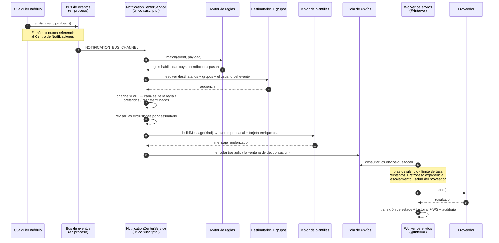

# Centro de Notificaciones

## Resumen

La mayoría de las aplicaciones tienen sus notificaciones escritas a fuego en el código. En algún lugar del fuente hay una línea que dice "cuando una descarga se complete, envía un email", y si en vez de eso quieres un mensaje de Telegram, abres un issue.

El **Centro de Notificaciones** invierte eso. Cada módulo **publica eventos en un bus de eventos en proceso**. El Centro es el único suscriptor. **Reglas configurables** — que tú controlas y puedes editar — deciden **si**, **cuándo**, **cómo** y **a quién** cada evento se convierte en una notificación.

**Nada está escrito a fuego. Cada notificación es una regla editable.**

Es un módulo **core** (id `notification_center`, permisos `notifications.*`).

## Por qué / cuándo usarlo

- **Quieres saber cuándo pasa algo** — una descarga terminó, una fuente RSS se rompió, un disco se está llenando, alguien empezó a ver algo.
- **Quieres saberlo *donde estás*** — Telegram, no un email que vas a leer el martes.
- **Quieres que *no* te avisen a las 3 a.m.** — las horas de silencio, las ventanas de deduplicación y los límites de tasa existen para que la automatización no se convierta en un bíper.
- **Quieres que a distintas personas les avisen cosas distintas** — el grupo Administrators se entera de los fallos; los Media Users se enteran del contenido nuevo.

## Requisitos previos

- Al menos un **canal** configurado: SMTP para email, Twilio para SMS/WhatsApp, o un token de bot para Telegram.
- Al menos un **destinatario**, con la dirección correcta para el canal que escogiste (una dirección de email, un número de teléfono, un chat id de Telegram).
- Permisos: `notifications.view` para mirar, más los granulares por cada superficie.

## Conceptos

**Evento** — algo que hizo un módulo. Los módulos hacen `emit()` de un sobre al bus (`NOTIFICATION_BUS_CHANNEL`) y **nunca referencian al Centro**. Ese desacoplamiento es la razón por la que agregar una notificación nunca requiere tocar el módulo que produjo el evento.

**Proveedor** — el código que habla con un servicio de mensajería. La lógica de negocio nunca toca la API de un proveedor directamente.

**Canal** — una *instancia configurada* de un proveedor. "Mi SMTP de Gmail" es un canal; "Email" es un proveedor.

**Destinatario** — una persona. Guarda nombre visible, email, teléfono, chat id de Telegram, número de WhatsApp, idioma, zona horaria, canal preferido, horas de silencio, preferencias por evento, y opcionalmente un usuario de UltraTorrent asociado.

**Grupo** — un conjunto de destinatarios con nombre. Sembrados: Administrators, Operators, Media Users, Developers, Support, Executives.

**Regla** — la decisión de enrutamiento. Cuál evento, bajo cuáles condiciones, hacia cuáles destinatarios, sobre cuáles canales, con cuál plantilla.

**Plantilla** — el cuerpo del mensaje, por canal. Soporta interpolación `{{variable}}` y bloques `{{#if}}` / `{{#unless}}`.

**Tarjeta de notificación** — un objeto enriquecido **agnóstico del proveedor** (póster, fondo, título, subtítulo, sinopsis, insignias de metadatos, calificación, géneros, duración, botones de acción, pie y marca de tiempo). Cada proveedor la renderiza **hasta el nivel de su propia capacidad** — Telegram recibe una foto con un teclado en línea; **SMS se colapsa a texto plano conciso**. La escribes una sola vez.

**Envío (delivery)** — un intento de mandar una notificación a un destinatario por un canal. Tiene un ciclo de vida completo: `queued · sending · sent · delivered · failed · cancelled · skipped · retrying · throttled`.

## Cómo funciona

### Proveedores

| Proveedor | Backend | Renderizado enriquecido |
|----------|---------|----------------|
| **Email** | SMTP (nodemailer) | Tarjeta HTML responsiva (póster, insignias, botones) + una alternativa en texto plano. |
| **SMS** | API de Mensajería de Twilio | Texto plano conciso — la tarjeta se colapsa, no se trunca. |
| **Telegram** | Bot API | Foto + descripción en Markdown + botones de teclado en línea. |
| **WhatsApp** | Twilio WhatsApp | Texto enriquecido + medios del póster. |

Agregar un proveedor (Discord, Slack, ntfy, Gotify, Pushover, un webhook genérico…) es **una clase más una entrada en el registro** — sin cambios en la lógica de negocio. Mira [Proveedores](/develop/providers).

## Configuración

### Canal

Un canal es una instancia configurada de un proveedor. Sus **credenciales se cifran en reposo con AES-256-GCM** y se **redactan en cada respuesta**. Los destinos se enmascaran en las vistas de lista.

Usa **Enviar prueba** en un canal nuevo antes de apuntarle una sola regla. Una regla que dispara hacia un canal roto simplemente falla en silencio dentro del historial de envíos.

### Regla

| Campo | Qué hace | Recomendado |
|-------|--------------|-------------|
| `event` | Cuál evento escucha esta regla. | — |
| `conditions[]` | Condiciones unidas con AND sobre el payload. Operadores: `eq`, `neq`, `gt`, `gte`, `lt`, `lte`, `contains`, `in`, `exists`, `regex`. | Úsalas. "Notifícame cuando una descarga se complete" es ruido; "…cuando una descarga **falle**" es señal. |
| `recipients{}` / `channelIds[]` | A quién, y por dónde. Las reglas también pueden dirigirse **al propio usuario del evento**. | Dirígete a un **grupo**, no a individuos — así cambiar quién está de guardia es una sola edición. |
| `templateId` | El cuerpo del mensaje. | — |
| `severity` / `priority` | Qué tan urgente. Determina el orden en la cola. | Reserva `critical` para cosas que de verdad sean críticas. |
| `quietHoursOverride` | Deja que una regla atraviese las horas de silencio. | **Solo** para emergencias genuinas. |
| `dedupeWindowSec` | Suprime duplicados de la misma notificación dentro de esta ventana. | Ponla en cualquier regla habladora. |
| `rateLimitPerHour` | Limita la regla. | Tu última línea de defensa contra una tormenta de notificaciones. |
| `retryPolicy` / `escalationPolicy` | Qué pasa cuando hay un fallo. | — |
| `schedule` | Control por horario. | — |

:::tip Ya hay 47 reglas sembradas para ti
Un **catálogo por defecto de 47 reglas** — a través de Analíticas del Servidor de Medios, Descargas, RSS, Gestor de Medios y Sistema — se **siembra una sola vez** (de forma idempotente, solo cuando no existen reglas de sistema) y es **completamente editable**. Nunca se pisa al actualizar.

No empieces de cero. Empieza habilitando las reglas sembradas que quieras y apuntándolas a tus canales.
:::

### Plantilla

Interpolación `{{variable}}` más bloques `{{#if}}` / `{{#unless}}`, con cuerpos por canal (subject, title, subtitle, html, text, markdown, sms, whatsapp, telegram), un constructor de tarjetas enriquecidas, localización, y un **endpoint de vista previa**.

Las variables disponibles incluyen `{{userDisplayName}}`, `{{mediaTitle}}`, `{{episodeTitle}}`, `{{overview}}`, `{{posterUrl}}`, `{{rating}}`, `{{serverName}}`, `{{device}}`, `{{playbackMethod}}`, `{{bitrate}}`, `{{watchUrl}}`, `{{torrentName}}`, `{{rssRule}}`, `{{errorMessage}}`, `{{eventTime}}`.

### El worker de envíos

Dos tareas en segundo plano:

- **`notification_delivery_worker`** — procesa los envíos que tocan, aplicando **prioridades, reintentos con retroceso exponencial, límite de tasa por canal, horas de silencio (con anulación por regla), una ventana de deduplicación y la salud del proveedor**.
- **`notification_provider_health`** — hace chequeos de salud a los canales y emite `notification.provider.online` / `.offline`.

### Qué publica eventos hoy

| Módulo | Eventos |
|--------|--------|
| **Analíticas del Servidor de Medios** | `user_started_watching`, `user_finished_watching`, `transcode_detected`, `newsletter_sent`, `newsletter_failed` |
| **Descargas** | `download.torrent_completed` |
| **RSS** | `rss.feed_failed`, `rss.rule_matched` |
| **Gestor de Medios** | `media.processing_completed` / `_failed`, `media.metadata_match_failed`, `media.renamed`, `media.missing_artwork`, `media.missing_subtitles`, `media.library_scan_completed` |
| **Indexadores** | `media.missing_episode_filled` |
| **Sistema** | `system.settings_changed`, `system.api_key_created`, `system.disk_space_low`, `system.cpu_high`, `system.memory_high` |
| **Auth** | `system.new_login`, `system.failed_login` |

:::caution Algunas reglas sembradas todavía no tienen quien publique
El catálogo sembrado incluye reglas para eventos que **todavía no se emiten** — `media_added`, `server_online` / `offline`, `download.torrent_added` / `_failed` / `_stalled`, `ratio_reached`, `rss.new_episode_available`, `media.duplicate`, `system.update_available`.

Sus reglas existen y son correctas. Se activarán en el momento en que esos ganchos emitan. Hasta entonces, habilitar una no tiene efecto — lo cual confunde si no sabes que hay que esperarlo.
:::

### Permisos

`notifications.` + `view`, `manage_channels`, `manage_templates`, `manage_rules`, `manage_recipients`, `manage_groups`, `view_history`, `retry`, `send_test`, `manage_preferences`, `manage_settings`, `admin`.

## Recorrido paso a paso

**1. Crea un canal.** **Automatización → Canales de Notificación → Agregar**. Para Telegram: un token de bot de BotFather. Para email: tu host SMTP, puerto, usuario y contraseña.

**2. Envía una prueba.** Haz esto **antes que nada**. `POST channels/:id/test`, o el botón. Si no llega, nada de lo que construyas encima va a funcionar tampoco.

**3. Crea un destinatario.** Dale la dirección que corresponde a tu canal — un **chat id** de Telegram, no un nombre de usuario; una dirección de email real; un número de teléfono en E.164.

**4. Ponlo en un grupo.** Agrégate a **Administrators**. Las reglas deberían dirigirse a grupos, no a personas.

**5. Habilita una regla sembrada.** Todavía no escribas una. Ve a **Reglas de Notificación**, busca *Media Server Offline* (o *Download Completed*), habilítala y apúntala a tu canal.

**6. Dispárala.** Completa una descarga. Baja el servidor de medios. Mira llegar la notificación.

**7. Ahora afina.** Ponle un `dedupeWindowSec` a cualquier regla habladora. Pon `rateLimitPerHour` como red de seguridad. Configura horas de silencio en tu registro de destinatario para que un fallo de RSS a las 3 a.m. no te despierte — y anula las horas de silencio **solo** en reglas genuinamente críticas.

**8. Revisa el historial de envíos.** Cada intento está ahí, con su estado. Uno fallido se puede **reintentar** desde la UI.

## Capturas de pantalla

:::tip Mira este tutorial
_Video próximamente._
:::

## Ejemplos del mundo real

### Tarjetas de "reproduciendo ahora" en Telegram

Agrega un canal de **Telegram** con tu token de bot. Crea un destinatario con tu **chat id** de Telegram. Habilita la regla sembrada **"User Started Watching"** (viene **deshabilitada por defecto**, a propósito) y apúntala al canal de Telegram.

Ahora, cuando alguien empieza una transmisión, recibes una tarjeta con foto: el póster, el título, el episodio, la calidad, el usuario, su dispositivo, el método de reproducción, los códecs y el bitrate — más **botones de Ver / Abrir**. La misma tarjeta, enviada a un canal de SMS, se colapsa a una línea concisa. La escribiste una sola vez.

### Que te avisen cuando el pipeline se rompe, y solo entonces

Las notificaciones útiles son los fallos. Habilita las reglas de `rss.feed_failed`, `media.processing_failed`, `media.server_refresh_failed` y `system.disk_space_low`. Apúntalas al grupo **Administrators**. Pon `severity: critical` y `quietHoursOverride: true` **solo en el espacio en disco** — un disco lleno a las 3 a.m. vale la pena para despertarse; una fuente RSS inestable no.

### Notificar desde una regla de Automatización

El módulo de [Automatización](/modules/automation) expone una acción **`send_notification`**. Sus parámetros (`channelIds`, `recipientIds`, `groupIds`, `templateId`, `variables`, `priority`, `title`, `message`) fluyen directo al Centro, que resuelve la audiencia y los canales (cayendo de vuelta al grupo Administrators y a los canales predeterminados), renderiza por canal y encola. Así que una regla de automatización puede enviar una notificación **completamente plantillada** por **cualquier** canal — no estás limitado a los eventos que los módulos se dan la casualidad de publicar.

## Solución de problemas

| Síntoma | Causa | Arreglo |
|---------|-------|-----|
| Una notificación de prueba nunca llega | Las credenciales del canal están mal, o el formato de la dirección está mal para ese proveedor. | Vuelve a correr **Enviar prueba**. Revisa el **historial de envíos** — el fallo queda registrado ahí con un error. Telegram necesita un **chat id**, no un nombre de usuario. |
| Una regla está habilitada pero nunca se dispara | El evento **todavía no tiene quien lo publique**. Varias reglas sembradas son para eventos que no se emiten. | Revisa la tabla de publicadores de arriba. Si el evento no está listado, esa regla es inerte por diseño. |
| Las notificaciones dejan de llegar de noche | **Horas de silencio** en el destinatario, funcionando exactamente como se esperaba. | Pon `quietHoursOverride: true` en las reglas que de verdad lo ameriten — y solo en esas. |
| La misma notificación llega una y otra vez | No hay `dedupeWindowSec` en una regla habladora. | Ponle uno. Considera también `rateLimitPerHour` como tope duro. |
| Una tormenta de notificaciones | Una regla coincidió con muchísimo más de lo esperado. | El límite de tasa por canal, las horas de silencio y la ventana de deduplicación del Centro existen justo para prevenir esto — pero solo si los configuras. Aprieta las `conditions[]` de la regla. |
| Un envío muestra `throttled` | Se alcanzó el límite de tasa por canal. | Este es el sistema protegiéndote. Sube el límite si de verdad es muy bajo. |
| Un canal muestra `offline` | El worker de salud del proveedor no pudo alcanzarlo. | Arregla las credenciales o el servicio. `notification.provider.online` se dispara cuando se recupera. |
| Los mensajes SMS salen truncados / ilegibles | No deberían — la tarjeta **se colapsa** a texto conciso para SMS en vez de truncarse. | Confirma que estás en una versión actual. Después simplifica el cuerpo `sms` de la plantilla. |

## Buenas prácticas

- **Envía una prueba antes de construir sobre un canal.** Todo lo que viene después asume que funciona.
- **Dirígete a grupos, no a personas.** Cambiar quién está de guardia se vuelve una edición, no veinte.
- **Notifica en los fallos, no en los éxitos.** Una notificación por cada descarga completada te está entrenando para ignorar las notificaciones.
- **Ponle una ventana de deduplicación y un límite de tasa a cada regla habladora.** Trátalos como obligatorios, no como opcionales.
- **Reserva `quietHoursOverride` para emergencias reales.** Si todo es urgente, nada lo es.
- **Empieza desde el catálogo sembrado.** Ya existen 47 reglas y son correctas. Habilita, no escribas.
- **Usa las preferencias por destinatario.** La gente puede excluirse de tipos de evento individualmente, lo cual es mucho mejor que borrar una regla que otra persona necesita.

## Errores comunes

- **Habilitar una regla para un evento que todavía nadie publica**, y después concluir que el Centro está roto.
- **Usar un nombre de usuario de Telegram en vez de un chat id.**
- **Notificar en `download.torrent_completed`** y después silenciar el canal completo una semana más tarde, porque se dispara cuarenta veces al día.
- **Anular las horas de silencio en todos lados** porque en su momento parecía cómodo.
- **Editar una regla sembrada hasta dejarla irreconocible** en vez de duplicarla. Las reglas sembradas nunca se pisan, pero igual quieres la original como referencia.

## Preguntas frecuentes

**¿Hay algo escrito a fuego?**
No. Cada notificación es una regla que puedes editar, deshabilitar, redirigir o borrar.

**¿Cómo le hablan los módulos al Centro?**
No le hablan. Hacen `emit()` de un sobre en un bus de eventos en proceso y nunca referencian al Centro para nada. El Centro es el único suscriptor. Eso es lo que hace posible agregar una notificación sin tocar el módulo que produjo el evento.

**¿Qué proveedores vienen incluidos?**
Email (SMTP), SMS (Twilio), Telegram (Bot API) y WhatsApp (Twilio). Agregar otro es una clase más una entrada en el registro.

**¿Tengo que escribir una plantilla por canal?**
No. Escribes una **tarjeta** agnóstica del proveedor, y cada proveedor la renderiza hasta el nivel de su propia capacidad. Telegram recibe una foto con botones; SMS recibe texto conciso.

**¿Están seguras las credenciales?**
Cifradas en reposo con AES-256-GCM, redactadas en cada respuesta, y nunca registradas. Los destinos se enmascaran en las vistas de lista. Los cuerpos completos de los mensajes no se registran por defecto.

**¿Puede la automatización enviar una notificación?**
Sí — la acción `send_notification` alimenta directamente al Centro con un juego completo de parámetros. Mira [Automatización](/modules/automation).

**¿Puede un destinatario excluirse?**
Sí. Los destinatarios tienen preferencias por evento, un canal preferido, horas de silencio, y un idioma y una zona horaria.

## Lista de verificación

- [ ] Crea un canal y usa **Enviar prueba**. Esperado: llega, y el historial de envíos muestra `sent`/`delivered`.
- [ ] Crea un destinatario con la dirección correcta para ese canal. Esperado: se valida y se normaliza.
- [ ] Agrega el destinatario al grupo **Administrators**. Esperado: la membresía del grupo se actualiza.
- [ ] Habilita una regla sembrada apuntando a tu canal. Esperado: aparece habilitada en el catálogo.
- [ ] Dispara el evento de verdad. Esperado: la notificación llega, renderizada al nivel de capacidad del canal.
- [ ] Pon `dedupeWindowSec` y dispara el evento dos veces seguidas. Esperado: un solo envío.
- [ ] Pon horas de silencio en el destinatario y dispara dentro de ellas una regla sin anulación. Esperado: el envío queda en `skipped` o retenido.
- [ ] Rompe un canal a propósito y dispara una regla. Esperado: el envío muestra `failed` y se puede **reintentar** desde el historial.
- [ ] Revisa el registro de auditoría. Esperado: los cambios de canal/regla/plantilla/destinatario, los envíos manuales y los reintentos quedan todos registrados.

## Ver también

- [Automatización](/modules/automation) — la acción `send_notification`.
- [Analíticas del Servidor de Medios](/modules/media-server-analytics) — la fuente más rica de eventos.
- [Gestor de Medios](/modules/media-manager) — los eventos `media.*`.
- [Automatización RSS](/modules/rss) — los eventos `rss.*`.
- [Sistema](/modules/system) — alertas de disco/CPU/memoria.
- [Proveedores](/develop/providers) — cómo agregar un proveedor de mensajería nuevo.
- [WebSockets](/develop/websockets) — los eventos `notification.*` en tiempo real.
