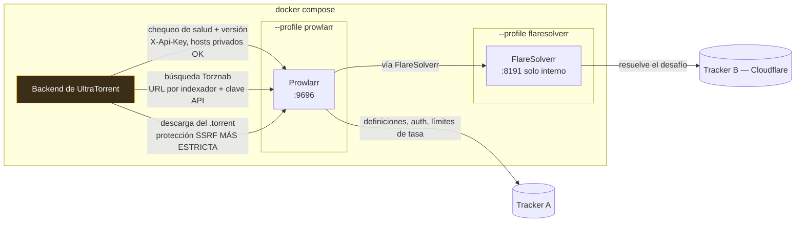

# Prowlarr

## Resumen

[Prowlarr](https://prowlarr.com/) es un **gestor de indexadores**. Trae definiciones para cientos de trackers públicos y privados, maneja sus flujos de inicio de sesión, sus límites de tasa y sus manías, y expone cada uno como un **endpoint Torznab** limpio — que es exactamente el protocolo que busca el subsistema de [Indexadores](/modules/indexers) de UltraTorrent.

UltraTorrent puede ejecutar Prowlarr como **contenedor acompañante opcional** y enlazar a él desde la UI.

:::info Prowlarr no viene incrustado en UltraTorrent
Es un servicio aparte detrás de un perfil de Compose que está **apagado por defecto**. UltraTorrent arranca y funciona perfectamente sin él. Nada de la integración se activa hasta que un operador habilite el perfil *y* llene los ajustes de conexión.
:::

La integración del lado de UltraTorrent es deliberadamente **solo de enlace**: guarda la conexión, verifica su salud, y ofrece un atajo de "Abrir Prowlarr". **No** hace de proxy para endpoints arbitrarios de Prowlarr y **no** configura tus indexadores automáticamente. Eso sigue siendo algo que haces explícitamente dentro de Prowlarr.

## Por qué / cuándo usarlo

Usa Prowlarr cuando no quieras mantener a mano las definiciones de trackers.

Sin él, cada indexador que agregas a UltraTorrent es una URL Torznab que conseguiste por tu cuenta. Con él, agregas los trackers una vez en Prowlarr — que conoce sus APIs, sus categorías, y cómo iniciar sesión — y copias las URLs Torznab resultantes a UltraTorrent.

**No** necesitas Prowlarr si ya tienes Jackett, un endpoint Torznab nativo, o un solo tracker que no te molesta configurar a mano. Al subsistema de [Indexadores](/modules/indexers) no le importa de dónde salió el endpoint.

## Requisitos previos

- El stack de Docker Compose incluido (o tu propia instancia de Prowlarr alcanzable desde el backend).
- El permiso `integrations.prowlarr.view` para ver el panel de ajustes; `…manage` para cambiarlo, `…test` para probar, `…open` para ver el atajo en la barra lateral.
- Entender **una trampa**, descrita en detalle más abajo: que la prueba de conexión pase **no** significa que las descargas vayan a funcionar.

## Conceptos

**Contenedor acompañante** — un servicio opcional en el mismo archivo de Compose, detrás de un **perfil**. Los perfiles están apagados a menos que los nombres, así que `docker compose up -d` por sí solo nunca levanta Prowlarr.

**URL interna** — cómo el *backend* llega a Prowlarr. En el stack incluido: `http://prowlarr:9696` (el nombre del servicio en la red interna de Docker).

**URL pública** — cómo *tu navegador* llega a Prowlarr, para el enlace de "Abrir Prowlarr". Por ejemplo `http://localhost:9696`, o tu nombre de host detrás del proxy inverso.

**FlareSolverr** — un segundo acompañante opcional: un proxy con navegador headless que resuelve el desafío anti-bots de Cloudflare por cuenta de Prowlarr.

**Protección SSRF** — UltraTorrent se niega a descargar un `.torrent` desde una dirección IP privada/interna a menos que pongas el host en la lista de permitidos. Esto existe para evitar que una fuente maliciosa haga que tu servidor sondee tu propia red. También es la fuente número uno de confusión en esta página.

## Cómo funciona



Fíjate en las tres flechas separadas que van del backend a Prowlarr. Se rigen por **reglas distintas**, y en eso consiste toda la trampa:

- El **chequeo de salud** deliberadamente *confía* en los hosts privados — `prowlarr:9696` es el destino previsto, así que bloquearlo sería absurdo.
- La **descarga del `.torrent`** usa una protección más estricta que *bloquea* las direcciones privadas e internas a menos que el host esté en `SSRF_ALLOW_HOSTS`.

Así que una insignia verde de *Conectado* solo prueba que UltraTorrent puede alcanzar la **API** de Prowlarr. **No** prueba que una captura se vaya a descargar.

:::danger La trampa de la prueba que pasa y la descarga que falla
Cuando una regla RSS, una decisión de Descarga Inteligente, o el barrido de episodios faltantes captura un lanzamiento, el backend descarga el enlace proxy `.torrent` de Prowlarr — que resuelve a una **IP privada de Docker/LAN**. Sin una entrada en la lista de permitidos, esa descarga se bloquea con *"Torrent URL resolves to a blocked internal address"*, y **las descargas automáticas no hacen nada, en silencio**, mientras la prueba de conexión sigue en verde.

El stack incluido **usa `SSRF_ALLOW_HOSTS=prowlarr` por defecto**, así que funciona de una. Si sobreescribes esa variable, o corres Prowlarr bajo otro host u otra IP, tienes que listarlo — conservando `prowlarr` si usas el incluido:

```bash
SSRF_ALLOW_HOSTS=prowlarr,indexer.lan
```
:::

## Configuración

### Habilitar el contenedor

Prowlarr vive detrás del perfil de Compose `prowlarr`:

```bash
# Levanta (o agrega al) stack con el acompañante Prowlarr
docker compose --profile prowlarr up -d

# Combina con otros perfiles opcionales según haga falta
docker compose --profile rtorrent --profile prowlarr up -d --build
```

Abre Prowlarr en `http://<host>:9696` (o tu `PROWLARR_PORT`), completa su asistente de primer arranque, y agrega los indexadores que quieras.

Consigue su **clave API** en **Settings → General → Security → API Key** dentro de Prowlarr.

### Variables de entorno

| Variable | Predeterminado | Propósito |
|----------|---------|---------|
| `PROWLARR_PORT` | `9696` | Puerto del host en el que se publica la UI web de Prowlarr. |
| `PROWLARR_BASE_URL` | `http://prowlarr:9696` | Siembra el valor por defecto de **URL interna** en el formulario de ajustes. |
| `PROWLARR_PUBLIC_URL` | `http://localhost:9696` | Siembra el valor por defecto de **URL pública**. |
| `PROWLARR_ENABLED` | `false` | Un valor por defecto de conveniencia. El interruptor real está en los ajustes de UltraTorrent. |
| `SSRF_ALLOW_HOSTS` | `prowlarr` (en el archivo de compose incluido) | **Requerido para las descargas automáticas.** Mira la caja de peligro de arriba. |
| `PUID` / `PGID` | `1000` | Usuario/grupo con el que corre Prowlarr. |
| `TZ` | `Etc/UTC` | Zona horaria del contenedor acompañante. |

Las dos variables de URL solo **siembran los valores por defecto** que se muestran en el formulario de ajustes. Los valores que mandan son los que guardes en la UI.

| Elemento | Valor |
|------|-------|
| Imagen | `lscr.io/linuxserver/prowlarr:latest` |
| Puerto de la UI web | `${PROWLARR_PORT:-9696}` → contenedor `9696` |
| Volumen | `prowlarr_config` → `/config` (la base de datos y los ajustes de Prowlarr) |
| Red | `internal` (compartida con backend/frontend/motor) |
| Política de reinicio | `unless-stopped` |

### Conectar UltraTorrent

Ve a **Configuración → Integraciones → Prowlarr** (necesita `integrations.prowlarr.view`):

| Campo | Qué hace | Recomendado |
|-------|--------------|-------------|
| **Habilitar la integración con Prowlarr** | El interruptor maestro. | Activado, una vez configurado. |
| **URL interna** | Cómo el backend llega a Prowlarr. | `http://prowlarr:9696` en el stack incluido. |
| **URL pública** | A dónde manda tu navegador el enlace de "Abrir Prowlarr". | `http://localhost:9696`, o tu nombre de host detrás del proxy inverso. |
| **Clave API** | La clave API de Prowlarr. **Cifrada en reposo**, se muestra como `••••••••`, nunca se devuelve. Déjala en blanco en ediciones posteriores para conservar la clave guardada. | Pégala una sola vez. |

Guarda, y luego dale a **Probar conexión**. Una insignia verde de *Conectado* muestra la versión de Prowlarr y su cantidad de indexadores configurados.

Una vez habilitado y con una URL pública, aparece un atajo de **Prowlarr** en la barra lateral bajo **RSS y Adquisición** para los usuarios con `integrations.prowlarr.open`, que abre Prowlarr en una pestaña nueva.

### Indexadores protegidos por Cloudflare (FlareSolverr)

Algunos trackers están detrás del **desafío anti-bots de Cloudflare**. Prowlarr no puede resolverlo solo, así que probar un indexador de esos falla con *"blocked by Cloudflare Protection."*

**FlareSolverr** es la solución estándar — un proxy con navegador headless que resuelve el desafío y devuelve las cookies. Viene como otro acompañante opcional, **solo en la red interna, sin puerto en el host**:

```bash
docker compose --profile prowlarr --profile flaresolverr up -d
```

| Elemento | Valor |
|------|-------|
| Imagen | `ghcr.io/flaresolverr/flaresolverr:latest` |
| Dirección (desde Prowlarr) | `http://flaresolverr:8191` |
| Entorno | `FLARESOLVERR_LOG_LEVEL` (por defecto `info`), `TZ` |
| Estado | Ninguno — sin estado, sin volumen |

Después conéctalo **dentro de Prowlarr**:

1. **Settings → Indexers → + (Add Indexer Proxy) → FlareSolverr.**
2. **Host:** `http://flaresolverr:8191`. Ponle una **Tag** (por ejemplo `cloudflare`). Guarda.
3. Abre el indexador protegido por Cloudflare y agrégale la **misma etiqueta**. Prowlarr ahora enruta las peticiones de ese indexador a través de FlareSolverr. Vuelve a probar.

:::warning FlareSolverr hace lo que puede
Cloudflare aprieta sus desafíos cada cierto tiempo y FlareSolverr se puede quedar atrás. Normalmente funciona, pero no está garantizado. Si no puede resolver el desafío, prueba con otro espejo para ese indexador en Prowlarr, o apóyate en tus otros indexadores.

Corre un Chromium headless, así que usa bastante más RAM (~200–400 MB) y en el archivo de Compose se le da un `/dev/shm` de 256 MB para evitar caídas.
:::

### Permisos

| Permiso | Concede |
|-----------|--------|
| `integrations.prowlarr.view` | Ver el panel de ajustes (con la clave API enmascarada). |
| `integrations.prowlarr.manage` | Cambiar los ajustes y la clave API. |
| `integrations.prowlarr.test` | Correr la prueba de conexión. |
| `integrations.prowlarr.open` | Ver el atajo en la barra lateral y abrir Prowlarr. |

## Guía paso a paso

**1. Levanta el contenedor.**

```bash
docker compose --profile prowlarr up -d
```

**2. Completa el asistente de primer arranque de Prowlarr** en `http://<host>:9696`. Configura la autenticación — no lo dejes abierto.

**3. Agrega tus trackers en Prowlarr.** Prueba cada uno ahí. Arregla con FlareSolverr los que estén bloqueados por Cloudflare antes de seguir.

**4. Copia la clave API de Prowlarr** desde **Settings → General → Security → API Key**.

**5. Conecta UltraTorrent.** **Configuración → Integraciones → Prowlarr** → habilitar, URL interna, URL pública, clave API → **Guardar cambios** → **Probar conexión**. Espera una insignia verde con la versión y la cantidad de indexadores.

**6. Ahora haz la parte que todo el mundo olvida.** Confirma que `SSRF_ALLOW_HOSTS` incluya tu host de Prowlarr. En el stack incluido el valor por defecto es `prowlarr` y ya está. Si tú mismo definiste esa variable, vuelve a agregar `prowlarr`.

**7. Agrega los indexadores a UltraTorrent.** En Prowlarr, cada indexador tiene una **URL Torznab**. Copia cada una a **Descargas → Indexadores**, con la clave API de Prowlarr — y **define `minSeeders`**. Mira [Indexadores](/modules/indexers).

**8. Comprueba una descarga real.** Corre una búsqueda manual de episodio faltante y confirma que el torrent de verdad aterriza en tu cliente. Si la captura se registra pero no aparece ningún torrent, caíste en la trampa del SSRF. Vuelve al paso 6.

## Capturas de pantalla


:::tip Mira este tutorial
_Video próximamente._
:::

## Ejemplos del mundo real

### De cero a un stack de búsqueda funcional en diez minutos

```bash
docker compose --profile prowlarr up -d
```

Agrega tres trackers en Prowlarr. Copia la clave API de Prowlarr. Conéctalo en los ajustes de UltraTorrent y pruébalo. Copia las tres URLs Torznab a **Descargas → Indexadores**, cada una con `minSeeders: 3` y una prioridad. Prueba cada una. Ahora corre un **Buscar ahora** manual en un episodio faltante — deberías recibir candidatos de los tres, deduplicados por info-hash, con el mejor evaluado contra tu perfil de adquisición.

### Diagnosticar "la automatización lo capturó pero no descargó nada"

La evaluación muestra `download`, se registró una acción, y no existe ningún torrent en el cliente. Esa es la trampa del SSRF, prácticamente siempre. Revisa los logs del backend buscando *"Torrent URL resolves to a blocked internal address"*. Agrega el host de Prowlarr a `SSRF_ALLOW_HOSTS`, reinicia el backend, y vuelve a correr la captura. La prueba de conexión estuvo verde todo el tiempo y no te dijo nada, porque usa una protección distinta y más permisiva.

## Solución de problemas

| Síntoma | Causa | Solución |
|---------|-------|-----|
| La prueba de conexión está verde, pero las descargas automáticas no hacen nada, en silencio | **La trampa.** El chequeo de salud confía en los hosts privados; la descarga del `.torrent` no. La captura se bloquea con *"Torrent URL resolves to a blocked internal address"*. | Agrega el host a `SSRF_ALLOW_HOSTS` (por defecto `prowlarr` en el archivo de compose incluido), y luego reinicia el backend. |
| Prowlarr no está corriendo, en lo absoluto | El perfil está apagado por defecto. | `docker compose --profile prowlarr up -d`. |
| La prueba de un indexador en Prowlarr falla con "blocked by Cloudflare Protection" | El tracker está detrás del desafío anti-bots de Cloudflare. | Levanta el perfil `flaresolverr`, agrégalo como Indexer Proxy en Prowlarr, y etiqueta el indexador afectado. |
| FlareSolverr se cae o va lentísimo | Corre un Chromium headless. Necesita RAM y memoria compartida. | El archivo de Compose le asigna un `/dev/shm` de 256 MB. Dale más RAM al host, o descarta el indexador. |
| La prueba de conexión falla de plano | URL interna equivocada, o una clave API mala. Recuerda: `localhost` dentro del contenedor del backend es el backend, no Prowlarr. | Usa el nombre del servicio de Compose (`http://prowlarr:9696`). Vuelve a copiar la clave API desde Prowlarr. |
| El enlace de "Abrir Prowlarr" no lleva a ningún lado | La **URL pública** está mal — tiene que ser alcanzable desde *tu navegador*, no desde el backend. | Ponla en `http://localhost:9696` o en tu nombre de host detrás del proxy inverso. |
| Las búsquedas no devuelven nada aunque Prowlarr sí tiene resultados | Conectaste la *integración* pero nunca agregaste las URLs Torznab de cada indexador a **Descargas → Indexadores**. La integración es solo de enlace; no configura indexadores automáticamente. | Agrega cada URL Torznab como indexador. Mira [Indexadores](/modules/indexers). |

## Mejores prácticas

- **Verifica `SSRF_ALLOW_HOSTS` antes de confiar en cualquier automatización.** Es la diferencia entre un pipeline que funciona y uno silencioso.
- **No expongas Prowlarr públicamente** a menos que enrutes su puerto a propósito. Por defecto es alcanzable en el host por `PROWLARR_PORT` y por la red interna. Ponlo detrás de tu [proxy inverso](/install/reverse-proxy) con autenticación si necesitas acceso remoto.
- **Mantén FlareSolverr interno.** Ejecuta páginas remotas en un navegador headless para vencer los chequeos anti-bots. Por algo no tiene un puerto publicado en el host — déjalo así, y nunca lo apuntes a URLs que no sean de confianza.
- **Respalda el volumen `prowlarr_config`.** Contiene todo el estado de Prowlarr: base de datos, definiciones de indexadores, y la clave API.

  ```bash
  docker run --rm -v ultratorrent_prowlarr_config:/c -v "$PWD":/b \
    alpine tar czf /b/prowlarr_config.tgz -C /c .
  ```

- **Actualiza bajando la imagen.** `/config` persiste entre actualizaciones, y la clave API guardada en UltraTorrent no se ve afectada a menos que la regeneres en Prowlarr.

  ```bash
  docker compose --profile prowlarr pull prowlarr && \
  docker compose --profile prowlarr up -d prowlarr
  ```

## Errores comunes

- **Creerle a la insignia verde.** Prueba que la API es alcanzable. No dice nada sobre si la descarga de un `.torrent` va a funcionar.
- **Sobreescribir `SSRF_ALLOW_HOSTS` y sacar `prowlarr` de la lista.** Todo se rompe al instante, y en silencio.
- **Esperar que la integración te configure los indexadores.** No lo hace. Es un chequeo de salud y un atajo. Igual tienes que agregar cada URL Torznab a **Descargas → Indexadores** tú mismo.
- **Usar `localhost` como URL interna.** Dentro del contenedor del backend, eso es el backend.
- **Exponer Prowlarr a internet** porque el puerto ya estaba publicado en el host.

## Preguntas frecuentes

**¿Necesito Prowlarr?**
No. UltraTorrent busca en cualquier endpoint Torznab/Newznab. Prowlarr es una comodidad — un gestor para cientos de definiciones de trackers.

**¿UltraTorrent hace de proxy para las peticiones a través de la API de Prowlarr?**
Solo para dos cosas: el **chequeo de salud** (versión + cantidad de indexadores) y las **búsquedas Torznab** que configuraste como indexadores. No hace de proxy para endpoints arbitrarios de Prowlarr y no modifica la configuración de Prowlarr.

**¿Está segura la clave API de Prowlarr?**
Está cifrada en reposo con AES-256-GCM, enmascarada (`••••••••`) en cada respuesta de la API, y nunca se registra en los logs. Viaja en un encabezado `X-Api-Key`, y la URL nunca se escribe en los logs.

**¿Por qué el chequeo de salud sí puede llegar a una IP privada y las descargas de torrents no?**
Porque una IP privada es el destino *esperado* del chequeo de salud — `prowlarr:9696` es un nombre de servicio de Docker. La URL de un `.torrent`, en cambio, puede venir de una fuente en la que no confías, así que descargarlo se protege mucho más estrictamente. La lista de permitidos es tu forma de decir "este host privado en específico sí lo conozco y confío en él".

**¿Qué queda en la auditoría?**
Las vistas y actualizaciones de los ajustes, los cambios de clave API, las pruebas de conexión, y las aperturas.

## Lista de verificación

- [ ] `docker compose --profile prowlarr up -d`. Esperado: Prowlarr responde en `http://<host>:9696`.
- [ ] Completa el asistente de Prowlarr y agrega al menos un tracker. Esperado: la prueba sale verde dentro de Prowlarr.
- [ ] Conecta la integración en UltraTorrent y dale a **Probar conexión**. Esperado: una insignia verde con una versión y una cantidad de indexadores.
- [ ] Confirma que `SSRF_ALLOW_HOSTS` contenga tu host de Prowlarr. Esperado: `prowlarr` (o tu host) aparece en la lista.
- [ ] Agrega una URL Torznab como indexador con `minSeeders`. Esperado: **Probar** funciona y devuelve las capacidades.
- [ ] Corre una búsqueda manual de episodio faltante y confirma que el torrent **de verdad aparece en tu cliente**. Esperado: un torrent real, no solo una evaluación registrada. Esta es la única prueba que demuestra que la vía del SSRF funciona.

## Mira también

- [Indexadores](/modules/indexers) — a dónde van realmente las URLs Torznab.
- [Episodios Faltantes](/modules/missing-episodes) — para qué sirve la búsqueda.
- [Descarga Inteligente](/modules/smart-download) — lo que decide sobre cada candidato.
- [Instalación con Docker Compose](/install/docker-compose) — perfiles y contenedores acompañantes.
- [Referencia de entorno](/reference/environment) — `SSRF_ALLOW_HOSTS`, `PROWLARR_*`.
- [Seguridad](/operate/security) — el modelo de SSRF.
- [Proxy inverso](/install/reverse-proxy)
