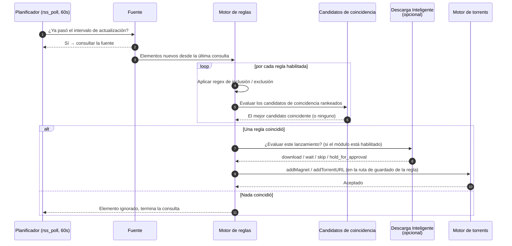

# Automatización RSS

## Resumen

La **Automatización RSS** es la puerta de entrada de la adquisición automatizada. Le das a UltraTorrent una URL de fuente — la salida RSS de un tracker, una fuente de Prowlarr, una fuente específica de una serie — y la consulta con un horario. Debajo de cada fuente escribes **reglas** que describen lo que de verdad quieres sacar de ella, y cuando un elemento coincide, UltraTorrent lo captura.

La cadena es corta y vale la pena memorizarla, porque cada página de adquisición en esta documentación se refiere a ella:

```
fuente  →  regla  →  candidatos de coincidencia rankeados  →  captura
```

RSS es un módulo **core** (id `rss`, permisos `rss.*`), así que no se puede deshabilitar. También es la dependencia dura de [Puntuación de Lanzamientos](/modules/smart-download) y [Descarga Inteligente](/modules/smart-download) — ambas se construyen sobre lo que RSS encuentra.

## Por qué / cuándo usarlo

Usa RSS cuando quieras que el contenido llegue **sin que tú lo pidas**:

- Una serie que sigues cada semana. Agrega la fuente, escribe una regla, y olvídate.
- Un grupo de lanzamiento en el que confías. Empareja por el nombre del grupo, excluye todo lo demás.
- Rellenar una serie ya terminada en una calidad específica.

Úsalo *en vez de* la búsqueda manual cuando el contenido sea predecible. Usa [Indexadores](/modules/indexers) + [Descarga Inteligente](/modules/smart-download) cuando el contenido sea un **hueco que ya conoces** — un episodio faltante es mejor *buscarlo* que *esperarlo*.

Los dos trabajan juntos: RSS atrapa las cosas según van apareciendo; Descarga Inteligente decide si lo que apareció de verdad vale la pena.

## Requisitos previos

- Una conexión funcionando con un **motor de torrents** — mira [Motores](/modules/engines). RSS declara `engine` como dependencia dura, y una captura sin motor no va a ningún lado.
- Una **URL de fuente** que tengas derecho a usar. La mayoría de los trackers privados exponen una URL RSS personal bajo tu perfil; la mayoría de los públicos exponen una fuente por categoría.
- El permiso `rss.view` para mirar, `rss.manage` para cambiar cualquier cosa.
- **Opcional pero muy recomendado:** una clave API de TMDB (`media.tmdbApiKey` en los ajustes, o la variable de entorno `TMDB_API_KEY`). Sin ella, la conciencia del estado de emisión recurre a fuentes de menor confianza.

:::warning Una fuente no es un indexador
Una fuente RSS es un flujo de **empuje** — recibes lo que el tracker decidió publicar, en el orden en que lo publicó. Un [indexador](/modules/indexers) es una API de búsqueda de **jalón** — le puedes pedir un episodio específico. RSS no puede ir a buscarte el `S03E07`; los indexadores sí. Si necesitas rellenar huecos, necesitas indexadores.
:::

## Conceptos

**Fuente** (`RssFeed`) — una URL consultada con un intervalo de actualización. La tarea del planificador `rss_poll` corre cada 60 segundos y consulta toda fuente cuyo intervalo ya haya pasado.

**Regla** (`RssRule`) — vive *debajo* de una fuente y describe qué capturar de ella: regex de inclusión/exclusión, categoría, ruta de guardado, y una lista ordenada de candidatos de coincidencia. Una fuente sin reglas se consulta pero nunca captura nada.

**Candidato de coincidencia** (`RssRuleMatchCandidate`) — una condición dentro de la lista ordenada y rankeada de una regla. Se construye en la **Creación inteligente** (Smart Match Builder) y se prioriza en la lista de **Preferencias de coincidencia**. El orden es el orden de preferencia: gana el candidato mejor rankeado que coincida.

**Creación inteligente** — la UI que convierte "quiero esta serie, en 1080p, de estos grupos, sin CAM" en un conjunto de candidatos rankeados sin que tengas que escribir regex a mano.

**Estado de la serie** — para las reglas de TV, el estado de emisión de la serie: `continuing`, `returning`, `planned`, `on_hiatus`, `ended`, `canceled`, o `unknown`. Se resuelve del lado del servidor desde un proveedor, se guarda en caché, y se toma una instantánea en la regla.

**Recomendación** — el veredicto en cristiano derivado del estado: `recommended` (la serie está activa), `caution` (en pausa), `not_recommended` (finalizada o cancelada), o `unknown`.

**Ruta de guardado** — dónde aterrizan los datos del torrent capturado. Se define por regla; si no se define, usa el directorio de descargas por defecto del motor.

## Cómo funciona



### Conciencia del estado de emisión de series de TV

Un modo de falla sutil: creas una regla para una serie que **terminó hace dos años**. Se consulta para siempre, no coincide con nada, y desperdicia ciclos calladita — y peor, te hace creer que la automatización está funcionando cuando no le queda nada que atrapar.

UltraTorrent resuelve el estado de emisión de una regla de TV **del lado del servidor** (nunca confía en un estado enviado por el navegador) y actúa según eso:

| Estado | Qué pasa al guardar |
|--------|---------------------|
| Activa (`continuing`, `returning`, `planned`) | Se guarda normal. |
| `on_hiatus` | Se guarda, con una recomendación de `caution` mostrada en la regla. |
| `unknown` | Se guarda con una advertencia `status_unconfirmed`. |
| `ended` / `canceled` | **Rechazada con `400`** a menos que lo confirmes explícitamente. La UI muestra un modal de confirmación; confirmar activa `allowInactiveShowMonitoring`. |

Anular esto se audita, emite un evento por WebSocket, y dispara un disparador de automatización — para que se le pueda avisar a un operador.

El estado lo resuelve un **proveedor**, intentados en orden de confianza:

| Proveedor | Fuente | Confianza | Notas |
|----------|--------|-----------|-------|
| TMDB | `/search/tv` + `/tv/{id}` | 0.95 | Estado, próximo/último episodio, póster. Necesita una clave de TMDB. |
| IMDb | Tu conjunto de datos local de IMDb (`IMDbTitle`) | 0.6 | `endYear` + tipo de título ⇒ finalizada/en emisión. Sin granularidad de próximo episodio. |
| NFO local | Tu propia biblioteca (`MediaItem`) | 0.3 | Respaldo, en el mejor de los casos. |

Los estados resueltos se guardan en caché en `tv_show_status`, y una tarea en segundo plano (`rss_show_status_refresh`, cada hora) los vuelve a resolver con una **cadencia por estado** — las activas cada 24 h, `on_hiatus` cada 7 días, `ended`/`canceled` cada 30 días, `unknown` cada 3 días, las más viejas primero, con un tope por corrida.

:::info Lo muestra, nunca lo deshabilita en silencio
Cuando el estado de una serie cambia, la tarea de actualización actualiza toda regla que le haya sacado una instantánea, transmite el cambio, lo audita, y dispara un disparador de automatización. **Nunca deshabilita tu regla.** Si dejas de monitorear una serie finalizada es decisión tuya — pero te lo van a decir.
:::

## Configuración

### Opciones de la fuente

| Opción | Qué hace | Predeterminado | Recomendado |
|--------|--------------|---------|-------------|
| **URL** | La fuente a consultar. | — | Usa la URL RSS personal/autenticada del tracker cuando exista una. |
| **Intervalo de actualización** | Cada cuánto se consulta esta fuente. La tarea `rss_poll` hace tick cada 60 s y recoge las fuentes cuyo intervalo ya pasó. | Por fuente | 10–30 minutos para la mayoría de los trackers. Consultar más rápido de lo que el tracker publica no te gana nada y te puede limitar la tasa. |
| **Activada** | Si la fuente se consulta o no. | Activado | Deshabilita en vez de eliminar cuando estés resolviendo problemas — así conservas el historial de la regla. |

### Opciones de la regla

| Opción | Qué hace | Predeterminado | Recomendado |
|--------|--------------|---------|-------------|
| **Regex de inclusión / exclusión** | Filtrado grueso sobre el título del lanzamiento. | Vacío | Usa la exclusión para las cosas que *nunca* quieres (`CAM`, `TS`, `HDCAM`). Usa candidatos de coincidencia, no regex, para las cosas que *sí* quieres. |
| **Tipo de medio** | `tv`, `anime`, `episode`, `series`, `movie`, … Impulsa la resolución del estado de emisión. | — | Ponlo siempre para TV. Es lo que desbloquea el panel de estado de la serie. |
| **Candidatos de coincidencia** | La lista rankeada construida en la Creación inteligente. | Vacío | Rankéalos por lo que de verdad aceptarías: tu lanzamiento ideal primero, tu respaldo aceptable segundo. |
| **Categoría** | La categoría que se le aplica al torrent capturado. | Sin definir | Ponla — es de lo que se agarran después la mayoría de las Reglas de Automatización. |
| **Ruta de guardado** | Dónde aterrizan los datos. | Predeterminado del motor | Ponla en la carpeta de biblioteca de esa serie, para que el Gestor de Medios la recoja. |
| **Descarga automática** | Si una coincidencia se captura automáticamente o solo se registra. | Activado | **Apágala** para convertir una regla en "solo relleno" sin eliminarla. |
| **Permitir monitorear series inactivas** | Permite guardar una regla para una serie finalizada/cancelada. | Apagado | Déjalo apagado. Actívalo solo cuando estés rellenando a propósito. |

### Permisos

| Permiso | Concede |
|-----------|--------|
| `rss.view` | Ver las fuentes y las reglas; recibir eventos en tiempo real `rss.*`. |
| `rss.manage` | Crear, editar y eliminar fuentes y reglas. |
| `rss.show_status.lookup` | Llamar a los endpoints de consulta del estado de la serie. |
| `rss.show_status.refresh` | Disparar una actualización manual del estado. |
| `rss.show_status.override` | Guardar una regla para una serie finalizada o cancelada. |

## Guía paso a paso

**1. Agrega una fuente.** Ve a **RSS y Adquisición → Fuentes RSS** y agrega la URL de la fuente. Guarda, y luego confirma que la fuente muestre una consulta exitosa reciente y un conteo de elementos distinto de cero. Si muestra un error, arregla eso antes de escribir ninguna regla — una regla sobre una fuente rota nunca se va a activar y va a parecer un error de la regla.

**2. Crea una regla bajo esa fuente.** Ponle un nombre (que sea el título de la serie — se usa después para resolver la ruta de guardado), elige el **Tipo de medio**, y define la **Categoría** y la **Ruta de guardado**.

**3. Lee el panel de estado de la serie.** Para una regla de TV/anime, aparece un panel en vivo: insignia de estado, banner de recomendación, proveedor y confianza, fechas del próximo/último episodio, y un póster. Si dice *No recomendado*, créele: esa serie ya terminó.

**4. Construye la coincidencia.** Abre la **Creación inteligente** en la página de detalle de la regla. Agrega candidatos para los lanzamientos que aceptarías, y luego reordénalos en **Preferencias de coincidencia** para que tu primera opción quede de primera.

**5. Míralo dispararse.** La siguiente consulta recoge los elementos coincidentes. Revisa el historial de la regla y la lista de torrents. Si Descarga Inteligente está habilitada, revisa también sus colas — un lanzamiento coincidente puede haberse retenido a propósito en `wait` a la espera de algo mejor.

**6. Ajusta.** Si te llegan lanzamientos que no querías, aprieta la coincidencia en vez de agregar regex. Si no te llega nada, afloja la coincidencia y verifica que la fuente de verdad esté publicando lo que crees.

## Capturas de pantalla


:::tip Mira este tutorial
_Video próximamente._
:::

## Ejemplos del mundo real

### Seguir una serie semanal en 1080p, nunca en 720p

Agrega la fuente de TV del tracker. Crea una regla nombrada exactamente como la serie (`Severance`), tipo de medio `tv`. En la Creación inteligente, agrega un candidato para el título de la serie anclado a 1080p WEB-DL de tus grupos preferidos, y un segundo candidato, con menor rango, para cualquier 1080p WEB-DL de la serie. Pon el regex de exclusión en `720p|HDTV`. Pon la ruta de guardado en la carpeta de esa serie dentro de tu biblioteca de TV. Ahora el candidato de arriba gana cuando publica tu grupo preferido, y el respaldo la atrapa cuando no lo hacen.

### Rellenar una serie terminada sin consultar para siempre

Quieres todos los episodios de una serie finalizada, una sola vez, y después nada. Crea la regla; el modal de confirmación te va a decir que la serie terminó y te va a pedir que anules — hazlo. Después **apaga la Descarga automática** para que la regla registre las coincidencias sin capturarlas. Captura a mano lo que necesites de la lista de coincidencias, y elimina la regla cuando termines. (Una Regla de Automatización que use la acción `convert_rule_to_backfill` te hace exactamente esta transformación cuando una serie termina.)

### Que te avisen cuando una serie regrese

Habilita la Regla de Automatización preconfigurada sobre el disparador `rss.show.became_active` con una acción `notify_admin`. Cuando la actualización horaria de estado note que una serie `returning` pasó a `continuing`, recibes una notificación y la regla que ya tienes empieza a atrapar episodios otra vez.

## Solución de problemas

| Síntoma | Causa | Solución |
|---------|-------|-----|
| Guardar una regla de TV falla con un `400` | La serie **terminó** o fue **cancelada**, y `allowInactiveShowMonitoring` está apagado. Esto es a propósito. | Confirma la anulación en el modal (necesita `rss.show_status.override`), o elige una serie que siga en emisión. |
| Una regla coincide con muchísimo más de lo que debería — por ejemplo, una regla de `M.I.A.` capturando Law & Order y MasterChef | Históricamente, `contains_text` coincidía por **subcadenas**. `M.I.A.` se normaliza a `m`, `i`, `a`, cada una subcadena de casi cualquier nombre de lanzamiento. Esto se arregló: `contains_text` ahora exige que cada palabra aparezca como **token completo**. | Asegúrate de estar en una versión actual. Después vuelve a revisar la regla: las palabras de un solo carácter y las numéricas ahora se emparejan por token completo. |
| Una regla para `9-1-1` captura `9-1-1 Lone Star` | Históricamente, la coincidencia inteligente de título era una prueba de prefijo/pertenencia a conjunto, así que el título de un spin-off contenía el del padre. Arreglado: la coincidencia inteligente de título ahora exige **igualdad completa del título puro**, y `smart_episode_match` / `smart_movie_match` anclan el título al **inicio de la región de la serie**. | Actualiza. Si sigues viendo filtraciones, aprieta el candidato al título exacto. |
| La fuente se consulta pero nunca se captura nada | O ninguna regla coincide, o Descarga Inteligente está reteniendo el lanzamiento a propósito. | Revisa el historial de coincidencias de la regla. Después revisa **Descarga Inteligente → En espera** — un lanzamiento que puntúa por encima de tu mínimo pero por debajo de `waitUntilScore` se retiene a propósito. |
| Los lanzamientos capturados aterrizan en `/downloads`, no en la biblioteca | La regla no tiene **ruta de guardado**. | Define la ruta de guardado en la regla. El Gestor de Medios solo organiza automáticamente una descarga cuya ruta de guardado esté *dentro* de la raíz de una biblioteca habilitada. |
| Una captura desde un Prowlarr autoalojado falla en silencio | La URL proxy del `.torrent` resuelve a una IP privada de Docker, y la protección SSRF la bloquea. La *prueba de conexión* de Prowlarr sigue pasando — ese chequeo de salud confía en los hosts privados; la descarga del torrent es una protección aparte y más estricta. | Agrega el host a `SSRF_ALLOW_HOSTS`. El stack incluido usa `prowlarr` por defecto. Mira [Prowlarr](/modules/prowlarr). |
| El estado de la serie dice `unknown` | No hay clave de TMDB, y ni el conjunto de datos de IMDb ni la biblioteca local pudieron resolver el título. | Define `media.tmdbApiKey` en los ajustes o `TMDB_API_KEY` en el entorno. |

## Mejores prácticas

- **Nombra la regla como la serie.** Varias funciones río abajo resuelven una ruta de guardado emparejando el **nombre** de una regla RSS contra el título de una serie. Una regla llamada `tv-hd-1` no ayuda a nadie.
- **Define una ruta de guardado en cada regla.** Es el campo con más impacto: decide si el Gestor de Medios va a organizar el resultado.
- **Excluye agresivamente, incluye con precisión.** Las exclusiones son baratas y seguras. Una inclusión demasiado amplia es la forma de amanecer con 40 torrents que no querías.
- **Rankea los candidatos por lo que de verdad aceptarías**, el mejor primero. La lista es un orden de preferencia, no un filtro.
- **Confía en el panel de estado de la serie.** Si dice *No recomendado*, la serie se acabó. Convierte la regla a relleno en vez de monitorearla para siempre.
- **Consulta con educación.** Con 10–30 minutos basta y sobra. Consultar agresivamente arriesga un baneo del tracker y no gana nada.

## Errores comunes

- **Escribir regex donde va un candidato de coincidencia.** La Creación inteligente existe para que no tengas que razonar sobre tokenización; ya sabe cuál es la región de la serie dentro del nombre de un lanzamiento.
- **Asumir que RSS puede encontrar un episodio específico.** No puede. Solo puede atrapar lo que la fuente publique, cuando lo publique. Usa [Indexadores](/modules/indexers).
- **Crear una regla por episodio.** Las reglas son por serie. Los episodios los maneja la coincidencia.
- **Eliminar una regla para "pausarla".** Deshabilítala, o apaga la descarga automática. Así conservas el historial.
- **Ignorar una advertencia de `ended` y después culpar a la automatización** por no encontrar episodios nuevos de una serie que no tiene ninguno.

## Preguntas frecuentes

**¿Cada cuánto se consultan las fuentes?**
La tarea del planificador `rss_poll` corre cada **60 segundos** y consulta toda fuente cuyo propio intervalo de actualización ya haya pasado. Tu intervalo por fuente es la cadencia real; los 60 s son solo la granularidad del tick.

**¿Puedo usar una fuente de Prowlarr como fuente RSS?**
Sí — Prowlarr expone salida RSS, y UltraTorrent la va a consultar como cualquier otra fuente. Pero si lo que quieres es *búsqueda* (pedir un episodio específico), apunta los [Indexadores](/modules/indexers) de UltraTorrent a las URLs Torznab de Prowlarr. RSS y Torznab son capacidades distintas.

**¿Qué pasa si una serie termina mientras la estoy monitoreando?**
La actualización horaria lo nota, actualiza la instantánea de tu regla, transmite `rss.show.ended`, lo audita, y dispara un disparador de automatización. Tu regla sigue corriendo — UltraTorrent te avisa, no decide por ti. Una Regla de Automatización puede reaccionar llamando a `convert_rule_to_backfill` o `disable_rss_rule`.

**¿Necesito una clave de TMDB?**
No, pero la quieres. Sin ella, el estado de emisión recurre al conjunto de datos local de IMDb (confianza 0.6, sin datos del próximo episodio) o a tu propia biblioteca (0.3). Con ella, obtienes estado con 0.95 de confianza más las fechas del próximo/último episodio y los pósters.

**¿RSS decide qué descargar, o lo decide Descarga Inteligente?**
RSS decide qué *coincide*. Si Descarga Inteligente está habilitada, ella decide si una coincidencia *vale la pena adquirirla* — puede omitir un lanzamiento que ya tienes en mejor calidad, retener uno mediocre a la espera de algo mejor, o enviar uno arriesgado a la cola de aprobación. RSS es el pescador; Descarga Inteligente es quien decide cuáles peces se quedan.

## Lista de verificación

- [ ] Agrega una fuente. Esperado: se consulta con éxito dentro de un ciclo de consulta y reporta un conteo de elementos distinto de cero.
- [ ] Crea una regla de TV con un tipo de medio definido. Esperado: el panel de Estado de la serie se resuelve con un proveedor y una confianza.
- [ ] Intenta guardar una regla para una serie que sabes que terminó, sin confirmar. Esperado: `400`, con el modal de confirmación ofreciéndote la anulación.
- [ ] Construye al menos dos candidatos de coincidencia rankeados. Esperado: aparecen en **Preferencias de coincidencia** en el orden que definiste.
- [ ] Espera un ciclo de consulta. Esperado: un elemento coincidente se captura en la ruta de guardado de la regla, y aparece en [Torrents](/modules/torrents).
- [ ] Revisa el registro de auditoría. Esperado: la creación de la regla queda registrada, y cualquier anulación de serie inactiva queda registrada aparte.

## Mira también

- [Descarga Inteligente](/modules/smart-download) — lo que le pasa después a un lanzamiento coincidente.
- [Indexadores](/modules/indexers) — búsqueda, en contraposición a consulta periódica.
- [Prowlarr](/modules/prowlarr) — el gestor de indexadores acompañante.
- [Gestor de Medios](/modules/media-manager) — dónde termina el archivo capturado.
- [Automatización](/modules/automation) — reaccionar a los disparadores `rss.*`.
- [Motores](/modules/engines) — el cliente que de verdad descarga.
- [Primera descarga](/learn/first-download)
