# Descarga Inteligente

## Resumen

La mayoría de la automatización de descargas es un filtro glorificado: *si el título coincide, captúralo*. Eso está bien hasta que captura un rip 720p HDTV de un episodio que ya tienes en 2160p Remux, o captura el primer lanzamiento de la noche cuando uno mucho mejor aparece veinte minutos después, o captura un archivo de 90 GB que no querías para nada.

**Descarga Inteligente** es la respuesta a eso. Es el **motor de decisiones de adquisición** de UltraTorrent: en vez de capturar el primer lanzamiento que coincide, evalúa cada candidato y escoge el **mejor aceptable** — decidiendo *qué* adquirir, *cuándo*, *cuál lanzamiento* y *si vale la pena mejorar* algo que ya tienes.

Cada decisión es **explicable**. Registra un rastro paso a paso, y puedes volver a pasar cualquier lanzamiento por toda la tubería sin ningún efecto secundario para ver exactamente por qué sería escogido o rechazado.

Descarga Inteligente es la forma actual del módulo **Media Acquisition Intelligence** (id `media_acquisition_intelligence`, permisos `media_acquisition.*`, tier `community` — se puede deshabilitar).

:::info Orquesta, no duplica
Descarga Inteligente consume las listas de preferencias de coincidencia (Smart Match) del módulo [RSS](/modules/rss) y el motor de Puntuación de Lanzamientos **como fuente de verdad**. Nunca reimplementa las preferencias de calidad. Es la capa que pregunta *"dado todo eso, ¿vale la pena adquirir esto?"*
:::

## Por qué / cuándo usarlo

Actívalo cuando "descarga todo lo que coincida" ya te esté costando algo:

- **Disco.** Estás guardando tres copias del mismo episodio en tres calidades.
- **Tiempo.** Estás revisando a mano las capturas para ver si sirvieron de algo.
- **Calidad.** Siempre terminas con el *primer* lanzamiento en vez del *mejor*.
- **Confianza.** Quieres que la automatización capture cosas mientras duermes, pero solo si puedes auditar *por qué*.

Déjalo deshabilitado si de verdad quieres cada coincidencia, de inmediato, sin ningún criterio aplicado.

## Requisitos previos

- El módulo **Media Acquisition Intelligence** habilitado (viene activado por defecto).
- Sus dependencias duras, todas core y activadas por defecto: `rss`, `automation`, `release_scoring`, `notifications`, `settings`, `audit`, `rbac`, `module_registry`.
- Un [motor](/modules/engines) funcional — las decisiones sí descargan.
- **Una biblioteca que Descarga Inteligente pueda leer.** Su lógica de "¿ya tengo esto?" se compara contra las filas `MediaItem` del [Gestor de Medios](/modules/media-manager). Una biblioteca mal identificada hace que cada verificación de "ya en biblioteca" salga mal.
- Al menos un **perfil de adquisición** y al menos un **elemento en la lista de seguimiento**.

## Conceptos

**Elemento de la lista de seguimiento** — lo que declaraste que *quieres*. Tipos: `series`, `season`, `episode`, `movie`, `movie_collection`, `anime`, `manual_query`. Cada uno lleva una prioridad, un perfil de adquisición opcional, una biblioteca destino y un estado (`active` / `paused` / `completed` / `archived`).

**Deseado vs. en biblioteca vs. necesario.** Esta distinción es el corazón del módulo. Un lanzamiento es una **brecha necesaria** solo cuando es *deseado* (coincide con un elemento activo de la lista de seguimiento) **y** *falta* en la biblioteca. Un lanzamiento cualquiera que simplemente no está en tu disco **no** es una brecha — es solo un archivo que nunca pediste.

**Perfil de adquisición** — la política: umbrales de puntaje, resolución/códec/fuente/audio/HDR preferidos, términos requeridos y excluidos, grupos preferidos, y los bloques de reglas de calidad/duplicados/almacenamiento/automatización.

**Decisión** — el veredicto sobre un lanzamiento candidato. Exactamente uno de siete valores, listados abajo.

**Rastro** — el registro paso a paso de cómo se llegó a la decisión. Cada etapa — análisis, coincidencia con la lista de seguimiento, estado de la biblioteca, puntaje del lanzamiento, riesgo de duplicado, verificación de mejora, aplicación del perfil, verificación de almacenamiento, decisión final — es un `TraceStep` con un estado y un motivo.

**Cola de aprobación** — donde aterrizan las decisiones que necesitan a un humano.

**Cola de espera** — lanzamientos que el motor está aguantando *deliberadamente*, porque es probable que llegue uno mejor.

## Cómo funciona

```mermaid
flowchart TD
    C["Lanzamiento candidato<br/>desde RSS, una búsqueda en indexador,<br/>o una evaluación manual/API"]
    C --> P1["1 · Analiza el nombre del lanzamiento<br/>parseTorrentName"]
    P1 --> P2["2 · Coteja la lista de seguimiento<br/>¿es DESEADO?"]
    P2 --> P3["3 · Estado de la biblioteca<br/>¿está EN BIBLIOTECA? ¿en qué calidad?"]
    P3 --> P4["4 · Puntaje del lanzamiento<br/>scoreRelease → 0–100"]
    P4 --> P5[5 · Riesgo de duplicado]
    P5 --> P6["6 · Oportunidad de mejora<br/>comparación multidimensional"]
    P6 --> P7["7 · Aplica el perfil de adquisición<br/>términos + umbrales de puntaje"]
    P7 --> P8[8 · Verificación de almacenamiento]
    P8 --> D{decide&#40;&#41;<br/>pura · determinista}

    D -->|"deseado, falta,<br/>sobre los umbrales"| DL[download]
    D -->|"en biblioteca, pero este es<br/>notablemente mejor"| UP[upgrade_existing]
    D -->|"aceptable, pero bajo el<br/>umbral de espera"| W[wait]
    D -->|"puntaje bajo / riesgo de duplicado /<br/>archivo enorme / aprobación forzada"| HA[hold_for_approval]
    D -->|coincidencia ambigua| MR[manual_review]
    D -->|"excluido / rechazado /<br/>ya en biblioteca / no deseado"| SK[skip]

    DL --> EX[SmartDownloadExecutorService<br/>addMagnet / addTorrentURL]
    UP --> EX
    EX --> ENG[(Motor de torrents)]
    UP -.->|también| RM[removeTorrentAndData<br/>el lanzamiento reemplazado]

    HA --> Q[Cola de aprobación<br/>se ejecuta al aprobar/anular]
    W --> WQ[Cola de espera]

    D --> T[(Rastro persistido en la<br/>MediaAcquisitionEvaluation)]
```

### Las siete decisiones

`decide()` es una **función pura y determinista**. Dadas las mismas señales siempre devuelve la misma respuesta — que es lo que hace confiable al Simulador de Decisiones.

| Decisión | Significado |
|----------|-------------|
| `download` | Deseado, falta, sobre los umbrales. Adquiérelo. |
| `upgrade_existing` | Ya lo tienes, pero este lanzamiento es *notablemente* mejor. Adquiérelo y elimina el viejo. |
| `wait` | Aceptable, pero bajo el umbral de espera del perfil. Aguanta por algo mejor. |
| `hold_for_approval` | Descargaría, pero algo necesita a un humano — puntaje bajo, riesgo de duplicado, un archivo inusualmente grande, o el perfil fuerza la aprobación. |
| `manual_review` | La coincidencia es ambigua a través de la biblioteca o la lista de seguimiento. |
| `skip` | Un término excluido, rechazado por la puntuación, ya en biblioteca en calidad igual o mejor, bajo el mínimo, o simplemente no deseado. |
| `replace_existing` | Reservado. El tipo de decisión existe pero `decide()` todavía no lo emite. |

Cada decisión lleva un `reason`, una `confidence` (0–100), una bandera `requiresApproval` y el rastro completo.

### Inteligencia de mejoras

Las mejoras son **multidimensionales**, no solo de resolución. Un candidato se compara contra lo que tienes a través de:

| Dimensión | Orden (mejor → peor) |
|-----------|---------------------|
| Resolución | 2160p > 1080p > 720p > 480p |
| Fuente | Remux > BluRay > WEB-DL > WEBRip > HDTV |
| HDR | Dolby Vision > HDR10+ > HDR10 > HLG > SDR |
| Audio | Atmos / DTS:X > TrueHD / DTS-HD > DD+ > DTS/DD > AAC |
| Canales | 7.1 > 5.1 > 2.0 |

El códec (HEVC/AV1 vs. AVC) es un **desempate de puntuación pero nunca dispara una mejora por sí solo** — una recodificación x264→x265 con la misma calidad no vale la pena volver a descargarla, y tratarla como mejora te haría readquirir toda tu biblioteca sin razón.

Cuando un candidato gana, las dimensiones ganadoras aparecen en el motivo: *"en biblioteca, calidad inferior (resolución 2160p > 1080p, HDR Dolby Vision > SDR)"*.

## Configuración

### Perfil de adquisición

| Campo | Qué hace | Recomendado |
|-------|----------|-------------|
| `minimumScore` | Por debajo de esto → `skip`. El piso de lo aceptable. | Empieza en `70`. Súbelo si se cuela basura. |
| `approvalScore` | Por debajo de esto → `hold_for_approval`. La banda entre `minimumScore` y `approvalScore` es "aceptable, pero lo quiero ver". | Empieza en `85`. Ponlo igual a `minimumScore` para desactivar la banda por completo. |
| `qualityRules.waitForBetter` | Habilita la política de espera. | Activado para TV, donde casi siempre viene un lanzamiento mejor después. |
| `qualityRules.waitUntilScore` | Un lanzamiento nuevo que puntúe **≥ `minimumScore` pero < esto** pasa a `wait` en vez de descargarse. | `90`. Este es el ajuste que evita que captures el primer lanzamiento mediocre de la noche. |
| `duplicateRules.allowUpgrades` | Si se permiten las mejoras del todo. | Activado, a menos que andes corto de disco. |
| `automationRules.approvalRequired` | Fuerza la aprobación para **todo**. | Activado la primera semana, mientras aprendes a confiar en él. Después, desactivado. |
| Resolución / códec / fuente / audio / HDR preferidos | Alimentan el puntaje del lanzamiento. | Configúralos según lo que realmente ves. |
| Términos requeridos / excluidos | Filtros duros. | Excluye `CAM`, `TS`, `HDCAM`, `TELESYNC`. |
| Grupos preferidos | Bono de puntaje. | Lista los grupos en los que confías. |

Un ejemplo trabajado: *TV 1080p HEVC — puntaje mínimo 85, aprobación bajo 90, prefiere x265 WEB-DL, excluye CAM/TS.*

### Elemento de la lista de seguimiento

| Campo | Qué hace | Recomendado |
|-------|----------|-------------|
| **Tipo** | `series`, `season`, `episode`, `movie`, `movie_collection`, `anime`, `manual_query`. | — |
| **ID de IMDb** | Requerido para [Episodios Faltantes](/modules/missing-episodes) y la detección de películas faltantes. Sin él, el elemento *no es monitoreable*. | Ponlo siempre. Usa el selector **Agregar desde la biblioteca**, que resuelve los IDs de IMDb automáticamente. |
| **Prioridad** | Pista de orden. | — |
| **Perfil de calidad** | Anula el predeterminado para este elemento. | Usa un perfil más estricto para las series que te importan. |
| **Biblioteca destino** | Dónde pertenece el contenido. Se usa para resolver una ruta de guardado. | Configúrala — si no, las capturas caen en el predeterminado del motor. |
| **Estado** | `active` / `paused` / `completed` / `archived`. | `paused` es como dejas de monitorear sin perder el historial. |

### Colas

| Cola | Endpoint | Qué contiene |
|------|----------|--------------|
| **En espera** | `GET /waiting` | Lanzamientos que la política `wait` está aguantando deliberadamente. |
| **Mejoras** | `GET /upgrades` | Decisiones `upgrade_existing`, anotadas como `pending` o `completed`. |
| **Rechazadas** | `GET /rejected` | Evaluaciones rechazadas y omitidas. |
| **Aprobación** | `GET /approval-queue` | Decisiones esperando a un humano. |

### Permisos

`media_acquisition.` + `view`, `manage_watchlist`, `manage_profiles`, `evaluate`, `approve`, `reject`, `override`, `history`, `export`, `settings`.

`override` es deliberadamente más fuerte que `approve` — te deja **forzar cualquier decisión**, incluyendo una a la que el motor dijo que no.

## Recorrido paso a paso

**1. Crea un perfil de adquisición.** Empieza conservador: `minimumScore: 70`, `approvalScore: 85`, `automationRules.approvalRequired: true`. Con la aprobación forzada, **nada se descarga sin ti** — que es exactamente lo que quieres el primer día.

**2. Agrega algo a la lista de seguimiento.** Usa **Agregar desde la biblioteca** para escoger series que ya tienes, para que sus IDs de IMDb se resuelvan automáticamente. Configura la biblioteca destino.

**3. Deja que RSS encuentre algo.** Un lanzamiento coincidente entra al evaluador. Como la aprobación está forzada, aterriza en la **cola de aprobación** en vez de descargarse.

**4. Lee el rastro.** Abre la evaluación. Obtienes cada etapa: en qué se analizó el lanzamiento, si coincidió con la lista de seguimiento, si ya lo tienes, cuánto puntuó, el riesgo de duplicado, la comparación de mejora, y la decisión final con un motivo y una confianza.

**5. Apruébalo.** La decisión se ejecuta: el ejecutor llama al motor y la descarga arranca. Si era una mejora, el torrent reemplazado y sus datos se eliminan.

**6. Usa el Simulador de Decisiones.** Pega un nombre de lanzamiento en el **Simulador de Decisiones** y córrelo. Obtienes la tubería completa **sin ningún efecto secundario** — nada persistido, ninguna acción, ninguna descarga. Así ajustas un perfil sin consecuencias.

**7. Apaga la aprobación forzada** una vez que confíes en él, y deja que `minimumScore` / `approvalScore` hagan el enrutamiento.

## Capturas de pantalla

:::tip Ve este tutorial
_Video próximamente._
:::

## Ejemplos del mundo real

### Deja de volver a descargar cosas que ya tienes, pero mejores

Tienes *Dune: Part Two* como 2160p Remux con Dolby Vision y Atmos. Una regla RSS atrapa un 1080p WEB-DL de la misma. Sin Descarga Inteligente, eso se descarga y o sobrescribe tu Remux o se queda al lado desperdiciando 8 GB. Con Descarga Inteligente, la etapa de comparación con la biblioteca ve que ya la tienes, la comparación de mejora clasifica al candidato como **peor** en resolución, fuente, HDR y audio, y la decisión es `skip` con el motivo *"ya en biblioteca en calidad igual o mejor"*. El rastro te muestra exactamente cuáles dimensiones perdieron.

### No captures el primer lanzamiento de la noche

Una serie se estrena. En minutos aparece un rip 1080p HDTV — puntaje 74. Tu perfil tiene `minimumScore: 70` y `waitUntilScore: 90`, así que la decisión es **`wait`**, y el lanzamiento va a la cola de espera en vez de descargarse. Noventa minutos después llega el WEB-DL, puntúa 94, y se descarga. Te quedaste con el bueno, automáticamente, sin vigilar la fuente tú mismo. Revisa **Descarga Inteligente → En espera** cuando quieras para ver qué está aguantando.

### Mejora una biblioteca vieja, a propósito

Tienes una temporada 720p de hace años. Pon la serie en la lista de seguimiento con un perfil donde `allowUpgrades: true` y la resolución preferida sea 2160p. A medida que aparecen lanzamientos 2160p vía RSS o búsqueda en indexador, cada uno se compara contra lo que tienes; los que ganan de verdad en las dimensiones de mejora producen `upgrade_existing`, aterrizan en la cola de **Mejoras**, y al ejecutarse el torrent viejo **y sus datos** se eliminan. Las "mejoras" que solo cambian de códec se ignoran correctamente, así que no vuelves a descargar la misma calidad en x265.

### Audita una decisión con la que no estás de acuerdo

Algo se omitió y crees que no debió omitirse. Ábrelo en **Rechazadas**, lee el rastro, y encuentra el paso culpable — normalmente un término excluido, o un puntaje justo por debajo del mínimo. Después usa el **Simulador de Decisiones** para probar el mismo lanzamiento contra un perfil modificado antes de aplicar el cambio.

## Solución de problemas

| Síntoma | Causa | Arreglo |
|---------|-------|---------|
| Todo sale `skip`: *"no deseado"* | Nada coincide con un elemento **activo** de la lista de seguimiento. Un lanzamiento que no tienes no es automáticamente una brecha. | Agrega el contenido a la lista de seguimiento y pon su estado en `active`. |
| Todo sale `skip`: *"ya en biblioteca"* — pero no lo tienes | La etapa de comparación con la biblioteca está emparejando lo incorrecto, casi siempre porque tu biblioteca está mal identificada. | Vuelve a identificar la biblioteca en el [Gestor de Medios](/modules/media-manager). La propiedad depende de la calidad de la identificación. |
| Nunca se descarga nada, todo espera | `waitUntilScore` está más alto que cualquier cosa que tus indexadores producen de verdad. | Bájalo, o revisa cuánto puntúan tus lanzamientos en el Simulador de Decisiones. |
| Todo va a la cola de aprobación | `automationRules.approvalRequired` está activado, o `approvalScore` está absurdamente alto. | Apaga la aprobación forzada una vez que confíes en el perfil. |
| Una decisión dice `download` pero no aparece ningún torrent | La descarga del `.torrent` fue bloqueada por la protección SSRF — típicamente un enlace de proxy de Prowlarr en una IP privada de Docker. La prueba de conexión de Prowlarr igual pasa. | Agrega el host a `SSRF_ALLOW_HOSTS`. Ve [Prowlarr](/modules/prowlarr). |
| Una captura aterriza en `/downloads` en vez de la carpeta de la serie | No se resolvió ninguna ruta de guardado. | Configura la **biblioteca destino** del elemento de la lista de seguimiento, enlázalo a una regla RSS, o nombra una regla RSS con el nombre de la serie — la ruta de guardado se resuelve por ahí, en ese orden. |
| Guardar un ID de IMDb en un elemento existente de la lista de seguimiento no se queda | Un bug histórico: el diálogo de edición enviaba `externalIds` pero el DTO de actualización lo descartaba en silencio. Arreglado. | Actualiza. Después vuelve a guardar el ID de IMDb. |
| Un episodio descargado termina monitoreado como su propia "serie" | Un bug histórico: un archivo de episodio (p. ej. `90 Day Fiance - S12E09`) se estaba metiendo en un elemento de lista de seguimiento tipo serie bajo su propio nombre. Arreglado. | Actualiza, y después borra la entrada falsa de la lista de seguimiento. |
| Una serie es permanentemente irresoluble — acentos o sin año | Dos bugs históricos: los acentos se **eliminaban** en vez de plegarse (así que `Pokémon` nunca coincidía con `Pokemon`), y los elementos sin año se saltaban por completo la coincidencia por puntuación/acentos. Ambos arreglados. | Actualiza. La resolución ahora se autocorrige desde el catálogo local. |
| Las decisiones muestran un tamaño de lanzamiento de cero | El tamaño del archivo del lanzamiento ahora se persiste y se muestra en las evaluaciones y en la cola de aprobación. | Actualiza. |

## Buenas prácticas

- **Fuerza la aprobación la primera semana.** Lee cada rastro. Vas a aprender más sobre tus indexadores y tu perfil en siete días de aprobaciones que en un mes de adivinar.
- **Simula antes de cambiar un perfil.** `POST /simulate` no tiene efectos secundarios. Úsalo.
- **Pon el ID de IMDb en cada elemento de la lista de seguimiento.** Sin él, el elemento no es monitoreable y nada de la detección de medios faltantes funciona.
- **Configura `waitUntilScore` a conciencia.** Es el ajuste más valioso del módulo, y el que casi nadie toca.
- **Mantén tu biblioteca identificada.** Cada respuesta a "¿ya tengo esto?" depende de ella. Una biblioteca desordenada hace que Descarga Inteligente se equivoque con total confianza.
- **Usa `override` con moderación, y ten claro que queda auditado.** Es un permiso más fuerte que `approve` por una razón.

## Errores comunes

- **Esperar que busque cosas.** Descarga Inteligente *decide*; no *busca*. Las brechas se llenan cuando aparece un lanzamiento vía RSS, o cuando una [búsqueda en indexador](/modules/indexers) sale a buscarlo. No tiene búsqueda propia.
- **Tratar "no lo tengo" como "lo deseo".** No es así. Sin una coincidencia en la lista de seguimiento, no hay brecha.
- **Poner `minimumScore` tan alto que no pase nada**, y luego concluir que el módulo está roto. Corre el simulador y mira cuánto puntúan tus lanzamientos de verdad.
- **Ignorar la cola de espera.** Las cosas en `wait` no están atascadas — están retenidas a propósito. Si la cola se llena y nunca se vacía, tu `waitUntilScore` es inalcanzable.
- **Asumir que un lanzamiento x265 es una mejora.** No lo es, por diseño.

## Preguntas frecuentes

**¿Descarga Inteligente busca lanzamientos?**
No. Evalúa candidatos que llegan desde RSS, desde una [búsqueda en indexador](/modules/indexers), o desde una evaluación manual/API. La capacidad de búsqueda activa vive en el subsistema de indexadores.

**¿Borra mis archivos?**
Solo en una decisión `upgrade_existing` que tú (o tu perfil) permitiste: el ejecutor elimina el torrent **reemplazado** y sus datos después de adquirir el lanzamiento mejor. Nada más borra.

**¿`decide()` es realmente determinista?**
Sí — es una función pura de las señales recogidas. Por eso el Simulador de Decisiones puede reproducir fielmente una decisión sin persistir nada.

**¿Cuál es la diferencia entre `approve` y `override`?**
`approve` acepta la decisión que tomó el motor. `override` **fuerza una distinta** — incluyendo descargar algo a lo que el motor le dijo `skip`. Es un permiso separado y más fuerte.

**¿Por qué está `replace_existing` en la documentación si nunca ocurre?**
El tipo de decisión existe en el modelo, pero `decide()` no lo emite actualmente. Está reservado.

**¿Se notifican las decisiones?**
Se emiten eventos (`media_acquisition.*`), y el [Centro de Notificaciones](/modules/notification-center) puede enrutarlos. Una notificación por usuario más profunda sobre eventos de decisión, y disparar los triggers de Descarga Inteligente hacia el motor de [Automatización](/modules/automation), siguen pendientes.

## Lista de verificación

- [ ] Crea un perfil de adquisición con aprobación forzada. Esperado: se guarda y aparece en la lista de perfiles.
- [ ] Agrega un elemento a la lista de seguimiento **con un ID de IMDb**. Esperado: se muestra como monitoreable, no como "no monitoreable".
- [ ] Corre un lanzamiento por el **Simulador de Decisiones**. Esperado: una tubería etapa por etapa, y **ninguna** evaluación persistida.
- [ ] Deja que RSS atrape un lanzamiento coincidente. Esperado: aterriza en la cola de aprobación con un rastro completo.
- [ ] Apruébalo. Esperado: el torrent aparece en [Torrents](/modules/torrents) en segundos, y se escribe una fila de auditoría.
- [ ] Dale un lanzamiento que ya tienes en mejor calidad. Esperado: `skip`, con el motivo nombrando las dimensiones ganadoras.
- [ ] Pon `waitUntilScore` por encima del puntaje típico de tu primer lanzamiento. Esperado: los primeros lanzamientos mediocres aterrizan en la cola **En espera** en vez de descargarse.

## Ver también

- [Automatización RSS](/modules/rss) — de donde vienen la mayoría de los candidatos.
- [Episodios Faltantes](/modules/missing-episodes) — el detector de brechas.
- [Indexadores](/modules/indexers) — la mitad de búsqueda activa.
- [Gestor de Medios](/modules/media-manager) — el estado de la biblioteca del que se calcula el "ya en biblioteca".
- [Torrents](/modules/torrents) — donde aparece una decisión ejecutada.
- [Centro de Notificaciones](/modules/notification-center) — enterarte de las decisiones.
- [Conceptos básicos](/learn/concepts)
