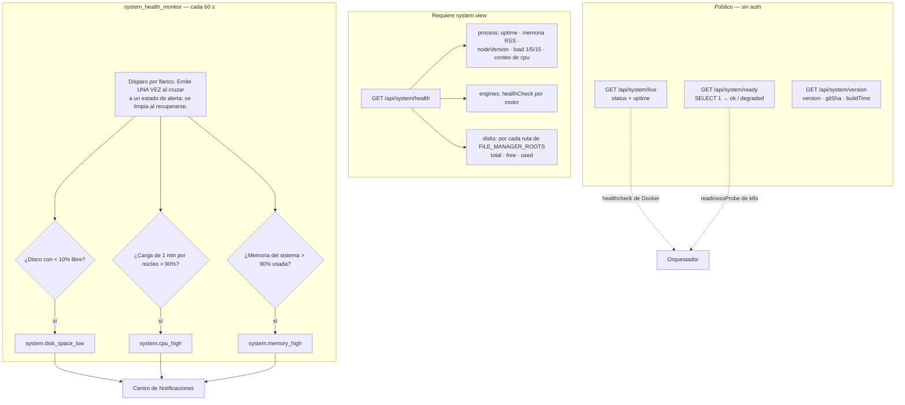

# Sistema y Configuración

## Resumen

Esta página cubre la plomería: el módulo **Sistema** (sondas de salud, monitoreo de recursos, información de versión y actualizaciones) y el módulo **Configuración** (el almacén clave/valor desde el que todo lo demás se configura).

Ninguno es glamoroso. Ambos son estructurales — las sondas de salud son lo que tu orquestador usa para decidir si UltraTorrent está vivo, y el almacén de configuración es donde vive de verdad la mitad de la configuración del producto.

Ambos son módulos **core** (`system`, permiso `system.view` / `system.manage`; `settings`, permiso `settings.view` / `settings.manage`).

## Por qué / cuándo usarlo

- **Estás desplegando bajo Docker, Kubernetes o systemd** y necesitas endpoints de liveness/readiness.
- **Quieres que te avisen antes de que el disco se llene** y no después.
- **Estás diagnosticando una instancia lenta o trabada** y necesitas ver la carga, la memoria, la salud de los motores y el espacio libre en un solo lugar.
- **Necesitas saber exactamente qué build está corriendo** cuando reportas un error.

## Conceptos

**Liveness** (`/api/system/live`) — "¿el proceso está corriendo?" **Público, sin auth.** Devuelve `{ status: 'ok', uptime }`.

**Readiness** (`/api/system/ready`) — "¿de verdad puede atender tráfico?" **Público, sin auth.** Ejecuta un `SELECT 1` contra Postgres y devuelve `{ status: 'ok' | 'degraded', database: boolean }`.

**Versión** (`/api/system/version`) — **público**. Devuelve el nombre del producto, la versión, la edición, la versión de la API, el tag de git, el SHA de git, la hora de build y la versión de Node.

**Salud** (`/api/system/health`) — la superficie de diagnóstico de verdad. **Requiere `system.view`.**

**Configuración** — una **tabla plana de clave → valor**, no un esquema estructurado. Las claves son cadenas con espacios de nombres separados por puntos (`general.theme`, `engine.pollIntervalMs`). Un `GET` devuelve un solo mapa plano.

## Cómo funciona



### El monitor de recursos

`system_health_monitor` corre cada **60 segundos** y es **de disparo por flanco**: emite una vez cuando se cruza un umbral y se limpia al recuperarse. No vuelve a alertar cada minuto mientras la condición persiste, que es por lo que puedes conectarlo directo a tu celular sin miedo.

| Alerta | Umbral | Evento |
|-------|-----------|-------|
| Disco | Cualquier ruta de `FILE_MANAGER_ROOTS` con **< 10 % libre** | `system.disk_space_low` (con `path` y `freePercent`) |
| CPU | Carga promedio de 1 minuto **por núcleo > 90 %** | `system.cpu_high` (con `loadPercent`) |
| Memoria | Memoria del sistema **> 90 % usada** | `system.memory_high` (con `usedPercent`) |

:::caution Los umbrales están fijos en el código
10 %, 90 % y 90 % son **constantes, no ajustes**. Hoy no hay forma de configurarlos.

Además: el estado de alerta se rastrea **en memoria**, así que **se reinicia al reiniciar el servicio** — después de un reinicio, una condición que siga incumpliendo el umbral volverá a alertar una vez.
:::

## Configuración

### Endpoints del sistema

| Método | Ruta | Auth | Permiso |
|--------|------|------|-----------|
| GET | `/api/system/live` | **Público** | — |
| GET | `/api/system/ready` | **Público** | — |
| GET | `/api/system/version` | **Público** | — |
| GET | `/api/system/health` | Bearer | `system.view` |
| GET | `/api/system/update` | Bearer | `system.view` |
| POST | `/api/system/update/check` | Bearer | `system.view` |
| PATCH | `/api/system/update/settings` | Bearer | **`system.manage`** |

:::info Solo un Super Admin puede activar o desactivar las verificaciones de actualización
El rol **Administrator** está definido como *todos los permisos excepto `system.manage`*. Como `PATCH /api/system/update/settings` es la única ruta que lo requiere, **solo un Super Admin puede habilitar o deshabilitar las verificaciones de actualización en segundo plano.**
:::

`GET /api/system/health` devuelve:

- **`process`** — `uptime` (segundos), `memory` (resident set size, bytes), `nodeVersion`, `load` (el trío de 1/5/15 minutos) y `cpus` (conteo de núcleos).
- **`engines`** — por cada motor registrado: `{ engineId, kind, online, latencyMs, version, error, checkedAt }`.
- **`disks`** — por cada ruta de `FILE_MANAGER_ROOTS`: `{ path, total, free, used }` en bytes, o un error `unavailable`.

### Configuración

La configuración es un **almacén plano de clave/valor**, no secciones. Hay seis claves predefinidas:

| Clave | Predeterminado |
|-----|---------|
| `general.productName` | `"UltraTorrent"` |
| `general.theme` | `"dark"` |
| `security.refreshTokenTtlDays` | `30` |
| `security.accessTokenTtlMinutes` | `15` |
| `engine.pollIntervalMs` | `2000` |
| `fileManager.defaultRootPath` | `""` (vacío = usar tal cual el límite de la variable de entorno `FILE_MANAGER_ROOTS`) |

Cada escritura emite `system.settings_changed` al bus de notificaciones llevando **solo la clave** — nunca el valor, que puede ser sensible.

:::warning Dos cosas de la configuración que te van a hacer tropezar

**1. Los valores en la tabla `settings` NO están cifrados.** Se guardan como JSON en texto plano. El cifrado existe en UltraTorrent — AES-256-GCM vía `SecretCipher` — pero protege los secretos en *las tablas propias de otros módulos*: contraseñas de motores, claves API de indexadores y de Prowlarr, credenciales de canales de notificación, tokens de servidores de medios, secretos TOTP y la clave API de IMDb. **No pongas un secreto en el almacén genérico de configuración.**

**2. La *página* de Configuración no es un esquema.** Más allá de unas pocas tarjetas hechas a propósito (Ruta raíz predeterminada, ajustes de correo, imágenes de boletines, Prowlarr), auto-renderiza una **lista genérica de clave/valor con las claves que resulten existir en la base de datos** — eligiendo el widget según el tipo de JavaScript del valor (booleano → un interruptor, número → un campo numérico, objeto → JSON de solo lectura, cualquier otra cosa → una caja de texto).

Así que las "secciones" que ves dependen enteramente de qué claves haya en la tabla. Dos instalaciones pueden mostrar páginas de Configuración distintas.
:::

`fileManager.defaultRootPath` es una **clave protegida**. Escribirla mediante `PUT /api/settings/:key` o `PATCH /api/settings` devuelve un **`403`** que te dice que uses la ruta dedicada, `PUT /api/files/root`, que requiere el permiso aparte `settings.manage_root_path` y valida la ruta contra las raíces duras. Consulta [Gestor de Archivos](/modules/files).

| Método | Ruta | Permiso |
|--------|------|-----------|
| GET | `/api/settings` | `settings.view` |
| PUT | `/api/settings/:key` | `settings.manage` |
| PATCH | `/api/settings` | `settings.manage` (upsert masivo) |
| PUT | `/api/files/root` | `settings.manage_root_path` |

## Guía paso a paso

**1. Conecta las sondas a tu orquestador.**

Docker Compose:

```yaml
healthcheck:
  test: ["CMD", "curl", "-fsS", "http://localhost:4000/api/system/live"]
  interval: 30s
  timeout: 5s
  retries: 3
```

Kubernetes:

```yaml
livenessProbe:
  httpGet: { path: /api/system/live, port: 4000 }
readinessProbe:
  httpGet: { path: /api/system/ready, port: 4000 }
```

Usa **liveness** para decidir si reiniciar el contenedor, y **readiness** para decidir si mandarle tráfico. `/ready` verifica la base de datos; `/live` no.

**2. Mira `/api/system/health` una vez, con calma.** Es la mejor superficie de diagnóstico del producto: carga y memoria del proceso, la salud de cada motor con latencia y versión, y el espacio libre de cada raíz configurada. Guárdala en marcadores.

**3. Conecta las alertas de recursos al [Centro de Notificaciones](/modules/notification-center).** `system.disk_space_low` es la que te va a salvar. Activa su regla predefinida, apúntala a un canal que de verdad leas, y ponle `severity: critical` con `quietHoursOverride: true` — un disco lleno a las 3 a. m. bien vale despertarse.

**4. Revisa la versión.** `GET /api/system/version` (público) te da la versión, el tag de git, el SHA de git y la hora de build. Inclúyelo siempre cuando reportes un error.

**5. Deja quietos los ajustes que no entiendas.** La página de Configuración auto-renderiza las claves que existan. Si no sabes qué hace una clave, no está ahí para que la toquetees.

## Capturas de pantalla


:::tip Mira este tutorial
_Video próximamente._
:::

## Ejemplos del mundo real

### Que te avisen antes de que el disco se llene, no después

Un stack de medios llena su disco calladito y luego todo falla de formas confusas a la vez: las descargas se estancan, los renombrados fallan, la base de datos se niega a escribir. El monitor revisa cada 60 segundos y dispara `system.disk_space_low` cuando **cualquier** ruta de `FILE_MANAGER_ROOTS` baja de **10 % libre** — una sola vez, en el flanco, no cada minuto. Conecta ese evento a Telegram por el [Centro de Notificaciones](/modules/notification-center) y tendrás horas de aviso en vez de una mañana rota.

### Darle a Kubernetes una señal de readiness honesta

`/api/system/live` dice que el proceso está arriba. `/api/system/ready` dice que la **base de datos es alcanzable**. Esos son fallos genuinamente distintos, y confundirlos es como terminas con un pod que se reinicia en bucle cuando el problema real es Postgres. Apunta `livenessProbe` a `/live` y `readinessProbe` a `/ready`, y el orquestador dejará de mandarle tráfico a una instancia que no puede atenderlo — sin matarla.

### Diagnosticar una instancia lenta en una sola petición

Algo se siente mal. `GET /api/system/health` te dice, en un solo payload: la carga promedio de 1/5/15 minutos frente a tu conteo de núcleos (¿está saturada la máquina?), la memoria residente, la salud de cada motor con su **latencia** (¿se trabó rTorrent?), y el espacio libre por raíz (¿te quedaste sin disco?). Con eso normalmente basta para saber dónde mirar después.

## Solución de problemas

| Síntoma | Causa | Solución |
|---------|-------|-----|
| `/api/system/ready` devuelve `degraded` | La base de datos no es alcanzable — el `SELECT 1` falló. | Revisa Postgres, sus credenciales y la red entre ella y el backend. |
| El contenedor se reinicia en bucle | Tu sonda de liveness apunta a `/ready`, así que un tropiezo temporal de la base de datos mata el contenedor. | Apunta **liveness** a `/live` y **readiness** a `/ready`. Existen para preguntas distintas. |
| No puedo activar ni desactivar las verificaciones de actualización | `PATCH /api/system/update/settings` requiere **`system.manage`**, y el rol Administrator está definido explícitamente como *todo excepto `system.manage`*. | Usa una cuenta **Super Admin**. |
| La alerta de disco se dispara de nuevo después de un reinicio | El estado de alerta se rastrea **en memoria** y se reinicia al reiniciar, así que una condición que siga incumpliendo el umbral vuelve a alertar una vez. | Es lo esperado. Arregla el disco. |
| Quiero cambiar los umbrales de 10 % / 90 % | Son **constantes fijas en el código**, no ajustes. | Hoy no es configurable. |
| Una clave de configuración no guarda: `403` | `fileManager.defaultRootPath` es una **clave protegida** y no se puede escribir por los endpoints genéricos de configuración. | Usa **Configuración → Ruta raíz predeterminada**, que llama a `PUT /api/files/root` y necesita `settings.manage_root_path`. |
| La insignia de versión no muestra hash de commit | Históricamente, el commit de git solo se incrustaba cuando se pasaban build args. Arreglado: ahora **siempre** se incrusta. | Actualiza, y reconstruye con el wrapper de build canónico. |
| Dos instalaciones muestran páginas de Configuración distintas | Es lo esperado. Más allá de las tarjetas hechas a propósito, la página auto-renderiza **las claves que existan en la base de datos**, eligiendo un widget según el tipo de JavaScript del valor. | No es un error. |
| Puse una clave API en el almacén de configuración y está en texto plano | **Los valores de configuración no están cifrados.** El cifrado protege los secretos en las tablas propias de *otros módulos*, no en esta. | Nunca guardes un secreto aquí. Usa el módulo que lo posee — motores, indexadores, canales de notificación e integraciones con servidores de medios cifran todos sus propias credenciales. |

## Buenas prácticas

- **Apunta liveness y readiness a los endpoints correctos.** `/live` para "reiníciame", `/ready` para "mándame tráfico".
- **Conecta `system.disk_space_low` a un canal que de verdad leas**, con una anulación de horas de silencio. Es la alerta de mayor valor del producto.
- **Nunca pongas un secreto en el almacén de configuración.** Es texto plano.
- **Incluye la salida de `GET /api/system/version` en cada reporte de error.** Versión, tag de git, SHA de git, hora de build.
- **Restringe `system.manage`.** Es el único permiso que Administrator deliberadamente no tiene.
- **No toquetees claves de configuración que no reconozcas.** La página renderiza lo que haya en la tabla, incluyendo claves que nunca debiste tocar.

## Errores comunes

- **Usar `/ready` como sonda de liveness**, lo que convierte un hipo transitorio de la base de datos en un bucle de reinicios.
- **Guardar una clave API o una contraseña en el almacén genérico de configuración**, donde está en texto plano.
- **Esperar que los umbrales de salud sean configurables.** Son constantes.
- **Intentar establecer la Ruta raíz predeterminada con `PATCH /api/settings`.** Está protegida; tiene su propia ruta y su propio permiso.
- **Asumir que Administrator lo puede todo.** No puede activar ni desactivar las verificaciones de actualización.

## Preguntas frecuentes

**¿Los endpoints de salud son públicos?**
`/live`, `/ready` y `/version` son **públicos y sin autenticación** — los orquestadores no pueden enviar un bearer token. `/health`, que es el detallado, requiere `system.view`.

**¿Cada cuánto corre el monitor de recursos?**
Cada **60 segundos**, y es **de disparo por flanco** — alerta una vez al cruzar un umbral y se limpia al recuperarse, en vez de volver a alertar cada minuto.

**¿Puedo cambiar los umbrales de alerta?**
No. 10 % de disco libre, 90 % de carga por núcleo y 90 % de memoria están fijos en el código.

**¿La configuración está cifrada?**
**No.** Los valores en la tabla `settings` son JSON en texto plano. Los secretos viven en la tabla del módulo que los posee, cifrados con AES-256-GCM (contraseñas de motores, claves API de indexadores y de Prowlarr, credenciales de canales de notificación, tokens de servidores de medios, secretos TOTP, la clave API de IMDb).

**¿Por qué mi página de Configuración se ve distinta a la de otra persona?**
Porque más allá de unas pocas tarjetas hechas a propósito, auto-renderiza las claves que existan en la base de datos, eligiendo un widget según el tipo del valor. No es un esquema fijo.

**¿Por qué mi cuenta Administrator no puede cambiar el ajuste de actualización?**
Administrator está definido como *todos los permisos excepto `system.manage`* — y esa ruta es la única que lo requiere. Usa un Super Admin.

**¿Dónde encuentro qué build estoy corriendo?**
`GET /api/system/version`, o la insignia de versión en el encabezado de la app, que muestra el tag de la versión y el commit de git abreviado.

## Lista de verificación

- [ ] `curl /api/system/live`. Esperado: `{ status: 'ok', uptime }`, **sin auth**.
- [ ] `curl /api/system/ready`. Esperado: `{ status: 'ok', database: true }`.
- [ ] Detén Postgres y vuelve a revisar `/ready`. Esperado: `degraded`, `database: false` — y `/live` sigue en `ok`.
- [ ] Llama a `/api/system/health` con `system.view`. Esperado: process, engines (con latencia y versión) y disks (con bytes libres por raíz).
- [ ] Conecta las sondas a tu orquestador. Esperado: liveness → `/live`, readiness → `/ready`.
- [ ] Activa la regla de notificación `system.disk_space_low`. Esperado: se dispara cuando una raíz baja de 10 % libre.
- [ ] Revisa la insignia de versión. Esperado: un tag de versión y un hash de commit abreviado.
- [ ] Confirma que no hay ningún secreto guardado en la tabla genérica de configuración. Esperado: ninguno.

## Ver también

- [Gestor de Archivos](/modules/files) — la Ruta raíz predeterminada y sus reglas de clave protegida.
- [Centro de Notificaciones](/modules/notification-center) — enrutar las alertas `system.*`.
- [Motores](/modules/engines) — la salud de motores que reporta `/health`.
- [Resumen de módulos](/modules/) — el registro de módulos.
- [Referencia de entorno](/reference/environment) — las variables detrás de todo esto.
- [Ajuste de rendimiento](/operate/performance)
- [Solución de problemas](/operate/troubleshooting)
- [Respaldo](/operate/backup)
