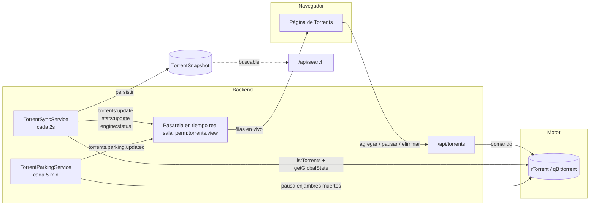

# Torrents

## Resumen

**Torrents** es el módulo en el que vas a pasar más tiempo. Es la lista de todo lo que tu motor de torrents está haciendo, la vista de detalle de cualquiera de ellos, y las acciones que tomas sobre ellos: agregar, iniciar, detener, pausar, reanudar, reverificar, mover, limitar y eliminar.

Es un módulo **core** (id `torrents`) y depende de [Motores](/modules/engines) — el módulo de torrents no tiene lógica de descarga propia. Lee y le da órdenes a cualquier motor que tengas conectado. Esa separación es deliberada: cambiar rTorrent por qBittorrent no cambia nada en esta página.

## Por qué / cuándo usarlo

Esta es tu superficie de control para las descargas en curso. Vienes aquí para:

- **Agregar** algo por enlace magnet, URL remota de `.torrent`, o subiendo un archivo `.torrent`.
- **Observar** el progreso, la velocidad, el ratio, el tiempo restante, las semillas y los pares en tiempo real.
- **Intervenir** — pausar un torrent que se está comiendo tu ancho de banda, reverificar uno cuyos datos se ven mal, eliminar uno que ya no quieres.
- **Actuar en masa** — detener 40 torrents completados de una vez en lugar de 40 veces.

Todo lo que hace la automatización ([RSS](/modules/rss), [Descarga Inteligente](/modules/smart-download), [Episodios Faltantes](/modules/missing-episodes)) termina aterrizando aquí. Cuando la automatización sale mal, aquí es donde lo ves.

## Requisitos previos

- **Un motor configurado y habilitado.** Sin motor, la página de torrents muestra un estado vacío diciéndote que configures uno. No hay una fila de motor predeterminada incluida — tú la creas. Mira [Motores](/modules/engines).
- El permiso `torrents.view` para ver algo. Cada acción tiene su propio permiso (más abajo).

## Conceptos

**Info-hash** — la identidad única del torrent, una cadena hexadecimal en minúsculas. Cada ruta se dirige a un torrent por su hash, no por su nombre. Dos torrents con el mismo hash son el mismo torrent, sin importar cómo se llame el archivo.

**Estado** — uno de `downloading`, `seeding`, `paused`, `stopped`, `queued`, `checking`, `error`, `completed`, `allocating`, `unknown`. Ojo: `paused` y `stopped` son *estados distintos*, con acciones distintas, porque los motores subyacentes los diferencian.

**Ratio** — subido ÷ descargado. El número que les importa a los trackers privados.

**Etiqueta** — una sola etiqueta de texto libre que el propio motor guarda en el torrent. Se muestra debajo del nombre en la lista, y es contra lo que compara el filtro `category`.

**Ruta de guardado** — el directorio en disco al que escribe el motor. Importa mucho más allá de esta página: el [Gestor de Medios](/modules/media-manager) solo organiza automáticamente una descarga completada cuya ruta de guardado caiga dentro de la raíz de una biblioteca habilitada.

**Cola de estacionamiento** — un corral para torrents muertos, para que no puedan bloquear a los sanos. Se explica completa más abajo.

**Sincronización de torrents** — la tarea en segundo plano que reconcilia la visión de UltraTorrent con la del motor. Corre cada **2 segundos** y es lo que hace que la lista esté viva.

## Cómo funciona

La lista que ves te llega empujada: la tarea de sincronización sondea el motor cada 2 segundos y transmite `torrents:update`, `stats:update` y `engine:status` a la sala `perm:torrents.view` — así que un usuario sin `torrents.view` nunca recibe ni un solo byte de datos de torrents por el socket. El navegador además hace un sondeo más lento de red de seguridad (cada 10 segundos) por si el socket se cae.

Cada tic de sincronización también escribe una fila `TorrentSnapshot`, que es lo que busca `GET /api/search`. Por eso la búsqueda funciona con torrents que ya fueron eliminados del motor.

### La cola de estacionamiento

Esta vale la pena entenderla, porque el fallo que previene es brutal y nada obvio.

Un enlace magnet con **cero seeders nunca puede obtener sus metadatos** — pero el motor lo cuenta como una *descarga activa* todo el tiempo que lo intenta. Junta suficientes magnets muertos y ocuparán permanentemente todas las ranuras de descarga activa que tiene el motor. Todo lo sano se encola detrás de ellos, para siempre. En una instalación real esto produjo **1,137 torrents moviendo 0 bytes**, con 1,114 de ellos reportando cero seeders y 100 ranuras clavadas por torrents que nunca podrían terminar.

`TorrentParkingService` hace un barrido cada **5 minutos**. Un torrent que está en `DOWNLOADING`, por debajo del piso de seeders, sin nadie conectado, sin bytes moviéndose y pasado un período de gracia, se **pausa** y se registra en `parked_torrents`. Un torrent pausado no retiene ninguna ranura, así que el motor promueve un torrent encolado a la ranura liberada — y ese torrent se juzga por sus propios méritos.

Como un torrent pausado nunca anuncia, su conteo de seeders no puede refrescarse por sí solo, así que el servicio **sondea** periódicamente los torrents estacionados forzando su arranque por un momento. Si un enjambre vuelve a la vida, el torrent se desestaciona.

:::warning El estacionamiento viene desactivado
La cola de estacionamiento está **apagada por defecto** (`enabled: false`). Enciéndela si adquieres en volumen automáticamente — sobre todo si alguno de tus indexadores no exige un mínimo de seeders.
:::

## Configuración

### Agregar un torrent

| Método | Cómo | Permiso |
|--------|-----|-----------|
| Enlace magnet | `POST /api/torrents` con `{ magnet }` | `torrents.add` |
| URL remota de `.torrent` | `POST /api/torrents` con `{ url }` | `torrents.add` |
| Subir un archivo `.torrent` | `POST /api/torrents/upload` (multipart, campo `file`) | `torrents.add` |

Las subidas están limitadas a **20 MB**, y un `.torrent` mal formado se rechaza con un `400` *antes* de llegar al motor. Al agregarlo también puedes indicar una **categoría**, **etiquetas** y una **ruta de guardado**.

### Reglas de estacionamiento (clave de configuración `torrents.parking`)

| Opción | Qué hace | Predeterminado | Recomendado |
|--------|--------------|---------|-------------|
| `enabled` | Enciende el barrido de estacionamiento. | `false` | **`true`** si adquieres automáticamente. Déjalo apagado si agregas todo a mano. |
| `minSeeders` | El piso de seeders por debajo del cual un torrent atascado es candidato a estacionarse. | `1` | `1` está bien para la mayoría. Súbelo solo si te estás ahogando en torrents de un solo seeder. |
| `deadAfterMinutes` | Cuánto tiempo debe pasar un torrent con cero seeders y cero progreso antes de estacionarse. | `30` | `30`. Bájalo si las ranuras escasean. |
| `stalledAfterMinutes` | Cuánto tiempo debe pasar un torrent con seeders pero sin movimiento antes de estacionarse. | `180` | `180`. Un enjambre lento no es uno muerto — no te apures. |
| `probeBatchSize` | Cuántos torrents estacionados se sondean por barrido. | `20` | Súbelo solo si tienes cientos estacionados y quieres una recuperación más rápida. |
| `probeIntervalMinutes` | Cada cuánto se vuelve a sondear un torrent estacionado. | `60` | `60`. |
| `maxProbeIntervalMinutes` | El techo hasta el que crece el retroceso del sondeo. | `1440` (24 h) | `1440`. Un torrent muerto por un día probablemente está muerto. |

Administra esto en **Descargas → Torrents → Estacionamiento**, o vía `PATCH /api/torrents/parking/settings` (`torrents.pause`).

### Permisos

Cada acción se protege por separado — puedes construir un rol que pueda pausar pero no eliminar.

| Permiso | Otorga |
|-----------|--------|
| `torrents.view` | Ver la lista, el detalle, los archivos, los pares, los rastreadores; recibir actualizaciones en tiempo real. |
| `torrents.add` | Agregar por magnet, URL o subida de archivo. |
| `torrents.start` / `.stop` / `.pause` / `.resume` | La acción de ciclo de vida correspondiente. |
| `torrents.recheck` | Forzar una reverificación de los datos. |
| `torrents.delete` | Quitar el torrent (dejando los datos). |
| `torrents.delete_data` | Quitar el torrent **y sus archivos en disco**. |
| `torrents.move` | Mover el almacenamiento de un torrent. |
| `torrents.manage_limits` | Fijar límites de subida/bajada por torrent. |
| `torrents.manage_files` | Fijar la prioridad por archivo (omitir / normal / alta). |
| `torrents.manage_trackers` | Agregar o quitar trackers. |

:::danger `delete` y `delete_data` son permisos distintos, a propósito
`torrents.delete` quita el torrent del motor. `torrents.delete_data` **además borra los archivos**. Otorga el segundo deliberadamente, a gente en la que confíes con tu disco.
:::

### Acciones en masa

`POST /api/torrents/bulk` recibe `{ hashes[], action }` donde `action` es uno de `start`, `stop`, `pause`, `resume`, `recheck`, `remove`, `removeData`. El servicio vuelve a verificar el permiso **específico de la acción** para cada uno, así que un usuario con `torrents.pause` pero sin `torrents.delete` no puede eliminar en masa. Devuelve conteos `{ succeeded, failed }` — un hash malo no aborta el lote.

### Filtrado, búsqueda y ordenamiento

`GET /api/torrents` acepta `engineId`, `state`, `category`, `search`, `sortBy`, `sortDir`, `page`, `pageSize` (predeterminado 50, tope duro 500).

- **Search** compara contra el **nombre o el hash** del torrent, sin distinguir mayúsculas.
- **Category** filtra por el `label` del torrent.
- El ordenamiento por defecto es primero lo agregado más recientemente.
- La UI agrega píldoras de filtro por estado (todos / descargando / compartiendo / completados / pausados / con errores), una caja de búsqueda con 350 ms de debounce, y columnas ordenables.

## Recorrido paso a paso

**1. Confirma que hay un motor conectado.** El encabezado de la página muestra una insignia de salud del motor. Si dice que el motor está sin conexión, detente aquí y arregla [Motores](/modules/engines) — nada en esta página va a funcionar.

**2. Agrega algo.** Haz clic en **Agregar torrent**, pega un enlace magnet y — importante — fija la **Ruta de guardado** a donde de verdad quieres los datos. Si la dejas en el valor predeterminado del motor, todo termina en un solo directorio plano y el Gestor de Medios no lo va a organizar.

**3. Míralo arrancar.** En unos dos segundos la fila aparece y empieza a moverse. Si se queda en 0% en `downloading` con 0 semillas, tienes un magnet muerto — mira Solución de problemas.

**4. Usa la vista de detalle.** Haz clic en la fila. Obtienes Archivos (con prioridad por archivo), Pares y Rastreadores. Pon la prioridad de un archivo en **Omitir** para evitar descargar la muestra y el `.nfo`.

**5. Administra la finalización.** Cuando termina, pasa a `seeding`. Déjalo compartiendo si estás en un tracker privado y te importa el ratio. Si no, selecciona los completados y **detenlos** en masa.

**6. Enciende el estacionamiento** si estás automatizando la adquisición. **Descargas → Torrents → Estacionamiento** → activar. Luego regresa en un día: la lista de estacionamiento te dice exactamente cuáles capturas llegaron muertas, lo cual es una señal excelente sobre tus indexadores.

## Capturas de pantalla

:::tip Mira este tutorial
_Video próximamente._
:::

## Ejemplos del mundo real

### Recuperar una cola de descargas atascada

Notas que tu velocidad de descarga es cero en todo, pero el motor dice que tiene 100 descargas activas. Ordena por semillas ascendente: vas a encontrar un muro de magnets con cero seeders atascados en 0%, cada uno reteniendo una ranura activa mientras caza metadatos en vano. Selecciónalos y **elimínalos** en masa, luego ve a **Estacionamiento** y actívalo para que no vuelva a pasar. Después arregla la causa raíz: pon un piso `minSeeders` en cada [indexador](/modules/indexers), porque un indexador sin piso te va a seguir entregando lanzamientos muertos por siempre.

### Liberar ancho de banda sin perder tu ratio

Necesitas recuperar tu subida para una videollamada. Selecciona tus torrents compartiendo y **pausa** en masa (no detener — pausar es reanudable y los motores lo tratan distinto). Cuando termines, selecciónalos otra vez y **reanuda** en masa. Tu ratio no se afecta; simplemente no estuviste subiendo por una hora.

### Omitir la basura dentro de un pack de temporada

Capturaste un pack de temporada que incluye muestras, archivos `.nfo` y una carpeta `Subs/` en doce idiomas que no lees. Abre el detalle del torrent, ve a **Archivos**, y pon todo lo que no quieras en prioridad **Omitir** (`0`). El motor no descargará esas piezas para nada. (Para archivos que *ya* están en disco, usa el asistente de limpieza del [Gestor de Archivos](/modules/files).)

## Solución de problemas

| Síntoma | Causa | Solución |
|---------|-------|-----|
| "No hay motor de torrents configurado" | No hay ninguna fila de motor. UltraTorrent no crea una por defecto. | Crea una en **Descargas → Motores**. Mira [Motores](/modules/engines). |
| Cientos de torrents, cero bytes moviéndose, DHT sano | Los magnets muertos están reteniendo todas las ranuras de descarga activa. Un magnet con 0 seeders nunca puede obtener metadatos pero igual cuenta como descarga activa. | Activa la **cola de estacionamiento**. Luego fija `minSeeders` en cada indexador — esto se causa aguas arriba, por un indexador sin piso de seeders. |
| Un magnet aparece como "fallido" pero descarga bien un minuto después | Históricamente, la confirmación de agregado de rTorrent esperaba ~6 s a que el info-hash se registrara, lo cual está bien para un archivo `.torrent` pero está mal para un magnet (rTorrent no lista el hash de un magnet hasta que obtiene los metadatos del DHT). Esto causaba una avalancha de eventos `download.failed` falsos — en un host, 257 "fallos" de los cuales **256 en realidad cargaron**. Arreglado: los magnets ahora se tratan como *aceptados/pendientes*, y la sincronización de 2 segundos reconcilia cuando se registran. Los archivos `.torrent` siguen fallando en duro, así que un archivo genuinamente roto sigue saliendo a la luz. | Actualiza. Si sigues viéndolo, revisa los registros del motor. |
| Los torrents completados "comparten para siempre" pese a una regla de eliminación que funciona | Dos bugs históricos distintos: el `delete` de rTorrent no verificaba la eliminación (ahora verifica + reintenta), y las reglas de automatización de `torrent.completed` solo se disparaban en el *borde de completado*, así que un torrent que ya estaba completo cuando se escribió la regla nunca se disparaba. Ambos arreglados. | Actualiza. Luego vuelve a revisar la regla en [Automatización](/modules/automation). |
| La lista está estancada / no se actualiza | El WebSocket se cayó, o te falta `torrents.view`. | El navegador sondea cada 10 s como respaldo, así que una lista estancada usualmente significa un problema de permisos. Revisa tu rol. |
| Un torrent está atascado en `checking` | El motor está verificando los datos contra las piezas. | Espera. En un torrent grande sobre almacenamiento lento esto toma un rato. No está colgado. |
| Eliminar un torrent dejó los archivos atrás | Usaste `delete`, no `delete with data`. Ese es el comportamiento diseñado. | Usa **Eliminar + datos** (necesita `torrents.delete_data`), o limpia en el [Gestor de Archivos](/modules/files). |
| La insignia de un motor parpadea entre en línea y sin conexión | El motor se está cayendo y reiniciando bajo carga. rTorrent 0.9.8 tiene un crash `priority_queue_insert` sin arreglar aguas arriba que es **impulsado por la carga** — un host con 752 torrents se cayó 44 veces en 4 días; otro con 7 torrents en el mismo build no se cayó ni una vez. | Mira [Motores → Solución de problemas](/modules/engines). No se pierde ningún torrent — la sesión se recarga. |

## Buenas prácticas

- **Siempre fija una ruta de guardado.** Es la diferencia entre una biblioteca organizada y un directorio de 4 TB llamado `/downloads`.
- **Activa el estacionamiento si automatizas.** El fallo que previene es silencioso, total y toma horas de diagnosticar sin él.
- **Separa `delete` de `delete_data` en tus roles.** La mayoría de la gente nunca necesita borrar archivos desde la UI web.
- **Usa las acciones en masa.** Vuelven a verificar los permisos por acción y reportan el éxito por elemento, así que son seguras.
- **Vigila la insignia de salud del motor**, no la lista de torrents, cuando las cosas se vean mal. Un motor muerto se ve exactamente igual que "nada está descargando".

## Errores comunes

- **Confundir pausar y detener.** Son estados distintos del motor con permisos distintos. Pausar es el reversible, el que quieres la mayoría de las veces.
- **Eliminar un torrent para liberar espacio en disco.** La eliminación simple no toca los archivos. Necesitas eliminar-con-datos, o el Gestor de Archivos.
- **Agregar un torrent sin categoría** y luego preguntarte por qué la regla de Automatización basada en esa categoría nunca se disparó.
- **Asumir que una descarga en 0% es un bug de UltraTorrent.** Casi siempre es un enjambre muerto. Revisa el conteo de semillas.
- **Intentar cambiar la categoría de un torrent después de agregarlo.** Actualmente no hay endpoint para eso — mira abajo.

## Preguntas frecuentes

**¿Qué tan rápido se actualiza la lista?**
La tarea de sincronización consulta el motor cada **2 segundos** y empuja el resultado por WebSocket. El navegador además sondea cada 10 segundos como respaldo.

**¿Puedo cambiar la categoría o la etiqueta de un torrent después de agregarlo?**
Actualmente no. La categoría y las etiquetas solo se pueden fijar **al agregarlo**. No hay `PATCH /api/torrents/:hash` ni ruta para asignar etiqueta.

**¿Puedo forzar un reanuncio?**
No. No hay acción de reanuncio en la API, ni en la interfaz del proveedor, ni en la UI.

**¿Puedo fijar la prioridad de un torrent completo?**
No vía la API. La prioridad de **archivo** sí está expuesta (`skip` / `normal` / `high`); la prioridad a nivel de torrent existe en la interfaz del proveedor pero no tiene ruta.

**¿Por qué tengo dos botones de "eliminar"?**
Porque borrar los archivos es irreversible y eliminar el torrent no lo es. Son permisos separados para que un administrador pueda otorgar uno sin el otro.

**¿La búsqueda solo cubre torrents activos?**
No — `GET /api/search` busca filas `TorrentSnapshot` persistidas (por nombre, hash, etiqueta y ruta de guardado), así que puede encontrar torrents que ya fueron eliminados del motor.

## Lista de verificación

- [ ] Abre **Descargas → Torrents**. Esperado: una insignia de salud del motor mostrando en línea, y la lista renderizando.
- [ ] Agrega un magnet bien sembrado con una ruta de guardado explícita. Esperado: la fila aparece en ~2 s y empieza a progresar.
- [ ] Abre su vista de detalle. Esperado: las pestañas Archivos, Pares y Rastreadores se llenan.
- [ ] Pon un archivo en **Omitir**. Esperado: el tamaño total de descarga baja.
- [ ] Pausalo y luego reanúdalo. Esperado: los cambios de estado se reflejan dentro de un tic de sincronización.
- [ ] Selecciona varios torrents y detenlos en masa. Esperado: un resultado `{ succeeded, failed }`, y todas las filas cambian de estado.
- [ ] Activa la cola de estacionamiento. Esperado: en 5 minutos, cualquier torrent muerto con 0 seeders queda pausado y listado bajo Estacionamiento.
- [ ] Confirma que el registro de auditoría registró tu agregado y tu eliminación. Mira [Auditoría](/modules/audit).

## Ver también

- [Motores](/modules/engines) — el cliente por debajo, y cómo conectarlo.
- [Automatización RSS](/modules/rss) — de donde viene la mayoría de los torrents.
- [Descarga Inteligente](/modules/smart-download) — el motor de decisiones que captura por ti.
- [Gestor de Archivos](/modules/files) — lidiar con los archivos después del hecho.
- [Automatización](/modules/automation) — reaccionar a `torrent.completed`.
- [Primera descarga](/learn/first-download) — el recorrido guiado.
- [Ajuste de rendimiento](/operate/performance)
