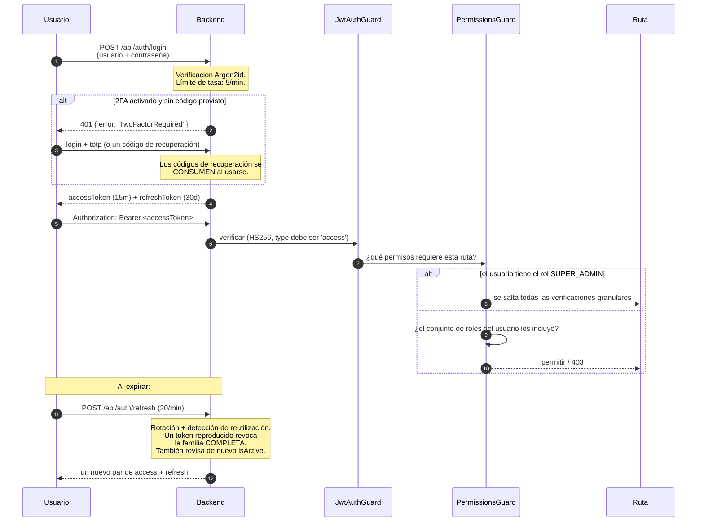

# Usuarios y Roles

## Resumen

**Usuarios** es donde creas cuentas y decides qué pueden hacer. Lo que pueden hacer se expresa como **permisos** — cerca de cien cadenas con espacios de nombres separados por puntos, como `torrents.delete_data` o `media_manager.rename` — que se agrupan en **roles**.

El servidor siempre manda. La UI esconde lo que no puedes hacer por conveniencia; el guard de permisos del backend es lo que de verdad te niega el paso.

Es un módulo **core** (id `users`, permisos `users.view` / `users.manage`) y depende de `auth` y `rbac`.

## Por qué / cuándo usarlo

- **Compartes tu instancia.** Un compañero de casa debería poder navegar y descargar; no debería poder borrar tu biblioteca.
- **Quieres privilegio mínimo.** La mayoría de la gente nunca necesita `torrents.delete_data` ni `settings.manage`.
- **Quieres responsabilidad.** Las acciones de cada usuario quedan atribuidas en el [registro de auditoría](/modules/audit).

## Requisitos previos

- `users.view` para ver usuarios, `users.manage` para crearlos, editarlos o eliminarlos.
- Solo un **Super Admin** puede otorgar el rol Super Admin.

:::danger Cambia la contraseña del admin predefinido de inmediato
Una instalación nueva crea una cuenta de super admin:

| Usuario | `admin` |
|----------|---------|
| **Correo** | `admin@ultratorrent.local` |
| **Contraseña** | **`changeme123!`** |

Cámbiala antes de que la instancia sea accesible para alguien más. Este es el paso cero de toda instalación.
:::

## Conceptos

**Permiso** — una capacidad, como cadena de texto (`torrents.view`, `media_manager.rename`). Existen cerca de cien. Consulta la [referencia de permisos](/reference/permissions).

**Rol** — un paquete con nombre de permisos. Hay cinco predefinidos, y los cinco están marcados como `isSystem`.

**Bypass de super admin** — el rol `SUPER_ADMIN` **se salta todas las verificaciones granulares de permisos** en el guard. No es tanto que "tenga todos los permisos" sino que "nunca se le pregunta".

**Familia de refresh tokens** — las sesiones son refresh tokens organizados en familias, con **rotación y detección de reutilización**. Presentar un refresh token ya revocado revoca la **familia completa** — la suposición es que un token reproducido significa que fue robado.

## Los roles predefinidos

| Rol | Qué incluye |
|------|--------------|
| **Super Admin** | Todo. Se salta las verificaciones granulares por completo. |
| **Administrator** | Todo **excepto `system.manage`**. En la práctica esto significa que solo un Super Admin puede activar o desactivar las verificaciones de actualización en segundo plano. |
| **Power User** | Todos los `torrents.*` **excepto `delete_data`**; categorías y etiquetas; todos los `rss.*`; `automation.view` + `manage`; todos los `indexers.*`; todos los `integrations.prowlarr.*`; todos los `files.*`; `system.view`; casi todos los `media_manager.*` incluyendo IMDb; `notifications.view` + `manage_preferences`. **Nada de `settings.*`, nada de `users.*`, nada de `audit.view`, nada de `apikeys.manage`.** |
| **User** | `torrents.view/add/pause/resume/start/stop`; categorías y etiquetas; `rss.view` + consulta del estado de la serie; `files.view/preview/download`; `media_manager.view`; ver y buscar en IMDb; `notifications.view` + `manage_preferences`. |
| **Read-Only** | `torrents.view`, `rss.view` + consulta del estado de la serie, `automation.view`, `files.view/preview/download`, `system.view`, `media_manager.view`. |

:::warning Los roles personalizados todavía no existen
`GET /api/users/roles` es de **solo lectura**. **No hay ningún endpoint para crear, actualizar o eliminar un rol**, ni una UI de roles personalizados. Existe una cadena de permiso `roles.manage` definida en el catálogo, pero **ninguna ruta la usa actualmente** — está inerte.

Asignas uno o más de los cinco roles predefinidos. Si necesitas un conjunto de permisos que no existe, por ahora estás eligiendo el rol más cercano — o contribuyendo uno. Consulta [RBAC](/develop/rbac).

Ojo también: el seed **borra y recrea** cada mapeo rol → permiso cada vez que corre. Editar a mano los permisos de un rol de sistema en la base de datos no sobrevivirá un nuevo seed.
:::

## Cómo funciona

### Protecciones contra escalada de privilegios

Cuatro reglas se aplican del lado del servidor y vale la pena conocerlas:

- **Solo un Super Admin puede otorgar el rol Super Admin.** Cualquier otro recibe un `403`.
- **Nadie puede cambiar sus propios roles.** Ni siquiera un Super Admin. `403: "You cannot change your own roles"`.
- **Los usuarios de sistema no se pueden eliminar.** `400`.
- **Desactivar un usuario revoca de inmediato todos sus refresh tokens.** Se le cierra la sesión en todas partes, al mismo tiempo.

## Configuración

### Crear un usuario

| Campo | Reglas |
|-------|--------|
| `username` | Obligatorio. |
| `email` | Obligatorio. |
| `displayName` | Opcional, máximo 120 caracteres. |
| `password` | Obligatoria, **mínimo 10 caracteres**. Se hashea con **Argon2id**. |
| `roleNames[]` | Uno o más de los cinco roles predefinidos. |

:::caution La política de contraseñas es deliberadamente mínima
Hay un **mínimo de 10 caracteres** y nada más: **ninguna** regla de complejidad, **ningún** historial de contraseñas, **ninguna** expiración o rotación, y **ninguna** verificación contra filtraciones.

Tampoco hay **flujo de contraseña olvidada ni de restablecimiento**, y **un administrador no puede restablecer la contraseña de otro usuario** — el DTO de actualización no tiene campo de contraseña. El cambio de contraseña es **solo autoservicio** (**Perfil → Contraseña**), y cambiarla revoca todos los refresh tokens de ese usuario.

Si un usuario olvida su contraseña, un operador tiene que restablecerla directamente en la base de datos.
:::

### Autenticación de dos factores

TOTP, con cualquier app de autenticación.

| Aspecto | Detalle |
|--------|--------|
| Algoritmo | TOTP, con una **ventana de ±1 paso (30 s)** para el desfase de reloj. |
| Registro | **Perfil → Dos factores → Configurar** devuelve un secreto, una URL `otpauth://` y un **código QR**. Escanéalo y luego confirma con un código para activarlo. |
| Almacenamiento del secreto | **Cifrado** en reposo. |
| Códigos de recuperación | Se emiten **10** al activarlo, en el formato `xxxxx-xxxxx-xxxxx-xxxxx` (80 bits de entropía). Solo se guardan sus **hashes SHA-256**. |
| Usar un código de recuperación | Ingrésalo en el mismo campo que un código TOTP al iniciar sesión. Se **consume al usarse**. |
| Regenerar códigos | Requiere un código TOTP válido y actual. |
| Desactivar | Requiere la **contraseña de la cuenta**. Borra el secreto y los códigos de recuperación. |

:::warning El 2FA no se puede exigir
**No existe ningún mecanismo** — ni ajuste, ni permiso, ni acción de administrador — para **requerir** 2FA a un usuario, un rol o la instancia. Es **puramente opcional, por usuario**.

Si necesitas a todo el mundo con 2FA, necesitas una política y una persona que la verifique, no un interruptor. Considera poner la instancia detrás de un [proxy inverso](/install/reverse-proxy) que autentique si necesitas MFA obligatorio.
:::

### Sesiones y límites de tasa

| Ajuste | Predeterminado |
|---------|---------|
| TTL del access token | **15 minutos** (`JWT_ACCESS_TTL`) |
| TTL del refresh token | **30 días** (`JWT_REFRESH_TTL_DAYS`) |
| Límite de tasa global | 120 peticiones / 60 s |
| `POST /api/auth/login` | **5 / min** |
| `POST /api/auth/refresh` | **20 / min** |

Los refresh tokens se almacenan **hasheados** (SHA-256), rotan en cada uso y detectan reutilización. Un refresh también vuelve a revisar `isActive` — una cuenta desactivada no puede colarse de vuelta a punta de refresh.

### Endpoints

| Método | Ruta | Permiso |
|--------|------|-----------|
| GET | `/api/users` | `users.view` |
| GET | `/api/users/roles` | `users.view` (solo lectura) |
| POST | `/api/users` | `users.manage` |
| PATCH | `/api/users/:id` | `users.manage` |
| DELETE | `/api/users/:id` | `users.manage` |

**Autoservicio de cuenta** (`/api/account`, autenticado, **sin permiso requerido**):
`GET/PATCH /profile`, `POST /password`, `GET /2fa`, `POST /2fa/setup`, `POST /2fa/enable`, `POST /2fa/disable`, `POST /2fa/recovery`.

## Guía paso a paso

**1. Cambia la contraseña del admin predefinido.** **Perfil → Contraseña**. Haz esto primero, antes que nada, antes de que alguien más pueda alcanzar la instancia.

**2. Activa el 2FA en la cuenta de admin.** **Perfil → Dos factores → Configurar**. Escanea el QR con tu app de autenticación. Ingresa un código para activarlo.

**3. Guarda tus códigos de recuperación en un sitio donde de verdad los vayas a encontrar.** Recibes **diez**, una sola vez. Se guardan solo como hashes, así que nadie — incluyéndote a ti — puede recuperarlos después. **Esta es la única oportunidad.**

**4. Créate un usuario real para ti.** Andar en el día a día con la cuenta `admin` predefinida enturbia el rastro de auditoría. Date una cuenta Administrator con tu propio nombre.

**5. Crea cuentas para otras personas con el rol más bajo que funcione.** Empieza en **User** o **Read-Only**. Escala solo cuando alguien de verdad choque con una pared.

**6. Verifica.** Inicia sesión como el usuario nuevo y confirma que no puede llegar a lo que no debe. La navegación se lo esconderá, pero **prueba una ruta directamente** — el backend es la puerta real, y eso es lo que estás probando.

## Capturas de pantalla

:::tip Mira este tutorial
_Video próximamente._
:::

## Ejemplos del mundo real

### Darle acceso a un compañero de casa sin darle tu biblioteca

Créalo como **User**. Puede ver, agregar, pausar y reanudar torrents, explorar y descargar archivos, y ver la biblioteca de medios. **No puede** eliminar datos de torrents, administrar la configuración, ver el registro de auditoría, administrar usuarios ni tocar tus bibliotecas. Si necesita poder escribir reglas RSS, súbelo a **Power User** — que aun así no puede eliminar datos de torrents ni llegar a la configuración, los usuarios o el registro de auditoría.

### Darle a alguien una cuenta puramente de observación

**Read-Only**. Puede mirar torrents, RSS, reglas de automatización, archivos, salud del sistema y la biblioteca de medios. No puede cambiar absolutamente nada. Este es el rol correcto para un panel en una pared, o para alguien a quien quieres que pueda *diagnosticar* pero no *actuar*.

### Blindar bien una cuenta de admin

Cambia la contraseña. Activa el 2FA y guarda los códigos de recuperación fuera de línea. Créate una cuenta aparte, sin privilegios de admin, para el día a día, y escala a la de admin solo cuando de verdad la necesites. Después revisa el [registro de auditoría](/modules/audit) — cada acción de administrador queda atribuida, y usar una cuenta `admin` compartida destruye esa atribución.

## Solución de problemas

| Síntoma | Causa | Solución |
|---------|-------|-----|
| Un usuario olvidó su contraseña | **No hay flujo de restablecimiento.** No hay endpoint de contraseña olvidada, y un admin **no puede** restablecer la contraseña de otro usuario — el DTO de actualización no tiene campo de contraseña. | Un operador tiene que restablecer el hash directamente en la base de datos. Es una carencia real; planifica para ella. |
| `403: You cannot change your own roles` | Deliberado. Nadie puede escalarse a sí mismo, ni un Super Admin. | Que otro Super Admin lo haga. |
| `403: Only a super admin can grant the SUPER_ADMIN role` | Deliberado. | Inicia sesión como Super Admin. |
| Un usuario desactivado sigue con la sesión abierta | No debería — desactivar **revoca de inmediato todos sus refresh tokens**, y el refresh vuelve a revisar `isActive`. Su access token actual sigue siendo válido hasta que se acabe su TTL de **15 minutos**. | Espera a que venza el TTL del access token. |
| El login devuelve `401 TwoFactorRequired` | La cuenta tiene 2FA activado y no se envió ningún código. Esto no es un login fallido y deliberadamente **no se audita como tal**. | Envía el código TOTP, o un código de recuperación, en el mismo campo. |
| Un código TOTP siempre se rechaza | Desfase de reloj más allá de ±1 paso (30 s). | Sincroniza el reloj del dispositivo que genera los códigos, y el del servidor. |
| Un usuario perdió su app de autenticación y sus códigos de recuperación | Los códigos de recuperación se guardan **solo como hashes SHA-256**. No se pueden recuperar. | Un operador tiene que limpiar los campos de 2FA del usuario en la base de datos. |
| Edité los permisos de un rol de sistema y se revirtieron | El seed **borra y recrea** cada mapeo rol → permiso cada vez que corre. | No edites a mano los roles de sistema. Los roles personalizados todavía no están soportados. |
| No puedo crear un rol personalizado | El CRUD de roles no existe. `GET /api/users/roles` es de solo lectura, y el permiso `roles.manage` no está conectado a nada. | Usa el rol predefinido más cercano. Consulta [RBAC](/develop/rbac). |

## Buenas prácticas

- **Cambia la contraseña del admin predefinido antes de que la instancia sea accesible.** Nada más importa si te saltas esto.
- **Activa el 2FA en toda cuenta privilegiada,** y guarda los códigos de recuperación fuera de línea.
- **No uses la cuenta `admin` predefinida en el día a día.** Destruye la atribución de auditoría.
- **Empieza con el rol más bajo que funcione** y escala solo ante una necesidad real.
- **Separa mentalmente `delete` de `delete_data`.** Power User deliberadamente **no** recibe `torrents.delete_data` — así está diseñado, y está bien diseñado.
- **Desactiva en vez de eliminar.** Desactivar revoca todas las sesiones al instante y conserva el rastro de auditoría.
- **Ten un plan de base de datos para restablecer contraseñas.** No hay flujo dentro de la app.

## Errores comunes

- **Dejar `changeme123!` puesto.** Es lo primero que cualquiera va a probar.
- **Darle Administrator a todo el mundo** porque Power User "no tenía suficiente". Fíjate en qué pared chocaron realmente.
- **Asumir que el 2FA se puede exigir.** No se puede. Es opcional, por usuario.
- **Botar los códigos de recuperación** porque la app de autenticación "está en mi celular y yo nunca pierdo el celular".
- **Asumir que esconder una entrada del menú protege una ruta.** No la protege. El guard del backend sí. Prueba la ruta, no el menú.

## Preguntas frecuentes

**¿Puedo crear un rol personalizado?**
Ahora mismo no. Los roles son los cinco predefinidos, y `GET /api/users/roles` es de solo lectura. El permiso `roles.manage` existe en el catálogo pero no está conectado a nada.

**¿Cuál es la diferencia entre Super Admin y Administrator?**
Administrator tiene todos los permisos **excepto `system.manage`**. En la práctica, solo un Super Admin puede activar o desactivar las verificaciones de actualización en segundo plano. Super Admin además **se salta las verificaciones granulares de permisos por completo** en el guard, en vez de ser comparado contra una lista.

**¿Puedo obligar a todos a usar 2FA?**
No. No hay ningún mecanismo de obligatoriedad. Si necesitas MFA obligatorio, pon la instancia detrás de un proxy inverso que autentique.

**¿Cómo restablezco la contraseña de un usuario?**
Directamente en la base de datos. No hay flujo de contraseña olvidada ni restablecimiento iniciado por el admin. Es una carencia conocida.

**¿Qué pasa si alguien roba un refresh token?**
Los refresh tokens rotan en cada uso y el sistema **detecta la reutilización**: presentar un token ya revocado revoca la **familia completa de tokens**, cerrando la sesión tanto del ladrón como del usuario legítimo. Ese es el comportamiento buscado — un token reproducido significa que algo anda mal.

**¿Se auditan los inicios de sesión?**
Sí — `auth.login`, tanto para éxito como para fallo. Un reto de 2FA pendiente deliberadamente **no** se audita como login fallido.

**¿Cuánto dura una sesión?**
El access token vive **15 minutos**; el refresh token **30 días**. El cliente hace el refresh de forma transparente.

## Lista de verificación

- [ ] Cambia la contraseña del `admin` predefinido. Esperado: la vieja ya no funciona, y todos sus refresh tokens quedan revocados.
- [ ] Activa el 2FA en la cuenta de admin. Esperado: un código QR y luego **diez** códigos de recuperación mostrados **una sola vez**.
- [ ] Cierra sesión y vuelve a entrar con un código TOTP. Esperado: el login funciona.
- [ ] Inicia sesión con un **código de recuperación**. Esperado: funciona, y queda **consumido** — usarlo otra vez falla.
- [ ] Crea un usuario **Read-Only**. Esperado: puede ver pero no cambiar nada.
- [ ] Con ese usuario, llama directamente a un endpoint que modifique algo. Esperado: **403** desde el backend, no solo un botón escondido.
- [ ] Intenta cambiar tus propios roles. Esperado: `403`.
- [ ] Desactiva un usuario. Esperado: sus refresh tokens se revocan de inmediato.
- [ ] Revisa el [registro de auditoría](/modules/audit). Esperado: los inicios de sesión, la creación del usuario y el cambio de rol aparecen todos atribuidos.

## Ver también

- [Referencia de permisos](/reference/permissions) — cada cadena de permiso.
- [RBAC](/develop/rbac) — cómo funciona el guard, y cómo extenderlo.
- [Autenticación](/develop/authentication) — JWT, rotación de refresh, detección de reutilización.
- [Claves API](/modules/api-keys) — y por qué todavía no son una credencial.
- [Registro de auditoría](/modules/audit) — atribución.
- [Seguridad](/operate/security)
