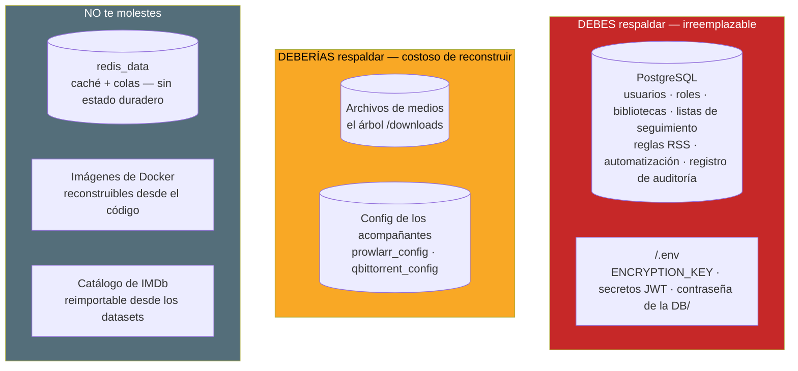
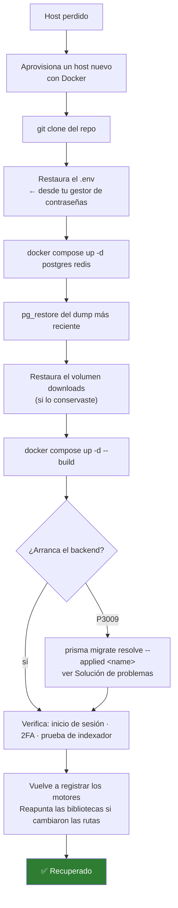

# Backup y Restauración {#backup--restore}

Un backup sin probar es un rumor. Esta página te dice qué es de verdad
irreemplazable, cómo capturarlo, y — la parte que todo el mundo se salta — cómo
**probar que lo puedes restaurar**.

## Propósito {#purpose}

Poder perder el host completo y estar corriendo de nuevo, con tus usuarios,
bibliotecas, reglas e historial intactos.

## Cuándo usar esto {#when-to-use-this}

- **Ahora.** Antes de que lo necesites.
- Antes de cualquier actualización (ver [Actualizar](/install/upgrading)).
- Antes de rotar `ENCRYPTION_KEY` o de hacerle cirugía a la base de datos.
- Antes de mudarte a un servidor nuevo.

## Requisitos previos {#prerequisites}

- Acceso a la shell del host de Docker.
- Un lugar donde poner los backups que **no sea el host que estás respaldando**.

:::tip Mira este tutorial
_Video próximamente._
:::

## Conceptos {#concepts}

### Qué es de verdad irreemplazable {#what-is-actually-irreplaceable}

Sé preciso con esto. Respaldar las cosas equivocadas desperdicia almacenamiento;
respaldar muy pocas pierde tu instalación.



| Elemento | Dónde vive | ¿Respaldarlo? | Por qué |
|------|----------------|-------------|-----|
| **PostgreSQL** | volumen `postgres_data` | **Sí — crítico** | Cada pieza de estado duradero. Usuarios, roles, motores, bibliotecas, elementos de medios, listas de seguimiento, fuentes y reglas RSS, reglas de automatización, trabajos, el registro de auditoría. |
| **`.env`** | Raíz del repo, en el host | **Sí — crítico** | Contiene `ENCRYPTION_KEY`. **No está en tu dump de la base de datos.** |
| **Medios / descargas** | volumen `downloads` | Sí, si lo valoras | Tus medios de verdad. También contiene la sesión de rTorrent en `/downloads/.session`. |
| **Config de Prowlarr** | volumen `prowlarr_config` | Recomendado | Definiciones y ajustes de indexadores. Reconstruible, pero tedioso. |
| **Config de qBittorrent** | volumen `qbittorrent_config` | Recomendado | Ajustes del motor + la sesión de torrents. |
| **Redis** | volumen `redis_data` | **No** | Caché y broker de trabajos. Sin estado duradero. |
| **Catálogo de IMDb** | Dentro de Postgres | Viene gratis con el dump de la DB | Está *en* el dump. Si lo excluyes para ahorrar espacio, lo puedes reimportar desde los datasets. |

:::danger El archivo `.env` es la mitad de tu backup
`ENCRYPTION_KEY` cifra los secretos TOTP, las claves API de los indexadores, la
clave de Prowlarr y las contraseñas de los motores **en reposo, dentro de la base
de datos**. Un dump de Postgres **sin** el `.env` restaura esas columnas como
**texto cifrado indescifrable**. Tendrías tus usuarios y tus bibliotecas, y ningún
2FA ni clave API que sirva.

**Guarda el `.env` en un gestor de contraseñas o en un almacén de secretos, fuera del host.**
:::

### Las dos estrategias de backup {#the-two-backup-strategies}

| Estrategia | Qué es | A favor | En contra |
|----------|------------|------|------|
| **Dump lógico (`pg_dump`)** — *recomendado* | Una exportación de la base de datos en SQL o en formato custom | Portátil entre versiones y arquitecturas de Postgres; se puede tomar **en caliente**, con el stack corriendo; comprime bien | Más lento de restaurar con un catálogo de IMDb muy grande |
| **Snapshot de volumen** | Copiar el directorio `postgres_data` | Rápido | **Hay que detener la base de datos primero** o queda inconsistente; no es portátil entre versiones mayores de Postgres |

Usa `pg_dump`. Usa los snapshots de volumen solo como un *complemento*.

## Pasos {#steps}

### 1. Respalda PostgreSQL {#1-back-up-postgresql}

El formato custom (`-Fc`) va comprimido y restaura selectivamente — prefiérelo.

```bash
cd /path/to/ultratorrent

# Backup en caliente — el stack puede seguir corriendo.
docker compose exec -T postgres \
  pg_dump -U ultratorrent -d ultratorrent -Fc \
  > "ultratorrent-$(date +%F-%H%M).dump"
```

Una variante en SQL plano, si quieres algo que puedas leer y pasarle grep:

```bash
docker compose exec -T postgres \
  pg_dump -U ultratorrent -d ultratorrent \
  | gzip > "ultratorrent-$(date +%F-%H%M).sql.gz"
```

:::tip Excluir el catálogo de IMDb
El catálogo de IMDb puede tener **8.9 millones de filas** y va a dominar el tamaño
de tu dump. Es totalmente reimportable desde los datasets de IMDb, así que lo
puedes excluir:

```bash
docker compose exec -T postgres \
  pg_dump -U ultratorrent -d ultratorrent -Fc \
    --exclude-table-data='imdb_titles' \
    --exclude-table-data='imdb_episodes' \
    --exclude-table-data='imdb_akas' \
  > "ultratorrent-slim-$(date +%F).dump"
```

El **esquema** sigue incluido — solo se salta la data de las filas. Después de
restaurar, reimporta los datasets desde **Medios → Ajustes → IMDb**, y deja que los
índices de trigramas se reconstruyan (se construyen `CONCURRENTLY` en segundo plano
durante el arranque). Tu lista de seguimiento conserva sus ids de IMDb de todos
modos, porque esos viven en *tus* tablas.
:::

### 2. Respalda el `.env` {#2-back-up-env}

```bash
cp .env "env-backup-$(date +%F)"
# ...luego muévelo a un lugar seguro y FUERA de este host.
```

Mejor todavía: pégalo en tu gestor de contraseñas. Es pequeño y es la diferencia
entre una instalación recuperable y una irrecuperable.

### 3. Respalda los medios (opcional, pero casi siempre lo quieres) {#3-back-up-the-media-optional-but-usually-wanted}

```bash
# Encuentra dónde vive de verdad el volumen downloads
docker volume inspect ultratorrent_downloads --format '{{ .Mountpoint }}'

# Luego sincronízalo a otro lado (rsync, restic, borg, un share de NAS, ...)
sudo rsync -aHAX --info=progress2 \
  "$(docker volume inspect ultratorrent_downloads --format '{{ .Mountpoint }}')/" \
  /mnt/backup/ultratorrent-downloads/
```

Si montaste un directorio del host para las descargas en vez de usar el volumen
nombrado, respalda ese directorio directamente — ya sabes dónde está.

### 4. Respalda los volúmenes de los acompañantes (opcional) {#4-back-up-the-companion-volumes-optional}

```bash
for v in prowlarr_config qbittorrent_config; do
  docker run --rm \
    -v "ultratorrent_${v}:/data:ro" \
    -v "$(pwd):/backup" \
    alpine tar czf "/backup/${v}-$(date +%F).tar.gz" -C /data .
done
```

### 5. Automatízalo {#5-automate-it}

Un cron nocturno mínimo que conserva 14 días:

```bash
# /etc/cron.d/ultratorrent-backup
0 3 * * * root cd /path/to/ultratorrent && \
  docker compose exec -T postgres pg_dump -U ultratorrent -d ultratorrent -Fc \
    > /mnt/backup/ultratorrent-$(date +\%F).dump && \
  find /mnt/backup -name 'ultratorrent-*.dump' -mtime +14 -delete
```

:::warning Cron y `$(date)`
Los signos de por ciento hay que escaparlos (`\%`) en los archivos de crontab. Esto
le pasa a todo el mundo una vez.
:::

## Restauración {#restore}

### Restaurar la base de datos {#restoring-the-database}

```bash
# 1. Detén la app para que nada escriba mientras restauras.
docker compose stop backend

# 2. Elimina y vuelve a crear la base de datos.
docker compose exec -T postgres \
  psql -U ultratorrent -d postgres -c "DROP DATABASE IF EXISTS ultratorrent;"
docker compose exec -T postgres \
  psql -U ultratorrent -d postgres -c "CREATE DATABASE ultratorrent OWNER ultratorrent;"

# 3. Restaura el dump.
docker compose exec -T postgres \
  pg_restore -U ultratorrent -d ultratorrent --no-owner --clean --if-exists \
  < ultratorrent-2026-07-11-0300.dump

# 4. Levanta el backend de nuevo. Corre `prisma migrate deploy` al arrancar,
#    así que un dump de una versión MÁS VIEJA se migra hacia adelante automáticamente.
docker compose up -d backend
```

Para un dump en SQL plano:

```bash
gunzip -c ultratorrent-2026-07-11.sql.gz | \
  docker compose exec -T postgres psql -U ultratorrent -d ultratorrent
```

### Restaurar el `.env` {#restoring-env}

Pon el archivo de vuelta en la raíz del repo, y luego recrea:

```bash
docker compose up -d --force-recreate backend
```

:::danger Restaura el `ENCRYPTION_KEY` ORIGINAL
Si restauras un dump de la base de datos pero le pones un `ENCRYPTION_KEY`
**distinto**, cada secreto TOTP y cada clave API de ese dump quedan
indescifrables. El `.env` y el dump son un **par pareado**. Restáuralos juntos.
:::

## Simulacro de restauración {#restore-drill}

**Haz esto una vez, ahora.** Un backup que nunca has restaurado no es un backup.

El simulacro, en un host desechable o en un segundo proyecto de Compose:

```bash
# 1. Directorio nuevo, mismo repo, MISMO .env (ese es el punto).
git clone https://github.com/damirabal/ultratorrent-core.git drill
cd drill
cp /path/to/backup/env-backup-2026-07-11 .env

# 2. Levanta SOLO los almacenes de datos.
docker compose up -d postgres redis

# 3. Espera por Postgres, y luego restaura.
until docker compose exec -T postgres pg_isready -U ultratorrent; do sleep 1; done
docker compose exec -T postgres \
  pg_restore -U ultratorrent -d ultratorrent --no-owner --clean --if-exists \
  < /path/to/backup/ultratorrent-2026-07-11.dump

# 4. Levanta la app.
docker compose up -d --build backend frontend
```

**Ahora verifica — este es el simulacro de verdad:**

- [ ] La UI carga y puedes **iniciar sesión con tu contraseña real**.
- [ ] El **2FA funciona** en una cuenta que lo tenía. *(Esto prueba que el
      `ENCRYPTION_KEY` calzó. Si el 2FA falla, tu `.env` y tu dump no coinciden — el
      fallo de backup roto más común que hay.)*
- [ ] Tus **usuarios y roles** están presentes.
- [ ] Tus **bibliotecas y elementos de medios** están presentes.
- [ ] Tus **fuentes RSS y reglas** están presentes.
- [ ] Una **prueba de conexión de indexador** pasa. *(Esto también prueba que la
      clave de cifrado calzó — la clave API se descifró.)*
- [ ] El **registro de auditoría** tiene tu historial adentro.

Después tumba el simulacro (`docker compose down -v` — seguro, es desechable).

Si alguna de esas falla, **tu backup está roto y te acabas de enterar barato**.

## Recuperación ante desastres {#disaster-recovery}

### El host ya no está. Reconstruye desde cero. {#the-host-is-gone-rebuild-from-scratch}



Secuencia completa:

```bash
# 1. Host nuevo, con Docker instalado.
git clone https://github.com/damirabal/ultratorrent-core.git ultratorrent
cd ultratorrent

# 2. Restaura el .env — el ORIGINAL, con el ENCRYPTION_KEY ORIGINAL.
#    (Desde tu gestor de contraseñas. Lo respaldaste. ¿Verdad?)

# 3. Los almacenes de datos primero.
docker compose up -d postgres redis
until docker compose exec -T postgres pg_isready -U ultratorrent; do sleep 1; done

# 4. Restaura la base de datos.
docker compose exec -T postgres \
  pg_restore -U ultratorrent -d ultratorrent --no-owner --clean --if-exists \
  < /mnt/backup/ultratorrent-latest.dump

# 5. Restaura los medios (si los respaldaste), dentro del volumen downloads.
docker volume create ultratorrent_downloads
sudo rsync -aHAX /mnt/backup/ultratorrent-downloads/ \
  "$(docker volume inspect ultratorrent_downloads --format '{{ .Mountpoint }}')/"

# 6. Todo arriba.
docker compose --profile qbittorrent up -d --build

# 7. Verifica.
docker compose exec backend wget -qO- http://127.0.0.1:4000/api/system/live
```

### Después de cualquier restauración, espera esto {#after-any-restore-expect-these}

| Cosa | Espera | Haz |
|-------|--------|----|
| **Migraciones** | El backend corre `prisma migrate deploy` en el arranque, así que un dump **más viejo** se migra hacia adelante automáticamente | Nada — pero vigila el log |
| **P3009 en el arranque** | Posible si una migración se interrumpe | [Resuélvelo](/operate/troubleshooting#the-backend-restart-loops-after-an-upgrade--prisma-p3009) |
| **Trabajos huérfanos** | Cualquier trabajo que estuviera `running` en el dump | Se reconcilian solos en el arranque — se marcan como fallidos con `Interrupted by a service restart` |
| **Índices de trigramas de IMDb** | Se reconstruyen `CONCURRENTLY` en segundo plano durante el arranque | Nada. Las búsquedas van lentas hasta que terminen |
| **Motores** | Las filas de los motores se restauran, pero los *containers* de los motores son nuevos | Vuelve a probar la conexión bajo **Infraestructura → Motores** |
| **Sesión de torrents** | Vive en el motor, **no** en Postgres | Restaura el volumen `downloads` (la sesión de rTorrent está en `/downloads/.session`) o el volumen de config de qBittorrent |
| **Rutas de las bibliotecas** | Se restauran tal como estaban | Si las rutas del host nuevo son distintas, reapunta las bibliotecas |

:::note La sesión de torrents no está en la base de datos
La base de datos de UltraTorrent registra *lo que sabe sobre* los torrents; el
motor guarda la sesión de verdad. Restaurar solo Postgres te devuelve tus reglas,
bibliotecas e historial — pero el motor va a arrancar con **ningún torrent
cargado** a menos que también restaures su sesión (el volumen `downloads` para
rTorrent, o `qbittorrent_config` para qBittorrent).
:::

## Solución de problemas {#troubleshooting}

| Síntoma después de una restauración | Causa | Solución |
|--------------------------|-------|-----|
| El login funciona, **el 2FA no** | El `ENCRYPTION_KEY` no coincide con el dump | Restaura el `.env` **original** |
| Rechazan las claves del indexador/Prowlarr | Lo mismo — clave que no coincide | Lo mismo, o vuelve a ingresar las claves |
| El backend entra en bucle de reinicios, `P3009` | Migración interrumpida | [Resuélvelo](/operate/troubleshooting#the-backend-restart-loops-after-an-upgrade--prisma-p3009) |
| El backend entra en bucle de fallos, `P1000` | El volumen `postgres_data` nuevo se inicializó con otra contraseña | [P1000](/operate/troubleshooting#the-backend-crash-loops-with-prisma-p1000-authentication-failed) |
| Todo está lento por un rato | Los índices de trigramas todavía se están construyendo en segundo plano | Espera. Revisa `indisvalid` |
| El motor no muestra torrents | Restauraste la DB pero no la sesión del motor | Restaura el volumen `downloads` / `qbittorrent_config` |
| `pg_restore` da errores sobre la propiedad | El dump lo hizo otro rol | Añade `--no-owner` (los comandos de arriba lo hacen) |

## Consejos {#tips}

- **Prueba la restauración, no el backup.** Que `pg_dump` salga con 0 no te dice
  casi nada.
- **Mantén el `.env` y el dump juntos**, o al menos mantenlos en sincronía. Son un
  par pareado.
- **Respalda antes de cada actualización.** Cuesta 30 segundos y es la diferencia
  entre un rollback y un incidente.
- **Excluye el catálogo de IMDb** si el tamaño del dump te molesta — es
  reimportable.
- **No respaldes Redis.** No te sirve de nada.

## Preguntas frecuentes {#faq}

**¿Puedo respaldar con el stack corriendo?**
Sí. `pg_dump` toma un snapshot consistente sin detener nada. Los *snapshots* de
volumen, en cambio, requieren detener Postgres primero.

**¿Necesito respaldar Redis?**
No. Es un caché y un broker de trabajos sin estado duradero.

**¿Puedo restaurar un dump de una versión más vieja?**
Sí. El backend corre `prisma migrate deploy` en el arranque, así que el esquema se
migra hacia adelante automáticamente. Restaurar un dump **más nuevo** en una
versión **más vieja** de la app no está soportado.

**¿De qué tamaño va a ser mi dump?**
Dominado por el catálogo de IMDb si lo importaste (8.9M+ filas). Sin él, el dump de
una instalación típica es pequeño — megabytes, no gigabytes.

**Perdí mi `.env`. ¿Qué tan malo es?**
Tus torrents, bibliotecas, usuarios e historial están todos bien. Pero cada valor
cifrado en reposo — secretos TOTP, claves API de indexadores, la clave de Prowlarr,
las contraseñas de los motores — es **permanentemente ilegible**. Pon un
`ENCRYPTION_KEY` nuevo, haz que los usuarios vuelvan a inscribir el 2FA, y vuelve a
ingresar las claves. Ver
[Seguridad → Rotar secretos](/operate/security#rotating-secrets).

**¿Debo respaldar las imágenes de Docker?**
No. Se reconstruyen desde el código.

## Lista de verificación {#checklist}

**Configúralo**
- [ ] Un `pg_dump` nocturno corre automáticamente
- [ ] Los backups aterrizan **fuera** del host
- [ ] El `.env` está guardado en un gestor de contraseñas / almacén de secretos
- [ ] Los backups viejos se podan (para que el disco no se llene)
- [ ] Los medios están respaldados, o has aceptado conscientemente perderlos

**Pruébalo**
- [ ] Has corrido el [simulacro de restauración](#restore-drill) al menos una vez
- [ ] En el simulacro, **el 2FA funcionó** (esa es la prueba del `ENCRYPTION_KEY`)
- [ ] En el simulacro, **una prueba de indexador pasó**
- [ ] Sabes cuánto se tarda una restauración completa

**Antes de cada actualización**
- [ ] Dump fresco tomado
- [ ] Copia del `.env` tomada

## Ver también {#see-also}

- [Actualizar](/install/upgrading) — respalda primero
- [Seguridad](/operate/security) — por qué `ENCRYPTION_KEY` importa tanto
- [Mantenimiento](/operate/maintenance) — dónde encajan los backups en la rutina
- [Solución de problemas](/operate/troubleshooting) — P3009, P1000, fallos de restauración
- [Esquema de la base de datos](/reference/database-schema)
- [Docker Compose](/install/docker-compose)
