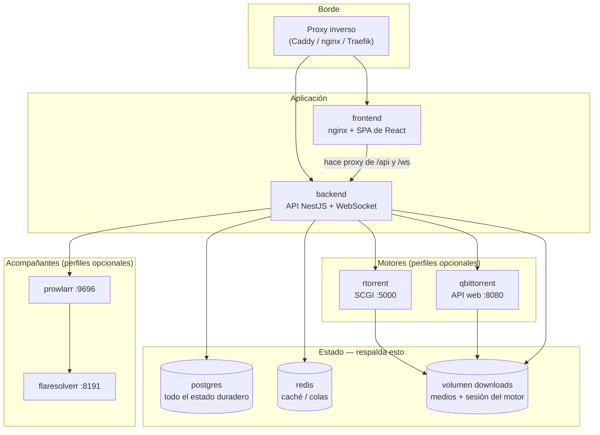
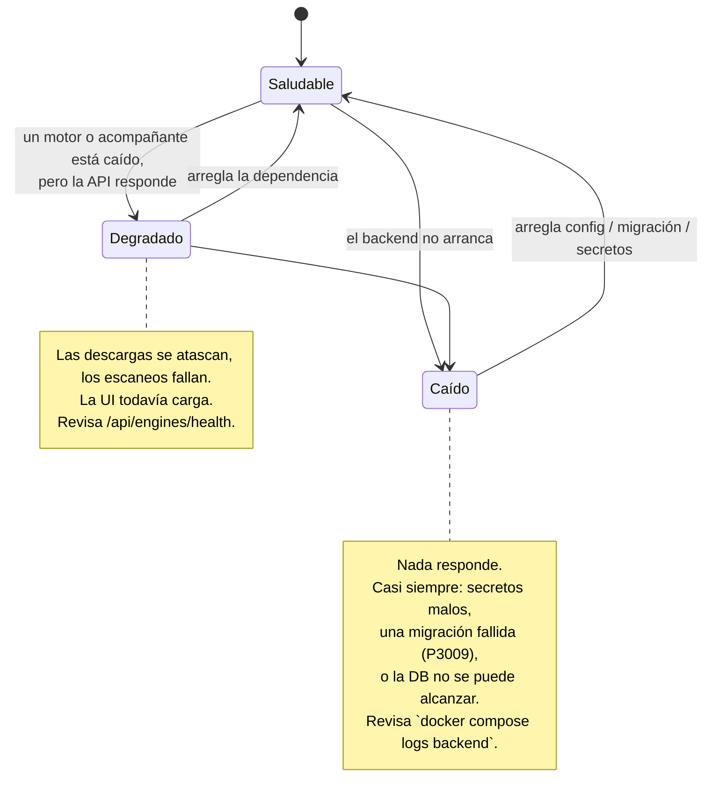

# Opera UltraTorrent en producción {#operate-ultratorrent-in-production}

Todo lo de esta sección asume que UltraTorrent ya está instalado y que ahora te
toca **mantenerlo corriendo**. La instalación es de una sola vez; la operación es
para siempre.

## Propósito {#purpose}

Levantar UltraTorrent es la parte fácil — [Instalación](/install/docker-compose)
lo cubre en un puñado de comandos. La parte difícil son los próximos dieciocho
meses: la base de datos crece a millones de filas, el motor acumula miles de
torrents, una actualización aplica una migración a medias, un indexador empieza a
rechazarte, y un escaneo de biblioteca se atasca calladito en 74%.

Esta sección es el **manual del operador** para esa fase. Cosa rara en la
documentación: la mayor parte no es teórica. El playbook de
[Solución de problemas](/operate/troubleshooting) está construido casi por
completo a partir de **incidentes reales que se diagnosticaron en hosts vivos de
UltraTorrent**, con los números reales, las líneas de log reales, y los comandos
que se usaron para encontrar la causa. Cuando algo es un fallo plausible que *no*
se ha observado de verdad, está marcado como tal.

## Cuándo usar esta sección {#when-to-use-this-section}

| Situación | Empieza aquí |
|-----------|------------|
| Algo está roto **ahora mismo** | [Solución de problemas](/operate/troubleshooting) |
| Estás a punto de exponerlo al internet | [Seguridad](/operate/security) |
| Nunca has tomado un backup | [Backup y Restauración](/operate/backup) |
| Funciona, pero está *lento* | [Rendimiento](/operate/performance) |
| Quieres una rutina para que nada se pudra | [Mantenimiento](/operate/maintenance) |
| Quieres ajustes probados para el tamaño de tu despliegue | [Perfiles de configuración](/operate/configuration-profiles) |

## Requisitos previos {#prerequisites}

- Un stack de UltraTorrent corriendo (ver [Docker Compose](/install/docker-compose)).
- Acceso a la shell del host de Docker, y la capacidad de correr `docker compose`.
- El archivo `.env` que usaste para levantar el stack.
- Una cuenta con `system.view` (para el endpoint de salud) e idealmente
  `SUPER_ADMIN` para los procedimientos de recuperación. Ver [Permisos](/reference/permissions).

:::tip Mira este tutorial
_Video próximamente._
:::

## Conceptos {#concepts}

### Las piezas móviles que estás operando {#the-moving-parts-you-are-operating}

UltraTorrent no es un solo proceso. Saber qué caja es dueña de un síntoma es la
mayor parte del diagnóstico, así que ten este mapa en la cabeza:



Tres hechos sobre este diagrama guían la mayoría de las decisiones operativas:

1. **Postgres es lo único verdaderamente irreemplazable.** Redis es un caché y una
   cola — perderlo no te cuesta nada duradero. Los motores se pueden reconstruir.
   Postgres guarda tus usuarios, bibliotecas, reglas, listas de seguimiento y el
   registro de auditoría. Respáldalo. Ver [Backup y Restauración](/operate/backup).
2. **El backend no se publica al host por defecto.** En el `docker-compose.yml`
   que se distribuye, el backend solo expone el puerto `4000` en la red interna;
   el navegador llega a él a través del nginx del frontend, que hace proxy de
   `/api/` y `/ws/`. Si estás depurando "la API no responde", verifica si
   siquiera *se supone* que puedas alcanzarla directamente.
3. **Los motores y los acompañantes son perfiles opcionales de Compose.** Están
   apagados a menos que los pidas. Muchísimos reportes de "el motor no funciona"
   son simplemente un stack levantado sin `--profile rtorrent`.

### Endpoints de salud {#health-endpoints}

UltraTorrent expone un conjunto pequeño y deliberado de superficies de salud.
Apréndetelas — responden "¿está arriba?" mucho más rápido que leer logs.

| Endpoint | Auth | Qué te dice |
|----------|------|-------------------|
| `GET /api/system/live` | ninguna | El proceso está vivo. Esto es lo que sondea el propio healthcheck de Docker del container del backend. |
| `GET /api/system/ready` | ninguna | El proceso está vivo **y** sus dependencias (la DB) se pueden usar. |
| `GET /api/system/version` | ninguna | La versión, y el commit de git horneado en la imagen — invaluable cuando te preguntas "¿de verdad aterrizó mi despliegue?" |
| `GET /api/system/health` | `system.view` | El informe de salud detallado y autenticado. |
| `GET /api/engines/health` | autenticada | Alcanzabilidad de cada motor. Un `online: false` aquí es la señal más útil que existe para un motor muerto. |

Un chequeo de vida rápido y sin dependencias desde el host:

```bash
docker compose exec backend wget -qO- http://127.0.0.1:4000/api/system/live
docker compose exec backend wget -qO- http://127.0.0.1:4000/api/system/version
```

### Los tres estados en que puede estar un stack {#the-three-states-a-stack-can-be-in}



**Caído** y **Degradado** tienen playbooks completamente distintos, y
diferenciarlos toma un comando:

```bash
docker compose ps
```

Si `backend` está reiniciándose o salió, estás **Caído** — ve a
[Solución de problemas → Arranque](/operate/troubleshooting#startup-and-boot).
Si `backend` está arriba pero las descargas no se mueven, estás **Degradado** — ve a
[Solución de problemas → Motores](/operate/troubleshooting#engines-and-rtorrent).

## Pasos: la primera hora en un despliegue nuevo {#steps-the-first-hour-on-a-new-deployment}

Haz esto una vez, inmediatamente después de instalar. Cada paso toma minutos y
cada uno ha evitado una caída real.

1. **Verifica que los secretos sean reales.** En producción el backend *se niega a
   arrancar* con secretos débiles, así que si arrancó probablemente estás bien —
   pero confirma que `JWT_ACCESS_SECRET` y `ENCRYPTION_KEY` sean distintos, de 32+
   caracteres, y que no sean `dev-*` ni `change-me`. Ver [Seguridad](/operate/security#secrets).
2. **Cambia la contraseña del admin sembrado** e inscribe 2FA. Ver
   [Seguridad](/operate/security#two-factor-authentication).
3. **Toma un backup, y luego restáuralo en algún lado.** Un backup sin probar es un
   rumor. Ver [Backup y Restauración](/operate/backup#restore-drill).
4. **Escoge un perfil de configuración** que calce con tu tamaño y aplícalo. Ver
   [Perfiles de configuración](/operate/configuration-profiles).
5. **Decide tu motor ahora, no a los 800 torrents.** Si tu biblioteca va a ser
   grande, empieza con qBittorrent — el rTorrent 0.9.8 que viene incluido tiene un
   bug de caída del proyecto original que no tiene arreglo y que escala con la
   cantidad de torrents. Ver
   [Rendimiento → rTorrent a escala](/operate/performance#rtorrent-at-scale).
6. **Anota dónde vive tu `.env`.** No está en la base de datos y no está en tu
   dump de Postgres. Perderlo es perder tu `ENCRYPTION_KEY`, que es perder cada
   clave API y cada secreto TOTP almacenado.

## Ejemplos {#examples}

### Una revisión de 30 segundos: "¿está todo bien?" {#a-30-second-is-everything-fine-check}

```bash
# 1. ¿Están todos los containers arriba y saludables?
docker compose ps

# 2. ¿Está viva la API?
docker compose exec backend wget -qO- http://127.0.0.1:4000/api/system/live

# 3. ¿Algo gritando en los últimos 5 minutos?
docker compose logs --since 5m --tail 50 backend | grep -iE "error|fatal|refus"

# 4. ¿Se puede alcanzar el motor? (un rTorrent en bucle de reinicios se ve aquí)
docker compose ps rtorrent qbittorrent
```

### Ver aterrizar una actualización {#watching-an-upgrade-land}

El endpoint de versión hornea el commit de git, así que puedes probar que la
imagen nueva de verdad está corriendo en vez de asumirlo:

```bash
docker compose exec backend wget -qO- http://127.0.0.1:4000/api/system/version
```

Si el commit no cambió después de un rebuild, tu imagen no se reconstruyó. Ver
[Actualizar](/install/upgrading).

## Solución de problemas {#troubleshooting}

Esta página es el mapa; el territorio es
[**Solución de problemas**](/operate/troubleshooting), que está organizado por
síntoma y te da, para cada fallo real, los comandos de diagnóstico, la causa raíz,
la solución, y cómo verificar que la solución funcionó.

## Consejos {#tips}

- **Los logs son baratos; adivinar es caro.** `docker compose logs -f backend` es
  el primer comando en casi todos los playbooks de este sitio.
- **Nunca uses `docker compose down -v`** a menos que tu intención sea destruir la
  base de datos. El `-v` elimina los volúmenes. Este es el comando más destructivo
  de toda la documentación.
- **Los reinicios no son gratis.** Los cuerpos de los trabajos corren en el mismo
  proceso, así que un reinicio interrumpe los escaneos y las importaciones que
  estén corriendo. Se reconcilian en el arranque en vez de reanudarse — ver
  [Solución de problemas → Escaneos y trabajos](/operate/troubleshooting#scans-and-jobs).
- **Guarda el `.env` en un gestor de contraseñas o en un almacén de secretos**, no
  solo en el host que estás a punto de perder.

## Preguntas frecuentes {#faq}

**¿Necesito exponer el puerto del backend?**
No. En el stack por defecto el frontend hace proxy de `/api/` y `/ws/` hacia el
backend por la red interna. Publica el `4000` solo si vas a integrar un cliente
externo directamente con la [API](/reference/api).

**¿Es Redis crítico? ¿Necesito respaldarlo?**
No. Redis es un caché y un broker de trabajos. Perderlo pierde valores cacheados
en vuelo, no estado duradero. No lo incluyas en tu plan de backup.

**¿Puedo correr sin ningún motor?**
Sí — la app arranca y la UI funciona, pero nada se va a descargar. El motor es un
servicio aparte que registras bajo **Infraestructura → Motores**. Ver
[Motores](/modules/engines).

**¿Cómo sé qué versión estoy corriendo?**
`GET /api/system/version`, o la insignia de versión en la UI. Reporta la versión
*y* el commit de git que se horneó en la imagen.

## Lista de verificación {#checklist}

- [ ] `docker compose ps` muestra todos los servicios esperados saludables
- [ ] `/api/system/live` responde correctamente
- [ ] `/api/engines/health` reporta `online: true` para tu motor
- [ ] Contraseña del admin sembrado cambiada; 2FA inscrito en las cuentas de admin
- [ ] El `.env` está respaldado **fuera** del host (contiene `ENCRYPTION_KEY`)
- [ ] Existe un dump de Postgres, y lo has restaurado al menos una vez
- [ ] Se escogió y se aplicó un perfil de configuración
- [ ] Sabes si tu motor va a escalar al tamaño de tu biblioteca

## Ver también {#see-also}

- [Solución de problemas](/operate/troubleshooting) — el playbook que empieza por el síntoma
- [Seguridad](/operate/security) — endurecimiento, secretos, RBAC, exposición
- [Backup y Restauración](/operate/backup) — qué respaldar y el simulacro de restauración
- [Rendimiento](/operate/performance) — ajuste fino y el catálogo de IMDb
- [Mantenimiento](/operate/maintenance) — la rutina que previene incidentes
- [Perfiles de configuración](/operate/configuration-profiles) — ajustes probados
- [Actualizar](/install/upgrading) · [Proxy inverso](/install/reverse-proxy) · [TLS](/install/tls)
- [Referencia de entorno](/reference/environment)
