# Mantenimiento rutinario {#routine-maintenance}

La mayoría de los incidentes de UltraTorrent son **de combustión lenta**: un disco
que se llena, un conteo de torrents que se pasa del techo de fallos de rTorrent, un
índice que nunca se reconstruyó, un backup que lleva tres meses fallando en
silencio. Ninguno se anuncia. Todos se atrapan con una rutina que toma minutos.

## Propósito {#purpose}

Atrapar los problemas mientras todavía son baratos.

## Cuándo usar esto {#when-to-use-this}

Pon un recordatorio recurrente. El chequeo diario toma 60 segundos; el mensual, media
hora.

## Requisitos previos {#prerequisites}

- Acceso de shell al host.
- Un [backup](/operate/backup) que funcione.

:::tip Mira este tutorial
_Video próximamente._
:::

## La rutina de un vistazo {#the-routine-at-a-glance}

```mermaid
flowchart LR
    subgraph D["DIARIO — 1 min"]
        D1["¿Containers saludables?"]
        D2["¿Errores en el log?"]
        D3["¿Las descargas se mueven?"]
    end
    subgraph W["SEMANAL — 10 min"]
        W1["Espacio en disco"]
        W2["RestartCount del motor"]
        W3["Trabajos atascados"]
        W4["Descargas fallidas"]
        W5["¿El backup corrió de verdad?"]
    end
    subgraph M["MENSUAL — 30 min"]
        M1["Actualizar"]
        M2["Revisión del log de auditoría"]
        M3["Mantenimiento de la BD"]
        M4["SIMULACRO DE RESTAURACIÓN"]
        M5["Podar torrents muertos"]
    end
    D --> W --> M

    style D fill:#2e7d32,color:#fff
    style W fill:#f9a825,color:#000
    style M fill:#1565c0,color:#fff
```



## Diario (60 segundos) {#daily-60-seconds}

Un solo comando te dice casi todo lo que necesitas:

```bash
cd /path/to/ultratorrent

# 1. ¿Está todo arriba y saludable?
docker compose ps

# 2. ¿Algo gritando?
docker compose logs --since 24h backend | grep -iE "error|fatal|refused" | tail -20

# 3. ¿Está el motor en línea?
docker compose exec backend wget -qO- http://127.0.0.1:4000/api/system/live
```

**Lo que estás buscando:**

| Señal de alerta | Significado | Ve a |
|----------|---------|-------|
| Un container muestra `Restarting` | Está en bucle de fallos | [Arranque](/operate/troubleshooting#startup-and-boot) |
| Un container muestra `unhealthy` | El healthcheck está fallando (p. ej. el puerto SCGI de rTorrent no está escuchando) | [Motores](/operate/troubleshooting#engines-and-rtorrent) |
| `blocked internal address` | La protección SSRF está bloqueando tu indexador | [SSRF](/operate/troubleshooting#auto-downloads-silently-do-nothing--resolves-to-a-blocked-internal-address) |
| `internal_error: priority_queue_insert` | El bug de fallo de rTorrent | [rTorrent](/operate/troubleshooting#rtorrent-restarts-constantly--internal_error-priority_queue_insert) |
| Descargas a 0 B/s en todo | Posiblemente torrents muertos ocupando todas las ranuras de la cola | [Cola](/operate/troubleshooting#dead-torrents-block-every-healthy-one-nothing-downloads-at-all) |

:::tip Un container puede estar en bucle de fallos y aun así verse "Up"
`restart: unless-stopped` significa que Docker lo sigue levantando, así que `docker compose
ps` puede verse saludable mientras el proceso muere cada veinte minutos. La verdad está en
`RestartCount` — mira el chequeo semanal.
:::

## Semanal (10 minutos) {#weekly-10-minutes}

### 1. Espacio en disco {#1-disk-space}

La causa más común de un stack que de repente deja de funcionar es un disco lleno.
Postgres en particular falla de maneras confusas cuando no puede escribir.

```bash
df -h

# ¿Cuáles volúmenes de Docker se lo están comiendo?
docker system df -v | head -30

# El árbol de descargas casi siempre es el culpable
du -sh "$(docker volume inspect ultratorrent_downloads --format '{{ .Mountpoint }}')"
```

Si Docker mismo está inflado (imágenes viejas, caché de build muerto):

```bash
docker system prune -f            # seguro: elimina containers detenidos e imágenes colgantes
docker builder prune -f           # seguro: elimina el caché de build
```

:::danger Nunca uses `docker system prune --volumes`
Elimina los **volúmenes sin usar** — y se puede llevar tu base de datos con él. Nunca
añadas `--volumes` en un host que corre UltraTorrent.
:::

### 2. ¿El motor está fallando calladito? {#2-is-the-engine-quietly-crashing}

```bash
docker inspect --format '{{.Name}} restarts={{.RestartCount}}' \
  $(docker compose ps -q) 2>/dev/null
```

Anota el número. **Un `RestartCount` que sube semana tras semana es un bucle de
fallos**, aunque el container se vea bien. Para rTorrent, eso es el
[bug de fallo de 0.9.8](/operate/troubleshooting#rtorrent-restarts-constantly--internal_error-priority_queue_insert)
y te está diciendo que ya se te quedó chiquito el motor.

### 3. Trabajos atascados {#3-stuck-jobs}

Como los cuerpos de los trabajos corren **en el mismo proceso**, un reinicio los deja
huérfanos. La reconciliación al arranque ahora los marca como fallidos automáticamente
— pero verifica que nada esté trabado *mientras corre*:

```bash
docker compose exec postgres psql -U ultratorrent -d ultratorrent -c "
SELECT type, status, progress, \"createdAt\"
FROM media_processing_jobs
WHERE status IN ('queued','running')
ORDER BY \"createdAt\";"
```

Un trabajo que lleva horas en `running` al **0%** está huérfano. Mira
[Trabajos atascados en running](/operate/troubleshooting#jobs-are-stuck-running-forever).

### 4. Descargas fallidas {#4-failed-downloads}

Revisa el registro de auditoría buscando `download.failed`. Pero conoce el falso positivo:

:::note La falsa alarma de `never registered within 6s`
En builds más viejos, los **magnets** se marcaban como fallidos si no se registraban en ~6
segundos — mientras descargaban perfectamente. En un caso real, **256 de 257 "fallos"
en realidad habían cargado**, con una mediana de ~53 segundos. Si ves una avalancha de estos,
lo que necesitas es [la solución](/operate/troubleshooting#a-magnet-is-marked-failed-but-actually-downloads-fine), no una investigación.
:::

### 5. ¿El backup corrió de verdad? {#5-did-the-backup-actually-run}

```bash
ls -lh /mnt/backup/ultratorrent-*.dump | tail -5
```

Revisa la **fecha** y el **tamaño**. Un dump de 0 bytes es un backup fallido que salió con 0.

### 6. Poda los torrents muertos {#6-prune-dead-torrents}

Los torrents con **cero seeders** nunca terminan y — algo crítico — **un magnet con 0
seeders sigue ocupando una ranura de descarga activa todo el tiempo que lo intenta**. Si
los dejas, bloquean la cabeza de tu cola entera. Elimínalos, o
[activa la cola de estacionamiento](/operate/performance#the-fixes).

## Mensual (30 minutos) {#monthly-30-minutes}

### 1. Actualiza {#1-upgrade}

Mira [Actualizar](/install/upgrading) para el procedimiento completo. La versión corta:

```bash
# 1. HAZ UN BACKUP PRIMERO. Siempre.
docker compose exec -T postgres pg_dump -U ultratorrent -d ultratorrent -Fc \
  > "pre-upgrade-$(date +%F).dump"
cp .env "pre-upgrade-env-$(date +%F)"

# 2. Descarga y reconstruye.
git pull
docker compose up -d --build

# 3. Observa la migración aterrizar. Aquí es donde aparece P3009 si va a aparecer.
docker compose logs -f backend

# 4. COMPRUEBA que el código nuevo está corriendo (no una imagen en caché):
docker compose exec backend wget -qO- http://127.0.0.1:4000/api/system/version
```

Ese último paso importa más de lo que parece. El endpoint de versión reporta el
**commit de git horneado en la imagen**. Si el commit no cambió después de reconstruir,
**tu imagen no se reconstruyó** y sigues corriendo el código viejo mientras crees lo
contrario.

| Riesgo de la actualización | Vigila |
|--------------|-----------|
| Una migración falla a mitad de camino | `P3009` → [resuélvelo](/operate/troubleshooting#the-backend-restart-loops-after-an-upgrade--prisma-p3009) |
| Construcciones largas de índices | Ahora se construyen en tiempo de ejecución en segundo plano — la app se queda arriba pero lenta hasta que terminen |
| Trabajos en vuelo | Los mata el reinicio; se reconcilian (se marcan fallidos) al arranque. **Vuelve a correr cualquier escaneo/importación que estuviera corriendo** |
| Nueva variable de entorno requerida | El backend se niega a arrancar. Lee el log; revisa [Entorno](/reference/environment) |

### 2. Revisa el log de auditoría {#2-review-the-audit-log}

El registro de auditoría anota el actor, la acción, el objeto, el resultado, la IP y el
user agent de toda acción destructiva o relevante para la seguridad — y ahora **nombra el
medio** al que apuntó una fila en vez de mostrar un id opaco.

Busca:

- **Inicios de sesión fallidos** (`auth.login` con `result: failure`) — se registran *con el
  usuario intentado*. Un grupo de ellos es significativo. Ojo que un **reto de 2FA pendiente
  deliberadamente no cuenta como fallo**, así que lo que ves es real.
- **`torrents.delete_data`** — alguien borró datos del disco.
- **`files.delete` / `files.cleanup`** — destrucción desde el gestor de archivos.
- **Cambios de rol** — quién otorgó qué.
- **Cambios de configuración** — especialmente `settings.update_root_path`.

Accede a esto en **Auditoría** en la UI (requiere `audit.view`), o `GET /api/audit`.

Mira [Auditoría](/modules/audit).

### 3. Mantenimiento de la base de datos {#3-database-housekeeping}

```bash
# Refresca las estadísticas del planificador — un plan viejo es un plan lento.
docker compose exec postgres psql -U ultratorrent -d ultratorrent -c "ANALYZE;"

# Revisa el bloat / las tuplas muertas
docker compose exec postgres psql -U ultratorrent -d ultratorrent -c "
SELECT relname, n_live_tup, n_dead_tup,
       pg_size_pretty(pg_total_relation_size(relid)) AS size
FROM pg_stat_user_tables
ORDER BY n_dead_tup DESC
LIMIT 10;"
```

El autovacuum normalmente se encarga del resto. Si una tabla tiene un conteo de tuplas
muertas altísimo y el autovacuum claramente no está dando abasto:

```bash
docker compose exec postgres psql -U ultratorrent -d ultratorrent \
  -c "VACUUM (ANALYZE, VERBOSE) media_items;"
```

**Y verifica que tus índices de trigramas sigan válidos** — una reconstrucción interrumpida
deja un índice INVALID que el planificador ignora en silencio para siempre:

```sql
SELECT c.relname, i.indisvalid
FROM pg_class c JOIN pg_index i ON i.indexrelid = c.oid
WHERE c.relname LIKE '%trgm%';
```

Todos tienen que estar en `true`. Mira
[Rendimiento](/operate/performance#verify-your-indexes-are-present-and-valid).

### 4. Corre un simulacro de restauración {#4-run-a-restore-drill}

**Este es el punto que la gente se salta, y es el que importa.** Un backup que nunca has
restaurado es un rumor.

Sigue [el simulacro](/operate/backup#restore-drill). Los dos chequeos que de verdad
prueban que tu backup está sano:

- **El 2FA funciona** en una cuenta restaurada → tu `ENCRYPTION_KEY` coincidía con el dump.
- **La prueba de un indexador pasa** → la clave API cifrada se descifró.

Si cualquiera de los dos falla, tu `.env` y tu dump no coinciden, y acabas de descubrir —
barato — que tu backup estaba incompleto.

### 5. Revisa la salud de los indexadores {#5-review-indexer-health}

- ¿**Cada** indexador tiene un `minSeeders` configurado? Un indexador sin uno te va a
  entregar cadáveres de 0 seeders que tapan la cola.
- ¿Hay algún indexador fallando en cada petición? Los fallos por indexador están
  **aislados** — un indexador roto no tumba la búsqueda entera, así que puede pudrirse sin
  que nadie lo note por meses.
- Si uno devuelve HTTP 429 en todo, lee
  [la entrada del 429](/operate/troubleshooting#an-indexer-always-returns-http-429-and-flaresolverr-cannot-fix-it)
  antes de que pierdas una tarde ajustando límites de tasa.

## Trimestral / anual {#quarterly--annually}

- **Rota los secretos JWT.** Barato — a todo el mundo se le cierra la sesión, y nada más pasa.
  Mira [Rotar secretos](/operate/security#rotating-the-jwt-secrets-safe-routine).
- **Revisa usuarios y roles.** Elimina a la gente que se fue. Recuerda que `POWER_USER`
  incluye **todos** los `files.*`, incluyendo delete.
- **Vuelve a revisar tu exposición.** ¿Siguen sin publicarse los puertos del motor y de los
  servicios acompañantes? Corre el
  [fragmento de auditoría de seguridad](/operate/security#audit-the-security-posture-of-a-running-stack).
- **Reevalúa tu motor.** Si tu conteo de torrents creció a los cientos, estás en tiempo
  prestado con rTorrent.

:::danger NO rotes `ENCRYPTION_KEY` como mantenimiento rutinario
Es **destructivo** — invalida todo secreto TOTP, toda clave API de indexador, la clave de
Prowlarr y las contraseñas de los motores. Rótala solo en respuesta a una filtración, y sigue
[el procedimiento](/operate/security#rotating-encryption_key-destructive--plan-it).
:::

## Ejemplos {#examples}

### Un script semanal de salud, de una sola pasada {#a-one-shot-weekly-health-script}

```bash
#!/usr/bin/env bash
# weekly-check.sh — córrelo desde el directorio de compose
set -euo pipefail
cd "$(dirname "$0")"

echo "=== Containers ==="
docker compose ps

echo -e "\n=== Restart counts (a climbing number = a crash loop) ==="
docker inspect --format '{{.Name}} restarts={{.RestartCount}}' $(docker compose ps -q)

echo -e "\n=== Disk ==="
df -h / | tail -1

echo -e "\n=== Errors, last 7 days ==="
docker compose logs --since 168h backend 2>/dev/null \
  | grep -icE "error|fatal" || echo 0

echo -e "\n=== Stuck jobs ==="
docker compose exec -T postgres psql -U ultratorrent -d ultratorrent -tAc \
  "SELECT count(*) FROM media_processing_jobs WHERE status IN ('queued','running');"

echo -e "\n=== Trigram indexes valid? (all must be t) ==="
docker compose exec -T postgres psql -U ultratorrent -d ultratorrent -tAc \
  "SELECT c.relname || '=' || i.indisvalid FROM pg_class c
   JOIN pg_index i ON i.indexrelid = c.oid WHERE c.relname LIKE '%trgm%';"

echo -e "\n=== Latest backup ==="
ls -lht /mnt/backup/ultratorrent-*.dump 2>/dev/null | head -1 || echo "NO BACKUP FOUND"
```


## Resolución de problemas {#troubleshooting}

Si la rutina saca algo a la luz, la solución casi seguro está en
[Resolución de problemas](/operate/troubleshooting). Enlaces rápidos:

- [El backend no arranca](/operate/troubleshooting#startup-and-boot)
- [rTorrent se reinicia](/operate/troubleshooting#rtorrent-restarts-constantly--internal_error-priority_queue_insert)
- [Nada se descarga](/operate/troubleshooting#dead-torrents-block-every-healthy-one-nothing-downloads-at-all)
- [Un escaneo nunca termina](/operate/troubleshooting#a-library-scan-freezes-at-a-percentage-and-never-completes)
- [Trabajos atascados en running](/operate/troubleshooting#jobs-are-stuck-running-forever)

## Consejos {#tips}

- **Automatiza el chequeo diario en una notificación.** El propio
  [Centro de Notificaciones](/modules/notification-center) de UltraTorrent puede avisarte
  cuando algo falle — úsalo en vez de depender de que tú te acuerdes de mirar.
- **Anota el `RestartCount` cada semana.** El número absoluto no dice nada; la
  **tendencia** es toda la señal.
- **Actualiza con frecuencia, en pasos pequeños.** La mayoría de los incidentes de esta
  documentación *se arreglaron* en algún lanzamiento. Mantenerte al día es la forma más
  barata de mantenimiento que existe.
- **Vuelve a correr los escaneos interrumpidos después de cada actualización.** El reinicio
  los mató.

## Preguntas frecuentes {#faq}

**¿Cada cuánto debo actualizar?**
Mensual es una buena cadencia. Muchos de los modos de fallo documentados en este sitio
están arreglados en builds posteriores — correr código viejo es quedarte con los bugs viejos.

**¿Necesito correr `VACUUM` a mano?**
Normalmente no — el autovacuum se encarga. Corre `ANALYZE` después de una importación
grande para que el planificador tenga estadísticas frescas.

**¿Es seguro reiniciar el backend como mantenimiento rutinario?**
Es seguro, pero **interrumpe los trabajos en vuelo**. Se reconcilian (se marcan fallidos)
al arranque, no se reanudan. Reinicia cuando no haya nada escaneando.

**¿Por qué mi `RestartCount` está alto pero nada parece mal?**
Porque `restart: unless-stopped` te está escondiendo un bucle de fallos. Si es rTorrent,
eso es el bug de fallo de 0.9.8 y depende de la carga — ya se te quedó chiquito el motor.

**¿Debo podar las imágenes de Docker?**
Sí — `docker system prune -f` y `docker builder prune -f` son seguros. **Nunca**
añadas `--volumes`.

## Lista de verificación {#checklist}

**Diario**
- [ ] `docker compose ps` — todo saludable
- [ ] No hay errores nuevos en el log del backend
- [ ] Las descargas se están moviendo

**Semanal**
- [ ] El espacio en disco está bien
- [ ] El `RestartCount` no está subiendo
- [ ] No hay trabajos atascados en `running`
- [ ] No hay descargas fallidas sin explicación
- [ ] El backup corrió de verdad (revisa la fecha **y** el tamaño)
- [ ] Torrents muertos / de 0 seeders podados

**Mensual**
- [ ] Actualizado (con un backup tomado primero)
- [ ] `/api/system/version` confirma que el **commit nuevo** está corriendo
- [ ] Log de auditoría revisado (inicios de sesión fallidos, borrados, cambios de rol)
- [ ] `ANALYZE` ejecutado; los índices de trigramas siguen **válidos**
- [ ] **Simulacro de restauración corrido — el 2FA y la prueba de un indexador pasaron**
- [ ] Cada indexador tiene un `minSeeders`

**Trimestral**
- [ ] Secretos JWT rotados
- [ ] Usuarios y roles revisados
- [ ] Exposición revisada de nuevo (no hay puertos del motor publicados)
- [ ] El motor sigue siendo apropiado para tu conteo de torrents

## Ver también {#see-also}

- [Actualizar](/install/upgrading)
- [Backup y restauración](/operate/backup) — especialmente el simulacro de restauración
- [Resolución de problemas](/operate/troubleshooting)
- [Rendimiento](/operate/performance)
- [Seguridad](/operate/security)
- [Perfiles de configuración](/operate/configuration-profiles)
- [Auditoría](/modules/audit) · [Centro de Notificaciones](/modules/notification-center) · [Sistema](/modules/system)
