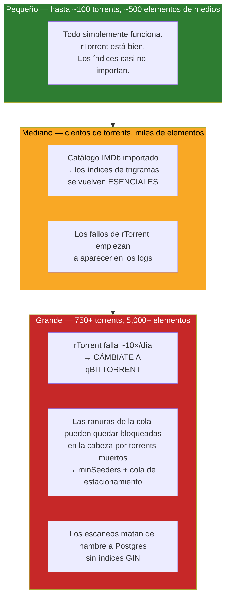

# Rendimiento y ajuste {#performance--tuning}

La historia del rendimiento de UltraTorrent está dominada por **dos paredes duras** que
aparecen de golpe, a escala, después de que todo funcionaba bien en las pruebas:

1. **El catálogo IMDb** — 8.9 millones de filas, y un patrón de consulta que no puede usar
   un índice normal.
2. **rTorrent 0.9.8** — un bug de fallo del proyecto original cuya frecuencia escala con tu
   conteo de torrents.

Todo lo demás es ajuste corriente. Esos dos no lo son; ambos han causado caídas reales, y
ambos están documentados aquí con las mediciones de verdad.

## Propósito {#purpose}

Mantener a UltraTorrent rápido mientras tu biblioteca crece de decenas a miles de elementos,
y saber contra cuál pared estás a punto de chocar.

## Cuándo usar esto {#when-to-use-this}

- Un escaneo de biblioteca va lento, o **nunca termina**.
- Las búsquedas tardan segundos.
- El motor se sigue reiniciando.
- Las descargas se quedan en cola y nunca empiezan.
- Estás *planificando* una biblioteca grande y quieres evitar todo lo anterior.

## Requisitos previos {#prerequisites}

- Acceso de shell, y `psql` vía `docker compose exec postgres`.
- Familiaridad con [Resolución de problemas](/operate/troubleshooting) — los dos peores
  fallos de rendimiento se presentan como *caídas*, y están documentados allí.

:::tip Mira este tutorial
_Video próximamente._
:::

## Conceptos {#concepts}

### El mapa del escalado {#the-scaling-map}



## El catálogo IMDb {#the-imdb-catalogue}

Este es el tema de rendimiento más importante de UltraTorrent, porque el modo de fallo no es
"lento" — es **un escaneo que se cuelga para siempre**.

### El problema, con precisión {#the-problem-precisely}

Prisma traduce `mode: 'insensitive'` al SQL **`ILIKE`**. Y:

> **`ILIKE` no puede usar un índice btree.**

En una tabla pequeña nadie lo nota. En el catálogo IMDb de **8.9 millones de filas**, cada
búsqueda de título insensible a mayúsculas se convirtió en un **escaneo completo de tabla**.
Medido en un host de producción en vivo:

| | Valor |
|---|---|
| Tamaño del catálogo | **8,900,000 filas** |
| Consulta | `primaryTitle ILIKE ...` + `ORDER BY startYear DESC` |
| Plan | El planificador recorrió un índice btree **hacia atrás**, filtrando con ILIKE la tabla entera |
| **Tiempo por búsqueda** | **47.8 segundos** |

Y estas búsquedas se disparan **por cada elemento de medios** — durante el calentamiento del
estado de la serie, la identificación y la autocorrección de episodios faltantes. Así que un
escaneo de biblioteca emitía miles de ellas, lo cual **saturaba Postgres y mataba de hambre a
todas las demás consultas, incluyendo las del propio escaneo**. El escaneo se quedó en 8%,
luego 41%, luego 74%, y nunca terminó.

### La solución: índices GIN pg_trgm {#the-fix-pg_trgm-gin-indexes}

Los índices de trigramas hacen que `LIKE`/`ILIKE` **se apoyen en un índice**.

```sql
CREATE EXTENSION IF NOT EXISTS pg_trgm;

CREATE INDEX CONCURRENTLY IF NOT EXISTS imdb_titles_primary_title_trgm
  ON imdb_titles USING gin ("primaryTitle" gin_trgm_ops);
CREATE INDEX CONCURRENTLY IF NOT EXISTS imdb_titles_original_title_trgm
  ON imdb_titles USING gin ("originalTitle" gin_trgm_ops);
CREATE INDEX CONCURRENTLY IF NOT EXISTS imdb_akas_title_trgm
  ON imdb_akas USING gin (title gin_trgm_ops);
```

El resultado, misma consulta, las mismas 8.9M de filas:

| | Antes | Después |
|---|--------|-------|
| Plan | Escaneo de índice hacia atrás + filtro | **Bitmap Index Scan** |
| Tiempo | **47.8 s** | **180 ms** |
| **Aceleración** | — | **~265×** |

**No cambió ni una línea del código de la aplicación.** La consulta siempre estuvo correcta;
lo que faltaba era el índice.

### Probablemente no necesitas hacer esto a mano {#you-probably-dont-need-to-do-this-by-hand}

Los builds actuales se encargan. La migración solo hace el barato
`CREATE EXTENSION IF NOT EXISTS pg_trgm`; luego un servicio dedicado construye los
tres índices GIN **en tiempo de ejecución, en segundo plano**, con
`CREATE INDEX CONCURRENTLY IF NOT EXISTS`:

- Una **instalación nueva** los construye al instante (el catálogo está vacío).
- Una **instalación existente** los rellena con **cero tiempo fuera de servicio**.
- Es **idempotente** — no hace nada una vez son válidos.
- **Detecta un índice que quedó INVALID por una construcción `CONCURRENTLY` interrumpida,
  lo elimina y lo reconstruye.**

:::danger Nunca pongas un `CREATE INDEX` grande dentro de una migración
Esto no es una preferencia de estilo — causó una **caída real en dos hosts a la vez**.
`CREATE INDEX` sobre el catálogo completo toma minutos y sostiene un lock. Cuando uno se mató
a mitad de camino, Prisma marcó la migración como **fallida (P3009)** y el backend
**se negó a arrancar del todo**, quedándose en bucle de reinicios hasta que la fila de la
migración se resolvió a mano.

Y `CREATE INDEX CONCURRENTLY` **no puede correr dentro de una transacción**, así que *nunca*
puede vivir en una migración de Prisma de todos modos. Construye los índices grandes en tiempo
de ejecución. Mira
[P3009](/operate/troubleshooting#the-backend-restart-loops-after-an-upgrade--prisma-p3009).
:::

### Verifica que tus índices estén presentes *y válidos* {#verify-your-indexes-are-present-and-valid}

Un índice INVALID es peor que no tener índice: el planificador lo ignora, pero su **nombre
existe**, así que `IF NOT EXISTS` se salta la reconstrucción para siempre.

```sql
SELECT c.relname AS index_name, i.indisvalid, i.indisready
FROM pg_class c
JOIN pg_index i ON i.indexrelid = c.oid
WHERE c.relname LIKE '%trgm%';
```

Los tres tienen que mostrar `indisvalid = true`. Si alguno está en `false`:

```sql
DROP INDEX CONCURRENTLY IF EXISTS <the_invalid_index>;
-- luego reinicia el backend y deja que el servicio lo reconstruya
```

Después comprueba que el planificador lo use:

```sql
EXPLAIN ANALYZE
SELECT * FROM imdb_titles WHERE "primaryTitle" ILIKE 'The Expanse';
-- Lo que quieres: Bitmap Index Scan. Lo que NO quieres: Seq Scan.
```

### La segunda lección de IMDb: no le pidas a SQL que doble los acentos {#the-second-imdb-lesson-dont-ask-sql-to-fold-accents}

Un descubrimiento relacionado. Emparejar un título **sin distinguir mayúsculas, puntuación ni
acentos** en SQL significa `ILIKE`, lo cual — incluso con trigramas — significaba que
Postgres estaba haciendo un **escaneo secuencial paralelo de los 8.9M de títulos** para
resolver series, medido en **~8 segundos por serie**.

La solución fue arquitectónica en vez de un índice: cargar **solo la porción de TV** del
catálogo (~325,000 filas `tvSeries`/`tvMiniSeries`) en memoria **una sola vez**, e indexarla
con una clave normalizada sin acentos ni puntuación.

| | Tiempo |
|---|---|
| Cargar la porción de TV una vez | **7.2 s** |
| Después, por búsqueda | **~7 ms** |

Con un TTL de 60 segundos, un barrido entero paga la carga **una sola vez**. La lección se
generaliza: **cuando necesitas emparejamiento aproximado sobre un subconjunto acotado, una
búsqueda hash en memoria le gana a cualquier índice**.

## rTorrent a escala {#rtorrent-at-scale}

### El techo de fallos {#the-crash-ceiling}

El motor incluido es rTorrent `0.9.8` (el binario estático mantenido de jesec `v0.9.8-r16`
— ya es el más nuevo de ese linaje). Arrastra un **bug del proyecto original** sin arreglar:

```
internal_error: priority_queue_insert(...) called on an invalid item
```

que se dispara durante la programación de anuncios al tracker. **No hay arreglo en el linaje
0.9.8** ([rakshasa/rtorrent#939](https://github.com/rakshasa/rtorrent/issues/939)).

La propiedad que lo define es que **depende de la carga**. Dos hosts en vivo, build idéntico:

| Host | Torrents activos | Fallos |
|------|-----------------|---------|
| A | **752** | **44** en 4 días (~10/día) |
| B | **7** | **0** |

Cada fallo termina el proceso limpiamente, Docker lo reinicia, y la sesión guardada se vuelve
a cargar — **no se pierde ningún torrent** — pero las transferencias se pausan y todo
vuelve a anunciarse.

:::warning No puedes salir de esto ajustando configuración
Es un bug del proyecto original, no un problema de configuración. Las mitigaciones de abajo
reducen el radio de la explosión; solo cambiar de motor o reducir el conteo de torrents
cambia el desenlace.
:::

### Qué hacer al respecto {#what-to-do-about-it}

**En orden de impacto:**

1. **Cámbiate a qBittorrent para una biblioteca grande.** La capa de motores de UltraTorrent
   es multimotor por diseño, y qBittorrent maneja **miles de torrents cómodamente**. Esta es
   la respuesta duradera.

   ```bash
   docker compose --profile qbittorrent up -d
   docker compose logs qbittorrent | grep -i password   # contraseña temporal del primer arranque
   ```

   Después regístralo en **Infraestructura → Motores** (tipo qBittorrent, URL base
   `http://qbittorrent:8080`). Si la prueba falla con 401, desactiva **Enable Host
   header validation** en **Options → Web UI** de qBittorrent — el backend se conecta
   por el nombre del servicio.

2. **Mantén modesto el conteo de torrents activos.** Elimina o detén los seeds completados.
   La tasa de fallos baja junto con el conteo.

3. **Ya está hecho por ti:** los anuncios a trackers UDP están desactivados
   (`trackers.use_udp.set = no`), lo cual elimina una variante *secundaria* del fallo. El DHT
   está apagado por defecto (`RT_DHT=off`) por la misma razón. **Ninguno de los dos arregla el
   fallo dominante.** Los trackers HTTP/HTTPS y PEX siguen encontrando pares.

4. **Un healthcheck saca a la luz un motor trabado.** El healthcheck de Compose verifica que
   el puerto SCGI esté escuchando, así que el estado más raro de "proceso vivo pero SCGI
   trabado" se muestra como `unhealthy`. (Un *fallo* ya termina el proceso, lo cual Docker
   recupera por su cuenta.)

Monitoréalo:

```bash
docker inspect --format '{{.RestartCount}}' $(docker compose ps -q rtorrent)
```

## Rendimiento de la cola de descargas {#download-queue-throughput}

### Los torrents muertos pueden consumir todas las ranuras de la cola {#dead-torrents-can-consume-every-queue-slot}

Un asesino sutil del rendimiento, y uno real: un motor sosteniendo **1,137 torrents y
moviendo 0 bytes**. No lento — *cero*. La red estaba bien (DHT saludable, 366 nodos; los
trackers respondiendo). Los torrents simplemente estaban **muertos — 1,114 de 1,137 tenían
cero seeders**.

El mecanismo:

> **Un magnet con 0 seeders nunca puede obtener sus metadatos — y aun así el motor lo cuenta
> como una descarga activa todo el tiempo que lo intenta.**

Con `max_active_downloads: 100`, exactamente **88 `metaDL` + 12 `stalledDL` = 100
ranuras retenidas permanentemente por torrents que nunca van a terminar**. Los otros 1,034
torrents — incluyendo todos los saludables — se quedaron en `queuedDL` detrás de ellos, sin
poder arrancar.

**La causa raíz estaba antes del motor:** dos de cuatro indexadores **no tenían `minSeeders`
configurado**, y el filtro de seeders por indexador *solo aplica cuando esa columna está
configurada*. Así que los lanzamientos con 0 seeders pasaron de largo.

### Las soluciones {#the-fixes}

1. **Configura `minSeeders` en cada indexador.** Esta es la prevención. Un indexador sin
   `minSeeders` te va a entregar cadáveres. Mira [Indexadores](/modules/indexers).

2. **Activa la cola de estacionamiento.** Un servicio en segundo plano (cada 5 minutos) pausa
   los torrents que están en `DOWNLOADING`, por debajo de `minSeeders`, sin nadie conectado,
   sin bytes moviéndose, y pasado un período de gracia. **Un torrent pausado no retiene
   ranura**, así que el motor promueve uno en cola a la ranura liberada — la cola drena su
   propio peso muerto.

   También maneja la trampa obvia: un torrent pausado nunca se anuncia, así que su conteo de
   seeders nunca podría refrescarse, y estacionarlo sería un **viaje sin regreso**. Así que en
   cada tick **fuerza el arranque** de un lote de torrents estacionados, lee el resultado en el
   siguiente tick, y libera los que encontraron seeders. Los que siguen muertos retroceden
   exponencialmente.

   Nunca toca un torrent en `QUEUED` (no cuesta ranura) ni uno en `PAUSED` (un humano lo pausó
   a propósito).

   :::caution Viene desactivada por defecto
   Tienes que activarla. Es un pausador automático, y encenderla es una decisión deliberada
   del operador.
   :::

3. **Sube `max_active_downloads`** solo si tus ranuras están retenidas por torrents
   *saludables*. Si están retenidas por cadáveres, subir el límite solo admite más cadáveres.

## Bibliotecas de medios grandes {#large-media-libraries}

| Síntoma a escala | Causa | Solución |
|------------------|-------|-----|
| Los escaneos se arrastran o se cuelgan | Faltan los índices de trigramas | [pg_trgm](#the-fix-pg_trgm-gin-indexes) |
| Escaneos interrumpidos por reinicios | Los cuerpos de los trabajos corren **en el mismo proceso** — un reinicio los deja huérfanos | No reinicies a mitad de escaneo. Los huérfanos se reconcilian (se marcan fallidos) al arranque |
| Las series reportan 0 episodios faltantes | Fallos de identificación | [Identificación de medios](/operate/troubleshooting#a-show-never-reports-any-missing-episodes-scans-to-000) |
| Biblioteca fragmentada en una entrada por episodio | Elementos creados con `title = basename(file)` y sin temporada/episodio (arreglado; se autocorrige al reescanear) | Actualiza y vuelve a escanear |
| El feed de actividad del panel es puro ruido | Los barridos en segundo plano en ráfaga escriben una fila de auditoría por elemento | Arreglado — las ráfagas se colapsan en una sola línea de "N eventos" |

### Ajuste de Postgres {#postgres-tuning}

Los valores por defecto de `postgres:17-alpine` son conservadores. Si importaste el
catálogo IMDb y te sobra RAM, estos ayudan:

```yaml
# docker-compose.override.yml
services:
  postgres:
    command:
      - postgres
      - -c
      - shared_buffers=1GB          # ~25% de la RAM disponible para Postgres
      - -c
      - work_mem=32MB               # por sort/hash; sube la velocidad de escaneo GIN
      - -c
      - maintenance_work_mem=512MB  # hace mucho más rápidas las construcciones de índices
      - -c
      - effective_cache_size=3GB    # le dice al planificador cuánta caché de SO existe
      - -c
      - random_page_cost=1.1        # estás en SSD; el valor 4.0 por defecto asume disco giratorio
```

:::tip `random_page_cost` es la línea con más apalancamiento
El valor por defecto de `4.0` asume un disco giratorio y sesga al planificador **en contra**
de los escaneos por índice. En SSD/NVMe, `1.1` hace que prefiera correctamente el índice. Esto
solo puede voltear un plan malo a uno bueno.
:::

Después mantén las estadísticas frescas — el planificador no puede escoger un buen plan con
estadísticas viejas:

```sql
ANALYZE imdb_titles;
ANALYZE imdb_episodes;
ANALYZE media_items;
```

### Dimensionamiento de recursos {#resource-sizing}

| Despliegue | RAM | Notas |
|------------|-----|-------|
| Pequeño (sin catálogo IMDb) | 2 GB | Cómodo |
| Mediano (IMDb importado) | 4 GB | La importación del catálogo y la construcción de índices quieren margen |
| Grande (IMDb + miles de torrents + qBittorrent) | 8 GB+ | La memoria de qBittorrent crece con el conteo de torrents |

La **importación del conjunto de datos de IMDb** es la operación más hambrienta de recursos
que hace la app. Dale espacio, y no la corras a la vez que un escaneo de biblioteca.

:::note FlareSolverr necesita memoria compartida
Chromium sin interfaz falla con el `/dev/shm` de 64 MB por defecto de Docker. El archivo de
Compose que se incluye pone `shm_size: "256m"` para FlareSolverr. Si lo corres en otro lado,
haz lo mismo.
:::

## Ejemplos {#examples}

### Encuentra tus consultas más lentas {#find-your-slowest-queries}

```bash
docker compose exec postgres psql -U ultratorrent -d ultratorrent -c "
SELECT pid, now() - query_start AS duration, state, wait_event_type,
       left(query, 100) AS query
FROM pg_stat_activity
WHERE state <> 'idle'
ORDER BY duration DESC
LIMIT 10;"
```

Acuérdate de la regla de lectura del incidente real: **`state = active`, sin contención de
locks, y con conexiones libres de sobra significa _muerto de hambre, no atascado_** — una
consulta es tan cara que se está comiendo el servidor. Eso apunta a un índice faltante, no a
la concurrencia.

### Confirma que una búsqueda de título se apoya en un índice {#confirm-a-title-lookup-is-index-backed}

```bash
docker compose exec postgres psql -U ultratorrent -d ultratorrent -c "
EXPLAIN ANALYZE SELECT * FROM imdb_titles WHERE \"primaryTitle\" ILIKE 'Silo';"
```

Lo que quieres: **Bitmap Index Scan**. Lo que no quieres: **Seq Scan**.

### Revisa los tamaños de las tablas {#check-table-sizes}

```bash
docker compose exec postgres psql -U ultratorrent -d ultratorrent -c "
SELECT relname, n_live_tup,
       pg_size_pretty(pg_total_relation_size(relid)) AS size
FROM pg_stat_user_tables
ORDER BY pg_total_relation_size(relid) DESC
LIMIT 10;"
```

`imdb_titles` va a dominar. Eso se espera.


## Resolución de problemas {#troubleshooting}

| Síntoma | Ve a |
|---------|-------|
| Un escaneo se congela y nunca termina | [Resolución de problemas](/operate/troubleshooting#a-library-scan-freezes-at-a-percentage-and-never-completes) |
| Nada se descarga; todo está en cola | [Resolución de problemas](/operate/troubleshooting#dead-torrents-block-every-healthy-one-nothing-downloads-at-all) |
| rTorrent se reinicia constantemente | [Resolución de problemas](/operate/troubleshooting#rtorrent-restarts-constantly--internal_error-priority_queue_insert) |
| Los índices existen pero se ignoran | [Resolución de problemas](/operate/troubleshooting#queries-are-slow-again-and-an-index-exists-but-is-ignored) |
| Trabajos atascados en 0% para siempre | [Resolución de problemas](/operate/troubleshooting#jobs-are-stuck-running-forever) |

## Consejos {#tips}

- **Importa el catálogo IMDb una sola vez, a propósito**, y deja que los índices de trigramas
  terminen de construirse antes de lanzar un escaneo grande de biblioteca.
- **`EXPLAIN ANALYZE` no es opcional** cuando una consulta va lenta. Adivinar con los índices
  es como terminas con un índice INVALID que nadie usa.
- **Los bugs que dependen de la carga son invisibles en las pruebas.** rTorrent con 7 torrents
  es impecable y con 750 falla diez veces al día. Prueba a tu escala real, o planifica para ella.
- **No reinicies a mitad de escaneo.** Los trabajos corren en el mismo proceso; un reinicio los
  deja huérfanos.
- **Una cola llena de torrents muertos se ve exactamente igual que un problema de red.** Revisa
  los seeders antes de culpar a tu proveedor de internet.

## Preguntas frecuentes {#faq}

**¿Tengo que importar el catálogo IMDb?**
No — es **opcional y está apagado por defecto**. Sin él pierdes la resolución local de títulos
y calidad en la detección de episodios faltantes. Con él, ganas 8.9M de filas y
tienes que tener los índices de trigramas.

**¿Cuánto se tardan en construir los índices de trigramas?**
Minutos en un catálogo completamente importado. Se construyen `CONCURRENTLY` en segundo plano,
así que la app se queda arriba — pero las búsquedas van lentas hasta que terminen.

**¿Por qué se recomienda qBittorrent por encima del rTorrent incluido?**
Porque rTorrent 0.9.8 tiene un bug de fallo imposible de arreglar que **depende de la carga**.
Con un puñado de torrents no importa. Con 750 falla ~10 veces al día.

**¿Subir `max_active_downloads` va a acelerar las cosas?**
Solo si tus ranuras están retenidas por torrents *saludables*. Si están retenidas por
cadáveres de 0 seeders, solo vas a admitir más cadáveres. Arregla `minSeeders` primero.

**¿Es Redis un cuello de botella?**
Muy poco probable. Es una caché y un broker de trabajos; no es ahí donde se te va el tiempo.

## Lista de verificación {#checklist}

**Base de datos**
- [ ] La extensión `pg_trgm` existe
- [ ] Los tres índices GIN de trigramas existen **y `indisvalid = true`**
- [ ] `EXPLAIN` sobre una búsqueda de título muestra un **Bitmap Index Scan**
- [ ] Se ha corrido `ANALYZE` desde la última importación grande
- [ ] `random_page_cost` está bajado si estás en SSD

**Motor**
- [ ] Conoces tu conteo de torrents activos
- [ ] Si está en los cientos, estás en qBittorrent (no en rTorrent)
- [ ] El `RestartCount` no está subiendo

**Cola**
- [ ] **Cada** indexador tiene un `minSeeders` configurado
- [ ] La cola de estacionamiento está activada (si corres un catálogo viejo grande)
- [ ] Las ranuras de descarga activa están retenidas por torrents que de verdad están moviendo bytes

## Ver también {#see-also}

- [Resolución de problemas](/operate/troubleshooting) — los incidentes detrás de esta página
- [Perfiles de configuración](/operate/configuration-profiles) — configuraciones dimensionadas y probadas
- [Mantenimiento](/operate/maintenance) — cómo mantenerlo rápido
- [Motores](/modules/engines) · [Indexadores](/modules/indexers) · [Gestor de Medios](/modules/media-manager)
- [Esquema de la base de datos](/reference/database-schema) · [Entorno](/reference/environment)
