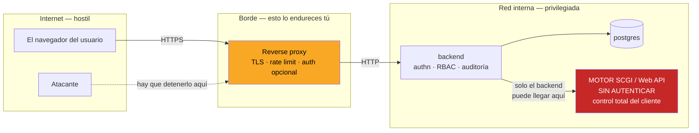
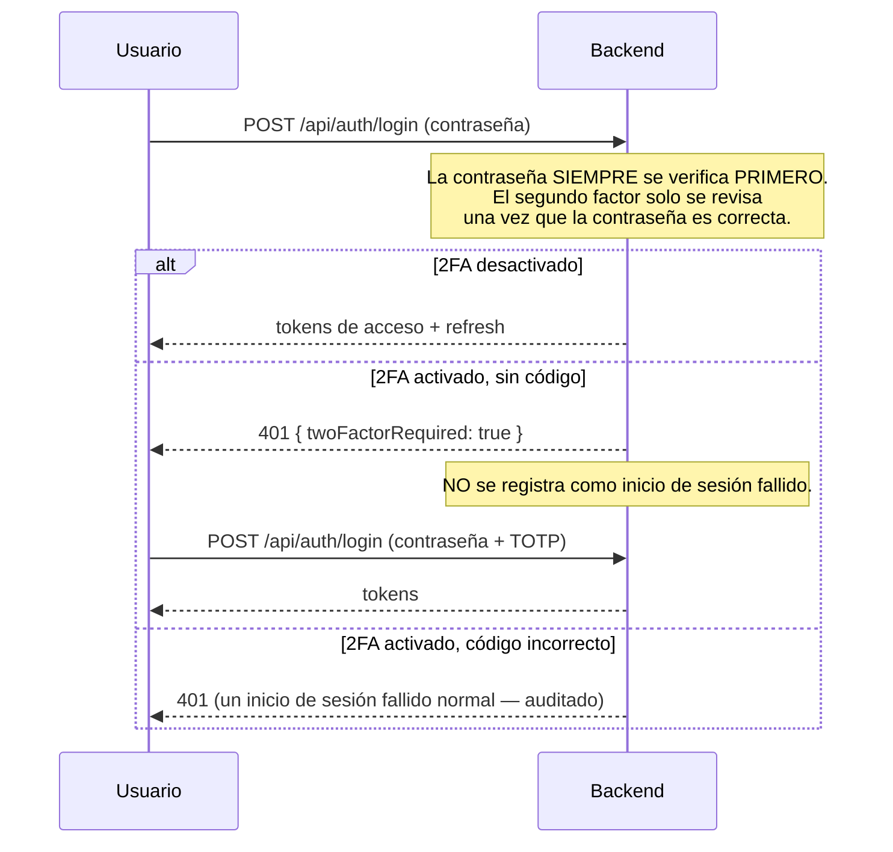
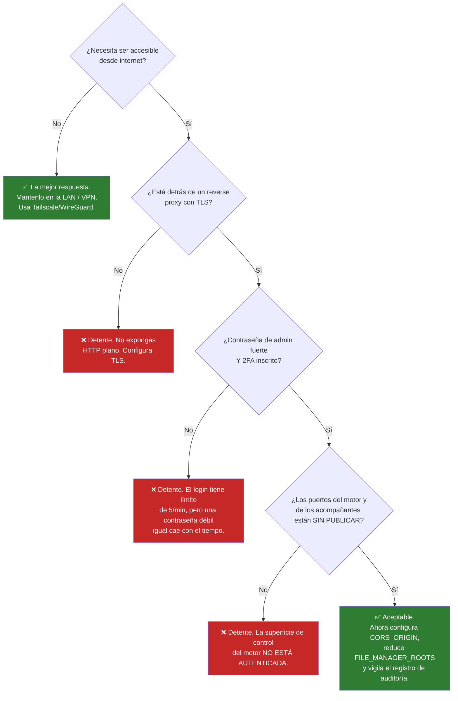

# Seguridad y endurecimiento {#security--hardening}

UltraTorrent controla un servicio que puede **mover y borrar archivos en disco**, así
que la seguridad no es decorativa. Esta página es la vista del operador: lo que la
plataforma ya hace por ti, lo que tienes que hacer tú, y cómo rotar un secreto sin
dejar a todo el mundo afuera.

## Propósito {#purpose}

Tomar una instalación de UltraTorrent que funciona y hacerla segura de operar —
incluyendo, si así lo decides, segura para exponerla a internet.

## Cuándo usar esto {#when-to-use-this}

- Inmediatamente después de instalar (la [lista de verificación de la primera hora](/operate/#steps-the-first-hour-on-a-new-deployment)).
- Antes de ponerla detrás de un hostname público.
- Cuando incorpores usuarios que no seas tú.
- Cuando un secreto se haya filtrado y haya que rotarlo.

## Prerrequisitos {#prerequisites}

- Acceso al shell del host y al archivo `.env`.
- Una cuenta `SUPER_ADMIN`.
- Para exposición pública: un reverse proxy y un certificado TLS. Consulta
  [Reverse proxy](/install/reverse-proxy) y [TLS](/install/tls).

:::tip Mira este tutorial
_Video próximamente._
:::

## Conceptos {#concepts}

### Lo que la plataforma ya aplica {#what-the-platform-already-enforces}

Recibes muchísimo gratis. Saber lo que *ya* está cubierto evita que "endurezcas"
cosas que ya lo están, y te enfoca en lo que falta.

| Control | Qué hace |
|---------|--------------|
| **Hash de contraseñas con Argon2id** | Memory-hard, resistente a GPU/ASIC. Las contraseñas en texto plano nunca se guardan ni se registran en los logs. El login está **endurecido contra ataques de tiempo** — un usuario desconocido igual ejecuta una verificación contra un hash falso, así que el tiempo de respuesta no revela si la cuenta existe. |
| **Tokens de acceso JWT de vida corta** | TTL por defecto de **15 minutos** (`JWT_ACCESS_TTL`). Algoritmo fijado. Un token cuyo `type` no sea `access` se rechaza. |
| **Refresh tokens rotativos con detección de reuso** | Los refresh tokens son secretos opacos aleatorios, guardados **solo como hash SHA-256**. Cada refresco revoca el token viejo y emite uno nuevo en la misma familia. **Presentar un token ya revocado quema la familia completa** — la señal característica de un token robado. |
| **Revocación de sesiones** | Cerrar sesión, cambiar la contraseña y desactivar un usuario revocan los refresh tokens **del lado del servidor**. Cambiar la contraseña termina toda sesión activa. |
| **Rate limiting** | `POST /api/auth/login` — **5 peticiones / 60 s**. `POST /api/auth/refresh` — **20 / 60 s**. El paso de 2FA usa el mismo endpoint de login, así que ese límite de 5/min también acota los **intentos de adivinar el TOTP**. |
| **Guarda de arranque en producción** | El backend **se niega a arrancar** con un secreto débil. Consulta [Secretos](#secrets). |
| **Helmet + CORS** | Cabeceras de respuesta HTTP seguras (HSTS, `X-Content-Type-Options`, políticas de frame/cross-origin). CORS está restringido a `CORS_ORIGIN`. |
| **Validación de entrada** | Cada cuerpo de petición es un DTO tipado validado con `class-validator`; los payloads inválidos se rechazan con `400` **antes de llegar a cualquier servicio**. |
| **Seguridad de rutas** | El gestor de archivos está confinado a `FILE_MANAGER_ROOTS`. El traversal, el escape absoluto, los null bytes y el **escape por symlink** están bloqueados; borrar una raíz configurada o un directorio del sistema siempre se rechaza. |
| **Protección SSRF** | Las descargas por URL de torrent solo permiten `http(s)`, bloquean direcciones privadas/loopback/link-local/CGNAT/**metadatos de nube**, rechazan redirecciones y limitan el cuerpo a 20 MB. |
| **Registro de auditoría** | Las acciones relevantes para la seguridad y las destructivas se registran con actor, acción, objeto, resultado, IP y user agent. |
| **Secretos cifrados en reposo** | Los secretos TOTP, las claves API de indexadores, la clave de Prowlarr y las contraseñas de motores se cifran con **AES-256-GCM** y salen **censurados** (`••••••••`) en toda respuesta de la API. |
| **Guardas contra escalada de privilegios** | Solo un `SUPER_ADMIN` puede otorgar `SUPER_ADMIN`. **Ningún usuario puede editar sus propios roles** — `users.manage` por sí solo no permite autopromoverse. |

### El límite de confianza {#the-trust-boundary}



:::danger La superficie de control del motor no está autenticada
La interfaz SCGI/XML-RPC de rTorrent **no está autenticada y da control total del
cliente** — incluyendo la capacidad de **ejecutar comandos** (corre `rm` durante el
borrado con datos). Trátala como un endpoint interno privilegiado:

- **Nunca la expongas a la red.** Enlázala a `127.0.0.1` o a un socket Unix, o
  mantenla solo en la red interna de Docker (que es lo que hace el archivo Compose
  que se distribuye — usa `expose`, no `ports`).
- Solo el backend de UltraTorrent debería poder alcanzarla. Todo acceso de *usuario*
  tiene que pasar por la API autenticada, con permisos verificados y auditada.

El mismo razonamiento aplica a la Web API de qBittorrent: si publicas su puerto para
obtener la contraseña del primer arranque, **considera dejar de publicarlo después**.
:::

## Secretos {#secrets}

Tres secretos importan. **No** son intercambiables y **no** se rotan de la misma
manera.

| Secreto | Protege | Rotarlo… |
|--------|----------|--------------|
| `JWT_ACCESS_SECRET` | Firma los tokens de acceso | Invalida todos los tokens de acceso — se cierra la sesión de los usuarios. **Barato.** |
| `JWT_REFRESH_SECRET` | La maquinaria de refresh tokens | Invalida los refresh tokens — los usuarios tienen que volver a iniciar sesión. **Barato.** |
| `ENCRYPTION_KEY` | **Cifrado AES-256-GCM en reposo** de los secretos TOTP, las claves API de indexadores, la clave de Prowlarr y las contraseñas de motores | **Destruye el acceso a cada uno de esos valores.** **Caro.** Lee abajo. |

Genera cada uno con:

```bash
openssl rand -base64 48
```

### La guarda de arranque en producción {#the-production-boot-guard}

Cuando `NODE_ENV=production`, el backend **se niega a arrancar** si
`JWT_ACCESS_SECRET` o `ENCRYPTION_KEY`:

- no está definido, o
- es un valor por defecto conocido (`dev-*`, `change-me`), o
- tiene menos de **32 caracteres**, o
- es **idéntico al otro**.

Esto cierra a propósito el hueco de *"se me olvidó poner un secreto → clave de firma
predecible → cualquiera puede falsificar un token de `SUPER_ADMIN`"*. Si el backend
arranca en producción, esas cuatro condiciones se cumplen.

Compose aplica la misma filosofía: **se niega a arrancar** sin `POSTGRES_PASSWORD` y
`ADMIN_PASSWORD`. **No hay valores por defecto inseguros** en ninguna parte del stack.

:::warning Usa un `POSTGRES_PASSWORD` alfanumérico
`DATABASE_URL` se deriva de él. Un carácter especial de URL (`@ : / ?`) necesita
codificación porcentual y, si no, romperá la cadena de conexión en silencio.
:::

## Rotar secretos {#rotating-secrets}

### Rotar los secretos JWT (seguro, rutinario) {#rotating-the-jwt-secrets-safe-routine}

Costo: se cierra la sesión de todo el mundo. Nada más.

```bash
# 1. Genera valores nuevos
openssl rand -base64 48   # -> JWT_ACCESS_SECRET
openssl rand -base64 48   # -> JWT_REFRESH_SECRET

# 2. Edita .env, luego recrea el backend
docker compose up -d --force-recreate backend
```

**Verifica.** Tu sesión se cerró; volver a iniciar sesión funciona.

Haz esto si un secreto pudo haberse filtrado, cuando se va un admin con acceso al
host, o de forma rutinaria (una vez al año es razonable).

### Rotar `ENCRYPTION_KEY` (destructivo — planifícalo) {#rotating-encryption_key-destructive--plan-it}

:::danger Lee esto completo antes de tocar `ENCRYPTION_KEY`
`ENCRYPTION_KEY` es la clave AES-256-GCM de todo lo cifrado en reposo.
**Rotarla hace que todos los valores cifrados anteriormente sean indescifrables.** No
hay recifrado automático. En concreto, vas a perder:

- **El secreto TOTP de cada usuario** → todos los usuarios con 2FA quedan fuera de su
  segundo factor y tienen que **volver a inscribirse**.
- **Las claves API de indexadores** → hay que reingresarlas.
- **La clave API de Prowlarr** → hay que reingresarla.
- **Las contraseñas de motores** (p. ej. qBittorrent) → hay que reingresarlas.
:::

El procedimiento de rotación:

1. **Haz un backup primero.** Consulta [Backup y restauración](/operate/backup).
2. **Avísale a tus usuarios.** Todo el que tenga 2FA va a necesitar volver a
   inscribirse. Asegúrate de que al menos una cuenta `SUPER_ADMIN` **sin** 2FA (o con
   códigos de recuperación a mano) todavía pueda entrar — de lo contrario te vas a
   quedar fuera de tu propia instalación.
3. Desactiva el 2FA en las cuentas que puedas, *antes* de rotar (esto es opcional pero
   deja la recuperación más limpia).
4. Pon la clave nueva y recrea:

   ```bash
   openssl rand -base64 48   # -> ENCRYPTION_KEY  (debe ser distinta de JWT_ACCESS_SECRET)
   docker compose up -d --force-recreate backend
   ```

5. **Vuelve a inscribir el 2FA** de cada usuario afectado.
6. **Reingresa** cada clave API de indexador, la clave de Prowlarr y cualquier
   contraseña de motor.

**Verifica.** Inicia sesión con 2FA en una cuenta reinscrita; corre una prueba de
indexador y una prueba de conexión de Prowlarr — ambas deben pasar.

:::tip Respalda tu `.env`, fuera del host
`ENCRYPTION_KEY` **no está en tu dump de Postgres**. Un backup de la base de datos sin
el `.env` es un backup que no puedes restaurar del todo — recuperarías los blobs
cifrados y ninguna clave para leerlos. Guarda el `.env` en un gestor de contraseñas o
en un almacén de secretos.
:::

## Autenticación de dos factores {#two-factor-authentication}

UltraTorrent soporta **TOTP** (RFC 6238) — compatible con Google Authenticator,
Authy, 1Password y cualquier app estándar. Paso de 30 segundos, tolerancia de desfase
de reloj de ±1 paso.



### La inscripción se confirma, no es a ciegas {#enrolment-is-confirmed-not-blind}

Esta es una propiedad importante: `POST /api/account/2fa/setup` genera un secreto y
devuelve un URI `otpauth://` más un código QR — pero **el 2FA no queda activo** hasta
que el usuario prueba que lo tiene enviando un código válido a
`POST /api/account/2fa/enable`. Nadie puede quedarse fuera por escanear un QR y
marcharse.

### Códigos de recuperación {#recovery-codes}

Activar el 2FA devuelve **10 códigos de recuperación de un solo uso**, mostrados **una
sola vez**. Se guardan **solo como hashes SHA-256**. En el login, un código de
recuperación se acepta en lugar de un código TOTP y se **consume** al usarlo, así que
no se puede reutilizar.

:::warning Guarda los códigos de recuperación
Se muestran una sola vez. Si un `SUPER_ADMIN` pierde tanto su autenticador como sus
códigos de recuperación, la recuperación significa cirugía directa en la base de datos.
:::

Regenéralos en `POST /api/account/2fa/recovery` (requiere un código TOTP actual).

### Desactivar el 2FA {#disabling-2fa}

`POST /api/account/2fa/disable` requiere la **contraseña** de la cuenta como
confirmación, y borra el secreto, el indicador y todos los códigos de recuperación.
Todos los endpoints de 2FA son **solo de autoservicio** — un usuario únicamente puede
administrar su propio 2FA.

## RBAC {#rbac}

La autorización está **basada en permisos**, no en roles con verificaciones
codificadas a mano. Cada ruta protegida declara los permisos que necesita; una guarda
verifica que el principal los tenga **todos**. `SUPER_ADMIN` se salta las
verificaciones granulares.

**No hay licencias, ediciones ni restricciones por funcionalidad** — RBAC es el *único*
mecanismo de control de acceso en el producto.

### Los roles del sistema {#the-system-roles}

| Rol | Otórgalo a | Incluye / excluye de forma notable |
|------|-------------|------------------------------|
| `SUPER_ADMIN` | Tú, y a la menor cantidad de personas posible | **Todos** los permisos, y se salta las verificaciones granulares. El único rol que puede otorgar `SUPER_ADMIN`. |
| `ADMINISTRATOR` | Un coadministrador de confianza | Todos los permisos **excepto `system.manage`**. |
| `POWER_USER` | Alguien de la casa que administra sus propios medios | Todas las acciones de torrents, categorías/etiquetas, RSS, automatización, **todos los `files.*`** (incluyendo borrar/en masa/limpieza), `system.view`. **Sin** gestión de usuarios/roles. |
| `USER` | Un usuario común del hogar | Ver/agregar torrents, cambios básicos de estado, categorías/etiquetas, `rss.view`, y archivos de **solo lectura**. |
| `READ_ONLY` | Alguien que solo mira el panel | Solo ver. |

### El principio de menor privilegio, aplicado {#principle-of-least-privilege-applied}

- **`POWER_USER` puede borrar archivos.** Incluye todos los permisos `files.*`,
  incluyendo `files.delete` y `files.cleanup`. Si eso no es lo que quieres, construye
  un rol personalizado.
- **`torrents.delete_data` está separado de `torrents.delete`** por una razón. Uno
  quita el torrent; el otro quita los **datos en disco**. Otórgalos por separado.
- **Las acciones en masa exigen el mismo permiso que su ruta dedicada**, por acción —
  así un usuario de solo lectura no puede colar una operación destructiva por
  `/torrents/bulk`.
- **Desactivar un usuario revoca sus refresh tokens**, y el refresco de token se
  rechaza para una cuenta deshabilitada. La desactivación es inmediata, no eventual.

Consulta [Permisos](/reference/permissions) para el catálogo completo y
[RBAC](/develop/rbac) para el modelo.

## Exponer UltraTorrent a internet {#exposing-ultratorrent-to-the-internet}



**La recomendación honesta: no lo hagas.** Una VPN (WireGuard, Tailscale) te da acceso
remoto con una fracción de la superficie de ataque. UltraTorrent es un servicio que
mueve archivos, borra archivos y ejecuta comandos. Hay muy poco que ganar poniéndolo en
la internet pública.

Si no te queda otra:

1. **TLS, siempre.** Termínalo en el proxy. El perfil de Caddy incluido lo hace
   automáticamente:

   ```bash
   docker compose --profile proxy up -d
   ```

   Reemplaza la etiqueta de sitio `:80` en `deploy/Caddyfile` con tu dominio para
   obtener HTTPS automático con Let's Encrypt. Consulta [TLS](/install/tls).

2. **Configura `CORS_ORIGIN` con tu origen real.** No `*`, no `localhost`.

   ```dotenv
   CORS_ORIGIN=https://ultratorrent.example.com
   ```

3. **No publiques los puertos del motor, de Prowlarr ni de FlareSolverr.** El archivo
   Compose que se distribuye mantiene rTorrent y FlareSolverr en `expose` (solo
   internos). *Sí* publica qBittorrent (8081) y Prowlarr (9696) por conveniencia en el
   primer arranque — **quita esos mapeos de `ports:` una vez que termines la
   configuración** si el host está expuesto a internet.

4. **Reduce `FILE_MANAGER_ROOTS`** exactamente a los directorios donde el motor
   escribe. Es el **límite duro, controlado por operaciones**, y nunca se amplía en
   tiempo de ejecución.

5. **Considera autenticación a nivel de proxy** (basic auth, o un proxy consciente de
   identidad) delante de todo, como una segunda barrera.

### El límite de dos capas del gestor de archivos {#the-two-layer-file-manager-boundary}

Vale la pena entenderlo, porque es un diseño genuinamente bueno y la gente lo
configura mal:

- **`FILE_MANAGER_ROOTS`** (entorno) es el **límite duro externo**. Se define en el
  entorno de la instalación; **nunca se amplía en tiempo de ejecución**. Nada en la UI
  puede escaparse de él.
- **La ruta raíz por defecto** (un ajuste, que solo se cambia vía `PUT /api/files/root`
  con el permiso `settings.manage_root_path`) solo puede **estrechar** la navegación a
  un subárbol *dentro* de esas raíces. Un valor fuera de las raíces duras se **ignora**.

El selector de directorios de la UI es una **conveniencia, no el límite de seguridad**
— el servidor valida cada ruta enviada al momento de usarla.

Los borrados son **suaves por defecto**: los elementos se mueven a un directorio
`.ultratorrent-trash` dentro de su propia raíz y se pueden restaurar; se requiere
`permanent: true` para borrar de forma irreversible. El Asistente de limpieza **nunca
borra automáticamente** — su vista previa es de solo lectura y solo elimina las rutas
seleccionadas explícitamente.

## Ejemplos {#examples}

### Auditar la postura de seguridad de un stack corriendo {#audit-the-security-posture-of-a-running-stack}

```bash
# 1. ¿Hay puertos privilegiados publicados al host?
docker compose ps --format "table {{.Service}}\t{{.Ports}}"
#    Busca: rtorrent, flaresolverr  -> NO deben mostrar mapeo al host.
#    qbittorrent (8081) / prowlarr (9696) -> deja de publicarlos si está expuesto a internet.

# 2. ¿Los secretos son reales? (chequeo de largo, sin imprimirlos)
awk -F= '/^(JWT_ACCESS_SECRET|JWT_REFRESH_SECRET|ENCRYPTION_KEY)=/ \
  { printf "%s: %d chars\n", $1, length($2) }' .env
#    Cada uno debe ser >= 32. ENCRYPTION_KEY debe ser distinta de JWT_ACCESS_SECRET.

# 3. ¿CORS está fijado a un origen real?
grep CORS_ORIGIN .env

# 4. ¿Qué tan amplio es el límite del gestor de archivos?
grep FILE_MANAGER_ROOTS .env

# 5. ¿La protección SSRF está activa para todo excepto lo que confías?
grep SSRF_ALLOW_HOSTS .env
```

### Revisar quién puede destruir cosas {#review-who-can-destroy-things}

```sql
-- Usuarios con un permiso destructivo, vía cualquier rol
SELECT u.username, r.name AS role
FROM users u
JOIN "_RoleToUser" ru ON ru."B" = u.id
JOIN roles r ON r.id = ru."A"
ORDER BY r.name, u.username;
```

Luego contrasta el rol con
[el catálogo de permisos](/reference/permissions). Recuerda que `POWER_USER` incluye
**todos** los `files.*`.


## Solución de problemas {#troubleshooting}

| Síntoma | Causa | Solución |
|---------|-------|-----|
| El backend termina con "insecure secret configuration" | Se activó la guarda de arranque en producción | [Solución de problemas → Secretos](/operate/troubleshooting#the-backend-exits-immediately-with-insecure-secret-configuration) |
| Todos quedaron fuera del 2FA después de un cambio | Se rotó `ENCRYPTION_KEY` | Vuelve a inscribir el 2FA. Consulta [Rotar `ENCRYPTION_KEY`](#rotating-encryption_key-destructive--plan-it) |
| Las claves de indexador/Prowlarr de pronto son inválidas | Se rotó `ENCRYPTION_KEY` | Reingrésalas |
| Errores de CORS en el navegador | `CORS_ORIGIN` no coincide con el origen del navegador | Configúralo exactamente |
| Un usuario no ve actualizaciones en vivo | Le falta el permiso de vista que exige la sala del WebSocket | Otórgale `torrents.view`, etc. |
| Las descargas automáticas están bloqueadas | La protección SSRF está haciendo su trabajo | [Agrega el host a `SSRF_ALLOW_HOSTS`](/operate/troubleshooting#auto-downloads-silently-do-nothing--resolves-to-a-blocked-internal-address) |

## Consejos {#tips}

- **El registro de auditoría es tu amigo después de un incidente.** Registra los logins
  fallidos *con el nombre de usuario que se intentó*, más cada acción destructiva con
  actor e IP.
- **Un desafío de 2FA pendiente no se registra como login fallido** — así que un pico de
  fallos genuinos de `auth.login` en el registro de auditoría es señal significativa, no
  ruido.
- **El rate limiting también acota los intentos de adivinar el TOTP**, porque el paso de
  2FA usa el mismo endpoint de login con límite de tasa.
- **Aplícale menor privilegio al propio archivo `.env`:** `chmod 600 .env`. Contiene
  todos los secretos que tienes.

## Preguntas frecuentes {#faq}

**¿Es seguro poner UltraTorrent en internet?**
*Puede* serlo, detrás de TLS, con 2FA, contraseñas fuertes y sin puertos del motor
publicados. Pero una VPN es mejor respuesta para casi todo el mundo.

**¿Qué pasa si pierdo `ENCRYPTION_KEY`?**
Cada secreto TOTP, clave de indexador, clave de Prowlarr y contraseña de motor queda
permanentemente ilegible. Los usuarios vuelven a inscribir el 2FA; tú reingresas las
claves. Tus torrents, bibliotecas y usuarios no se ven afectados. **Respalda el `.env`.**

**¿Puede un `USER` borrar mis medios?**
No. `USER` tiene permisos de archivo de **solo lectura**. `POWER_USER`, sin embargo,
tiene **todos** los `files.*`, incluyendo borrar y limpiar — otórgalo a propósito.

**¿UltraTorrent hace scraping de IMDb?**
No. **No hay ninguna ruta de código que descargue o parsee el HTML de imdb.com.** El
proveedor de IMDb funciona solo a partir de **conjuntos de datos de IMDb provistos por
el usuario** y/o una **API de IMDb licenciada**. Está **deshabilitado por defecto**, su
clave API se cifra con AES-GCM, se censura en las respuestas y nunca se registra en los
logs.

**¿Puede `users.manage` promoverse a sí mismo a `SUPER_ADMIN`?**
No. Solo un `SUPER_ADMIN` puede otorgar `SUPER_ADMIN`, y **ningún usuario puede editar
sus propios roles**.

**¿Cómo reporto una vulnerabilidad?**
**En privado** — no abras un issue público en GitHub. Usa la función de aviso de
seguridad privado de GitHub para el repositorio, con una descripción, las versiones
afectadas, los pasos de reproducción y el impacto.

## Lista de verificación de endurecimiento {#hardening-checklist}

**Secretos**
- [ ] `JWT_ACCESS_SECRET`, `JWT_REFRESH_SECRET` y `ENCRYPTION_KEY` tienen cada uno 32+ caracteres aleatorios
- [ ] `ENCRYPTION_KEY` **es distinta** de `JWT_ACCESS_SECRET`
- [ ] `POSTGRES_PASSWORD` es fuerte y **alfanumérica**
- [ ] El `.env` está en `chmod 600` y respaldado **fuera del host**

**Cuentas**
- [ ] La contraseña del admin sembrado se cambió
- [ ] El 2FA está inscrito en cada cuenta de administrador
- [ ] Los códigos de recuperación están guardados en un lugar seguro
- [ ] Los usuarios tienen el **menor** rol que les permita hacer su trabajo (`POWER_USER` puede borrar archivos)
- [ ] Hay más de una vía para volver a entrar si un admin pierde su autenticador

**Exposición**
- [ ] Los puertos de control del motor (rTorrent/qBittorrent) **no** están publicados al host
- [ ] FlareSolverr es solo interno
- [ ] El puerto de Prowlarr está sin publicar (o con firewall) si está expuesto a internet
- [ ] TLS termina en un reverse proxy
- [ ] `CORS_ORIGIN` es el origen exacto de producción

**Sistema de archivos**
- [ ] `FILE_MANAGER_ROOTS` es lo más estrecho posible
- [ ] Coincide con los directorios donde el motor realmente escribe
- [ ] `SSRF_ALLOW_HOSTS` lista solo los indexadores en los que confías (deja `prowlarr` si viene incluido)

**Continuo**
- [ ] El registro de auditoría se revisa periódicamente (consulta [Mantenimiento](/operate/maintenance))
- [ ] Las actualizaciones se aplican (consulta [Actualizaciones](/install/upgrading))

## Ver también {#see-also}

- [Referencia de permisos](/reference/permissions) — el catálogo completo
- [RBAC](/develop/rbac) — el modelo
- [Usuarios](/modules/users) · [Auditoría](/modules/audit)
- [Reverse proxy](/install/reverse-proxy) · [TLS](/install/tls)
- [Backup y restauración](/operate/backup) — respalda el `.env`, no solo la base de datos
- [Solución de problemas](/operate/troubleshooting)
- [Referencia del entorno](/reference/environment)
